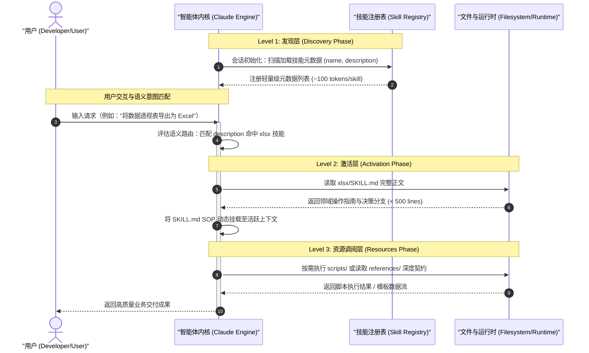
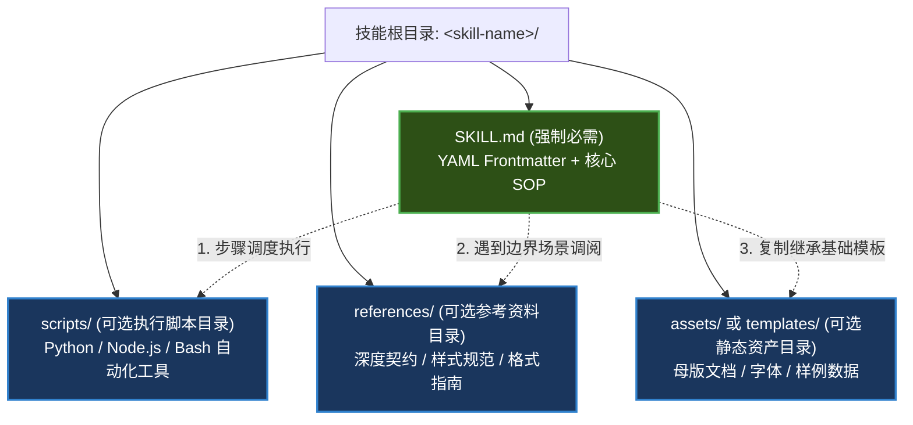

# Anthropic Skills 架构原理与 SKILL.md 规范标准

| 属性 | 详情 |
| :--- | :--- |
| **文档类型** | 架构设计指南 / 接口规范契约 |
| **当前状态** | 已归档 (Accepted) |
| **作者** | Ateng |
| **创建日期** | 2026-09-23 |
| **关联系统/模块** | Anthropic Skills / Agent Skills Specification |

---

## 1. 渐进式披露架构深度剖析

在智能体开发中，上下文预算（Context Window Budget）是最珍贵且稀缺的计算资源。Anthropic Skills 架构体系通过 **渐进式披露（Progressive Disclosure）** 范式，实现了高性能语义路由与精细化资源加载的统一。



---

### 1.1 Level 1: 发现层 (Discovery Phase)

- **加载时机**：在智能体环境（如 Claude Code CLI、Claude.ai 会话）启动或项目初始化时触发。
- **加载范围**：仅读取每个技能目录中 `SKILL.md` 顶部的 YAML Frontmatter 元数据，特别是 `name` 与 `description`。
- **资源开销**：每个技能仅产生约 50~100 个 Token 的初始开销。即使在企业环境中预挂载 50 个垂直技能，初始 Token 损耗仍严格压制在 5,000 Token 以内，确保主会话拥有超过 95% 的自由上下文预算。
- **路由决策**：模型利用轻量级描述进行前置语义判断。如果用户指令与所有技能描述均无交集，则直接进入通用对话，绝不产生多余的文件读取或上下文注入。

---

### 1.2 Level 2: 激活层 (Activation Phase)

- **加载时机**：当且仅当用户输入的问题或待办任务命中了某个技能的触发描述时。
- **加载范围**：Agent 发起局部工具调用，读取对应技能的 `SKILL.md` Markdown 正文。
- **工程约束（500 行黄金红线）**：
  > [!IMPORTANT]
  > **正文规模约束**：
  > 官方规范强烈建议 `SKILL.md` 的正文行数控制在 **500 行以内**（约 2,000~3,500 Token）。
  > 正文应聚焦于高层决策分支、逻辑编排流、前置检查与关键约束，严禁将大段长篇 API 字典、原始代码库或测试数据一股脑塞入正文，防止“激活即瘫痪”。

---

### 1.3 Level 3: 资源调阅层 (Resources Phase)

- **加载时机**：在 Agent 执行任务的具体分支步骤时，根据 `SKILL.md` 中的引导按需调阅。
- **加载范围**：
  - **`scripts/`**：确定性自动化脚本（如 `python scripts/generate_sheets.py`），直接在沙箱执行并仅返回标准输出（Stdout），完全免除将源码打入上下文的 Token 消耗。
  - **`references/`**：深水区参考手册（如复杂的第三方接口契约、特定格式的样式表），仅在遇到特殊边界场景时由 Agent 精准检索单份文件。
  - **`assets/` / `templates/`**：静态母版文件（如 `.pptx` 模板、字体文件、图片），供脚本或智能体复制修改。

---

## 2. 物理目录结构拓扑与标准布局

根据 [agentskills.io](https://agentskills.io) 开放标准，每一个技能包必须作为一个物理自包含的目录存在。

### 2.1 单技能标准物理拓扑结构



#### 详细目录职责矩阵：

| 目录/文件 | 必要性 | 访问机制 | 核心职责与设计原则 |
| :--- | :--- | :--- | :--- |
| **`SKILL.md`** | **强制 (Required)** | Level 1 读头部，Level 2 读全文 | 技能核心契约。包含元数据与核心业务决策流程，指导智能体“做什么”与“如何判断”。 |
| **`scripts/`** | 可选 (Optional) | Level 3 执行调用 | 包含确定性处理脚本。将复杂的数据转换、文件解析等逻辑代码化，降低模型逻辑幻觉。 |
| **`references/`** | 可选 (Optional) | Level 3 检索读取 | 存放按需查阅的辅助 Markdown 文档（如 API 列表、排版标准），避免撑大 `SKILL.md`。 |
| **`assets/`** | 可选 (Optional) | Level 3 物理复制 | 存放静态资产（如公司 Logo、Word 母版骨架、特定字体），直接用于生成目标产物。 |

---

### 2.2 命名空间与跨平台文件命名公约

为了保证技能在 Linux、macOS 与 Windows 多平台环境下的完全兼容，必须遵守如下命名公约：

1. **技能目录命名**：
   - 必须使用 **全小写短横线连接（kebab-case）**，例如 `frontend-design`、`algorithmic-art`、`mcp-builder`。
   - 长度限制：**1 至 64 个字符**。
   - 严禁包含空格、大写字母、下划线或特殊标点符号。
2. **核心引导文件**：
   - 严格固定为全大写的 **`SKILL.md`**，不可使用 `skill.md` 或 `README.md` 代替。
3. **跨平台路径分隔符**：
   - 在 `SKILL.md` 中引用子文件时，统一使用正斜杠 `/`（例如 `scripts/build.py`），严禁使用 Windows 专用的反斜杠 `\`。

---

## 3. `SKILL.md` 语法规范与 YAML Frontmatter 契约

`SKILL.md` 采用标准的“YAML Frontmatter + Markdown Body”两段式结构。

```markdown
---
name: docx-advanced-editor
description: Comprehensive Microsoft Word (.docx) generator and editor. Use when the user requests creating business reports, technical whitepapers, editing tracked changes, adding comments, or styling document templates.
license: Apache-2.0
compatibility: claude-code>=1.0.0
metadata:
  category: productivity
  author: Ateng
  version: 1.2.0
---

# Word 文档处理高阶操作指南
... 正文内容 ...
```

---

### 3.1 YAML 元数据字段详解与约束表

| 字段名 | 类型 | 必填性 | 长度/格式约束 | 说明与最佳实践 |
| :--- | :--- | :--- | :--- | :--- |
| **`name`** | String | **必填** | 1~64 字符，`^[a-z0-9-]+$` | 技能唯一标识符。建议与技能外层目录名保持绝对一致。 |
| **`description`** | String | **必填** | 最大 1024 字符（建议 50~150 词） | **最重要的路由决策字段**。向智能体解释该技能“是什么”以及“何时应该触发”，直接影响激活概率。 |
| **`license`** | String | 可选 | 标准 SPDX 标识符 | 声明开源许可，例如 `Apache-2.0`、`MIT` 或 `Proprietary`。 |
| **`compatibility`** | String | 可选 | 语义化版本表达式 | 声明支持的宿主环境版本，例如 `claude-code>=1.0.0`。 |
| **`metadata`** | Object | 可选 | 自由键值对 (Key-Value) | 存储扩展信息（如 `version`、`author`、`category`、`tags`）。 |
| **`allowed-tools`** | Array | 实验性 | 工具标识符列表 | 限制该技能激活后允许调用的工具子集（如 `[Bash, ReadFile]`）。 |

---

### 3.2 描述字段（`description`）工程学

`description` 是整个技能生命周期中最关键的“开关”。智能体仅凭这段文字决定是否读取 `SKILL.md`。

#### 常见失败模式（Anti-Patterns）：
- **过于宽泛（Over-triggering 泛化滥用）**：
  - *反例*：`"Helps with code and files."`
  - *后果*：用户提出任何写代码或看文件的需求，该技能都会被错误激活，造成 Token 浪费与干扰。
- **过于狭窄（Under-triggering 唤醒失败）**：
  - *反例*：`"Executes python scripts/generate_excel.py for quarterly report."`
  - *后果*：用户说“帮我做一个财务对账单”时，模型因关键词未精准匹配而无法唤醒技能。

#### 黄金编写结构（Golden Template）：
优质的 `description` 应当包含 **核心能力陈述**、**显式触发动词短语** 以及 **边界/排他声明**：

```yaml
description: >
  Professional frontend UI designer for web applications. Use when the user
  wants to design modern, production-grade Web interfaces, create landing pages,
  or build responsive dashboards with Tailwind CSS. Avoid using for backend API
  design or plain documentation generation.
```

> [!TIP]
> **描述设计三要素**：
> 1. **Role/Function (角色职责)**：明确本技能的领域专业身份。
> 2. **Explicit Triggers (触发条件)**：以 `Use when the user asks to...` 开头，列举 3~5 个高频用户意图。
> 3. **Exclusions (排除边界)**：以 `Avoid using for...` 结尾，清晰指明不适用的场景，防止与兄弟技能撞车。

---

### 3.3 正文结构范式（System Prompt, Workflow, Rules, Edge Cases）

经过生产验证的 `SKILL.md` 正文推荐采用如下四层模块化骨架：

```markdown
# [技能名称]

## 1. 角色定位与设计哲学 (Role & Philosophy)
- 简明扼要陈述本技能在当前领域的权威设计原则与质量基线。

## 2. 前置检查与环境验证 (Prerequisites & Sanity Checks)
- 必须包含运行时卫语句（Guard Clauses），引导智能体在执行前自检：
  - 是否安装了必要的依赖？（如 `python-docx`）
  - 工作目录是否正确？

## 3. 分步标准作业流程 (Workflow & SOP)
- 采用清晰的步骤编排：
  - 步骤 1：需求解析与参数提取
  - 步骤 2：生成/修改代码与模板
  - 步骤 3：自检与格式校验

## 4. 边界处理与容错规则 (Edge Cases & Failure Recovery)
- 明确指出当遇到常见错误（如权限不足、文件锁冲突、格式损坏）时的降级补救方案。
```

---

## 4. Token 预算控制与系统提示词防御

在长会话或多智能体协同环境下，技能包必须具备严格的 Token 纪律：

1. **正文严控 500 行以内**：
   - 保持高信息密度，将解释性长文本外移到 `references/`。
2. **免除上下文污染的外部脚本化**：
   - 能用 Python 脚本解决的机械操作（如遍历 1,000 行 Excel 进行正则清洗），写在 `scripts/clean_data.py` 中，让模型通过命令行直接调用脚本，仅获取几行摘要，**避免把千行数据读入上下文**。
3. **消除重复与自解释命名**：
   - 目录与代码变量自解释，避免在 Markdown 中用冗余文字反复阐述基础概念。

---

## 5. 权威参考资料与事实依据 (References & Grounding)

- [[Tier 1]] [agentskills.io Specification](https://agentskills.io) - Agent Skills 开放标准核心契约与 YAML 语法定义 (核验日期: 2026-09-23)
- [[Tier 1]] [anthropics/skills Official Repository](https://github.com/anthropics/skills) - Anthropic 官方技能实现、目录规范与双轨许可 (核验日期: 2026-09-23)
- [[Tier 1]] [Anthropic Engineering Blog](https://anthropic.com/engineering/equipping-agents-for-the-real-world-with-agent-skills) - 渐进式披露架构设计思想与上下文优化实践 (核验日期: 2026-09-23)

### 契约核查矩阵：
| 核查对象 (规范/参数) | 官方基准事实 (Ground Truth) | 对应依据 | 状态 |
| :--- | :--- | :--- | :--- |
| YAML 必需字段 | `name` 与 `description` 为强制必需项 | `agentskills.io/spec` | 已核实真实有效 |
| 目录命名公约 | 小写短横线连接（kebab-case），1~64 字符 | `spec/agent-skills-spec.md` | 已核实真实有效 |
| 渐进式披露分层 | Level 1 (Discovery) / Level 2 (Activation) / Level 3 (Resources) | Anthropic Engineering Blog | 已核实真实有效 |
| 正文行数推荐阈值 | 建议不超过 500 行，多余资料外置到 `references/` | Anthropic Best Practices | 已核实真实有效 |
