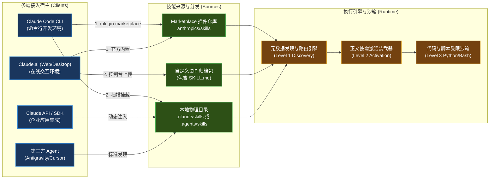

# Anthropic Skills 多端运行环境与安装部署实战

| 属性 | 详情 |
| :--- | :--- |
| **文档类型** | 运维与部署手册 (Ops Guide) / 系统集成指南 |
| **当前状态** | 已归档 (Accepted) |
| **作者** | Ateng |
| **创建日期** | 2026-09-23 |
| **关联系统/模块** | Claude Code / Claude.ai / Claude API / Agent Skills |

---

## 1. 运行时加载全景拓扑

Agent Skills 具备卓越的跨平台运行能力。无论是命令行环境（Claude Code CLI）、网页与桌面端（Claude.ai）、原生 SDK 编排（Claude API），还是遵循开放标准的第三方智能体，其核心加载生命周期遵循统一的装载与执行标准：



---

## 2. Claude Code CLI 运行时集成指南

Claude Code 是官方首选的终端交互式智能体环境，提供了最完善的技能生命周期管理命令。

### 2.1 插件市场机制与官方 Marketplace 挂载

Claude Code 引入了插件市场（Marketplace）概念，支持将 GitHub 仓库注册为技能包来源：

```bash
# 1. 注册 Anthropic 官方技能市场仓库
/plugin marketplace add anthropics/skills

# 2. 列出已挂载市场中的所有可用插件与技能集合
/plugin marketplace list
```

挂载成功后，Claude Code 会自动拉取远程仓库的 `.claude-plugin/marketplace.json` 索引，解析可用技能列表及其依赖描述。

---

### 2.2 集合与单技能安装命令实战

官方仓库将高频技能按照业务场景组织为“集合（Collections）”，支持一键批量安装：

```bash
# 1. 安装官方文档处理核心套件 (包含 docx, xlsx, pptx, pdf)
/plugin install document-skills@anthropic-agent-skills

# 2. 安装示例与创新类技能套件 (包含 frontend-design, mcp-builder 等)
/plugin install example-skills@anthropic-agent-skills

# 3. 安装单个独立技能 (语法: <skill-name>@anthropic-agent-skills)
/plugin install webapp-testing@anthropic-agent-skills

# 4. 查看当前项目中所有已激活生效的技能
/plugin list

# 5. 更新已安装技能至最新版本
/plugin update document-skills@anthropic-agent-skills

# 6. 卸载不再需要的技能
/plugin uninstall webapp-testing@anthropic-agent-skills
```

---

### 2.3 本地离线开发模式与目录优先级规范

除了通过网络市场安装外，开发者可在本地以物理目录方式直接挂载技能。Claude Code 遵循严密的**就近覆盖与优先级原则**：

```
优先级: 项目级本地技能 (.claude/skills) > 用户全局技能 (~/.claude/skills) > Marketplace 插件
```

#### 目录拓扑与配置说明：
1. **项目级技能（Project-Scope）**：
   - 物理路径：`<project-root>/.claude/skills/<skill-name>/`
   - 作用域：仅在当前代码仓库内生效。建议随 Git 提交，实现团队工程规范的统一沉淀。
2. **用户级全局技能（Global-Scope）**：
   - Linux/macOS 路径：`~/.claude/skills/<skill-name>/`
   - Windows 路径：`C:\Users\<Username>\.claude\skills\<skill-name>\`
   - 作用域：当前操作系统用户跨所有项目均可调用的个人高频技能。

```bash
# 本地快速开发与调试技能软链接示例 (macOS/Linux)
mkdir -p ~/.claude/skills
ln -s /path/to/my-custom-skill ~/.claude/skills/my-custom-skill

# Windows PowerShell 目录链接创建示例
New-Item -ItemType SymbolicLink -Path "$HOME\.claude\skills\my-custom-skill" -Target "D:\dev\my-custom-skill"
```

---

## 3. Claude.ai (Web / Desktop) 企业与个人端集成

Claude.ai 网页版与官方桌面客户端同样支持通过技能扩展模型能力。

### 3.1 运行时环境前提

在 Claude.ai 中运行技能涉及代码执行与文件流处理，必须在前置设置中开启对应特权：

1. 打开 **Settings (设置)** → **Capabilities / Features (功能特性)**。
2. 确保勾选 **"Code execution and file creation (代码执行与文件创建)"**。
   > [!IMPORTANT]
   > 官方 Office 文档技能（`docx`, `xlsx`, `pptx`, `pdf`）依赖底层容器沙箱中的 Python 运行时。若未开启代码执行功能，模型将只能输出静态文字说明，无法生成可下载的二进制物理文件。

---

### 3.2 ZIP 格式技能包打包与控制台上传流程

在 Claude.ai 中安装自定义技能需采用标准 ZIP 归档包。打包时必须防止系统隐藏文件破坏目录结构。

#### 打包约束与过滤脚本：
技能包根目录必须直接包含 `SKILL.md`，严禁多包一层同名父目录！

```bash
# 正确的 ZIP 归档目录结构:
my-skill.zip
├── SKILL.md
├── scripts/
│   └── helper.py
└── references/
    └── guide.md
```

#### 跨平台安全打包命令：

```bash
# Linux / macOS (显式排除 macOS 元数据与隐藏文件)
cd path/to/my-skill
zip -r ../my-skill.zip . -x "*.DS_Store" "*__MACOSX*" "*.git*"

# Windows (PowerShell 压缩脚本)
cd path\to\my-skill
Compress-Archive -Path * -DestinationPath ..\my-skill.zip -Force
```

#### 控制台上传步骤：
1. 进入 Claude.ai 对话界面，点击输入框下方的 **Attach (附件)** 或进入 **Artifacts & Skills** 管理面板。
2. 上传准备好的 `.zip` 文件，系统将自动校验 `SKILL.md` 中的 YAML Frontmatter 格式合法性。
3. 校验通过后，技能立即在当前会话激活。

---

### 3.3 团队与企业版 (Team/Enterprise) 权限受控分发

对于 Claude for Work（Team / Enterprise）组织管理员：
- **统一技能库（Workspace Library）**：管理员可在企业管理后台（Admin Console）统一发布公司级技能（如 `corp-brand-guard`、`sql-query-generator`）。
- **权限边界隔离**：支持按部门（Workspace/Group）分配特定技能，对高风险脚本技能（如访问内部数据库的脚本）配置成员白名单。

---

## 4. Claude API / Anthropic SDK 编排调用

针对自建 AI 应用或微服务，可以通过 Anthropic Python / TypeScript SDK 动态加载与编排技能。

### 4.1 官方 Skills API 机制

Anthropic 提供了专用的 Skills API 接口端点，允许在云端持久化注册技能对象并在调用 Messages API 时按 ID 动态关联：

```bash
# 注册云端技能请求示例 (REST API)
curl https://api.anthropic.com/v1/skills \
  -H "x-api-key: $ANTHROPIC_API_KEY" \
  -H "anthropic-version: 2023-06-01" \
  -H "content-type: application/json" \
  -d '{
    "name": "sales-report-generator",
    "description": "Generates formatted Excel reports with charts.",
    "instructions": "# Instructions\nUse openpyxl to generate spreadsheets..."
  }'
```

---

### 4.2 本地 SDK 动态编译与按需注入实战 (Python 方案)

在生产环境中，更通用、更灵活的方案是由应用层在本地解析 `SKILL.md`，并基于模型语义动态将激活的技能注入到 `system` 提示词或 `tools` 列表中：

```python
# 文件: skill_loader.py
# 职责: 动态加载并编译标准 Agent Skills 目录
# @author Ateng
# @since 2026-09-23

import os
import re
import yaml
from pathlib import Path
from typing import Dict, Any, Optional

class SkillPackage:
    def __init__(self, skill_dir: str):
        self.skill_dir = Path(skill_dir)
        self.skill_md_path = self.skill_dir / "SKILL.md"
        self.meta: Dict[str, Any] = {}
        self.instructions: str = ""
        self._parse()

    def _parse(self) -> None:
        """解析 SKILL.md 中的 YAML Frontmatter 与 Markdown 正文"""
        if not self.skill_md_path.exists():
            raise FileNotFoundError(f"Missing SKILL.md in {self.skill_dir}")

        content = self.skill_md_path.read_text(encoding="utf-8")
        pattern = r"^---\s*\n(.*?)\n---\s*\n(.*)$"
        match = re.match(pattern, content, re.DOTALL)
        
        if not match:
            raise ValueError(f"Invalid SKILL.md format in {self.skill_dir}")

        yaml_str, body_str = match.groups()
        self.meta = yaml.safe_load(yaml_str) or {}
        self.instructions = body_str.strip()

    @property
    def discovery_summary(self) -> str:
        """Level 1: 发现层轻量元数据"""
        return f"- [{self.meta.get('name')}]: {self.meta.get('description')}"

    @property
    def activation_content(self) -> str:
        """Level 2: 激活层完整 SOP 指令"""
        return f"### Skill: {self.meta.get('name')}\n\n{self.instructions}"
```

---

## 5. 第三方多智能体生态跨平台兼容 (Agent Skills Open Standard)

得益于 [agentskills.io](https://agentskills.io) 开放标准，Anthropic Skills 规范已成为跨平台智能体生态的事实标准。

### 5.1 开放标准统一目录 `.agents/skills/`

为了在多个 AI 编程辅助工具（如 Google Antigravity、Cursor、GitHub Copilot CLI 等）间无缝共享技能，开放标准定义了通用中立路径：

```
<project-root>/.agents/skills/
├── docx/
│   └── SKILL.md
└── frontend-design/
    └── SKILL.md
```

现代智能体在扫描工程根目录时，均优先读取 `.agents/skills/` 下的子目录，使团队编写的业务技能只需维护一份，即可在所有支持 Agent Skills 标准的宿主工具中通行。

---

### 5.2 平台特异性差异抹平与降级策略

| 宿主环境 | 工具执行能力 (Tooling) | 兼容性适配建议 |
| :--- | :--- | :--- |
| **Claude Code** | 原生支持 Bash 执行、文件读写、Web 检索 | 完整支持 `scripts/` 下的 Python/Bash 自动化脚本。 |
| **Claude.ai** | 受限 Python 沙箱 (无网络外联) | 仅能执行纯计算与离线文档库，不可在脚本中发起公网 HTTP 请求。 |
| **纯 LLM API 接入** | 无内置执行环境，需宿主应用提供 Tool Call | 建议将 `scripts/` 中的代码逻辑转化为具体 Tool Definition 供模型调用。 |

---

## 6. 权威参考资料与事实依据 (References & Grounding)

- [[Tier 1]] [Claude Code Official Documentation](https://support.claude.com/en/articles/12512180-using-skills-in-claude) - 官方插件与技能安装指南 (核验日期: 2026-09-23)
- [[Tier 1]] [Claude Support: Creating Custom Skills](https://support.claude.com/en/articles/12512198-creating-custom-skills) - 自定义技能打包与上传规范 (核验日期: 2026-09-23)
- [[Tier 1]] [agentskills.io Directory Standards](https://agentskills.io) - `.agents/skills` 开放目录规范与跨平台互操作基线 (核验日期: 2026-09-23)

### 契约核查矩阵：
| 核查对象 (命令/配置) | 官方基准事实 (Ground Truth) | 对应依据 | 状态 |
| :--- | :--- | :--- | :--- |
| Marketplace 挂载指令 | `/plugin marketplace add anthropics/skills` | Claude Code CLI Docs | 已核实真实有效 |
| 官方插件集合名称 | `document-skills@anthropic-agent-skills` | anthropics/skills 仓库 | 已核实真实有效 |
| 目录就近覆盖优先级 | Local (`.claude/skills`) 优先于 Global (`~/.claude/skills`) | Claude Code Specs | 已核实真实有效 |
| 跨平台中立规范路径 | `<repo>/.agents/skills/<skill-name>/SKILL.md` | agentskills.io 标准 | 已核实真实有效 |
