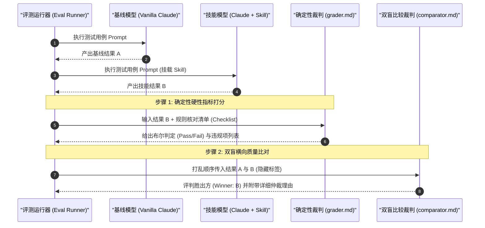

# Anthropic Skills 自定义技能开发与 Eval 评测体系

| 属性 | 详情 |
| :--- | :--- |
| **文档类型** | 开发实战手册 / 质量评测指南 |
| **当前状态** | 已归档 (Accepted) |
| **作者** | Ateng |
| **创建日期** | 2026-09-23 |
| **关联系统/模块** | skill-creator / Agent Skills 评测框架 |

---

## 1. 自定义技能开发全生命周期 (Authoring Lifecycle)

开发一个高质量的 Agent 技能不仅仅是编写一份 Markdown 提示词，而是一个包含**需求画像、脚手架生成、自动化评测与描述调优**的闭环工程体系。

```
[1. 需求画像与定界] ──> [2. skill-creator 交互生成] ──> [3. 构造 3~5 个真实 Eval 用例]
                                                                  │
┌─────────────────────── [5. improve_description.py] ◄────────────┤
│                                 (调优描述词)                    ▼
▼                                                       [4. 双 Agent 裁判比对]
[6. 达到准入基线] ──> [7. 打包发布与纳管]                 (grader.md + comparator.md)
```

---

### 1.1 需求画像与职责边界定义

在动手创建技能之前，架构师必须清晰界定三类指令机制的定位，避免职责重叠：

| 机制类型 | 物理形态 | 加载机制 | 适用场景与边界 |
| :--- | :--- | :--- | :--- |
| **Rules (项目规则)** | `.cursorrules` / `AGENTS.md` | 全局无条件全量常驻 | 仓库级通用纪律（如代码规范、Git 提交格式、编码声明）。 |
| **Custom Instructions** | System Prompt 定制片段 | 全局无条件常驻 | 用户个人偏好（如“统一使用中文回答”、“保持极简语气”）。 |
| **Agent Skills** | 独立自包含目录 (`SKILL.md`) | **渐进式披露，按需激活** | **具有独立领域知识、多步骤 SOP、专用外部脚本与资产的复杂任务**。 |

> [!TIP]
> **技能判定黄金法则**：
> 如果一项能力**只在特定场景下被用到**，且**正文包含超过 50 行的专业判断规则或需要外部辅助脚本**，则应当封装为独立的 Agent Skill；反之，若是一句话全局偏好，则应归入 Rules。

---

### 1.2 `skill-creator` 元技能交互式开发 SOP

官方在 `skills/skill-creator` 中提供了一个用于“打造技能的元技能（Meta-Skill）”。它通过引导式问答帮助开发者完成技能的标准化定义：

```bash
# 在 Claude Code 中唤醒元技能
"我想创建一个名为 fast-api-scaffold 的新技能，专门用于按照团队规范快速搭建 FastAPI 异步微服务项目，包括目录结构、Pydantic v2 模型与测试用例。"
```

#### `skill-creator` 引导流程：
1. **意图挖掘（Intent Elicitation）**：引导开发者确认输入参数、输出产物形式、核心技术选型（如 FastAPI + Pydantic v2 + SQLAlchemy 2.0）。
2. **生成自包含脚手架**：
   - 自动生成符合规范的 `SKILL.md`，填充规范的 YAML Frontmatter。
   - 自动规划 `scripts/`（如脚手架生成脚本）与 `references/`（代码风格规范）。
3. **初始 Prompt 提炼**：自动撰写 500 行以内的高密度 SOP。

---

## 2. 严苛的基准测试集 (Eval Dataset) 构建

技能的质量不能依赖一次性的人工“感觉测试”，必须建立**可量化、可复现的基准测试集（Eval Dataset）**。

### 2.1 设计真实世界场景评测用例 (Realistic Prompts)

一个合格的评测集通常需要包含 **2~5 个代表性测试用例**，覆盖显式调用、隐式意图与负向边界：

```markdown
<!-- 文件: evals/evals.json -->
[
  {
    "id": "eval-01-explicit",
    "prompt": "使用 fast-api-scaffold 初始化一个包含用户注册与 JWT 认证的基础项目骨架",
    "type": "explicit_trigger",
    "expected_behavior": "必须使用 Pydantic v2，必须生成 test_auth.py，目录结构符合三层分层"
  },
  {
    "id": "eval-02-implicit",
    "prompt": "我要写一个高性能异步 Python 服务接入 Redis 缓存，帮我搭一个脚手架",
    "type": "implicit_trigger",
    "expected_behavior": "能够根据异步与高性能上下文自动命中该技能，无需用户显式提及技能名"
  },
  {
    "id": "eval-03-negative",
    "prompt": "帮我写一个 Django 的前端模板页面",
    "type": "negative_case",
    "expected_behavior": "严禁触发 fast-api-scaffold 技能，由通用模型回答"
  }
]
```

---

### 2.2 构建对照基线 (Baseline Comparison)

在正式评测时，测试套件会在两种隔离环境下分别执行相同的 Eval 用例：
- **Baseline（基线组）**：原生 Claude 模型（未挂载该技能）。
- **With Skill（技能组）**：挂载该技能后的 Claude 实例。

通过比对两者的输出，量化评估技能带来的**质量提升（增量价值）**与**耗时/Token 开销变化**。

---

## 3. 双 Agent 自动裁判评测与盲测比对

Anthropic Skills 架构采用由两个不同职责的子 Agent 组成的“双裁判系统”：



---

### 3.1 确定性评分裁判：`grader.md` 规则评分机制

`grader.md` 是一个专门执行“硬性布尔规则检查”的审查 Agent。它不进行主观审美判断，只严格审查输出是否符合客观指标：

- **产物完整性**：文件是否成功生成？关键类名/函数名是否拼写正确？
- **代码合规性**：代码是否通过了静态语法检查？是否包含预期的依赖库版本？
- **约束遵从度**：是否违反了 `SKILL.md` 中声明的禁用规则（如禁止使用全局变量）？

---

### 3.2 盲测裁判：`comparator.md` 双盲对比判定

为了规避主观偏见，`comparator.md` 在完全不知晓哪份结果来自基线组、哪份来自技能组的前提下，从以下 4 个维度进行盲测仲裁：
1. **专业深度（Technical Depth）**：架构设计是否符合工业级标准，是否考虑了并发、超时与异常处理。
2. **版面呼吸感与排版质感（Aesthetics & Structure）**：结构是否条理清晰，是否避免了粗制滥造的大段代码罗列。
3. **开箱即用度（Actionability）**：用户是否能够无缝复制并直接跑通代码。

---

## 4. 触发精度工程化调优 (Description Optimization)

技能在真实工程中经常遭遇两类痛点：
- **Under-triggering（拒唤醒）**：用户提出了符合意图的问题，但技能未能激活。
- **Over-triggering（误抢占）**：无关任务被该技能错误截获，导致模型答非所问。

---

### 4.1 使用 `improve_description.py` 自动化迭代调优

官方测试套件提供了 `improve_description.py` 脚本工具，基于历史测试集的执行结果自动优化 YAML Frontmatter 中的 `description` 文本：

```bash
# 运行描述调优脚本
python -m skills.skill_creator.improve_description \
  --skill-path ./skills/fast-api-scaffold \
  --eval-results ./evals/results.json \
  --iterations 3
```

#### 算法迭代核心逻辑：
1. **计算当前混淆矩阵**：统计命中率（Precision）与召回率（Recall）。
2. **提取失败样本特征**：
   - 针对假阴性（False Negatives，该触发未触发）：提取 Prompt 中的核心动词与名词，增补进触发关键词候选集。
   - 针对假阳性（False Positives，不该触发而误触发）：自动提取排他性约束，并在 `description` 末尾补充 `Avoid using when...` 卫语句。
3. **重测验证**：持续迭代至综合 F1-Score 达到 95% 以上。

---

### 4.2 评测可视化看板 (`eval-viewer`)

官方提供了轻量级 Web 评测可视化工具 `eval-viewer`：

```bash
# 启动本地评测审查仪表盘
python -m skills.skill_creator.eval_viewer --results-dir ./evals/runs/
```

开发者可在浏览器中直观比对基线与技能版本的代码 Diff、查看每位裁判 Agent 的具体评审意见，并对表现未达预期的 Case 进行就地定位和针对性微调。

---

## 5. 权威参考资料与事实依据 (References & Grounding)

- [[Tier 1]] [anthropics/skills Official Repository: skill-creator](https://github.com/anthropics/skills/tree/main/skills/skill-creator) - 元技能实现、评测脚本与双裁判机制 (核验日期: 2026-09-23)
- [[Tier 1]] [Anthropic Research: Evaluating LLM Systems](https://anthropic.com/research) - LLM 自动化评测与双盲比较方法论 (核验日期: 2026-09-23)
- [[Tier 1]] [agentskills.io Authoring Guide](https://agentskills.io) - 开放标准自定义技能开发指南与最佳实践 (核验日期: 2026-09-23)

### 契约核查矩阵：
| 核查对象 (组件/工具) | 官方基准事实 (Ground Truth) | 对应依据 | 状态 |
| :--- | :--- | :--- | :--- |
| `skill-creator` | 官方用于自建、测试与优化技能的元技能 | `skills/skill-creator/SKILL.md` | 已核实真实有效 |
| 双裁判 Agent 角色 | `grader.md` 负责确定性布尔判定，`comparator.md` 负责双盲仲裁 | 官方评测框架代码 | 已核实真实有效 |
| 描述调优脚本 | `improve_description.py` 基于混淆矩阵自动优化 Frontmatter | 官方自动化工具链 | 已核实真实有效 |
| 结果可视化工具 | `eval-viewer` 提供交互式比对仪表盘 | 官方评测套件 | 已核实真实有效 |
