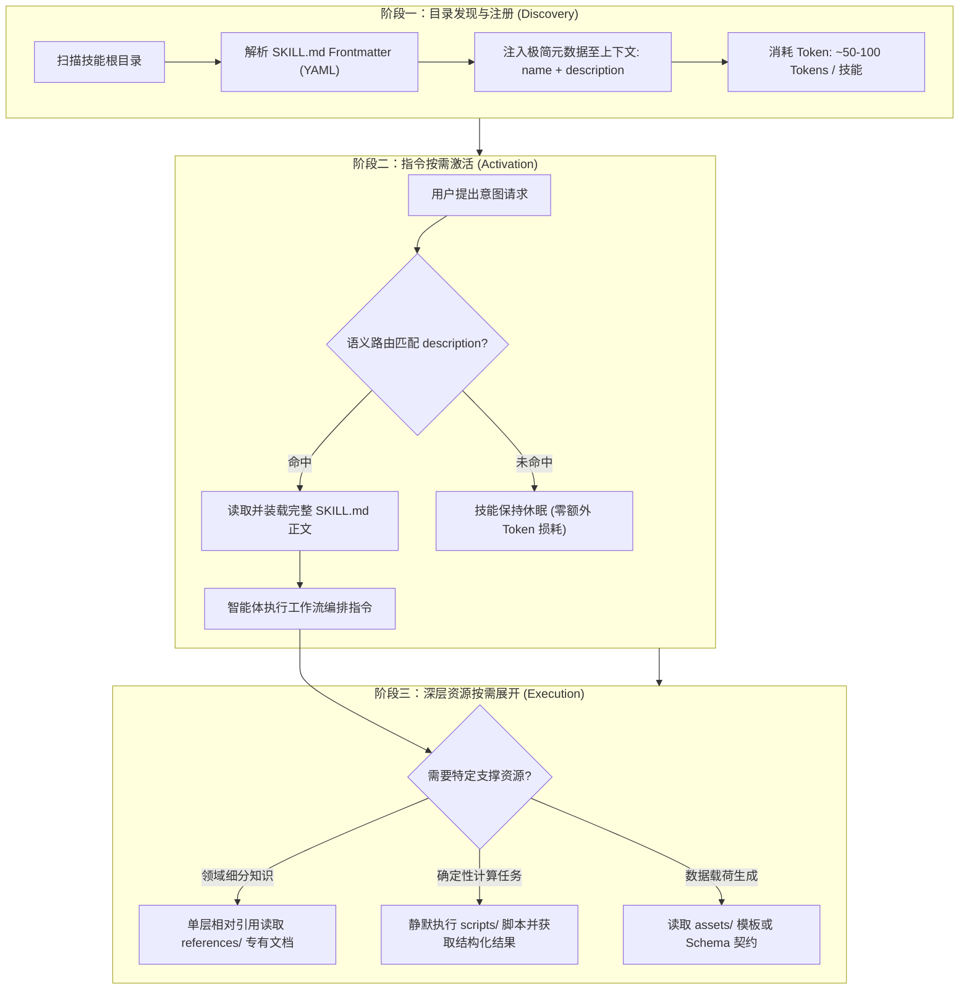
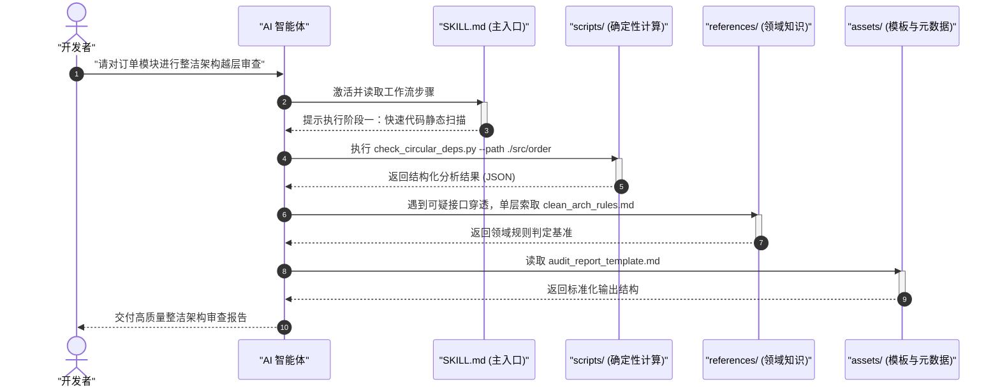

# 自定义技能开发、目录规约与离线校验工程指南

| 属性 | 详情 |
| :--- | :--- |
| **文档类型** | 工程研发与质量校验指南 (Authoring & Validation) |
| **当前状态** | 已归档 (Accepted) |
| **作者** | Ateng |
| **创建日期** | 2026-09-22 |
| **关联系统/模块** | Ateng-AI / Skills / Anthropic |

---

## 一、引言与设计哲学

在现代 AI Agent（智能体）工程体系中，技能（Skills）是扩展智能体认知边界与执行能力的标准化插件形态。技能将特定领域的专家经验、流程规约、操作脚本和离线参考知识高度解耦并封装成一个自包含单元，使大语言模型（LLM）能够在不重新微调的前提下，安全、精准、高效地执行复杂的研发与运维任务。

然而，智能体技能的开发面临着严苛的系统性挑战：**上下文窗口预算（Context Window Budget）的不可逆消耗**。如果将所有的工程规则、长篇文档和庞大脚本全量注入提示词中，不仅会导致极高的推理成本，还会引发**注意力稀释（Attention Dilution）**与**指令漂移（Instruction Drift）**。

因此，Anthropic 规范下的技能架构贯彻了**渐进式披露（Progressive Disclosure）**的核心哲学。



### 技能开发的“三大黄金法则”

1. **精简主文件（Slim Entrypoint Rule）**：
   - 主入口文件 `SKILL.md` 严格收敛在 **500 行以内**（推荐 100 ~ 300 行）。
   - `SKILL.md` 的职责仅限于**流程编排、状态流转与逻辑分支调度**。具体的长篇领域知识必须下沉到子目录，严禁在主入口中堆砌大段教程或日志范本。
2. **单层相对引用（Single-hop References Rule）**：
   - 技能内部的文件引用必须保持**单层单跳（Single-hop）**，禁止出现深层链式引用（如 `SKILL.md` -> `ref_a.md` -> `ref_b.md` -> `ref_c.md`）。
   - 所有的领域参考知识均由 `SKILL.md` 直接以相对路径单级索取，避免智能体陷入长程寻址迷宫与上下文递归污染。
3. **Token 保护与确定性下沉（Token Shield & Deterministic Offloading）**：
   - 凡是能够通过确定性代码（如 Python、Shell、Node.js 脚本）完成的计算、过滤、排序、静态分析或 Schema 校验，**坚决不要交由 LLM 进行纯文本推理**。
   - 将计算下沉到 `scripts/` 中执行，智能体仅需消费脚本的标准输出（JSON / 轻量 Markdown），从而以最低的 Token 消耗获得 100% 确定性的执行质量。

> [!IMPORTANT]
> **黄金法则的工程本质**：技能不是为了让智能体“阅读更多”，而是为了给智能体在正确的时间提供“最精确的最小必要信息（Just-In-Time Minimal Context）”。

---

## 二、`SKILL.md` 形式化契约约束详解

每个技能目录的根节点必须包含且仅包含一个名为 `SKILL.md` 的契约入口文件。该文件由顶部的 **YAML Frontmatter 元数据区** 与底部的 **Markdown 核心指令正文** 组成。

### 1. Frontmatter 规范约束全景

| 字段名 | 类型 | 必填性 | 长度/格式约束 | 核心职责说明 |
| :--- | :--- | :---: | :--- | :--- |
| `name` | String | **必填** | 1 ~ 64 字符，正则 `^[a-z0-9]+(-[a-z0-9]+)*$` | 技能唯一标识符，**必须与所在父目录名严格完全一致**。 |
| `description` | String | **必填** | 1 ~ 1024 字符，非空字符串 | 描述技能功能边界与激活时机，路由召回的核心决策源。 |
| `compatibility` | String / List | 可选 | 自由文本或版本规范列表 | 声明技能运行所需的系统依赖、语言运行时或环境基线。 |
| `metadata` | Map | 可选 | 键值对映射对象（Key-Value Map） | 自定义扩展元数据（如作者、版本、许可证、归属模块等）。 |
| `allowed-tools` | List | 可选 | 字符串列表（工具标识符） | 预授权或声明技能被允许调用的宿主工具集合，收敛安全边界。 |

---

### 2. 核心字段深度拆解与正反用例对比

#### (1) `name` 字段规范

- **命名空间与字符集**：只允许使用 ASCII 小写字母（`a-z`）、半角数字（`0-9`）和连字符（`-`）。
- **连字符边界限制**：严禁以连字符开头或结尾；严禁出现连续连字符（如 `foo--bar`）。
- **禁止特殊符号**：严禁出现大写字母（`A-Z`）、下划线（`_`）、点号（`.`）或空格。
- **目录一致性红线**：`name` 字段的值必须与承载该文件的文件夹名称**字面完全一致**。例如：目录为 `api-design-helper/`，则 `name` 必须精准配置为 `name: api-design-helper`。

| 评估状态 | 示例名称 | 原因与问题分析 |
| :---: | :--- | :--- |
| ✅ **推荐** | `codebase-review` | 纯小写字母与连字符，语义明确，符合正则规范。 |
| ✅ **推荐** | `db-migrate-v2` | 合理使用小写数字与连字符，版本语义清晰。 |
| ❌ **违规** | `CodebaseReview` | 包含大写字母，违反 `skills-ref` 静态校验规范。 |
| ❌ **违规** | `codebase_review` | 使用了下划线 `_`，未收敛至连字符 `-`。 |
| ❌ **违规** | `fast--parser` | 包含连续两个连字符 `--`，破坏标准 Slug 格式。 |
| ❌ **违规** | `-lint-fixer-` | 以连字符开头或结尾，违反前缀后缀边界约束。 |
| ❌ **违规** | 目录为 `tdd`，配置为 `name: tdd-runner` | 技能标识符与目录名不一致，导致目录发现引擎无法对齐索引。 |

#### (2) `description` 字段规范

- **双核结构**：必须同时回答两个核心问题：**做什么（What it does）** 与 **何时使用（When to use）**。
- **意图激发与关键词布局**：在描述中显式包含用户在提问时高频出现的短语（Trigger Phrases）与专业术语，为模型路由提供高密度的语义向量指纹。
- **篇幅克制**：控制在 1024 字符以内，去除所有无关寒暄。

```yaml
# ❌ 不良范例：模糊、无触发时机、缺乏关键词
description: 这是一个用来检查代码的技能，可以帮助开发者写出更好的代码。

# ❌ 不良范例：仅描述了动作，缺乏何时触发的场景边界
description: 解析并验证 OpenAPI 3.0 规范，输出错误列表。

# ✅ 良好范例：清晰阐述功能职责、触发场景与关键词
description: 针对 Python 异步代码库进行性能瓶颈诊断与并发死锁审查。当用户提出“优化 async 性能”、“排查协程卡死”、“解决 asyncio 死锁”或需要进行异步代码审查时自动激活该技能。
```

#### (3) `compatibility`、`metadata` 与 `allowed-tools` 字段

```yaml
---
name: async-debugger
description: 深度分析与定位 Python 异步服务（asyncio, FastAPI, Celery）中的事件循环卡死与并发资源竞争问题。在用户提到“协程超时”、“排查死锁”或“优化异步性能”时调用。
compatibility:
  python: ">=3.12"
  package-manager: "uv"
  os: "linux, darwin, windows"
metadata:
  author: Ateng
  version: 1.2.0
  category: diagnostics
  license: Apache-2.0
allowed-tools:
  - Bash
  - FileRead
  - FileEdit
---
```

> [!TIP]
> **安全最佳实践**：合理声明 `allowed-tools` 能够防止智能体在执行未预期分支时越权调用非必要工具（如防止只读审查技能误调用文件写工具或外部网络请求工具）。

---

## 三、资源解耦组织模式

一个经过良好工程解耦的技能项目，其内部结构应清晰反映代码、文档与静态模板的物理边界。

### 1. 标准工程目录树

```
arch-guardian/                      # 技能父目录 (必须与 name 字段一致)
├── SKILL.md                        # 核心契约与编排主入口 (<= 500 行)
├── scripts/                        # 确定性可执行脚本 (下沉执行逻辑)
│   ├── check_circular_deps.py     # 循环依赖静态分析脚本
│   └── generate_metrics.sh         # 架构度量统计脚本
├── references/                     # 领域知识与微规范 (单层相对引用)
│   ├── clean_arch_rules.md         # 整洁架构分层规则表
│   └── layer_violations.md         # 越层调用代码坏味道对照表
└── assets/                         # 模板、Schema 与静态元数据
    ├── audit_report_template.md    # 审查报告 Markdown 输出模板
    └── rules_schema.json           # 规则定义 JSON Schema 契约
```

### 2. 各子目录的工程职责与约束



#### (1) `scripts/`（确定性可执行代码）
- **自包含与防御性编程**：脚本必须独立可运行，通过标准 CLI 参数（如 `argparse`）接受输入，严禁隐式依赖外部未受控的全局环境变量。
- **标准化退出码**：正常完成返回退出码 `0`，捕获业务错误返回明确的非零退出码（如 `1` 或 `2`）。
- **结构化输出**：脚本输出优先选择紧凑的 JSON 或结构化 Key-Value 文本，方便智能体快速解析，严禁无意义的冗长调试日志刷屏。
- **轻量依赖与 PEP 723**：Python 脚本建议尽可能依赖标准库；若必须引入第三方库，推荐采用 PEP 723 单文件元数据声明（便于使用 `uv run` 零配置沙箱执行）。

#### (2) `references/`（轻量领域知识，单层引用）
- **职责隔离**：仅收录与特定任务紧密相关的业务术语、接口速查表、错误代码映射等细分知识。
- **单层引用保证**：`SKILL.md` 中以 `[整洁架构规则](./references/clean_arch_rules.md)` 形式声明关联。智能体仅在需要判定特定架构越层时才去读取它。
- **篇幅限制**：单个参考文档建议控制在 300 行以内，内容聚焦于“规则陈述 + 判定表格”，避免冗长的理论发散。

#### (3) `assets/`（模板、Schema 与静态载荷）
- **契约固化**：存放需要智能体生成的报告模板（如 Jinja2/Mustache/Markdown 骨架）、配置文件示例以及各类 JSON Schema。
- **不可变性**：`assets/` 内的资源原则上属于只读资产，供智能体读取后填入动态业务数据，不得在运行时直接修改原始模板。

---

## 四、官方 `skills-ref` 规范校验器实战

为保障技能在被加载与分发前的工程健壮性，Anthropic 提供了官方技能参考校验器 `skills-ref`。该工具执行无状态的静态语法树分析与规范验证。

### 1. 安装与离线执行

开发者无需在宿主环境中进行复杂的深度配置，可直接通过 `pip` 安装或使用现代 Python 包管理器 `uv` 进行零安装即时执行：

```bash
# 方案 A: 通过 pip 全局或虚拟环境安装
pip install skills-ref

# 运行单技能目录校验
skills-ref validate ./my-skill

# 运行多技能集合批量校验
skills-ref validate ./skills/*

---

# 方案 B: 使用 uvx 即用即弃免安装执行 (强烈推荐)
uvx skills-ref validate ./my-skill

# 以 JSON 格式输出机器可读的静态分析报告 (用于集成脚本)
uvx skills-ref validate ./my-skill --format json
```

### 2. 常见静态校验错误对照与自愈方案

| 错误代码 / 提示 | 根因剖析 | 自愈修复方案 |
| :--- | :--- | :--- |
| `ERR_NAME_MISMATCH: Skill name does not match directory` | `SKILL.md` 中的 `name` 字段与父目录名称不一致。 | 统一两者的命名。例如目录为 `git-rebase-wizard`，必须将 `name` 改为 `git-rebase-wizard`。 |
| `ERR_INVALID_NAME_CHARS: Name contains illegal characters` | 包含了大写字母、下划线、空格或非法符号。 | 将名称转换为纯小写字母与连字符组合，如将 `Code_Review` 修正为 `code-review`。 |
| `ERR_MISSING_FRONTMATTER: Frontmatter block not found` | 文件未以 `---` 开头或未闭合 YAML 头。 | 在文件第 1 行添加 `---`，并在元数据末尾正确闭合 `---`。 |
| `ERR_DESCRIPTION_TOO_LONG: Description exceeds 1024 chars` | `description` 字段字数超标，包含了过度冗长的指南。 | 精简描述，将操作步骤移入 Markdown 正文，仅保留核心职责与触发场景。 |
| `ERR_EMPTY_DESCRIPTION: Description field cannot be empty` | 遗漏了 `description` 字段或值为空。 | 补充清晰的“功能 + 何时激活”描述语句。 |
| `ERR_BROKEN_REFERENCE: Referenced path does not exist` | Markdown 正文中引用的本地路径不存在或拼写错误。 | 检查所有以 `./references/` 或 `./scripts/` 开头的相对路径，确保物理文件存在。 |
| `ERR_MAIN_FILE_EXCEEDS_LIMIT: File lines exceed recommendation` | `SKILL.md` 文件行数超过了 500 行推荐上限。 | 触发重构：将长篇规则拆分下沉至 `references/`，将处理逻辑下沉至 `scripts/`。 |

> [!WARNING]
> **发布门禁红线**：任何包含静态校验错误的技能**严禁合并入主干分支**。未经校验的非法字段会导致智能体宿主环境在初始化技能清单时抛出解析异常，甚至造成全量技能加载失败。

---

### 3. CI/CD 自动化流水线配置

在团队工程协作中，应将 `skills-ref` 纳入 GitHub Actions 持续集成流水线，作为 Pull Request 的前置强制检查门禁（Quality Gate）。

以下为经过生产检验的完整工作流配置示例：

```yaml
# .github/workflows/skills-validation.yml
name: "Skills Specification & Lint Gate"

on:
  push:
    branches:
      - main
    paths:
      - "skills/**"
      - ".github/workflows/skills-validation.yml"
  pull_request:
    branches:
      - main
    paths:
      - "skills/**"

jobs:
  validate-skills:
    name: "Validate Skills with skills-ref"
    runs-on: ubuntu-latest

    steps:
      - name: "Checkout Repository"
        uses: actions/checkout@v4

      - name: "Install Astral uv"
        uses: astral-sh/setup-uv@v3
        with:
          version: "latest"
          enable-cache: true

      - name: "Set up Python Environment"
        run: uv python install 3.12

      - name: "Run skills-ref Static Validation"
        run: |
          echo "=========================================="
          echo "🔍 开始对所有 Agent Skills 执行静态规范校验..."
          echo "=========================================="
          
          # 遍历扫描 skills 目录下所有包含 SKILL.md 的子目录
          FAIL_COUNT=0
          for skill_dir in $(find skills -type f -name "SKILL.md" -exec dirname {} \;); do
            echo "👉 正在校验技能单元: ${skill_dir}"
            if ! uvx skills-ref validate "${skill_dir}"; then
              echo "❌ 校验失败: ${skill_dir}"
              FAIL_COUNT=$((FAIL_COUNT + 1))
            else
              echo "✅ 校验通过: ${skill_dir}"
            fi
          done

          if [ ${FAIL_COUNT} -ne 0 ]; then
            echo "🚨 发现 ${FAIL_COUNT} 个技能未通过契约规范校验，流水线阻断！"
            exit 1
          fi

          echo "🎉 全量技能静态契约校验 100% 通过！"
```

---

## 五、从零编写生产级自定义技能实战案例

在本章节中，我们将完整演练一个面向真实研发场景的生产级技能——**`arch-auditor`（架构合规与循环依赖审计师）**的开发全流程。

### 1. 项目拓扑与文件分布

```
skills/arch-auditor/
├── SKILL.md
├── scripts/
│   └── analyze_deps.py
├── references/
│   └── layered_architecture.md
└── assets/
    └── audit_template.md
```

---

### 2. 编写核心契约文件：`SKILL.md`

```markdown
---
name: arch-auditor
description: 专门用于审查代码库架构分层契约、探测包间循环依赖与定位非规范跨层调用的工程技能。当用户提到“代码架构检查”、“循环依赖排查”、“分层合规审查”或需要执行代码坏味道诊断时自动触发。
compatibility:
  python: ">=3.11"
  runner: "uv"
metadata:
  author: Ateng
  version: 1.0.0
  category: architecture
allowed-tools:
  - Bash
  - FileRead
  - FileEdit
---

# 架构合规与循环依赖审计指引 (Arch-Auditor)

本技能为代码库提供确定性的架构分层审查与循环依赖扫描能力。

## 审计工作流阶段


### 步骤 1：执行确定性静态依赖拓扑提取
不要使用纯文本遍历代码。优先使用内置分析脚本提取模块级导入关系：

```bash
uv run python ./scripts/analyze_deps.py --source-dir <待审查源码路径> --output-format json
```

### 步骤 2：对标架构分层规则
如果脚本扫描出跨模块调用或潜在循环依赖，按需查阅 [分层架构设计准则](./references/layered_architecture.md)，判定是否违背了“仅允许高层依赖底层”、“同层解耦”等规则。

### 步骤 3：渲染标准化审计报告
1. 读取报告骨架：[审计报告标准模板](./assets/audit_template.md)。
2. 将违反架构规则的调用点与循环依赖链填入对应章节。
3. 针对每一个违背点，给出具体的依赖倒置（DIP）或事件解耦重构建议。
```

---

### 3. 编写下沉计算脚本：`scripts/analyze_deps.py`

```python
"""
模块依赖与循环导入静态分析脚本
@author Ateng
@since 2026-09-22
"""

import ast
import argparse
import json
import os
import sys
from typing import Dict, List, Set


def parse_imports(file_path: str) -> List[str]:
    """解析单个 Python 源码文件中的顶级 import 模块"""
    imported_modules = []
    try:
        with open(file_path, "r", encoding="utf-8") as f:
            tree = ast.parse(f.read(), filename=file_path)
        for node in ast.walk(tree):
            if isinstance(node, ast.Import):
                for alias in node.names:
                    imported_modules.append(alias.name)
            elif isinstance(node, ast.ImportFrom):
                if node.module:
                    imported_modules.append(node.module)
    except Exception as e:
        sys.stderr.write(f"Warning: 解析文件失败 {file_path}: {e}\n")
    return imported_modules


def detect_cycles(graph: Dict[str, Set[str]]) -> List[List[str]]:
    """使用深度优先搜索 (DFS) 检测依赖有向图中的环路"""
    cycles = []
    visited: Set[str] = set()
    rec_stack: List[str] = []

    def dfs(node: str):
        visited.add(node)
        rec_stack.append(node)
        for neighbor in graph.get(node, set()):
            if neighbor not in visited:
                dfs(neighbor)
            elif neighbor in rec_stack:
                cycle_start = rec_stack.index(neighbor)
                cycles.append(rec_stack[cycle_start:] + [neighbor])
        rec_stack.pop()

    for n in list(graph.keys()):
        if n not in visited:
            dfs(n)
    return cycles


def main():
    parser = argparse.ArgumentParser(description="Python 模块依赖拓扑提取器")
    parser.add_argument("--source-dir", required=True, help="待扫描的源码根目录")
    parser.add_argument("--output-format", choices=["json", "text"], default="json")
    args = parser.parse_args()

    src_dir = os.path.abspath(args.source_dir)
    dep_graph: Dict[str, Set[str]] = {}

    for root, _, files in os.walk(src_dir):
        for file in files:
            if file.endswith(".py") and not file.startswith("__"):
                full_path = os.path.join(root, file)
                rel_mod = os.path.relpath(full_path, src_dir).replace(os.sep, ".").rstrip(".py")
                imports = parse_imports(full_path)
                dep_graph[rel_mod] = set(imports)

    cycles = detect_cycles(dep_graph)

    result = {
        "status": "success",
        "total_modules": len(dep_graph),
        "cycle_count": len(cycles),
        "cycles": cycles
    }

    if args.output_format == "json":
        print(json.dumps(result, ensure_ascii=False, indent=2))
    else:
        print(f"扫描模块数: {result['total_modules']}, 发现环路数: {result['cycle_count']}")
        for c in cycles:
            print(" -> ".join(c))

    sys.exit(0 if len(cycles) == 0 else 1)


if __name__ == "__main__":
    main()
```

---

### 4. 编写轻量领域参考：`references/layered_architecture.md`

```markdown
# 领域驱动分层架构核心准则

| 分层 | 职责范围 | 允许依赖的下层 | 绝对禁止的行为 |
| :--- | :--- | :--- | :--- |
| **API 接入层 (Interfaces)** | HTTP 路由、RPC 契约处理、DTO 参数校验 | Application, Domain | 越过应用层直接操作基础设施层持久化对象。 |
| **应用服务层 (Application)** | 用例编排、分布式事务管理、跨领域协调 | Domain, Infrastructure | 编写核心领域逻辑；引入外部协议特有依赖。 |
| **核心领域层 (Domain)** | 业务聚合根、实体、领域服务、值对象、仓储契约 | 无（核心纯洁性） | 依赖任何外部存储框架、Spring 注解或第三方 SDK。 |
| **基础设施层 (Infrastructure)**| 数据库实现、Redis 缓存、消息队列、外部网关 | Domain (通过倒置契约依赖) | 反向控制业务核心；泄露存储细节到领域层。 |

## 违规越层模式辨析
1. **下层穿透调用高层**：如 Domain 实体直接调用 Application Service，属于严重架构破坏。
2. **同层双向循环依附**：如 `order` 模块与 `payment` 模块互相直接引用，应重构为领域事件（Domain Events）驱动。
```

---

### 5. 编写输出模板契约：`assets/audit_template.md`

```markdown
# 代码库架构合规与循环依赖审计报告

- **审查时间**: {{AUDIT_DATE}}
- **目标目录**: `{{TARGET_DIR}}`
- **合规评级**: {{COMPLIANCE_LEVEL}} (优秀 / 良好 / 需重构 / 严重阻塞)

---

## 一、循环依赖扫描结果

- **分析模块总量**: {{TOTAL_MODULES}}
- **环路总数**: {{CYCLE_COUNT}}

{{CYCLES_DIAGRAM_OR_LIST}}

---

## 二、分层越界违规明细

| 违规源文件 | 目标被调用方 | 所属违规模式 | 严重程度 |
| :--- | :--- | :--- | :---: |
| `path/to/source.py` | `path/to/target.py` | 越级穿透 / 反向依赖 | P1 / P2 |

---

## 三、架构重构建议与消除方案

1. **针对循环依赖链**:
   - 方案阐述：...
2. **针对分层越界**:
   - 方案阐述：...
```

---

### 6. 本地校验自检

编写完成后，在终端针对 `arch-auditor` 目录执行离线规范校验：

```bash
uvx skills-ref validate ./skills/arch-auditor
```

校验器将自动完成：
1. 检查 YAML Frontmatter 格式是否合法。
2. 验证 `name: arch-auditor` 是否与目录名一致。
3. 验证 `description` 长度与字符完整性。
4. 扫描 Markdown 正文中的相对引用链接（如 `./scripts/analyze_deps.py`、`./references/layered_architecture.md`、`./assets/audit_template.md`）是否存在有效物理文件。
5. 输出全绿状态报告 `Validation passed successfully!`。

---

## 六、技能工程化最佳实践检查清单

在提交或发布任何 Agent Skill 前，研发团队应严格对照以下十项核心检查指标进行逐项验收：

| 维度 | 检查项 | 验收达标基准 |
| :---: | :--- | :--- |
| **1. 命名契约** | Slug 一致性 | `name` 字段使用小写字母与连字符，且与父目录名称 100% 字符一致。 |
| **2. 路由语义** | Description 完备度 | 明确阐明“做什么”与“何时使用”，富含业务意图关键词，长度 <= 1024 字符。 |
| **3. 篇幅受控** | 主文件行数上限 | `SKILL.md` 正文必须控制在 500 行以内，长文档已拆解下沉。 |
| **4. 引用拓扑** | 单层单跳深度 | 不存在深层多跳链式引用，所有关联文档均由 `SKILL.md` 直接相对寻址。 |
| **5. 计算下沉** | 逻辑代码解耦 | 复杂的计算、文本提取、矩阵判定与依赖分析均下沉为 `scripts/` 下的自包含脚本。 |
| **6. 脚本健壮性** | 输入输出与退出码 | 脚本具备 CLI 参数解析、标准化退出码（0/非0），输出为对 LLM 友好的 JSON。 |
| **7. 权限最小化** | 工具授权收敛 | `allowed-tools` 仅声明工作流中绝对必须的工具，杜绝无限制通配赋权。 |
| **8. 模板规范** | 资产契约清晰 | `assets/` 中的模板包含清晰的占位符与 Schema 定义，只读不突变。 |
| **9. 离线校验** | 静态检查 0 告警 | 通过 `uvx skills-ref validate <skill-dir>` 校验，无任何错误或警告。 |
| **10. CI/CD 纳管** | 持续集成自动化 | 技能已纳入代码仓库的自动化校验工作流，具备 PR 合并拦截门禁。 |
