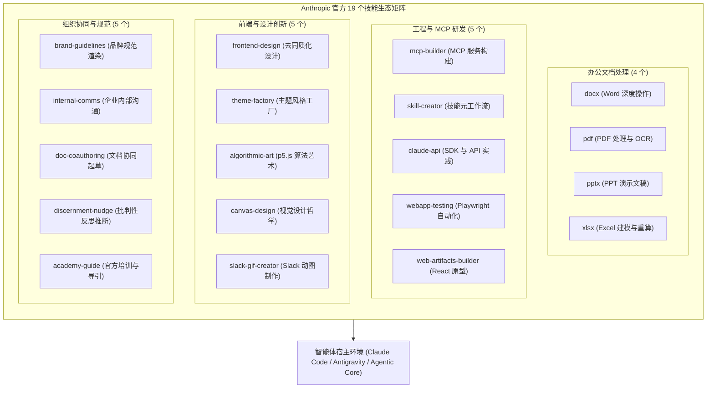
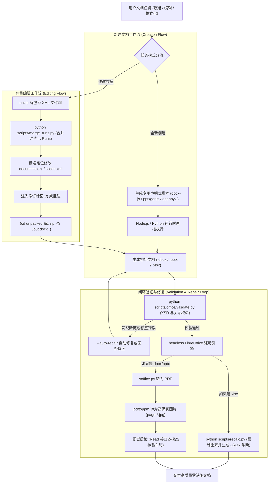
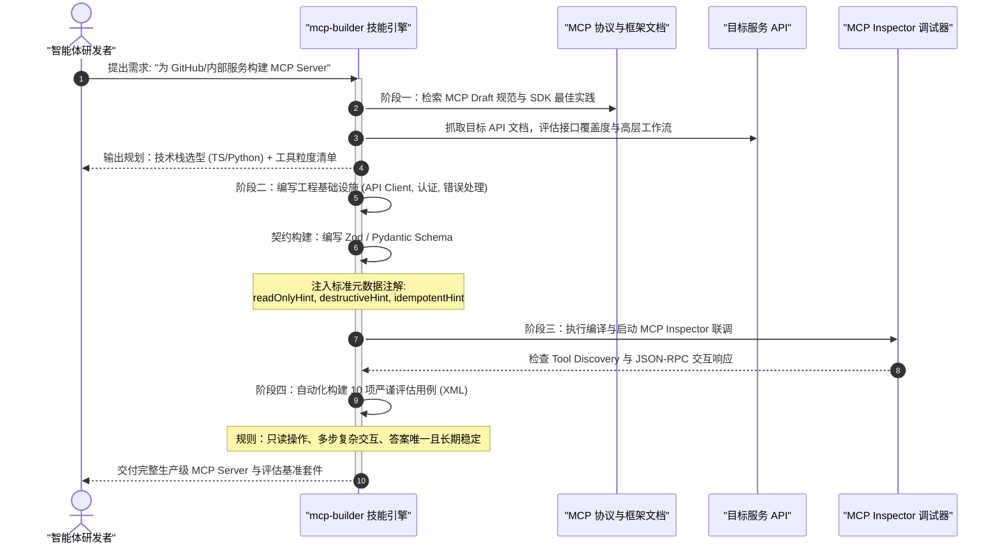
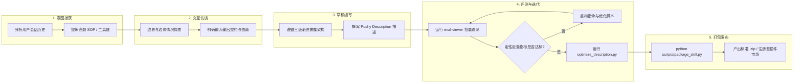
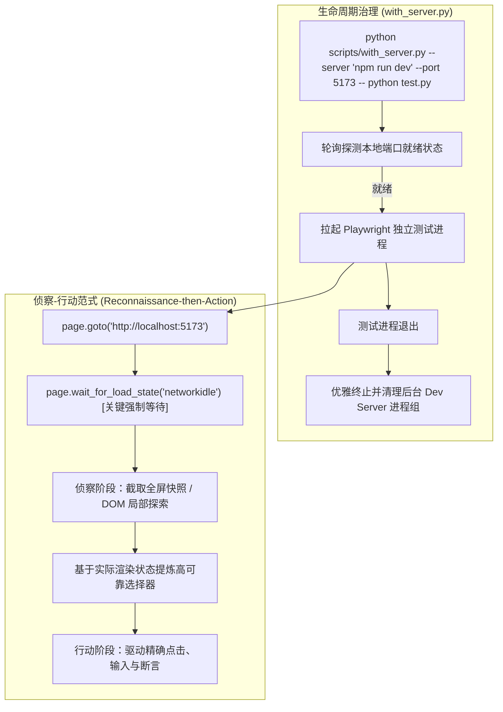
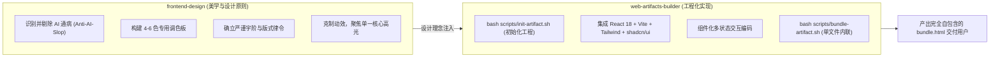

# 官方 19 个技能全景矩阵与核心实战拆解

| 属性 | 详情 |
| :--- | :--- |
| **文档类型** | 官方技能手册与实战解析 (Catalog & Deep Dive) |
| **当前状态** | 已归档 (Accepted) |
| **作者** | Ateng |
| **创建日期** | 2026-09-22 |
| **关联系统/模块** | Ateng-AI / Skills / Anthropic |

---

## 一、引言与生态定位

在 Anthropic 推进的 **Agent Skills（智能体技能标准）** 开放生态中，官方技能仓库（`anthropics/skills`）不仅是技能规范（[agentskills.io](https://agentskills.io)）的标杆实现，更是现代 AI Agent 走向工业级生产交付的“实战军械库”。

不同于早期仅包含单一自然语言 Prompt 的玩具式插件，Anthropic 官方沉淀的 **19 个生产级技能** 贯彻了**渐进式披露（Progressive Disclosure）**、**代码隔离执行（Isolated Script Execution）** 与 **确定性脚本兜底（Deterministic Script Grounding）** 的工程哲学。这些技能涵盖了从日常办公文档处理、底层协议工程、现代前端交互开发到跨部门组织协同的完整业务频谱。

---

## 二、双重协议与合规警示卡片

在探索与集成 Anthropic 官方技能时，开发者与企业架构师必须高度关注仓库内部的**双重许可证体系（Dual-Licensing Architecture）**。忽视许可证差异可能导致严重的企业法务合规风险。

> [!WARNING] 核心合规红线：Office 四件套 Source-Available 专有协议警示
> Anthropic 官方技能仓库中的 19 个技能并非全量采用通用开源协议。其中办公文档处理四件套（`docx`、`pdf`、`pptx`、`xlsx`）附带了独有的 **`LICENSE.txt` 专有许可（Proprietary / Source-Available）**：
>
> 1. **非商用开源 (Not Open Source)**：该四项技能受 Anthropic 服务条款（Consumer / Commercial Terms of Service）约束，属于“源码可用（Source-Available）”而非宽松开源软件（FOSS）。
> 2. **明确限制条款 (Explicit Restrictions)**：
>    - **严禁提取与留存**：禁止将这些材料从官方服务体系中提取或在服务之外保留独立副本用于商业分发。
>    - **严禁衍生作品与转许可**：禁止基于上述代码创建闭源衍生产品、销售或转授权给第三方。
>    - **严禁逆向工程与反编译**：禁止逆向编译相关资产。
> 3. **企业合规底线**：在自研商业产品、闭源 SaaS 平台或二次销售的商业 Agent 解决方案中，**严禁直接打包或内置此四项技能的原生源码与私有脚本**！

> [!IMPORTANT] 生产级技能架构范本的参考价值
> 尽管 Office 四件套在商用分发上受到严格法律约束，但 Anthropic 将其公开作为技术参考，其核心目的在于**为全球开发者提供复杂生产级智能体技能（Production-Grade Complex Skills）的顶级架构范本**：
> - **揭示工程真实挑战**：展示了大语言模型在面对 OOXML 复杂规范、XML 碎片化 Runs、样式丢失、公式缓存缺失等工业级硬核问题时的标准解法。
> - **规范设计标杆**：提供了 Node / Python 双运行时隔离编排、静默黑盒命令行脚本封装、XSD Schema 严格校验与双阶段修复循环的黄金范本。
> - **企业自研借鉴**：企业可以在合规前提下，参考其“规范解构、辅助脚本隔离、后置校验与视觉核对”的架构模式，使用合规的开源库（如 Apache POI、python-docx、WeasyPrint 等）自主构建适配内部业务的文档技能。

> [!TIP] 通用与研发类技能的开源许可
> 除 Office 四件套外，其余 15 个技能（如 `mcp-builder`、`skill-creator`、`frontend-design` 等）均遵循标准的 **Apache 2.0 开源许可证**，开发者与企业可自由集成、扩展与商业化使用。

---

## 三、19 个官方技能四分类全景矩阵速查表

官方 19 个技能按业务领域划分为四大集群，下表汇总了各技能的功能定位、底层核心依赖、协议分类与标准适用场景：

### 1. 办公文档处理技能群 (Office Document Automation)

| 技能标识 (Name) | 功能定位 | 核心优势与底层机制 | 许可证 | 典型触发场景 |
| :--- | :--- | :--- | :--- | :--- |
| **`docx`** | Word 文档高保真创建、精准修改与红线审阅 | 基于 `docx-js` (Node) 纯脚本化创建；解包编辑模式结合 `merge_runs.py` 合并碎片化 Runs；支持 tracked changes 修订标记与 `comment.py` 六文件联动批注；集成 `validate.py` 严格 XSD 校验。 | 专有源码可用 (Source-Available) | 商业合同审查、法律条款红线标记 (Redlining)、商务立项方案、正式公文模板生成。 |
| **`pdf`** | PDF 文档解析、表单填报、合成切分与 OCR | 组合式工具链策略：`pypdf` 处理页面级切分合并；`pdfplumber` 高精度还原表格与布局；`pdftoppm` 渲染高清位图；OCR 引擎处理扫描件检索。 | 专有源码可用 (Source-Available) | 电子发票结构化提取、多源 PDF 合并签名、交互式表单自动化填充、不可检索扫描件解析。 |
| **`pptx`** | 现代演示文稿代码级生成与母版复用 | 采用 `pptxgenjs` (Node) 动态编程绘制；全面规避色值前缀、选项突变、双轴图表与文本边距陷阱；提供 `thumbnail.py` 缩略图矩阵辅助选型，`add_slide.py` 自动化母版复制。 | 专有源码可用 (Source-Available) | 融资路演 Deck、技术架构汇报幻灯片、培训课件母版套用与图表数据动态更新。 |
| **`xlsx`** | 财务级电子表格建模、公式计算与数据清洗 | 基于 `openpyxl` + `pandas`；强制“全公式驱动”，杜绝硬编码数值；集成 headless LibreOffice 驱动的 `recalc.py` 强制重算脚本，输出 JSON 级公式与跨表引用校验报告。 | 专有源码可用 (Source-Available) | 投资财务模型测算、损益表平衡分析、脏乱数据清洗重组、自动化月度运营看板。 |

### 2. 工程与 MCP 研发技能群 (Engineering & MCP Ecosystem)

| 技能标识 (Name) | 功能定位 | 核心优势与底层机制 | 许可证 | 典型触发场景 |
| :--- | :--- | :--- | :--- | :--- |
| **`mcp-builder`** | 工业级 MCP (Model Context Protocol) 研发向导 | 涵盖 TypeScript (MCP SDK) 与 Python (FastMCP) 双栈落地；指导 API 覆盖度与高阶工具选型；规范 Zod/Pydantic Schema；自动构建 10 项严谨只读评估集（XML `<evaluation>`）。 | Apache 2.0 | 将企业内部 REST / GraphQL / 数据库 API 快速封装为符合工业标准的 MCP 服务端。 |
| **`skill-creator`** | Agent Skills 标准构建与优化的元技能 (Meta-Skill) | 贯彻三级渐进披露机制；内置完整构建流水线：意图捕获、交互式访谈、草稿起草、基于 `eval-viewer` 的定性定量评测、以及基于真实日志的描述词防漏触发调优。 | Apache 2.0 | 团队自研工程技能包从 0 到 1 孵化、存量提示词重构成标准技能、技能触发准确率基准调优。 |
| **`claude-api`** | Anthropic 官方 SDK 与 API 深度集成实战手册 | 覆盖 Python、TypeScript、Java、Go、C#、Rust 等全语言 SDK 契约；提供 Prompt Caching（提示词缓存）、Message Batches（批处理）、Token 计算与跨模型平滑迁移准则。 | Apache 2.0 | 研发多智能体后端系统、长上下文 Prompt Caching 性能优化、大吞吐异步批量离线推理。 |
| **`webapp-testing`** | 基于 Playwright 的前端端到端无头自动化测试 | 封装 `with_server.py` 屏蔽单服务/微服务生命周期管理；执行“侦察-行动（Reconnaissance-then-Action）”范式；先等待 `networkidle` 与 DOM 勘测，再执行精准断言。 | Apache 2.0 | 本地全栈 Web 界面功能验收、复杂 SPA 异步状态流调试、UI 截屏与视觉回归分析。 |
| **`web-artifacts-builder`** | 高保真交互式 Web Artifacts 工程化构建器 | 预置 React 18 + TypeScript + Vite + Tailwind CSS 3.4 + 40 多个 shadcn/ui 组件；借助 Parcel + `html-inline` 编译成完全自包含的单文件 HTML。 | Apache 2.0 | 在对话流中交付企业级交互后台、动态可视化看板、带状态路由的复杂前端交互原型。 |

### 3. 前端与设计创新技能群 (Frontend & Visual Design)

| 技能标识 (Name) | 功能定位 | 核心优势与底层机制 | 许可证 | 典型触发场景 |
| :--- | :--- | :--- | :--- | :--- |
| **`frontend-design`** | 破除 AI 模版化（Anti-AI-Slop）的前端视觉设计指导 | 明确指认并杜绝 AI 生成界面的常见陈词滥调（如暖奶油底色、兵马俑红 `#D97757`、无脑圆角 SaaS 卡片）；确立 4-6 色品牌基调、严谨字阶系统与单点视觉聚焦原则。 | Apache 2.0 | 企业官网重构、高辨识度产品落地页（Landing Page）设计、具有强品牌记忆点的界面重塑。 |
| **`theme-factory`** | 多端通用的专业主题与色彩设计工厂 | 预置 10 套涵盖现代科技、学术经典、极简主义的色彩与字体组合方案；提供无缝应用到幻灯片、文档、报表与 HTML 页面的标准化转换通道。 | Apache 2.0 | 跨媒介材料视觉风格统一、PPT 与 Web 协同换肤、多品牌客户个性化主题快速适配。 |
| **`algorithmic-art`** | 基于 p5.js 的算法生成艺术与参数化交互探索 | 采用“设计哲学先行 (.md) -> 代码表达实现 (.html + .js)”的双阶段创作流；结合种子随机、Perlin 噪声流场 (Flow Fields)、粒子物理系统与数学公式生成艺术品。 | Apache 2.0 | 交互式动态背景构建、生成式视觉艺术展览、算法海报生成、创意编程教学。 |
| **`canvas-design`** | 视觉哲学驱动的高清矢量海报与艺术画作生成 | 遵循“90% 视觉构图 + 10% 精炼文字”的美学律令；专注于形体、空间留白、色块平衡与版式张力；原生输出高保真 PNG 与矢量 PDF。 | Apache 2.0 | 技术大会主视觉海报、品牌宣导插画、文化纪念封面板、艺术排版卡片生成。 |
| **`slack-gif-creator`** | 针对企业协同平台深度优化的动图制作套件 | 严格适配 Slack 表情包（128x128）与消息卡片（480x480）尺寸标准；内置帧率（10-30 FPS）与色彩量化（48-128 色）算法，平衡动画流畅度与极小文件体积。 | Apache 2.0 | 团队专属动效 Emoji 设计、系统部署/测试结果动态状态标识、活动氛围动图定制。 |

### 4. 组织协同与规范技能群 (Collaboration & Governance)

| 技能标识 (Name) | 功能定位 | 核心优势与底层机制 | 许可证 | 典型触发场景 |
| :--- | :--- | :--- | :--- | :--- |
| **`brand-guidelines`** | 官方品牌资产与设计规约渲染器 | 固化 Anthropic 官方色彩体系（暗色 `#141413`、明色 `#faf9f5`、强调暖色等）与排版规则；确保所有对外交付材料具备统一、严谨的品牌质感。 | Apache 2.0 | 官方方案白皮书排版、合作生态演讲 Deck 视觉合规校验、企业对外标准化文档输出。 |
| **`internal-comms`** | 企业级内部沟通 SOP 与结构化模板库 | 预置业界验证的高效沟通模版：3P 进展周报 (Progress, Plans, Problems)、全员通告、FAQ 答疑、生产故障复盘 (Incident Reports) 与高管汇报。 | Apache 2.0 | 研发团队跨组协作同步、重大生产事故复盘报告编写、技术团队季度成果沉淀。 |
| **`doc-coauthoring`** | 双向交互式高质量技术文档协同起草工作流 | 创新定义三阶段协作流：阶段一“上下文深度收集” -> 阶段二“结构提炼与逐段打磨” -> 阶段三“读者视角零上下文盲测 (Blind Reader Testing)”。 | Apache 2.0 | 重大技术架构 RFC 起草、核心业务 PRD 撰写、关键架构决策记录 (ADR) 协同制定。 |
| **`discernment-nudge`** | 认知偏差防御与批判性反思微推断插件 | 在智能体完成复杂决策建议、数据分析或战略规划后，主动追加 2-3 个直击底层假设、核心依赖与潜在盲点的追问，辅助人类进行实质风险穿透。 | Apache 2.0 | 重大技术选型评估、财务预算与商业计划推演、战略风险把控与团队决策评审。 |
| **`academy-guide`** | Claude 官方学院实战课程与知识库智能导航 | 实时对齐 Claude Academy (academy.claude.com) 的官方培训资源；根据用户提问精准匹配实战教程、团队推广指南与学习路线，杜绝幻觉虚构。 | Apache 2.0 | 组织级 AI 工具链赋能培训、团队新成员快速上手导引、官方高级功能深度探索。 |

---

## 四、核心重点技能深度剖析

为了真正掌握官方技能的设计精髓，本节对代表了最高工程复杂度的 5 类核心技能展开深度架构解构。

### 1. Office 四件套：底层 Python/Node 脚本隔离执行模式

传统上，直接让大语言模型输出二进制 Office 文件或直接拼接成千上万行底层 XML，失败率极高。OOXML（Office Open XML）是由数十个相互引用的 XML 与媒体文件组成的复杂 ZIP 归档，一旦命名空间缺失、关联 ID 断裂或样式标签顺序违规，整份文档将彻底损坏，甚至无法被 Microsoft Word 或 LibreOffice 打开。

官方四件套采用了一套**解耦、健壮的双运行时脚本架构**：

#### 关键技术点拆解：
1. **`docx` 的碎片化 Runs 合并与批注联动**：
   - **碎片化 Runs 陷阱**：Word 内部因拼写检查、输入法分段等原因，经常将一段完整句子拆解为数十个连续的 `<w:r>` 节点。直接搜索匹配字符必然失败。官方通过 `merge_runs.py` 在保留格式属性的前提下，将相邻的相同格式 Run 合并，使文本重新可被正则精准匹配与替换。
   - **六文件联动批注 (`comment.py`)**：在 Word 中添加一条有效批注，需要同步修改或创建 `comments.xml`、`commentsExtended.xml`、`commentsIds.xml`、`commentsExtensible.xml`、关系文件 `.rels` 以及 `[Content_Types].xml`。官方将这一繁重工作收敛至 `comment.py` 单个黑盒脚本中，仅向智能体暴露直观的命令行参数，并在控制台输出需要回填至 `document.xml` 的锚点标记片段。
2. **`pptx` 的防踩坑防御与母版复制**：
   - **`pptxgenjs` 陷阱防御**：官方明确指出，`pptxgenjs` 在处理色值时严禁前缀 `#`（例如必须为 `FF0000` 而非 `#FF0000`），否则将直接导致文件损坏；选项对象在第一次渲染时会被内部篡改（突变为 EMU 单位），因此必须每次传入新对象；组合图表若定义了辅助轴，必须同时显式声明 `valAxes` 与 `catAxes` 两个条目，否则 PowerPoint 将在启动时强制丢弃图表并报错。
   - **母版视觉分析 (`thumbnail.py`)**：在面对存量 `.pptx` 或模板 `.potx` 时，智能体先执行 `python scripts/thumbnail.py template.pptx` 生成 12 宫格缩略图，直观审阅各页布局语义，再通过 `add_slide.py` 在包管理级别复制母版并更新关系表，彻底解决纯文字生成 PPT 布局单调的顽疾。
3. **`xlsx` 的零公式错误底线 (`recalc.py`)**：
   - **空缓存灾难**：`openpyxl` 写入公式时，只写入公式字符串，其单元格的计算值（Cached Value）为 `None`。若直接将文件交付给第三方工具（如 Pandas、手机端预览器或财务审计软件），公式单元格全显示为空。
   - **LibreOffice 强制无头重算**：官方设计了 `recalc.py`，启动后台无头 LibreOffice 计算所有单元格真实结果并原位覆写，同时抓取计算异常。脚本输出结构化 JSON 诊断（包含 `total_formulas`、`total_errors`、`error_summary`），智能体若检测到错误，必须修正公式直到 `errors_found` 为 0 方可交付。

---

### 2. mcp-builder：自动构建高质量 MCP 服务的四阶段执行流

作为连接大模型与现实数字世界的关键桥梁，**MCP（Model Context Protocol）** 服务端的质量直接决定了智能体在复杂环境中的存活率与执行精度。`mcp-builder` 将开发过程解构为四大标准阶段：

#### 核心设计考量：
1. **API 覆盖度 vs 工作流工具 (API Coverage vs Workflow Tools)**：
   - 优先保证原子 API 接口的完整覆盖，赋予智能体自由组合任务的基石能力；
   - 针对高频且复杂的长链路业务，抽象专用高层工作流工具（Workflow Tools），减少多轮往返耗时与上下文占用。
2. **结构化内容与元数据注解 (Structured Content & Hints)**：
   - 在现代 TypeScript MCP SDK 中，全面采用 `structuredContent` 返回强类型数据，配合简洁的 Markdown 摘要；
   - 显式声明语义注解：`readOnlyHint: true`（指示客户端无需高风险确认）、`destructiveHint: true`（指示客户端弹出危险操作二次确认）、`idempotentHint: true`（指示操作可安全幂等重试）。
3. **闭环黄金评估集 (Evaluation QA Pairs)**：
   - 强制产出 10 个包含在 `<evaluation>` XML 标签中的复杂基准问题。这些问题必须满足：**独立解耦**、**仅触发只读操作**、**需要跨多工具深度推演**、**答案唯一确定且可通过字符串直接匹配**。这构成了后续自动化回归测试的核心护城河。

---

### 3. skill-creator：用 Skill 构建合规 Skill 的元工作流

`skill-creator` 是典型的**元技能（Meta-Skill）**——即用于创造和打磨其他技能的技能。它深刻体现了 Anthropic 对智能体行为引导的最高认知。

#### 关键技术点拆解：
1. **解决模型“漏触发（Undertriggering）”难题**：
   - 统计表明，大模型在判断是否使用某个技能时，往往倾向于保守（即即使用户请求高度匹配，模型仍可能误判为无需调用）。
   - 为此，`skill-creator` 提出 **"Pushy Description"** 提示工程法则：在 `description` 中不仅说明技能“是什么”，还必须使用强约束语态列举所有可能的隐式触发同义词、文件后缀及相关操作短语，明确限定“何时必须调用、何时严禁调用”。
2. **三级渐进披露（Progressive Disclosure）落地**：
   - **Level 1 (元数据层)**：`name` 与 `description` 控制在 100 词以内，启动时全量注入系统上下文（消耗极小）；
   - **Level 2 (核心指令层)**：`SKILL.md` 正文控制在 500 行以内，触发时按需动态加载；
   - **Level 3 (深层资源层)**：`scripts/`（确定性黑盒脚本）、`references/`（领域长篇规范）与 `assets/`（静态资源模版），仅当正文指令指示时通过单层相对路径静默读取。
3. **自动化打包与规范校验 (`package_skill.py`)**：
   - 自动化验证目录规范（必须包含 `SKILL.md`，禁止多级嵌套嵌套引用）；
   - 自动化剥离开发期临时文件与软链接（防范越权路径注入），生成开箱即用的分发归档包。

---

### 4. webapp-testing：基于 Playwright 机制的端到端自动化测试

Web 应用测试通常面临两大核心工程痛点：**测试执行期间服务器生命周期的管理极其脆弱**，以及**动态 SPA 页面的异步加载导致 DOM 抓取充满不确定性**。

`webapp-testing` 提出了极具启发性的解决方案：

#### 关键技术点拆解：
1. **`with_server.py` 黑盒生命周期托管**：
   - 彻底摆脱在终端中手动开启多个标签页启动前后端服务的传统繁琐模式；
   - 支持多服务编排参数（如 `--server "cd backend && python server.py" --port 3000 --server "cd frontend && npm run dev" --port 5173`），并在测试结束或异常崩溃时，确保子进程组被完全回收，杜绝僵尸进程占用端口。
2. **侦察-行动（Reconnaissance-then-Action）原则**：
   - **严禁盲猜选择器**：智能体禁止凭空根据源代码猜测动态生成的 CSS 类名（如 Tailwind 编译哈希）；
   - **必须等待 `networkidle`**：动态 SPA 应用在网络空闲前 DOM 树不完整。必须先等待网络空闲，随后通过 `page.screenshot()` 与局部 DOM 嗅探确定真实存在的节点，再发起交互。
3. **黑盒脚本与上下文保护**：
   - 测试逻辑封装在独立的 Python 文件中运行，仅向智能体控制台回传测试通过率与错误堆栈，绝不将整个长篇测试框架源码加载至上下文窗口。

---

### 5. frontend-design & web-artifacts-builder：高质量前端界面原型与组件构建

随着智能体被广泛用于构建界面原型，AI 生成的设计呈现出极其严重的模式化通病：无处不在的紫白渐变、千篇一律的圆角卡片、生硬居中的全屏布局以及泛滥的 Inter 字体。

Anthropic 提出了“**设计理念指引（`frontend-design`）+ 工程化构建工具（`web-artifacts-builder`）**”的双轮驱动方案：

#### 关键技术点拆解：
1. **反 AI 刻板印象（Anti-AI-Slop）美学准则**：
   - **慎用暖奶油底色与兵马俑红**：Anthropic 官方指出，大模型极其喜欢生成 `#F4F1EA` 底色搭配 `#D97757`（Anthropic 自身品牌色），在第三方产品中这会立刻呈现出浓烈的“AI 代笔味”；
   - **结构化信息替代装饰性标记**：严禁在非流程性内容前添加装饰性的 `01 / 02 / 03` 序号；
   - **设计自省（Restraint & Self-Critique）**：在生成前先制定紧凑的色彩、字阶与布局 Token，并在编码前进行一次“去模版化”自检，移除无用装饰。
2. **`web-artifacts-builder` 单文件编译流水线**：
   - **工程化开发体验**：开发者享有完整的现代前端工程栈，支持 40 多个预置的 shadcn/ui 组件、TypeScript 类型系统与路径别名（`@/`）；
   - **Parcel + `html-inline` 内联打包**：通过精心配置的 `.parcelrc`，将所有 JS Chunk、CSS 样式表、SVG 图标与外部字体全部转化为 Base64 或内联代码，合成为单个高密度的 `bundle.html`，既能在 Claude.ai 对话窗口中无缝即时渲染，也能脱离宿主独立运行。

---

## 五、技能选型决策指南与落地实践

为了帮助开发团队在面对复杂多变的工程诉求时快速匹配最优技能，以下梳理了场景决策树：

```mermaid
flowchart TD
    Start["收到用户任务与业务诉求"] --> Type{"诉求核心产出物类型"}

    Type -- 办公文档 --> DocSub{"具体格式"}
    DocSub -- Word --> S_Docx["docx (Word 规范创建与红线审阅)"]
    DocSub -- PDF --> S_Pdf["pdf (PDF 高精度提取与表单)"]
    DocSub -- PPT --> S_Pptx["pptx (幻灯片生成与母版复用)"]
    DocSub -- Excel --> S_Xlsx["xlsx (公式重算校验与建模)"]

    Type -- 工程扩展 --> EngSub{"研发焦点"}
    EngSub -- 外部服务对接 --> S_Mcp["mcp-builder (构建生产级 MCP 服务)"]
    EngSub -- 沉淀自身工作流 --> S_Creator["skill-creator (打造符合规范的 Agent Skill)"]
    EngSub -- LLM 接口调用 --> S_Api["claude-api (官方 SDK 与缓存最佳实践)"]
    EngSub -- 浏览器 UI 验收 --> S_Test["webapp-testing (Playwright 自动化测试)"]
    EngSub -- 复杂前端交互原型 --> S_Artifact["web-artifacts-builder (React + shadcn/ui)"]

    Type -- 界面设计与美学 --> DesignSub{"设计重点"}
    DesignSub -- 界面整体去 AI 味 --> S_FDesign["frontend-design (定制视觉规范与字阶)"]
    DesignSub -- 多媒介统一换肤 --> S_Theme["theme-factory (10 套预置专业主题工厂)"]
    DesignSub -- 数学动态图形 --> S_Algo["algorithmic-art (p5.js 算法流场艺术)"]
    DesignSub -- 静态海报与封面 --> S_Canvas["canvas-design (90% 视觉 + 10% 极简文字)"]
    DesignSub -- 协同平台微动画 --> S_Gif["slack-gif-creator (高压缩比动画 GIF)"]

    Type -- 团队协同与治理 --> CollabSub{"协同诉求"}
    CollabSub -- 官方标准品牌色 --> S_Brand["brand-guidelines (品牌规范注入)"]
    CollabSub -- 周报/事故复盘 --> S_Comms["internal-comms (3P 汇报与事故复盘模板)"]
    CollabSub -- 重大方案双向起草 --> S_Coauthor["doc-coauthoring (三阶段协同起草与盲测)"]
    CollabSub -- 高风险决策防御 --> S_Nudge["discernment-nudge (批判性反思追问)"]
    CollabSub -- 官方技能学习与培训 --> S_Academy["academy-guide (Claude Academy 资源对齐)"]
```

---

## 六、总结与工程落地演进路线

Anthropic 官方 19 个技能不仅代表了当前智能体插件化工程的最高水准，更确立了从提示词技巧走向**现代 Agent 软件工程（Agentic Software Engineering）**的技术分水岭：

1. **分层加载与预算控制**：始终以 Progressive Disclosure 机制保护宝贵的上下文窗口预算；
2. **强弱解耦与确定性脚本**：让 LLM 专注于意图理解与高层任务编排，将底层繁重的数据解析、编译打包与严格数学校验交由经过验证的本地隔离脚本；
3. **闭环质检与自愈机制**：无论是在 Office 四件套中的 XSD 校验与无头渲染质检，还是在 MCP 开发中的 10 项复杂评估集与 Web 测试中的侦察-行动范式，均将“后置自检与反馈重试”内嵌于技能执行生命周期。

### 专题扩展阅读与导航

- **[技能编写与创作指南 (`authoring.md`)](/skills/anthropic/authoring)**：深入掌握如何使用标准三层架构打造高质量自定义技能，学习高精度 `description` 编写与本地离线校验工程。
- **[运行时架构与执行引擎 (`runtime.md`)](/skills/anthropic/runtime)**：深入探索智能体宿主环境（Host）的动态注册扫描、沙箱权限隔离与状态持久化机制。
- **[Matt Pocock 25 个工程技能套件](/skills/mattpocock/)**：探索另一套专注于大型软件工程生命周期闭环的智能体方法论。
