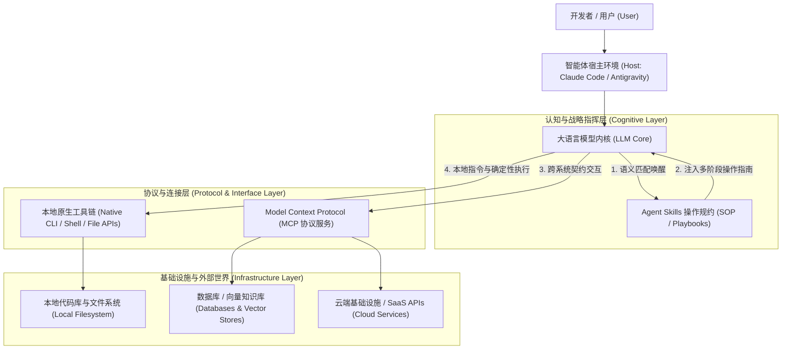
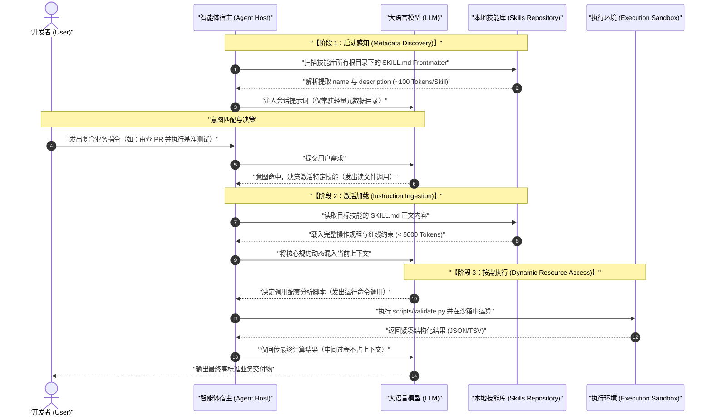
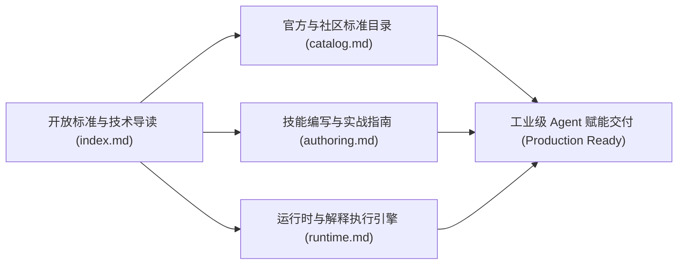

# Anthropic Agent Skills 开放标准与技术导读

| 属性 | 详情 |
| :--- | :--- |
| **文档类型** | 技术专题指南 / 开放标准规约 (Specification Guide) |
| **当前状态** | 已归档 (Accepted) |
| **作者** | Ateng |
| **创建日期** | 2026-09-22 |
| **关联系统/模块** | Ateng-AI / Skills / Anthropic |

---

## 一、背景与愿景：从单体 Prompt 走向开放技能规范

随着生成式人工智能（Generative AI）从单轮对话向具备自主环境交互能力的 **AI Agent（智能体）** 深度演进，传统基于单体静态提示词（Monolithic Prompt）与硬编码工具调用的开发范式正遭遇严峻瓶颈。

在面对工业级复杂软件工程、大型基础设施运维或精密数据分析任务时，智能体面临以下三大核心挑战：

1. **上下文过载与注意力损耗（Context Saturation & "Lost in the Middle"）**：
   将全部领域知识、工程规范与多步骤指令一股脑注入系统提示词（System Prompt），不仅极其昂贵，而且会导致模型长程推理能力下降，出现指令遗忘与幻觉蔓延。
2. **工具调用缺乏高层意图指导（Tool Misalignment）**：
   传统函数调用（Function Calling）仅暴露单点 API 签名，模型虽知晓参数格式，却不知晓“何时使用”、“遵循何种最佳实践”以及“遇到错误时如何优雅回退”。
3. **经验知识难以跨宿主沉淀与迁移（Fragmentation & Lock-in）**：
   各厂商自定义的智能体框架互相割裂，团队沉淀的专业工作流（SOP）无法在 Claude Code、Google Antigravity、Cursor 或自主构建的智能体系统之间无缝共享。

为彻底打破这一僵局，Anthropic 联合开源社区与行业伙伴确立了 **[agentskills.io](https://agentskills.io)** 开放标准。该标准定义了一套平台中立、高内聚、自包含的 **Agent Skills（智能体技能规范）**。它将高价值的专家操作规程、领域上下文与自动化脚本打包为模块化工程资产，确立了新一代 AI 认知扩展的标准化基线。

```
                               ┌────────────────────────────────┐
                               │  agentskills.io 开放技能标准   │
                               └───────────────┬────────────────┘
                                               │
              ┌────────────────────────────────┼────────────────────────────────┐
              ▼                                ▼                                ▼
   【轻量化自包含规范】              【三级渐进式披露机制】             【全生态跨宿主互通】
    • 标准 SKILL.md 入口              • 阶段 1：启动感知 (~100 T)         • Claude Code 终端套件
    • 脚本与静态资源同构              • 阶段 2：激活加载 (< 5000 T)       • Google Antigravity
    • 单层相对路径引用                • 阶段 3：按需调用 (零常驻)        • 自研/开源智能体宿主
```

---

## 二、技术维度横向解耦：对比矩阵与协同关系

在理解 Agent Skills 之前，必须厘清其与 **Prompt Engineering（提示词工程）**、**Function Calling（函数调用 / Tools）** 以及 **MCP（Model Context Protocol，模型上下文协议）** 的本质差异与边界。

### 1. 全维度技术特性对比矩阵

| 对比维度 | 静态提示词 (Prompt Engineering) | 函数调用 (Function Calling / Tools) | 模型上下文协议 (MCP) | Agent Skills 开放标准 |
| :--- | :--- | :--- | :--- | :--- |
| **抽象层级** | 原始文本层 (Raw Text) | 原子接口层 (Atomic API) | 协议与通信管道层 (Wire Protocol) | 战略与工作流规约层 (Procedural Playbook) |
| **上下文占用** | 极高（每次请求全量常驻） | 中等（所有工具 Schema 常驻） | 动态查询（资源/工具按需暴露） | 极低（基于三级渐进披露，初始仅 ~100 Tokens） |
| **动态加载能力** | 无（构建期固定注入） | 弱（通常随会话初始化装载） | 强（客户端通过 JSON-RPC 协商拉取） | 强（模型根据意图自主读取执行） |
| **内容承载形态** | 自然语言说明 | JSON Schema 签名 | JSON-RPC 传输的 Tools/Resources | 结构化 Markdown + Scripts + References |
| **可执行性** | 无（依赖大模型文本推断） | 强（外部程序拦截并执行） | 强（由 MCP Server 代理执行） | 极强（包含可直接执行的确定性脚本） |
| **跨平台可移植性** | 弱（强绑定 Prompt 结构） | 中等（不同模型厂商格式略异） | 高（跨语言开放标准协议） | 极高（纯文本文件树，天然文件系统兼容） |

### 2. 生态协同架构与职责划分

Agent Skills 并不是要取代 MCP 或 Tools，而是作为**高层智慧指挥官**，与底层基础设施形成紧密的协同互补。



> [!NOTE] 核心协同理念：大脑、神经与手册
> - **LLM 是思考的中枢大脑**：具备通识推理与代码编写能力，但对特定项目规范缺乏认知。
> - **Function Calling / MCP 是神经感知与手脚**：负责连接外部世界，提供“读写文件”、“执行 SQL”、“查询 Git”等具体能力管道。
> - **Agent Skills 是专业岗位操作手册（SOP）**：负责告知智能体“如何组合使用手脚，按什么标准与顺序，达成特定的高难度业务目标”。

---

## 三、核心机制：三级渐进式披露 (Progressive Disclosure)

在上下文窗口经济学中，Token 消耗量与推理延迟、成本成正比，而注意力聚焦度与输入长度成反比。Agent Skills 规范的核心技术亮点在于引入了 **三级渐进式披露（Progressive Disclosure）** 架构。

### 1. 三级架构时序与动态流转图



---

### 2. 阶段深度拆解与规约边界

#### 阶段 1：启动感知 (Metadata Discovery)
- **Token 预算**：单技能约 **~100 Tokens**。
- **运行机制**：
  智能体宿主初始化时，仅遍历扫描技能目录中 `SKILL.md` 的顶部 YAML 元数据（Frontmatter）。宿主提取 `name` 与 `description`，以极简表格或列表形式注入全局系统提示词。
- **高信噪比原则**：
  `description` 是该阶段唯一的意图路由诱饵。它必须精准描述技能的**核心职责、输入触发条件与输出物**，严禁堆砌实现细节，确保智能体能将其作为语义路由词典快速检索。

#### 阶段 2：激活加载 (Instruction Ingestion)
- **Token 预算**：严格控制在 **< 5,000 Tokens**，且正文篇幅建议 **< 500 行**。
- **运行机制**：
  当用户的提问或当前子任务意图触发该技能时，智能体通过内置的读文件工具（如 `view_file` 或 `cat`）动态载入 `SKILL.md` 的 Markdown 正文。
- **规约内容**：
  正文包含该专业任务的操作流程清单、设计哲学、决策树、边界防御与质量红线。未激活前，正文不占用任何上下文空间。

#### 阶段 3：按需执行与动态资源展开 (Dynamic Resource Access)
- **Token 预算**：**零常驻开销**，即用即走。
- **运行机制**：
  复杂技能往往涉及大型参考文档、细分领域错误代码库或可执行计算逻辑。Agent Skills 提倡将此类重度信息剥离为独立文件，智能体仅在执行到特定子步骤时单点读取或调用：
  - `scripts/`：通过 Bash 或 Python 直接在宿主终端运行。利用本地计算单元完成海量数据清洗与计算，**只向模型上下文返回浓缩后的结构化结果**，避免将原始百万行日志拉入上下文。
  - `references/`：存放详尽的第三方 API 契约、ADR 文档或术语表，仅当模型在遇到特定分支时按需翻阅。
  - `assets/`：存放初始代码脚手架、配置模版或设计图例，按需拷贝。

---

## 四、标准自包含技能目录骨架与设计约束

遵循 agentskills.io 标准的技能包必须具备**高度内聚性**与**开箱即用**能力。以下为推荐的工业级标准目录骨架：

```
my-specialized-skill/
├── SKILL.md                 # 核心规约入口与元数据定义 (必需)
├── scripts/                 # 确定性自动化可执行脚本 (可选)
│   ├── audit_schema.py      # 本地环境分析与校验脚本
│   └── run_benchmark.sh     # 确定性性能基准压测脚本
├── references/              # 扩展参考资料与深度技术规格 (可选)
│   ├── error_catalog.md     # 详尽的故障码排障指南
│   └── architecture_v2.md   # 深度架构背景说明书
└── assets/                  # 模板、脚手架与静态素材 (可选)
    ├── report_template.html # 交付物 HTML 报告模版
    └── boilerplate.json     # 初始配置脚手架
```

### 核心设计约束

> [!IMPORTANT] 黄金铁律：单层相对路径引用原则 (Single-Level Relative Path Principle)
> 1. **全域自包含**：技能包应被视为一个独立的软件分发单元（Bundle）。所有内部资源的相互引用，**必须严格使用相对于技能包根目录的相对路径**（例如：`./scripts/audit_schema.py` 或 `references/error_catalog.md`）。
> 2. **禁止跨级反向跃迁**：严禁在指令中写入向上跳跃的相对路径（如 `../../configs/global.json`）或绝对路径（如 `/home/user/...`），确保技能可在任意宿主、不同操作系统及任何目录层级下直接解压运行。

### 其他关键设计准则
- **瘦 SKILL.md 原则**：如果 `SKILL.md` 正文超过 500 行，必须将背景描述、历史演进及冗长样例抽取至 `references/` 目录中。
- **脚本无交互与确定性**：`scripts/` 下的程序必须支持无交互命令行参数（Non-Interactive），具备标准退出码（`0` 代表成功，非 `0` 代表失败），并优先输出 JSON 格式以便模型解析。
- **最小环境假定**：显式在 `SKILL.md` 中声明所需环境依赖（如 Python 3.10+、Node.js 20+），避免依赖冷门系统原生库。

---

## 五、YAML Frontmatter 元数据规范定义

每个技能的根入口 `SKILL.md` 起始位置必须包含符合 YAML 规范的 Frontmatter 元数据块。

### 1. 字段契约规范表

| 字段名称 | 类型 | 必填 | 约束与说明 |
| :--- | :--- | :---: | :--- |
| `name` | `string` | **是** | 技能唯一标识符。仅允许小写英文字母、数字和连字符 `-`，例如 `code-review`、`react-native-perf`。 |
| `description` | `string` | **是** | 触发描述与能力摘要。**建议长度在 100 ~ 1024 字符**。直接决定模型启动路由命中的精准度。 |
| `version` | `string` | 否 | 语义化版本号（遵循 SemVer 2.0.0），如 `1.2.0`。 |
| `author` | `string` | 否 | 作者或维护组织标识。 |
| `tools` | `string[]` | 否 | 该技能预期调用的宿主基础工具列表（如 `["view_file", "run_command", "grep_search"]`）。 |
| `license` | `string` | 否 | 开源或商业许可协议，如 `MIT`、`Apache-2.0`。 |

### 2. 标准合规 SKILL.md 模板示例

```markdown
---
name: code-review-standards
description: 工业级代码质量双轴审查专家。当用户要求审查 PR、评估代码变更对现有系统架构的破坏性，或排查潜在技术债与安全漏洞时激活。
version: 1.0.0
author: Ateng
tools:
  - view_file
  - run_command
  - grep_search
license: MIT
---

# 代码质量双轴审查技能指南

## 一、审查准备与基线确立
在开始审查前，必须先理清本次变更的上下文与业务目标：
1. 运行 `./scripts/get_diff_summary.sh` 获取变更文件列表与关键行统计。
2. 查阅 `./references/checklist.md` 明确当前技术栈的必检清单。

## 二、双轴审查执行步骤
// 1. 规范轴审查：验证命名规范、注释完整度、代码分层解耦。
// 2. 需求轴审查：核对逻辑是否完整实现原始需求，是否存在边界遗漏与空指针风险。

## 三、严重缺陷红线
> [!CAUTION]
> 发现任何明文密码、未经验证的动态 SQL 或在循环体内的 RPC 调用，必须立即阻断合并。
```

---

## 六、本专题演进路线与深度导航

本专题围绕 Anthropic Agent Skills 开放标准展开，构建了一套从标准理论、官方目录、工程编写到运行时原理解析的完整知识闭环体系：



### 专题子模块速查与导读

1. **[标准技能目录与分类大厅 (`catalog.md`)](/skills/anthropic/catalog)**
   - 汇集 Anthropic 官方、Google Antigravity 生态与开源社区沉淀的精选技能库。
   - 涵盖架构设计、代码审查、逆向工程、测试驱动开发（TDD）及运维排障等标准分类矩阵。
2. **[技能编写与创作实战指南 (`authoring.md`)](/skills/anthropic/authoring)**
   - 详解如何从 0 到 1 打造高质量生产级技能包。
   - 包含高精准度 `description` 提示工程提炼法、Markdown 操作指引排版法则、本地脚本沙箱封装及上下文极限压缩技巧。
3. **[运行时架构与解释执行引擎 (`runtime.md`)](/skills/anthropic/runtime)**
   - 深度剖析宿主环境如何实现 Discovery 静态扫描、动态上下文注入及按需拦截。
   - 探讨多 Agent 协同体系下的技能调用权限沙箱隔离、状态持久化与安全防御边界。

> [!TIP] 建议学习路径
> 建议先阅读本篇技术导读建立全局架构认知，随后进入 **[技能编写与创作指南](/skills/anthropic/authoring)** 动手编写您的第一个标准 Agent 技能，并在 **[运行时架构](/skills/anthropic/runtime)** 中了解智能体宿主内部的执行细节。
