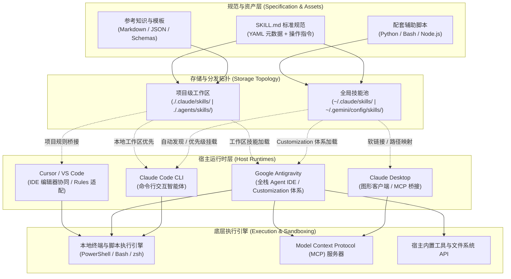
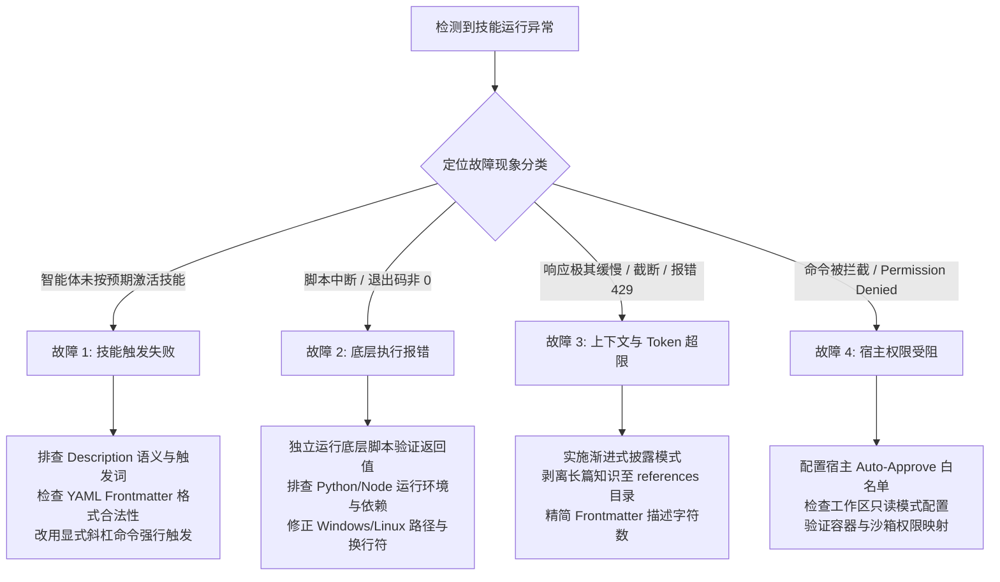

# 多宿主集成、客户端配置与运行时调试指南

| 属性 | 详情 |
| :--- | :--- |
| **文档类型** | 宿主运维与调试指南 (Runtime & Troubleshooting) |
| **当前状态** | 已归档 (Accepted) |
| **作者** | Ateng |
| **创建日期** | 2026-09-22 |
| **关联系统/模块** | Ateng-AI / Skills / Anthropic |

---

## 📖 概述

在现代智能体工程实践中，**Agent Skills（智能体技能规范）** 已经成为连接高层模型推理与底层工程执行的标准协议。一个设计良好的技能包不仅是一组提示词模板，更是融合了业务规则、执行脚本（Scripts）、依赖上下文（References）与确定性工具调用的自包含工程资产。

为了实现“**一次编写，多端无缝运行（Write Once, Run Everywhere）**”，开发者必须深刻理解技能包在不同宿主环境（Host Runtimes）中的注册机制、配置加载拓扑与调试生命周期。本文档旨在系统化阐述 Anthropic 技能体系在 **Claude Code CLI**、**Claude Desktop**、**Google Antigravity** 与 **Cursor** 等主流宿主中的集成方案，并提供生产级运行时疑难排障 SOP。

---

## 🌐 跨宿主多端生态全景

不同宿主环境在上下文机制、交互界面与底层权限上各具特色。通过标准化的 `SKILL.md` 规范，我们可以将核心能力统一管理并分发至各宿主中：



### 核心宿主能力与定位对比

| 宿主环境 | 主要定位 | 技能加载方式 | 脚本执行权限 | 适用典型场景 |
| :--- | :--- | :--- | :--- | :--- |
| **Claude Code CLI** | 终端命令行交互智能体 | 自动发现全局与工作区 `skills/` | 原生系统 Shell 权限 | 终端批量重构、代码推演、Git 流水线运维 |
| **Claude Desktop** | 本地桌面交互客户端 | 通过 MCP 桥接或文件系统映射注入 | 严格受限，依赖 MCP 代理 | 架构评审、文档编写、知识库对话探索 |
| **Google Antigravity** | 专业级全栈智能体 IDE | 深度集成于 Customization 体系 | 受管沙箱 + 显式授权终端 | 端到端全栈开发、多 Agent 协作网络、TDD 循环 |
| **Cursor** | AI 代码编辑器 | Rules / 软链接映射 / 提示词内联 | 依赖终端插件或内置执行器 | 实时代码补全、内联函数重构、单文件轻量辅助 |

---

## 💻 Claude Code CLI 原生集成

Claude Code 是 Anthropic 推出的官方终端交互智能体，具备开箱即用的技能发现与执行调度能力。

### 1. 技能存储目录与层级优先级

Claude Code 遵循“**项目局部优先于用户全局**”的层级设计：

1. **项目级技能目录**：`<workspace-root>/.claude/skills/`
   - 随项目代码一同进行 Git 版本管理，供团队所有成员共享该仓库特有的业务技能与工程契约。
2. **全局用户技能目录**：`~/.claude/skills/`（在 Windows 上通常对应 `C:\Users\<username>\.claude\skills\`）
   - 适用于跨项目复用的个人开发工具、通用审查脚本与标准化工作流。

> [!NOTE] 加载优先级策略
> 当项目级目录与全局目录存在同名技能包时，Claude Code 优先加载**项目工作区技能**，从而确保项目维度的定制行为能精确覆盖全局配置。

### 2. 技能包安装与生命周期管理

通过命令行可以直接维护技能包的生命周期：

```bash
# 1. 查看当前环境已加载的全部可用技能列表
claude skills list

# 2. 从官方源或远程 Git 仓库安装技能包
claude skills install <skill-package-name>
# 或指定远程仓库路径安装
claude skills install github.com/anthropic/skills-starter-pack

# 3. 本地开发技能包安装（创建全局软链接，便于调试修改实时生效）
claude skills link ./my-custom-skill

# 4. 更新指定技能包至最新版本
claude skills update <skill-package-name>

# 5. 卸载或解除软链接绑定
claude skills uninstall <skill-package-name>
claude skills unlink ./my-custom-skill
```

### 3. 项目级配置文件定制

在项目根目录创建 `.claude/config.json`，可对技能的执行行为与沙箱权限进行精细化调优：

```json
{
  "$schema": "https://json.schemastore.org/claude-code-config.json",
  "skills": {
    "paths": [
      "./.claude/skills",
      "./vendor/team-skills"
    ],
    "autoApprove": [
      "code-review",
      "tdd-runner"
    ],
    "environment": {
      "NODE_ENV": "development",
      "CI": "false"
    }
  },
  "execution": {
    "timeoutMs": 120000,
    "maxTokensPerStep": 8192
  }
}
```

---

## 🖥️ Claude Desktop 原生集成

Claude Desktop 是一款原生桌面应用程序，其架构注重数据隔离与本地安全。它不直接读取宿主操作系统的任意磁盘目录，而是通过 **MCP (Model Context Protocol)** 协议或显式配置的受信任路径来暴露工具与技能。

### 1. 配置文件跨平台绝对路径

Claude Desktop 的主配置文件为 `claude_desktop_config.json`，各操作系统路径如下：

| 操作系统 | 默认配置文件绝对路径 |
| :--- | :--- |
| **Windows** | `%APPDATA%\Claude\claude_desktop_config.json` <br>*(即 `C:\Users\<用户名>\AppData\Roaming\Claude\claude_desktop_config.json`)* |
| **macOS** | `~/Library/Application Support/Claude/claude_desktop_config.json` |
| **Linux** | `~/.config/Claude/claude_desktop_config.json` |

### 2. 通过 Skills MCP 代理加载技能包

为了在 Claude Desktop 中使用完整的技能定义，推荐通过启动一个本地轻量级 **Skills Runner MCP Server** 来暴露技能，使模型能够按需调用：

```json
{
  "mcpServers": {
    "skills-runtime": {
      "command": "node",
      "args": [
        "D:/My/tools/mcp-skills-runner/dist/index.js",
        "--skills-dir",
        "D:/My/dev/Ateng-AI/skills"
      ],
      "env": {
        "PATH": "C:\\Program Files\\nodejs;C:\\Windows\\system32",
        "SKILLS_RUNTIME_MODE": "desktop"
      }
    },
    "filesystem": {
      "command": "npx",
      "args": [
        "-y",
        "@modelcontextprotocol/server-filesystem",
        "D:/My/dev/Ateng-AI"
      ]
    }
  }
}
```

> [!IMPORTANT] Windows 环境路径反斜杠转义
> 在 Windows 环境下配置 JSON 文件时，路径中的反斜杠必须使用双反斜杠转义（如 `C:\\Users\\admin`），或者统一使用标准正斜杠（如 `D:/My/dev/Ateng-AI`），以避免 JSON 解析器报语法错误。

### 3. 本地提示词模板降级模式

若当前环境无法启动额外的 MCP Server，可在 Claude Desktop 的 **Projects（项目空间）** 中使用降级方案：
1. 打开 Claude Desktop 左侧边栏进入指定的 Project。
2. 点击 **Project Knowledge** -> **Add Content**。
3. 将所需技能包的 `SKILL.md` 直接添加为知识库文件。
4. 在 **Custom Instructions** 中补充技能路由指令：
   ```markdown
   你拥有知识库中定义的标准化 Agent Skills。
   当检测到用户的意图与某个 SKILL.md 的触发场景匹配时，必须严格按照该 SKILL.md 声明的流程分步推演并执行。
   ```

---

## 🛸 通用智能体开发环境适配

### 1. Google Antigravity 深度集成

Google Antigravity 拥有极其完备的智能体生态机制。在 Antigravity 体系中，技能包与全局规则（Rules）、模型上下文协议（MCP）、子智能体网络（Subagents）构成协同编排整体。

```
Antigravity 运行时加载层级：
┌─────────────────────────────────────────────────────────────┐
│ 1. 工作区私有技能: <workspace>/.agents/skills/*             │ (最高优先级)
├─────────────────────────────────────────────────────────────┤
│ 2. 用户全局技能: ~/.gemini/config/skills/*                   │ (中优先级)
├─────────────────────────────────────────────────────────────┤
│ 3. 插件安装技能: ~/.gemini/config/plugins/<name>/skills/*     │ (中优先级)
├─────────────────────────────────────────────────────────────┤
│ 4. 内置基础技能: ~/.gemini/antigravity/builtin/skills/*      │ (基线保底)
└─────────────────────────────────────────────────────────────┘
```

#### 组织与目录结构

在 Antigravity 工作区中，推荐建立标准的多宿主复用结构：

```
d:\My\dev\Ateng-AI\
├── .agents\
│   └── skills\
│       ├── domain-modeling\
│       │   └── SKILL.md
│       └── tdd\
│           └── SKILL.md
├── AGENTS.md                  # 全局行为守则与红线约定
├── CONTEXT.md                 # 领域模型与统一词汇表
└── package.json
```

#### 与 Customization 体系的协同编排

1. **与 `AGENTS.md` 规则协同**：
   - 规则层（Rules）定义全局不可逾越的红线（如“严禁未经显式授权自动 Git 提交”、“汉字与英文间必须保留半角空格”）。
   - 技能层（Skills）聚焦具体的领域解题战术与操作流。技能包在执行时，会自动继承并遵从 `AGENTS.md` 的全部工程约束。
2. **与 Subagents 子智能体网络协同**：
   - 主智能体在推演复杂需求时，可通过 `invoke_subagent` 工具将带有独立技能包的子任务派发给专业子 Agent。例如，调用运行 `code-review` 技能的只读审查子 Agent，审查完成后通过消息总线回传报告。

### 2. Cursor 及其他主流 IDE 适配与共享

在 Cursor、VS Code（结合 Cline / Roo Code）等现代 AI IDE 中，为了避免维护多份重复的技能文档，推荐采用**统一资产池 + 符号链接（Symlink）**管理模式：

```bash
# Windows (PowerShell 以管理员身份运行，创建目录软链接)
New-Item -ItemType SymbolicLink -Path "d:\My\dev\Ateng-AI\.cursor\rules\skills" -Target "d:\My\dev\Ateng-AI\.agents\skills"

# macOS / Linux (创建标准软链接)
ln -s /path/to/project/.agents/skills /path/to/project/.cursor/rules/skills
```

在 Cursor 的 `.cursorrules` 文件中引入技能路由契约：

```markdown
# Agent Skills 接入声明
本仓库的专业工程技能集中存放于 `.agents/skills/` 目录中。
当用户在对话中提到相关技能或使用斜杠命令时，请先检索并阅读对应技能目录下的 `SKILL.md`，随后严格按照其声明的步骤执行。
```

---

## 🛠️ 运行时疑难排障清单 (Troubleshooting SOP)

在实际工程落地过程中，技能包可能会因描述不清、依赖冲突、上下文溢出或环境限制而发生异常。本章提供标准化的四维故障诊断处理流程。



---

### SOP-01：技能触发失败 (Triggering Failures)

#### 1. 现象描述
用户输入明确的需求指令，但智能体直接使用普通大模型常识回答，未调起对应的技能包，也未执行技能中定义的 SOP 流程。

#### 2. 根因排查表

| 排查项 | 常见根因 | 检验与修复手段 |
| :--- | :--- | :--- |
| **YAML Frontmatter 语法错误** | 首行非 `---`、缩进错误或字段缺失 | 使用 YAML 校验工具确保包含 `name` 和 `description` 两个必需字段。 |
| **Description 描述过于抽象** | 仅写“处理代码”或“辅助测试”，缺少具体动词与业务实体 | 重写 Description，采用“**何时使用 + 触发关键词 + 核心产出**”三段式结构。 |
| **意图分类器置信度不足** | 用户的提问词与 Description 中的用词语义距离过远 | 在 Description 中显式补充高频同义词与典型提示词（Trigger Phrases）。 |
| **目录命名或路径未对齐** | 文件夹名包含非法字符，或未放置在宿主监听的有效路径中 | 统一使用全小写中划线命名（如 `domain-modeling`），核对宿主扫描路径。 |

#### 3. 修复示例

❌ **不良定义（过于模糊）**：
```yaml
---
name: code-review
description: 审查代码质量
---
```

✅ **推荐定义（精准明确）**：
```yaml
---
name: code-review
description: 审查代码变更。当用户要求审查分支、PR、当前工作区修改，或提及“代码审查”、“review since X”、“核对规范与架构”时必须调用此技能。沿“规范遵从”与“契约实现”双轴展开平行审查。
---
```

---

### SOP-02：底层脚本执行报错 (Script Execution Errors)

#### 1. 现象描述
技能成功触发，但在调用内部脚本（如 `scripts/verify.py` 或 `scripts/lint.sh`）时，宿主报出 `Exit code 1`、`Command not found` 或文件未找到等底层错误。

#### 2. 根因与排障流程

```bash
# 步骤 1: 验证解释器与依赖是否存在于当前系统的 PATH 中
node --version
python --version
pnpm --version

# 步骤 2: 脱离智能体宿主，在本地终端直接执行报错的脚本，观察真实标准输出与错误流
python ./skills/my-skill/scripts/run.py --verbose

# 步骤 3: 排查跨平台换行符（CRLF 导致 Linux/macOS 环境下 Bash 解释器报 '\r': command not found）
# 使用 git 属性规范或 dos2unix 进行转换
dos2unix ./skills/my-skill/scripts/*.sh
```

#### 3. 跨平台路径防御准则
- **严禁硬编码绝对路径**：在脚本与 `SKILL.md` 中，严禁使用类似 `C:\Users\admin\...` 或 `/home/user/...` 的写死路径。
- **动态解析工作区根目录**：使用环境变量（如 `CLAUDE_WORKSPACE_ROOT`、`PROJECT_DIR`）或通过脚本相对当前工作目录动态计算：
  ```python
  import os
  from pathlib import Path

  # 始终以当前项目根目录为基准锚定
  workspace_root = Path(os.getenv("WORKSPACE_ROOT", Path.cwd()))
  target_file = workspace_root / "docs" / "adr" / "0001-init.md"
  ```

---

### SOP-03：上下文与 Token 资源超限 (Token & Context Exhaustion)

#### 1. 现象描述
智能体在运行技能后响应变得极为缓慢，对话轮次极少便触发模型上下文上限告警（如 `Context window exceeded`），或者模型出现严重的注意力涣散、遗漏先前提出的核心指令。

#### 2. 根因分析：单体技能过载
许多开发者将几十页的业务文档、庞大的 API Schema 以及复杂的历史样例全部塞入单个 `SKILL.md` 文件中。宿主在发现并激活技能时，会将全部内容一次性注入系统提示词（System Prompt），导致消耗上万 Token。

#### 3. 优化方案：渐进式披露架构 (Progressive Disclosure)

```
标准技能包目录物理布局：
my-skill/
├── SKILL.md            # [轻量级入口] 仅保留核心流程编排与导航（控制在 300 行以内）
├── references/         # [按需加载区] 静态大型规范、完整 API 契约与长篇参考案例
│   ├── api-spec.md
│   └── architecture.md
├── scripts/            # [执行隔离区] 确定性逻辑下沉为脚本，不占用推理 Token
│   └── validate.js
└── templates/          # [输出模板区] 结构化输出 Markdown 样例
    └── report-template.md
```

> [!TIP] 渐进式披露原则
> `SKILL.md` 只负责告诉模型“**在何种条件下读取哪一个参考文件**”。模型在执行具体步骤前，通过 `view_file` 按需拉取对应的 `references/api-spec.md`，使用完毕后自然滑出上下文关注焦点，从而节省 70% 以上的上下文开销。

---

### SOP-04：宿主环境权限受阻 (Permission Denial & Sandboxing)

#### 1. 现象描述
智能体执行写文件、执行 Shell 命令或发起外部网络请求时，被宿主安全机制直接拒绝，报出 `Operation not permitted` 或弹窗等待人工确认导致自动化流水线挂起。

#### 2. 排查与修复矩阵

| 宿主环境 | 拦截原因 | 解决办法与安全配置 |
| :--- | :--- | :--- |
| **Claude Code CLI** | 默认安全级别拦截高危命令（如 `rm`、`curl`） | 在 `.claude/config.json` 中配置 `autoApprove` 白名单命令，或使用 `claude --dangerously-skip-permissions`（仅限受信隔离容器环境）。 |
| **Claude Desktop** | 本地沙箱严禁任意系统 Shell 调用 | 将脚本封装为标准化受管的 MCP Server，并在配置文件中授予显式受信任目录访问权。 |
| **Google Antigravity** | 工作区模式设置为只读，或命令需要显式交互确认 | 检查工作区模式设置，对受信任的构建与自检命令配置受管执行策略；严格遵守红线规则（如未经授权严禁自动 Git 提交）。 |
| **Docker / CI 容器** | 容器缺少非 root 用户写入权限或网络未放行 | 检查 Dockerfile 中的 `USER` 权限与 `chmod +x` 脚本执行权限，正确映射工作区卷（Volume）。 |

---

## 📋 生产就绪度检查清单 (Production Readiness Checklist)

在将新编写或重构的技能包发布到团队共享池之前，必须逐一验证以下检查项：

- [ ] **元数据合规**：YAML Frontmatter 包含标准 `name` 与 `description`，无语法错误。
- [ ] **意图清晰**：`description` 清晰指明适用场景与关键词，支持中英文双向意图识别。
- [ ] **排版与空白规范**：全篇严格遵守盘古之白，汉字与英文、代码标识符及数字间均保留半角空格。
- [ ] **路径跨平台适配**：全量脚本与文档均未硬编码绝对路径，使用标准相对路径或环境变量动态解析。
- [ ] **换行符标准化**：所有文本与脚本文件统一采用 `LF` 换行符，严禁引入 Windows `CRLF` 破坏跨平台解释器。
- [ ] **渐进式披露**：`SKILL.md` 主文档体积精简，大型规范已剥离至 `references/` 目录。
- [ ] **静态自检通过**：在 VitePress 知识库根目录下执行 `pnpm docs:build`，确保 **0 编译错误** 与 **0 死链告警**。
