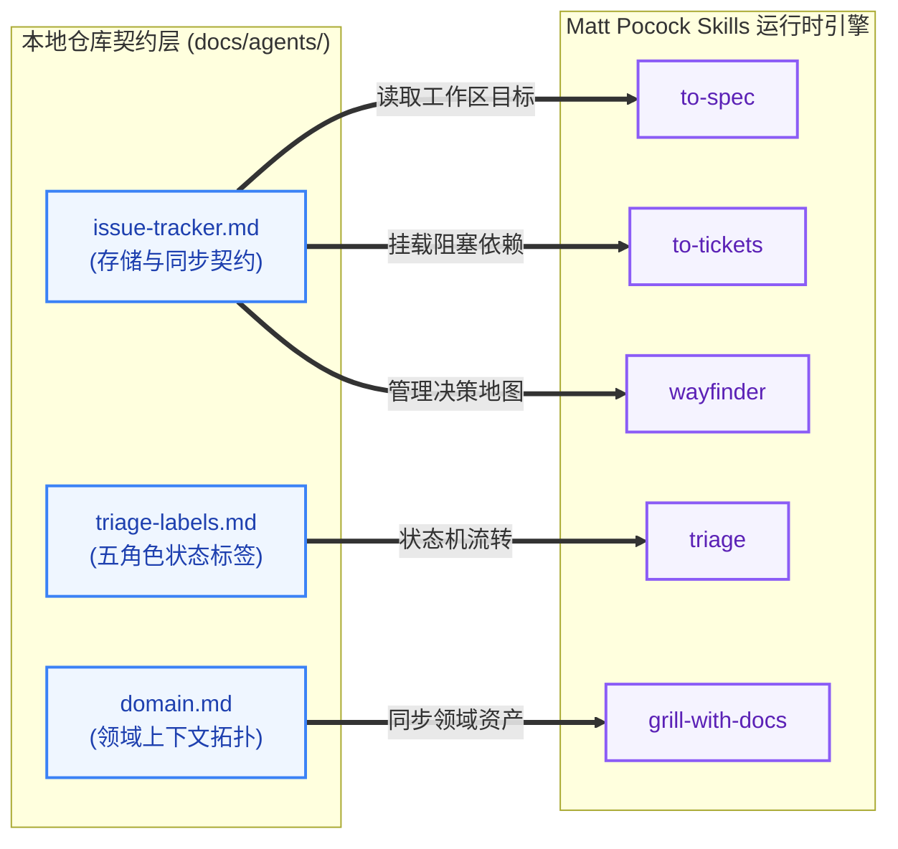
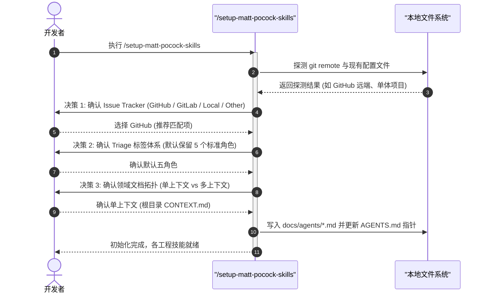
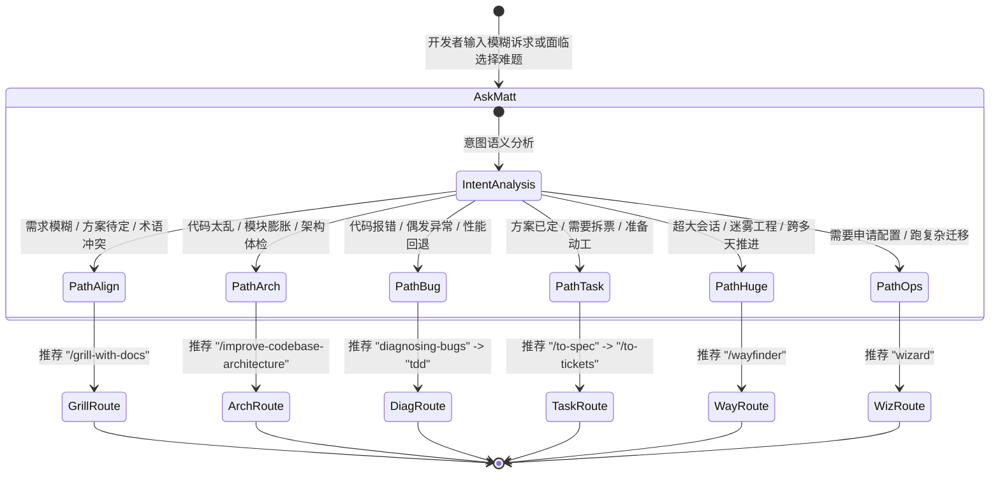

# Matt Pocock Skills 体系架构、基础设施与初始化配置

| 属性 | 详情 |
| :--- | :--- |
| **文档类型** | 技术专题指南 / 架构配置 |
| **当前状态** | 已归档 (Accepted) |
| **作者** | Ateng |
| **创建日期** | 2026-09-23 |
| **关联系统/模块** | Matt Pocock Skills / Architecture & Setup |

---

## 1. 基础设施契约架构 (Infrastructure Contracts)

Matt Pocock Skills 在架构设计上实现了一项关键突破：**技能逻辑与仓库配置的彻底解耦**。所有技能代码本身保持 100% 幂等与纯净，不硬编码任何具体平台（如 GitHub、GitLab、Jira）的 API 或环境假设。每个代码库的私有工作流与环境特性，全部通过自包含的轻量 Markdown 契约文件进行注入。

### 1.1 基于 Markdown 的仓库自包含配置设计

当在代码库中运行初始化命令后，系统会在本地仓库生成 `docs/agents/` 契约目录，并向下游所有技能提供运行时事实依据（Ground Truth）：

```
[仓库根目录]
├── AGENTS.md (或 CLAUDE.md)       # 声明指向 docs/agents/ 的契约指针
└── docs/
    └── agents/
        ├── issue-tracker.md       # 定义 Issue Tracker 的类型与读写协议
        ├── triage-labels.md       # 定义分流状态机所对应的五大规范标签
        └── domain.md              # 定义领域上下文拓扑 (单域 CONTEXT.md 或多域矩阵)
```

下游技能（如 `/to-spec`、`/to-tickets`、`/triage`、`/wayfinder`）在运行时，首先通过统一的契约读取器解析 `docs/agents/` 中的 Markdown 文件。这种设计的核心优势在于：
- **纯文本纳管**：所有配置均提交至 Git 版本控制，团队成员与协作 Agent 共享完全一致的环境视图；
- **免二次修改**：更新技能包版本时，无需担心本地仓库的配置被覆盖或冲突；
- **渐进增强**：若未安装或未启用 `triage` 技能，`triage-labels.md` 会被优雅忽略，不影响核心流程。



### 1.2 跨项目无缝迁移与零代码侵入原理

传统的 Agent 定制方案往往需要在 Skill 源码中塞满 `if-else` 分支来判断“当前是否是 GitHub 企业版”或“当前是否使用本地文件”。Matt Pocock Skills 采用 **提示词驱动的契约绑定 (Prompt-Driven Contract Binding)**：

1. **零代码修改**：无论你的代码托管在 GitHub、GitLab、私有 Gitea，还是使用 Jira 或本地纯文本，技能包的 `.md` 与脚本无需变动哪怕一个字符；
2. **描述即契约**：在 `issue-tracker.md` 中，哪怕是用自然语言描述一段企业内部 MCP 服务的调用指令，下游 Agent 也能依据语义自然解析并无缝执行。

---

## 2. 仓库初始化实战 (`/setup-matt-pocock-skills`)

### 2.1 三大核心决策与交互流

在任何新仓库中初次引入 Matt Pocock Skills 时，只需在终端中执行一次初始化命令：

```bash
/setup-matt-pocock-skills
```

> [!NOTE]
> `/setup-matt-pocock-skills` 是一个非模型自主调用的编排技能。它不会由 Agent 悄悄触发，必须由人类显式发起。它首先会自动探测当前环境的 `git remote`、已有 `CLAUDE.md` 与 `CONTEXT.md`，然后向用户发起三项核心决策确认：



### 2.2 多 Issue Tracker 适配与契约实战

#### 选型 A：GitHub Issues (官方标准集成)
- **前置依赖**：系统安装官方 `gh` CLI 并通过 `gh auth login` 完成鉴权。
- **契约内容 (`docs/agents/issue-tracker.md`)**：
  ```markdown
  # Issue Tracker: GitHub Issues

  We use GitHub Issues to track specs, tickets, and tasks.

  - Read issues: `gh issue list`, `gh issue view <number>`
  - Create issues: `gh issue create --title "<title>" --body "<body>" --label "<labels>"`
  - Edit issues: `gh issue edit <number> --body "<body>" --add-label "<labels>"`
  - Close issues: `gh issue close <number>`
  - Parent/child blocking relationships are tracked via standard markdown checklists or body text references.
  ```

#### 选型 B：GitLab Issues (企业自建/公有集成)
- **前置依赖**：系统安装官方 `glab` CLI 并完成认证。
- **契约内容 (`docs/agents/issue-tracker.md`)**：
  ```markdown
  # Issue Tracker: GitLab Issues

  We use GitLab Issues via glab CLI.

  - Read issues: `glab issue list`, `glab issue view <id>`
  - Create issues: `glab issue create --title "<title>" --description "<description>" --label "<labels>"`
  - Update issues: `glab issue update <id> --description "<description>"`
  - Close issues: `glab issue close <id>`
  ```

#### 选型 C：Local Markdown 纯本地文件 (单兵离线/隐私安全)
- **前置依赖**：无需任何外部 CLI 工具或网络连接，完全在本地工作区落盘。
- **契约内容 (`docs/agents/issue-tracker.md`)**：
  ```markdown
  # Issue Tracker: Local Markdown Files

  We store all issues and tickets as local markdown files under `.scratch/<feature>/`.

  - Directory convention: `.scratch/<feature-name>/`
  - Spec file: `.scratch/<feature-name>/spec.md`
  - Ticket files: `.scratch/<feature-name>/ticket-01-<slug>.md`
  - Status tracking: Update status inside ticket header metadata (`status: open | in-progress | done`).
  ```

> [!WARNING]
> 不要将 GitHub 与 Local Markdown 混用在同一个功能周期内。它们是平行的替代方案，而非分层叠加。混合使用会导致依赖追踪混乱。

#### 选型 D：自定义 Tracker (Jira / Linear / MCP 自研平台)
只需在初始化交互时选择 "Other"，并用一段自然语言说明 CLI 或 API 规范，写入 `docs/agents/issue-tracker.md`，技能即可自适应：
```markdown
# Issue Tracker: Custom Linear via MCP

We use Linear MCP tools:
- Search issues: `linear_search_issues(query="...")`
- Create ticket: `linear_create_issue(teamId="ENG", title="...", description="...")`
- Link blocking: `linear_add_relation(issueId="...", relatedIssueId="...", type="blocks")`
```

---

## 3. 智能路由与技能导航 (`/ask-matt`)

面对全套 25 个技能，开发者有时难以在第一时间研判最合适的工作流入口。`/ask-matt` 作为全局智能路由中枢，能够根据开发者当前的上下文、困境或口语化描述，精准推荐最契合的技能组合。

### 3.1 智能路由决策树与意图识别



### 3.2 常见路由场景调用示例与最佳姿势

下表总结了日常研发中最典型的口语化提问与 `/ask-matt` 的标准研判路由对照：

| 开发者口语化输入 | `/ask-matt` 研判结果与推荐路径 | 核心理由与后续动作 |
| :--- | :--- | :--- |
| *“我有一个做实时通知的新想法，但还不确定怎么落地。”* | **第一步**：执行 `/grill-with-docs`<br>**备选**：`prototype` | 需求尚未收敛，需要通过极限盘问理清设计树，并沉淀领域模型与 ADR；若涉及复杂状态可先做单文件原型验证。 |
| *“这个微服务维护了半年，越来越难懂，感觉像个大泥球。”* | **第一步**：执行 `/improve-codebase-architecture`<br>**后续**：`codebase-design` | 启动全库架构加深扫描，输出可视化 HTML 候选报告，针对暴露的浅模块发起定向重构盘问。 |
| *“线上突然抛 NPE，偶尔出现，本地还没复现出来。”* | **第一步**：执行 `diagnosing-bugs`<br>**第二步**：执行 `tdd` | 严禁盲目猜想改代码。先建立必败的自动化测试反馈环，最小化复现并打桩，确认根因后再写修复代码。 |
| *“我们刚刚在会话里把方案彻底讨论清楚了，接下来怎么做？”* | **第一步**：执行 `/to-spec`<br>**第二步**：执行 `/to-tickets` | 无需再次盘问，直接提炼当前对话生成 Spec 并发布；随后拆解为带阻塞依赖的曳光弹任务票据。 |
| *“这是一个非常庞大的重构项目，单次会话根本装不下。”* | **第一步**：执行 `/wayfinder` | 启动战略寻路罗盘，将未决问题拆解为决策票据（Decision Tickets），跨会话逐一收敛推进。 |

---

## 4. 权威参考资料与事实依据 (References & Grounding)

### 4.1 核心依赖与引用信源

- [[Tier 1]] [setup-matt-pocock-skills 官方说明](https://github.com/mattpocock/skills/tree/main/skills/setup-matt-pocock-skills) - 初始化设计哲学与三项决策实现细节 (核验日期: 2026-09-23)
- [[Tier 1]] [ask-matt 官方指南](https://github.com/mattpocock/skills/tree/main/skills/ask-matt) - 技能路由器调度与路由算法设计 (核验日期: 2026-09-23)
- [[Tier 1]] [GitHub CLI Manual](https://cli.github.com/manual/) - `gh issue` 标准语法与自动化契约 (核验日期: 2026-09-23)
- [[Tier 1]] [GitLab CLI Manual](https://docs.gitlab.com/ee/editor_extensions/gitlab_cli/) - `glab issue` 标准参数规范 (核验日期: 2026-09-23)

### 4.2 事实核查矩阵

| 核查对象 (组件/配置/版本) | 官方基准事实 (Ground Truth) | 对应官方依据 (Tier 1 链接) | 状态 |
| :--- | :--- | :--- | :--- |
| `docs/agents/` 存放路径 | 统一初始化于仓库内 `docs/agents/` 下，无全局或用户级模式 | [setup-matt-pocock-skills](https://github.com/mattpocock/skills/tree/main/skills/setup-matt-pocock-skills) | 已核实真实有效 |
| 五大规范分流标签 | 标准角色为 `needs-triage`、`needs-info`、`ready-for-agent`、`ready-for-human`、`wontfix` | [triage-labels.md 模板](https://github.com/mattpocock/skills/blob/main/skills/setup-matt-pocock-skills/templates/triage-labels.md) | 已核实真实有效 |
| `/ask-matt` 非侵入性 | 仅作为用户端引导路由，不篡改已有会话状态，只输出建议路径 | [ask-matt/SKILL.md](https://github.com/mattpocock/skills/blob/main/skills/ask-matt/SKILL.md) | 已核实真实有效 |
