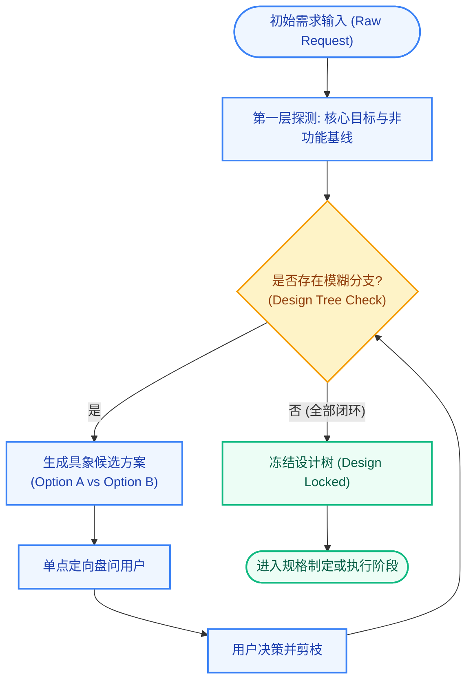
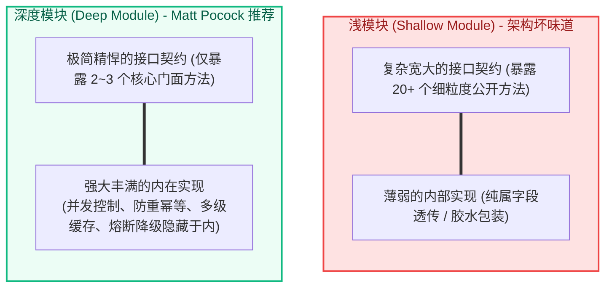

# Matt Pocock Skills 需求对齐、极限盘问与深度模块设计

| 属性 | 详情 |
| :--- | :--- |
| **文档类型** | 技术专题指南 / 设计架构 |
| **当前状态** | 已归档 (Accepted) |
| **作者** | Ateng |
| **创建日期** | 2026-09-23 |
| **关联系统/模块** | Matt Pocock Skills / Alignment & Design |

---

## 1. 消除对齐鸿沟：极限盘问机制 (Grilling System)

在软件工程中，最昂贵的错误不是编写了有缺陷的代码，而是以极高的执行力构建了完全错误的功能。开发者在提出初始需求时，大脑中往往充斥着未经验证的隐式假设。Matt Pocock 的 **Grilling（极限盘问）机制** 通过结构化交互，强制智能体在动工前对设计边界进行穷根究底的压力测试，将模糊意图彻底收敛为清晰的设计树。

### 1.1 `grilling` 核心原语与设计树 (Design Tree) 收敛

`grilling` 是一个基础的模型自主调用技能（Model-Invoked Primitive），它为 `/grill-with-docs`、`/grill-me-matt`、`/triage` 以及 `/wayfinder` 提供底层的决策收敛算法。

其核心行为遵循以下三项不可动摇的盘问纪律：

1. **单次仅聚焦一个决策节点**：严禁一次性倾泻十几个庞杂问题让用户疲于应付。盘问必须如剥洋葱般，沿着设计树的主干向分支逐层递进；
2. **拒绝开放式空泛提问，提供结构化权衡选项**：当抛出一个架构分歧点时，Agent 必须列出选项 A、选项 B 及各自的 Pros & Cons，并带上推荐建议；
3. **设计树全部分支闭环前严禁编写代码**：只有当所有未决疑问（Open Questions）均被用户确认或明确排除时，Grilling 才会宣告结束。



### 1.2 `/grill-with-docs` 实战：边盘问边沉淀领域资产

`/grill-with-docs` 是面向真实代码研发的核心入口。与普通闲聊不同，它在盘问过程中不仅推进设计树的收敛，还会**就地提取并沉淀代码库的持久化智力资产**：

1. **术语捕获与同步**：在用户回答过程中，一旦识别出新的业务名词（如将“用户在结账页放弃购买”提炼为“流失购物车 (Abandoned Cart)”），Agent 会立即调用 `domain-modeling` 将其同步至根目录的 `CONTEXT.md`；
2. **架构决策就地落盘 (ADR)**：当盘问涉及到核心技术选型或不可逆架构取舍（如“采用 WebSocket 还是 SSE 做实时推送”）并达成共识时，Agent 会立即在 `docs/adr/` 下生成一份编号递增的标准化 ADR 文档。

```bash
# 启动面向工程代码的极限盘问会话
/grill-with-docs 计划在结算中心引入分布式优惠券防刷控制
```

> [!TIP]
> 每次执行 `/grill-with-docs` 都是对代码库领域模型的一次“磨刀”。经过几次盘问后，项目的 `CONTEXT.md` 将沉淀出极度清晰的术语基线，后续会话中的 Token 消耗会显著下降。

### 1.3 `/grill-me-matt`：非代码场景下的纯逻辑盘问

当开发者正在思考产品定价策略、团队 OKR 拆解、开源治理模型或纯商业方案时，无需创建 `docs/adr/` 或改动 `CONTEXT.md`。此时应调用 `/grill-me-matt`：
- **纯粹逻辑辩论**：专注于商业模型漏洞、用户体验盲区与逻辑悖论；
- **零仓库副作用**：不生成任何工程配置文件或代码文件，会话结束后直接在聊天框中输出清晰的结论报告。

---

## 2. 领域建模与统一语言 (`domain-modeling`)

### 2.1 泛化黑话的治理与 `CONTEXT.md` 规范

智能体在进入一个陌生项目时，往往只能通过文件名或通用词典推测语义，导致表达极为冗长。Eric Evans 在《领域驱动设计》中强调，统一语言（Ubiquitous Language）是消除沟通损耗的核心武器。

通过 `domain-modeling` 技能，团队将核心领域模型显式固化在根目录的 `CONTEXT.md` 中：

```markdown
# 结算中心领域模型上下文 (CONTEXT.md)

## 核心统一语言 (Language)

**券批次 (Coupon Batch)**:
由营销平台统一创建的优惠券元数据模板，定义了面额、有效周期与预算上限。
_避免_: 优惠券类型, 优惠券模板, 券类别

**券实例 (Coupon Voucher)**:
发放到具体用户账户下的一张真实可用凭证，具备唯一凭证编号与核销状态。
_避免_: 优惠券, 券, 优惠卡

**券冻结 (Voucher Lock)**:
用户提交订单待支付时，对券实例施加的临时独占状态，具备 15 分钟 TTL 自动释放机制。
_避免_: 锁定, 暂扣, 占用
```

**效益对比分析**：
- **治理前**：*“当用户在下单页面点提交的时候，那张优惠卡需要被暂时锁定起来，不能让别的订单再选上它，如果 15 分钟没给钱就得退回去。”*（共 56 字，推理消耗约 80 Tokens，多轮对话极易产生歧义）；
- **治理后**：*“执行订单预占时触发券冻结。”*（共 13 字，推理消耗仅 18 Tokens，意图绝对精准）。

### 2.2 负面清单 (_Avoid_) 与边界防卫实操

在领域建模中，**明确“不要用什么词”往往比“用什么词”更重要**。在 `CONTEXT.md` 中，每个术语下方必须提供 `_Avoid_` 负面清单：
- **杜绝同义词飘移**：防止 Agent 在同一个 PR 内将同一个实体混称为 `Coupon`、`Ticket`、`Voucher`；
- **边界防卫**：当 Agent 试图使用被禁用的泛化词汇时，系统会立即触发警示并要求其替换为官方统一语言。

---

## 3. 深度模块哲学与架构重构 (`codebase-design` & `/improve-codebase-architecture`)

### 3.1 Ousterhout 深度模块设计原则与缝隙 (Seam) 定义

John Ousterhout 在经典著作《软件设计哲学》中指出：**优秀的模块必须是“深度”的（Deep Modules），即“通过极简精巧的对外接口，暴露出极其丰满强大的内在功能”**。相反，充斥着大泥球的代码库中，往往遍地都是“浅模块 (Shallow Modules)”——接口复杂庞大，内部却仅仅做了微不足道的透传。



#### 架构接缝 (Seam) 的核心准则
`codebase-design` 致力于在系统最坚固的物理边界处寻找接缝（Seam）：
1. **信息隐藏 (Information Hiding)**：底层存储细节（如 Redis 命令、SQL 表结构）严禁泄漏给上层调用方；
2. **可测性隔离 (Testability)**：通过纯净的接口边界，使单元测试能够轻松通过真实接口进行断言，而无需去 Mock 模块内部盘根错节的私有方法。

### 3.2 `/improve-codebase-architecture` 架构扫描与体检报告

为了防止 AI 辅助研发加速软件熵增，Matt Pocock 提供了 `/improve-codebase-architecture` 命令。建议团队每隔数天在代码库上运行一次：

```bash
/improve-codebase-architecture
```

#### 执行与交互阶段
1. **静态扫描与加深机会探测**：分析代码库中所有的类、模块与文件调用拓扑，识别出公开方法过多、内部职责外溢的浅模块候选集；
2. **生成交互式 HTML 体检报告**：输出包含复杂度评估、耦合度热力图与加深建议的单文件 HTML 报告；
3. **针对性重构盘问**：开发者在报告中选中某个重构候选模块后，技能会自动启动 Grilling 盘问，引导开发者收紧接口契约并完成重构。

---

## 4. 抛弃型原型探索 (`prototype`)

### 4.1 探索型代码与生产型代码的隔离原则

在面对全新的业务逻辑、复杂的状态转换或激进的 UI 布局时，直接在生产代码库中动手往往会造成不可挽回的污染。`prototype` 技能贯彻**抛弃型原型 (Throwaway Prototype)** 思想：

- **单文件沙盒**：针对纯逻辑或状态机问题，将全部 HTML、CSS、JavaScript/TypeScript 收敛在单个独立文件中，可以在任何浏览器中双击直接运行与调试；
- **激进 UI 变体**：在探索交互形态时，允许在单一路由下同时渲染 3~4 种风格迥异的视觉原型，供团队直接在线比对与投票；
- **绝不直接合并**：原型代码的核心目的在于“解答设计疑惑、验证可行性假设”。一旦假设得到验证，原型代码应当直接废弃，由 `/implement` 严格按照工程规范重写。

---

## 5. 权威参考资料与事实依据 (References & Grounding)

### 5.1 核心依赖与引用信源

- [[Tier 1]] [grilling 官方技能源码与规范](https://github.com/mattpocock/skills/blob/main/skills/grilling/SKILL.md) - 设计树收敛机制与盘问协议 (核验日期: 2026-09-23)
- [[Tier 1]] [domain-modeling 官方指南](https://github.com/mattpocock/skills/tree/main/skills/domain-modeling) - 领域统一语言构建与 CONTEXT.md 落地标准 (核验日期: 2026-09-23)
- [[Tier 1]] [codebase-design 架构规范](https://github.com/mattpocock/skills/tree/main/skills/codebase-design) - 深度模块与架构接缝定义基线 (核验日期: 2026-09-23)
- [[Tier 2]] [Domain-Driven Design (Eric Evans)](https://www.domainlanguage.com/ddd/) - 统一语言与通用上下文理论来源 (核验日期: 2026-09-23)

### 5.2 事实核查矩阵

| 核查对象 (组件/配置/版本) | 官方基准事实 (Ground Truth) | 对应官方依据 (Tier 1 链接) | 状态 |
| :--- | :--- | :--- | :--- |
| `grilling` 状态机与选项要求 | 必须单次仅问一个问题，给出候选选项与 Pros/Cons 权衡推荐 | [grilling/SKILL.md](https://github.com/mattpocock/skills/blob/main/skills/grilling/SKILL.md) | 已核实真实有效 |
| `CONTEXT.md` 语言格式要求 | 必须使用加粗术语，单行描述，紧跟 `_Avoid_` 负面清单 | [CONTEXT.md 规范](https://github.com/mattpocock/skills/blob/main/CONTEXT.md) | 已核实真实有效 |
| `/improve-codebase-architecture` 输出 | 生成独立可视化的单文件 HTML 报告，供开发者审阅并选择加深候选 | [skills/improve-codebase-architecture](https://github.com/mattpocock/skills/tree/main/skills/improve-codebase-architecture) | 已核实真实有效 |
