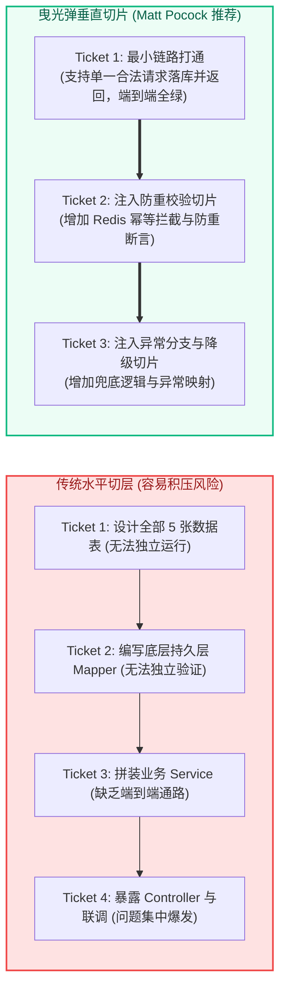
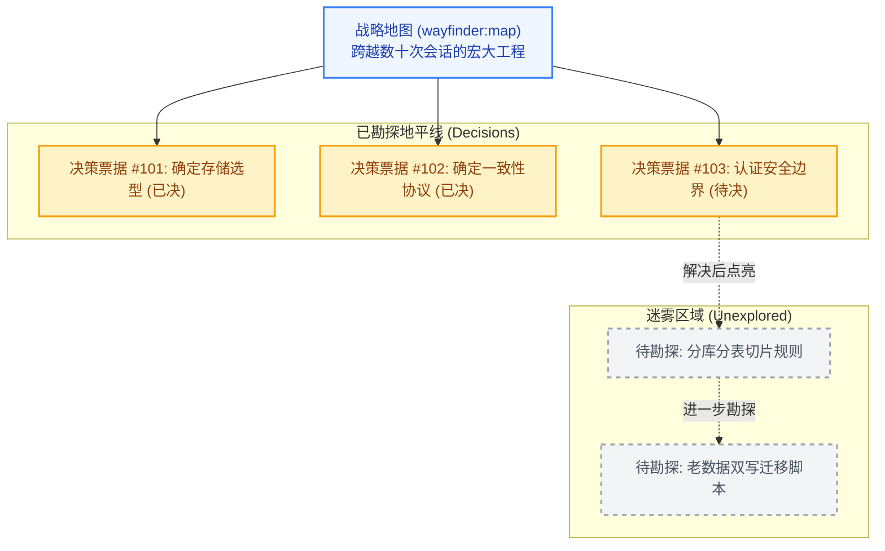
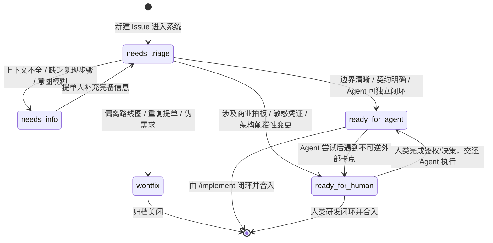

# Matt Pocock Skills 规范制定、曳光弹任务拆解与分流管理

| 属性 | 详情 |
| :--- | :--- |
| **文档类型** | 技术专题指南 / 任务管理 |
| **当前状态** | 已归档 (Accepted) |
| **作者** | Ateng |
| **创建日期** | 2026-09-23 |
| **关联系统/模块** | Matt Pocock Skills / Planning & Triage |

---

## 1. 结构化规格生成 (`/to-spec`)

在完成需求对齐与设计探讨后，很多团队常犯的错误是让 Agent“直接开始写代码”。这种跳跃极易导致早期达成的共识在编写细节时丢失。`/to-spec` 命令的作用是**在不发起重复面试的前提下，精准提炼当前会话已达成的共识，生成高标准的正式规格书 (Specification)**。

### 1.1 从会话上下文到标准化 Spec 的逆向合成

与 `/grill-with-docs` 不同，`/to-spec` **默认不包含采访环节**。它的职责是“纯粹合成”：
- 深度提取会话中的功能边界、非功能约束、数据模型与验收标准；
- 输出符合软件工程规范的标准化 Spec 模板结构：

```markdown
# 规格说明书: [功能简述]

## 1. 业务目标与背景 (Context & Goals)
简述当前变更解决的核心业务痛点及其量化业务目标。

## 2. 涉及模块与架构接缝 (Impacted Modules & Seams)
明确列出受影响的内部模块，以及各模块对外暴露的 Seam 接口边界。

## 3. 详细契约设计 (Detailed Contract & Data Design)
定义 RESTful 路由、RPC 契约、事件 Payload 格式及持久层变更。

## 4. 异常处理与边界防御 (Edge Cases & Degradation)
详细定义超时、降级、防刷策略及错误码映射。

## 5. 验收标准清单 (Acceptance Criteria)
采用 Given-When-Then 或高精度清单列出客观可自动测试的判定条件。
```

### 1.2 Spec 发布与 Issue Tracker 协同契约

生成 Spec 后，`/to-spec` 会自动读取本地 `docs/agents/issue-tracker.md` 中声明的协议，将其同步至目标跟踪器：
- **GitHub 模式**：通过 `gh issue create --label "spec"` 自动创建一条带有 `spec` 标签的顶层 Issue；
- **Local Markdown 模式**：在 `.scratch/<feature-name>/spec.md` 路径下持久化落盘；
- 无论哪种后端，该 Spec 的全局唯一标识（如 Issue 编号 `#42` 或相对文件路径）都将作为下游拆解任务的唯一锚点。

---

## 2. 曳光弹票据拆解与依赖图谱 (`/to-tickets`)

### 2.1 曳光弹开发模式 (Tracer Bullet Approach) 核心思想

在传统敏捷或瀑布开发中，任务往往被水平切分：先写完所有的数据库表，再写完所有的 Service，最后写 Controller 和前端。这种切分模式导致系统在最后一刻组装前始终处于不可运行状态，风险极高。

Matt Pocock 严格推崇《程序员修炼之道》中的**曳光弹开发理念 (Tracer Bullet Approach)**：
- **垂直穿透 (Vertical Slice)**：每个任务（Ticket）必须是一根贯穿“路由 -> 业务逻辑 -> 持久化存储”的完整细线；
- **即刻可验证**：每个 Ticket 落地后，哪怕仅支持最简陋的单一路径，代码也必须能够真实编译、运行并通过端到端测试。



### 2.2 阻塞边 (Blocking Edges) 与有向无环图 (DAG) 编排

使用 `/to-tickets` 将 Spec 拆解为具体票据时，最关键的是**声明阻塞边 (Blocking Edges)**。

每个生成的 Ticket 必须包含以下结构：
```markdown
# Ticket: [简要动词+宾语]
- **所属 Spec**: #42
- **阻塞前置依赖 (Blocked by)**: #43, #44
- **阻塞后置任务 (Blocks)**: #46
- **核心垂直切片目标**: 实现领券核心链路的最小幂等控制。
- **验证断言**: 编写并执行并发抢券集成测试，确保相同 RequestId 只能成功一次。
```

当多智能体并发或单智能体跨轮次执行时，调度系统依据阻塞依赖构建有向无环图（DAG）。只有当依赖的前置 Tickets 全部进入 `Done` 状态时，被阻塞的任务才会被激活为可执行状态，彻底消除依赖冲突。

---

## 3. 宏大工程战略寻路罗盘 (`/wayfinder`)

### 3.1 跨越单会话上下文容量限制的战略规划

在面对跨越数周、涉及十几个子系统重构或超大功能迁移的巨型工程时，单个 LLM 会话的上下文窗口（Context Window）无论如何都无法承载整个实施细节。试图在一个会话里完成一切必然导致严重的“灾难性遗忘”和幻觉。

`/wayfinder` 是专为**超大工程跨会话推进**而设计的战略寻路系统：
1. **决策地图 (`wayfinder:map`)**：在 Issue Tracker 上建立一张带有 `wayfinder:map` 标签的顶层战略索引地图；
2. **渐进式点亮迷雾**：不在第一天去穷尽每一个细枝末节的实现代码，而是将工程拆分为若干个战略里程碑与关键决策分支。



### 3.2 决策票据 (Decision Ticket) 的生命周期与收敛流

在 `wayfinder` 体系中，**决策票据 (Decision Ticket)** 拥有独特的属性：
- **核心本质**：它的产出不是业务源码，而是**针对一个悬而未决的技术/业务问题的明确裁决**；
- **执行方式**：在独立会话中唤起 `/wayfinder` 针对单一决策票据进行集中攻坚，攻克后更新 `wayfinder:map`，并衍生出下一阶段的普通实现 Ticket。

---

## 4. 敏捷分流管理 (`/triage`)

当代码库长期运行并积累了大量 Issues、Bug 报告与用户反馈时，需要一套严密的流程机制将其分流并调度给合适的角色处理。

### 4.1 五大标准分流角色状态机

`/triage` 技能内置了标准的五角色状态机模型。所有纳管的 Issue 必须且仅能处于以下五大角色之一：



| 分流角色 (Triage Role) | 标签名称 (Canonical Label) | 触发条件与准入红线 | 后续流转责任人 |
| :--- | :--- | :--- | :--- |
| **待分流** | `needs-triage` | 新建 Issue 默认初始态，尚未经过架构师或分流技能研判 | `/triage` 或项目负责人 |
| **补充信息** | `needs-info` | 缺乏日志堆栈、复现用例、版本基准或输入输出预期 | 提单人 / 外部报告者 |
| **Agent 就绪** | `ready-for-agent` | 范围收敛在代码库内、具备客观验收断言、无外部鉴权依赖 | 可直接派发给 `/implement` 自动化执行 |
| **人类就绪** | `ready-for-human` | 涉及生产环境私钥、跨部门商业协调、设计哲学冲突 | 人类高级工程师 / 架构师 |
| **不予处理** | `wontfix` | 明显不合理需求、与 ADR 决策冲突且无合理理由、无法复现 | 直接关闭并附带原由说明 |

### 4.2 自动化分流审查与标签批量维护

通过执行 `/triage` 命令，智能体会对当前处于 `needs-triage` 状态的 Issues 进行批量静态研判：
1. **自动补全缺陷**：若发现 Issue 缺少必要运行环境或堆栈，主动回复提问并打上 `needs-info`；
2. **能力评估**：若判断该任务可以通过单元测试和代码修改直接闭环，立即打上 `ready-for-agent`；
3. **批量状态维护**：自动调用底层 CLI（如 `gh issue edit`）同步远端状态，保持任务看板始终健康流转。

---

## 5. 权威参考资料与事实依据 (References & Grounding)

### 5.1 核心依赖与引用信源

- [[Tier 1]] [to-spec 官方说明](https://github.com/mattpocock/skills/tree/main/skills/to-spec) - 免面试规格合成算法与契约定义 (核验日期: 2026-09-23)
- [[Tier 1]] [to-tickets 官方指南](https://github.com/mattpocock/skills/tree/main/skills/to-tickets) - 曳光弹拆解原则与阻塞拓扑定义 (核验日期: 2026-09-23)
- [[Tier 1]] [wayfinder 官方架构手册](https://github.com/mattpocock/skills/tree/main/skills/wayfinder) - 超大会话战略地图与决策票据模型 (核验日期: 2026-09-23)
- [[Tier 1]] [triage 官方设计文档](https://github.com/mattpocock/skills/tree/main/skills/triage) - 五角色状态机与自动化分流标准 (核验日期: 2026-09-23)

### 5.2 事实核查矩阵

| 核查对象 (组件/配置/版本) | 官方基准事实 (Ground Truth) | 对应官方依据 (Tier 1 链接) | 状态 |
| :--- | :--- | :--- | :--- |
| `/to-spec` 交互形式 | 不发起面试提问，纯粹依赖并提炼当前对话中已收敛的上下文 | [to-spec/SKILL.md](https://github.com/mattpocock/skills/blob/main/skills/to-spec/SKILL.md) | 已核实真实有效 |
| 曳光弹 Tickets 关系 | 必须显式声明 Blocking / Blocked-by 拓扑关系 | [to-tickets/SKILL.md](https://github.com/mattpocock/skills/blob/main/skills/to-tickets/SKILL.md) | 已核实真实有效 |
| `wayfinder:map` 标签契约 | 必须使用 `wayfinder:map` 作为顶层地图的锚点标识 | [wayfinder/SKILL.md](https://github.com/mattpocock/skills/blob/main/skills/wayfinder/SKILL.md) | 已核实真实有效 |
