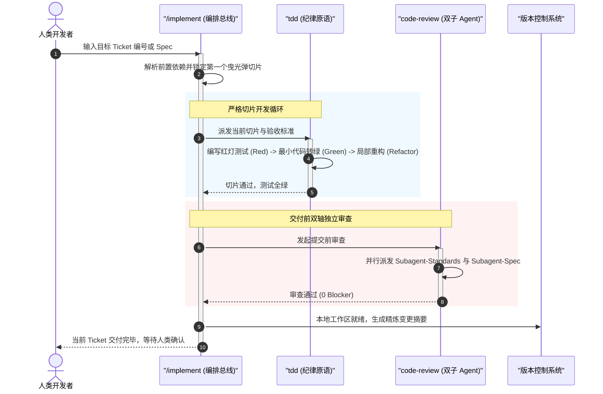
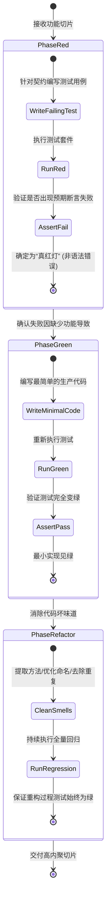
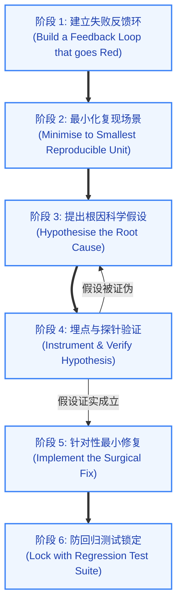
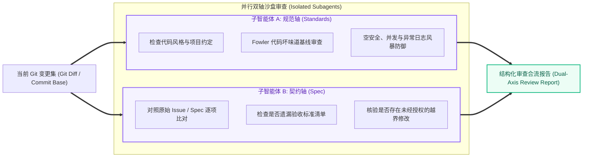

# Matt Pocock Skills 工程研发、红绿测试与双轴审查

| 属性 | 详情 |
| :--- | :--- |
| **文档类型** | 技术专题指南 / 质量工程 |
| **当前状态** | 已归档 (Accepted) |
| **作者** | Ateng |
| **创建日期** | 2026-09-23 |
| **关联系统/模块** | Matt Pocock Skills / Engineering Execution & Quality |

---

## 1. 研发执行总线 (`/implement`)

当需求规格（Spec）和曳光弹任务票据（Tickets）拆解就绪后，研发便进入代码产出阶段。很多初级 Agent 会在此阶段失控，一口气重写数十个文件并引入大量未经测试的代码。`/implement` 是 Matt Pocock Skills 的**研发总线编排器**，它通过严格的阶段门禁控制，确保代码实现始终行驶在安全轨道上。

### 1.1 端到端自动化实现编排

`/implement` 不直接蛮干写代码，而是作为指挥官调度底层的纪律原语：
1. **加载输入契约**：读取用户指定的 Spec 文件或目标 Ticket 列表，解析阻塞关系 DAG；
2. **切片驱动测试开发**：对于当前激活的曳光弹切片，强制调用 `tdd` 技能，通过红绿测试循环完成实现；
3. **交付前自动化审查**：在提交代码前，强制触发 `code-review` 进行规范与契约双轴审查；只有审查完全通过后，才允许进行暂存与提交。

### 1.2 缝隙断点 (Seam Breakpoints) 控制与进度反馈

在推进复杂任务时，`/implement` 会在预设的**架构接缝 (Seams)** 处设置断点，主动暂停工具执行并向开发者汇报：
- **避免黑盒失控**：每完成一个独立的曳光弹切片，Agent 都会输出简要进展并明确标出当前变动范围；
- **人类及时纠偏**：若开发者在断点处发现设计走偏，可立即输入修改意见，避免在错误基线之上越走越远。

---

## 2. 测试驱动开发实战 (`tdd`)

测试驱动开发（TDD）是区分“氛围写代码”与“真正软件工程”的试金石。Matt Pocock 的 `tdd` 技能不仅是一个提示词，更是一套不可逾越的执行铁律。

### 2.1 红-绿-重构 (Red-Green-Refactor) 刚性闭环

`tdd` 技能在执行时强制锁定以下三个阶段，严禁阶段跃迁：

> [!CAUTION]
> **TDD 红灯硬性法则 (Red Light Baseline)**：
> 严禁直接编写生产代码！必须先看到测试套件运行并输出**语义明确的断言失败（Assertion Failed）**。如果测试因为编译错误、找不到文件或拼写错误而挂掉，不属于有效红灯，必须修正测试用例直至捕获正确的预期业务断言。

### 2.2 Agent 测试代码质量黄金法则

很多 AI 生成的测试用例往往是“为了测试而测试”，充斥着大量的无意义断言或脆弱 Mock。`tdd` 技能树立了三项黄金质量标准：

1. **防过度 Mock (Avoid Over-Mocking)**：
   - 严禁 Mock 模块内部的私有方法或同一包下的邻近服务；
   - 仅对不可控的外部物理边界（如第三方支付网关、当前系统时间、随机数种子、外部网络 HTTP 请求）进行 Mock。
2. **防脆弱断言 (Resilient Assertions)**：
   - 避免对大段未经格式化的 JSON 字符串或长日志文本做全字面量相等匹配；
   - 优先对核心业务状态、关键错误码与数据实体属性做精准断言。
3. **垂直切片自解释性 (Self-Contained Slices)**：
   - 每个测试方法遵循标准的 Given-When-Then 三段式结构；
   - 测试方法名必须清晰描述业务场景与预期结果（如 `should_reject_coupon_when_user_daily_quota_exceeded`）。

---

## 3. 严谨故障排查纪律 (`diagnosing-bugs`)

当线上出现异常、偶发崩溃或性能回退时，业余的做法是阅读代码凭感觉“猜测”原因，并随意修改代码碰运气。`diagnosing-bugs` 技能建立了严谨的**六阶段闭环排障流水线**。

### 3.1 拒绝猜测：六阶段闭环排障流水线

1. **阶段 1：建立失败反馈环**：编写一个能稳定触发该 Bug 的自动化测试脚本或 CLI 命令，使排障过程拥有毫秒级的客观反馈；
2. **阶段 2：最小化复现场景**：剥离无关的中间件、依赖表和干扰参数，将输入压缩为最小触发集；
3. **阶段 3：提出科学假设**：基于运行现象，提出 1~2 个具有可证伪性的根因假设（例如：“由于缓存击穿导致的数据库连接池耗尽”）；
4. **阶段 4：埋设探针验证**：通过临时日志、断点或计数探针，客观验证假设是否成立。若被证伪，立刻回退并提出新假设，严禁在假设被证实前盲目修改业务代码；
5. **阶段 5：针对性外科手术式修复**：定位真实根因后，以最小的代码修改面修复缺陷，严禁借机进行未经评审的大面积重构；
6. **阶段 6：防回归测试锁定**：将阶段 1 中建立的测试用例固化至项目的官方回归测试集中，确保历史缺陷永不反弹。

---

## 4. 双轴代码审查体系 (`code-review`)

传统的代码审查往往将“代码写得是否整洁”和“是否符合需求”混为一谈，导致注意力分散。`code-review` 技能引入了前沿的**双子 Agent 隔离并行审查机制**。

### 4.1 规范轴 (Standards) vs 契约轴 (Spec) 并行审查机制

执行 `/code-review` 时，系统会在后台同时启动两个互不干扰的独立子 Agent（Subagent）：

- **子智能体 A（规范轴）**：只关心“代码质量”。它不读业务需求，只根据项目规范（如命名规范、Fowler 代码坏味道、集合空安全契约）给代码挑刺；
- **子智能体 B（契约轴）**：只关心“功能一致性”。它对照原始 Issue/Spec，逐条核对代码是否忠实实现了需求，是否悄悄删除了功能，或是否写了 Spec 外的无关代码。
- **并行隔离价值**：避免了“因为代码写得很漂亮而忽略了契约漏洞”，或“因为功能跑通了而包庇了严重坏味道”。

### 4.2 审查报告结构与阻断级别认定

最终合流输出的报告将问题划分为三个刚性级别：

| 级别 (Severity) | 判定准则与典型示例 | 处理动作 |
| :--- | :--- | :--- |
| **阻断项 (Blocker)** | 违反核心空安全规范、引入并发死锁风险、遗漏关键验收标准、存在注入漏洞 | 严格阻断提交，Agent 必须就地修复 |
| **警告项 (Warning)** | 模块出现信息外溢、测试用例断言偏弱、注释与代码意图脱节 | 建议立即修复，需人类确认后方可豁免 |
| **建议项 (Note)** | 变量命名微调、可抽取的辅助私有方法建议 | 记录待办，不影响当前流程推进 |

---

## 5. 意图级 Git 冲突消解 (`resolving-merge-conflicts`)

在多分支并行或长周期研发合并时，Git 冲突不可避免。很多开发者或 AI 在面对冲突时，由于恐惧而经常执行 `git merge --abort` 或直接覆盖某一方，导致他人辛苦编写的代码被静默丢弃。

### 5.1 追溯源头的冲突解决哲学（永不 `--abort`）

`resolving-merge-conflicts` 技能贯彻**块级意图溯源原则**：
1. **绝不放弃**：进入冲突状态后，严禁慌乱执行 `--abort`；
2. **追溯提交上下文**：对冲突区块（Hunk），通过 `git log -S` 或提交历史，分别追踪当前分支（Ours）与合入分支（Theirs）在该代码块背后的原始意图；
3. **意图融合而非简单二选一**：分析两端变更是否是在不同维度（如 Ours 是修复 Bug，Theirs 是重命名参数）。将两者的真实意图精细融合在一个干净的代码块中；
4. **编译与全量测试自检**：消解冲突后，立即在本地运行全量测试套件，验证融合后的代码无语法错误且业务断言全绿，最后安全完成 Merge 或 Rebase。

---

## 6. 权威参考资料与事实依据 (References & Grounding)

### 6.1 核心依赖与引用信源

- [[Tier 1]] [implement 官方技能手册](https://github.com/mattpocock/skills/tree/main/skills/implement) - 研发流水线总线与 Seam 接缝控制 (核验日期: 2026-09-23)
- [[Tier 1]] [tdd 官方规范](https://github.com/mattpocock/skills/tree/main/skills/tdd) - 红绿重构铁律与测试质量反模式定义 (核验日期: 2026-09-23)
- [[Tier 1]] [diagnosing-bugs 官方排障手册](https://github.com/mattpocock/skills/tree/main/skills/diagnosing-bugs) - 六阶段排障纪律与反馈环构建标准 (核验日期: 2026-09-23)
- [[Tier 1]] [code-review 官方设计方案](https://github.com/mattpocock/skills/tree/main/skills/code-review) - 双轴并行子 Agent 隔离审查机制 (核验日期: 2026-09-23)
- [[Tier 2]] [Refactoring: Improving the Design of Existing Code (Martin Fowler)](https://martinfowler.com/books/refactoring.html) - 代码坏味道分类与重构纪律基线 (核验日期: 2026-09-23)

### 6.2 事实核查矩阵

| 核查对象 (组件/配置/版本) | 官方基准事实 (Ground Truth) | 对应官方依据 (Tier 1 链接) | 状态 |
| :--- | :--- | :--- | :--- |
| `tdd` 红灯判定标准 | 必须是客观断言失败，严禁将编译崩溃或语法报错视为有效红灯 | [tdd/SKILL.md](https://github.com/mattpocock/skills/blob/main/skills/tdd/SKILL.md) | 已核实真实有效 |
| `code-review` 架构隔离 | 必须通过独立的并行子智能体分别处理 Standards 轴与 Spec 轴，互不污染 | [code-review/SKILL.md](https://github.com/mattpocock/skills/blob/main/skills/code-review/SKILL.md) | 已核实真实有效 |
| `resolving-merge-conflicts` 执行原则 | 严禁主动执行 `git merge --abort`，必须按提交意图块级溯源解决 | [resolving-merge-conflicts/SKILL.md](https://github.com/mattpocock/skills/blob/main/skills/resolving-merge-conflicts/SKILL.md) | 已核实真实有效 |
