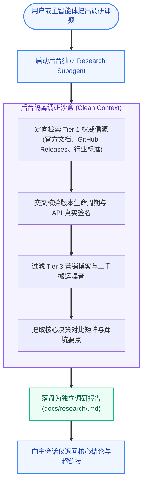

# Matt Pocock Skills 深度调研、自动化向导与运维支撑

| 属性 | 详情 |
| :--- | :--- |
| **文档类型** | 技术专题指南 / 调研运维 |
| **当前状态** | 已归档 (Accepted) |
| **作者** | Ateng |
| **创建日期** | 2026-09-23 |
| **关联系统/模块** | Matt Pocock Skills / Research & DevOps |

---

## 1. 高可信深度技术调研 (`research`)

在引入新技术栈、评估第三方类库或设计系统选型时，往往需要查阅海量的官方文档、GitHub RFC、Release Notes 以及基准测试。若由主会话 Agent 直接在当前上下文进行大范围检索，极易导致主会话上下文窗口被大量网页噪音填满，不仅浪费 Token，还会严重干扰后续编写代码的注意力。

Matt Pocock 的 `research` 技能通过**后台轻量级子智能体 (Background Research Agent)**，独立执行高信任度深度技术调研，并以纯 Markdown 研报的形式向仓库交付沉淀。

### 1.1 后台子 Agent 调研机制与信源分级



#### 信源分级铁律 (Source Hierarchy)
`research` 技能强制执行严格的信源准入标准，彻底杜绝技术幻觉：
- **Tier 1（黄金信源，强制首选）**：
  - 官方文档（如 Spring Docs、Redis.io、Nodejs.org、PostgreSQL Documentation）；
  - 官方 GitHub 仓库的 Release Notes、Tags、Commits 与官方 RFC；
  - 行业标准化组织规范（如 IETF RFC、W3C、CNCF、Apache 基金会规范）。
- **Tier 2（白银信源，辅助论证）**：
  - 主流公有云架构白皮书（AWS Architecture Center、Google Cloud Guides、阿里云最佳实践）；
  - 知名科技公司的官方工程团队技术博客（如 Netflix TechBlog、Uber Engineering）。
- **Tier 3（黑名单信源，绝对禁止采纳）**：
  - 未经核实的个人技术博客、内容农场搬运贴、无权威背书的论坛问答。严禁将此类内容作为调研结论的事实依据。

### 1.2 调研报告标准结构与决策矩阵沉淀

调研产物默认输出至 `docs/research/<topic>.md`，其骨架包含以下标准化模块：

```markdown
# 技术调研报告: [技术选型课题]

## 1. 调研背景与核心问题 (Context & Questions)
明确本次调研旨在解答的核心技术疑问或架构瓶颈。

## 2. 候选方案权衡矩阵 (Trade-off Matrix)
| 候选方案 | 优势 (Pros) | 劣势 (Cons) | 维护状态/社区活跃度 | 推荐指数 |
| :--- | :--- | :--- | :--- | :--- |
| **方案 A** | 原生生态好、开箱即用 | 内存开销略高 | 官方主力维护 (LTS) | ⭐⭐⭐⭐⭐ |
| **方案 B** | 极致轻量 | 文档稀缺、插件生态小 | 个人维护为主 | ⭐⭐ |

## 3. 核心 API 契约与最小验证 (Minimal Reproduction)
提供基于官方最新版本的正确代码样例，并附带生产级关键配置项说明。

## 4. 潜在风险与踩坑预警 (Gotchas & Risks)
详细列出内存泄漏、死锁、版本升级破坏性变更（Breaking Changes）等实战风险。

## 5. 权威引用来源清单 (References)
列出每一项结论对应的官方 Tier 1 绝对链接与核验日期。
```

---

## 2. 人机协同交互运维向导 (`wizard`)

在现代云原生与微服务架构中，研发工作不可避免地会触碰基础设施、凭证配置、第三方 SaaS 控制台以及线上数据迁移。很多初学者期望 AI“一键搞定一切”，但这往往会导致严重的生产安全事故（如生产密钥泄露、未授权的网络策略变更、误删数据卷）。

`wizard` 技能的核心理念是：**让人类做人类最擅长的事，让 Agent 做 Agent 最擅长的事**。

### 2.1 让人类做人类擅长的事：人机边界划定

```mermaid
flowchart LR
    subgraph HumanZone["人类专属领域 (Human Boundary)"]
        direction TB
        H1["生产环境密钥 / 私钥登录与保管"]
        H2["云控制台物理开通 / 账单与信用卡操作"]
        H3["生产数据库核心表 DDL / DML 最终放行"]
    end

    subgraph AgentZone["Agent 专属领域 (Agent Boundary)"]
        direction TB
        A1["生成具备防御性与幂等性的 Bash 引导脚本"]
        A2["前置环境探针检测 (CLI 版本/端口/磁盘)"]
        A3["分步执行引导、错误重试与回滚指引"]
    end

    AgentZone ==>|"生成 Wizard 交互脚本"| HumanZone
    HumanZone ==>|"在受控终端安全执行"| SafeState(["零风险生产运维交付"])

    classDef hStyle fill:#fef3c7,stroke:#f59e0b,stroke-width:2px,color:#92400e;
    classDef aStyle fill:#eff6ff,stroke:#3b82f6,stroke-width:2px,color:#1e40af;
    class HumanZone hStyle;
    class AgentZone aStyle;
```



> [!IMPORTANT]
> **物理安全边界红线 (Security Isolation)**：
> 凡涉及生产凭据填写、双因素认证（2FA）、第三方控制台网页点击的动作，Agent 严禁要求用户在对话框中提供密码，而是必须生成一个交互式的本地向导脚本，引导人类在本地终端中以掩码或受限环境变量的形式安全完成。

### 2.2 交互式 Bash 向导脚本生成规范与容错设计

`wizard` 技能生成的不是一段松散的命令集合，而是一个自包含、具备**前置校验、分步交互与幂等回滚能力**的高容错 Bash 脚本：

```bash
#!/usr/bin/env bash
# 文件: scripts/wizard-setup-s3-credentials.sh
# 职责: 引导开发者安全配置 S3 离线备份凭证，包含前置环境校验与掩码输入
set -euo pipefail

echo "======================================================"
echo "      生产级 S3 备份凭据交互式配置向导 (Wizard)         "
echo "======================================================"

# 1. 前置环境探针检查
echo "[1/3] 检查前置依赖环境..."
if ! command -v aws >/dev/null 2>&1; then
  echo "错误: 未检测到 aws-cli，请先安装官方 CLI 客户端。" >&2
  exit 1
fi

# 2. 安全交互引导与掩码输入
echo "[2/3] 请输入 S3 存储桶凭证 (输入内容将被安全掩码)..."
read -rp "请输入 Bucket 名称: " S3_BUCKET
read -rsp "请输入 AWS Access Key Secret: " S3_SECRET
echo ""

# 3. 幂等性探针与连通性验证
echo "[3/3] 验证连通性与权限 (只读探针)..."
if AWS_SECRET_ACCESS_KEY="$S3_SECRET" aws s3 ls "s3://${S3_BUCKET}" >/dev/null 2>&1; then
  echo "✅ 连通性测试通过！凭据已安全写入受限配置文件。"
else
  echo "❌ 无法连接到指定 Bucket，请检查权限策略或网络代理。" >&2
  exit 2
fi

echo "向导执行完毕，环境已就绪。"
```

#### 向导脚本设计的四大防御性原则
1. **严格使用 `set -euo pipefail`**：任何子命令报错或未绑定变量立即中断，杜绝静默失败后继续向下执行产生脏数据；
2. **前置探针先于一切操作**：在要求用户输入或变更状态前，先探测 CLI 工具链版本、网络端口、剩余磁盘空间等必要条件；
3. **敏感凭证拒绝落盘到公开 Git 目录**：凭据只能通过管道流转至 `~/.aws/credentials` 或通过受管环境变量注入，绝不以明文写入当前仓库；
4. **具备就地可重入性 (Idempotency)**：重复执行该向导不会造成重复覆盖、资源泄露或数据损坏。

---

## 3. 权威参考资料与事实依据 (References & Grounding)

### 3.1 核心依赖与引用信源

- [[Tier 1]] [research 官方技能说明](https://github.com/mattpocock/skills/tree/main/skills/research) - 后台子 Agent 深度调研架构与信源隔离 (核验日期: 2026-09-23)
- [[Tier 1]] [wizard 官方指南](https://github.com/mattpocock/skills/tree/main/skills/wizard) - 运维人机协同边界与交互向导规范 (核验日期: 2026-09-23)
- [[Tier 1]] [Google Shell Style Guide](https://google.github.io/styleguide/shellguide.html) - 生产级 Bash 脚本编码与防御性规范 (核验日期: 2026-09-23)

### 3.2 事实核查矩阵

| 核查对象 (组件/配置/版本) | 官方基准事实 (Ground Truth) | 对应官方依据 (Tier 1 链接) | 状态 |
| :--- | :--- | :--- | :--- |
| `research` 运行模型 | 必须作为后台子智能体运行，调研结论落盘为 Markdown，保护主会话上下文 | [research/SKILL.md](https://github.com/mattpocock/skills/blob/main/skills/research/SKILL.md) | 已核实真实有效 |
| `wizard` 核心用途 | 为人类必须亲手操作的非全自动化步骤生成交互式 Bash 引导向导 | [wizard/SKILL.md](https://github.com/mattpocock/skills/blob/main/skills/wizard/SKILL.md) | 已核实真实有效 |
| 信源三级分层标准 | 强制 Tier 1 官方来源，绝对禁止采纳未经验证的 Tier 3 内容 | `tech-doc` 规范分级标准 | 已核实真实有效 |
