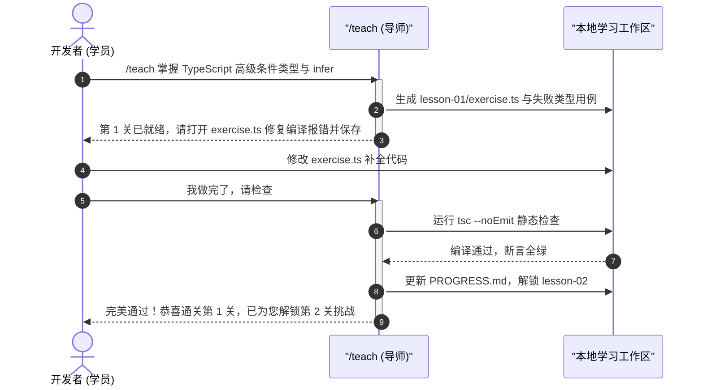

# Matt Pocock Skills 效能协作、教学传承与 Agent 文档编写

| 属性 | 详情 |
| :--- | :--- |
| **文档类型** | 技术专题指南 / 协作效能 |
| **当前状态** | 已归档 (Accepted) |
| **作者** | Ateng |
| **创建日期** | 2026-09-23 |
| **关联系统/模块** | Matt Pocock Skills / Productivity & Collaboration |

---

## 1. 跨会话上下文交接 (`/handoff`)

随着研发排障的深入，单个 LLM 会话往往会累积数万甚至十数万 Token 的历史上下文。此时，模型的响应速度显著变慢、推理成本陡增，且极易出现对早期指令的注意力漂移。然而，直接开启一个空的新会话，又意味着开发者必须把前因后果重新打字复述一遍。

`/handoff` 技能彻底解决了这一痛点。它能够**将漫长会话的全部有效智力成果高度压缩为一份标准化的“交接棒文档”**，实现跨会话的零摩擦平滑接力。

### 1.1 会话上下文压缩与状态机冻结

当开发者在一个长会话中完成了一部分复杂工作（例如定位到了偶发 Bug 的部分线索，或者完成了三个切片中的前两个），只需在终端输入：

```bash
/handoff
```

`/handoff` 会启动结构化压缩管道，提取当前上下文中的关键事实，生成并落盘一份精炼的 Markdown 文件（如 `.scratch/handoff-<timestamp>.md` 或交接摘要）：

```markdown
# 研发会话交接棒 (Session Handoff)

## 1. 核心目标与当前基线 (Context & Baseline)
- **原始目标**: 解决线上支付超时且订单状态未自动回退的竞态 Bug。
- **当前状态**: 已完成最小化复现用例，锁定问题在分布式锁续期时钟漂移。

## 2. 已落地成果 (Completed Work)
- 编写了必挂测试用例: `PaymentTimeoutRegressionTest#test_clock_drift`
- 修复了本地工作区核心类: `RedisDistributedLockRenewer.java`

## 3. 悬而未决的阻断点与关键事实 (Open Items & Crucial Facts)
- 本地测试通过，但在高并发模拟下有 1% 几率抛 `IllegalMonitorStateException`；
- 探针显示续期线程在执行 `unlock()` 时与看门狗存在细微竞态。

## 4. 下一步即刻行动指引 (Next Actions for Continuing Agent)
1. 重点检查 `RedisDistributedLockRenewer.java` 第 48 行的双重检查锁；
2. 运行 `mvn test -Dtest=PaymentTimeoutRegressionTest` 进行针对性调试；
3. 严禁改动已通过测试的 `PaymentOrderService.java`。
```


### 1.2 接力会话的快速热启动

在新会话启动后，开发者只需输入一行：

```bash
请读取 .scratch/handoff.md 并继续推进下一步行动指引。
```

接力 Agent 即可在完全没有历史冗余 Token 包袱的前提下，瞬间掌握当前工程的精确状态与防踩坑红线，实现真正的无缝接力。

---

## 2. 跨干系人异步决策问卷 (`/to-questionnaire`)

在实际研发过程中，工程师经常会遭遇自身权限之外的业务或架构决策（例如：“优惠券过期后，已支付但在退款期的订单是否补发新券？”、“是否允许用户单日跨设备多次登录？”）。这类问题必须由产品经理、业务负责人或首席架构师定夺。

然而，拉着外部干系人开会沟通往往费时费力，且往往因为信息不对称导致讨论陷入细枝末节。

### 2.1 针对决策者的定向问卷合成

`/to-questionnaire` 采取了一种极其独特的视角：**它盘问开发者关于“发送对象与决策诉求”，而非盘问“技术本身”**。

1. **识别决策受众**：明确问卷是给非技术的业务负责人看，还是给基础设施架构师看；
2. **提取清晰权衡分支**：剥离所有底层代码实现细节，将技术分歧转化为**业务后果、成本差异与风险权衡**；
3. **生成即填即走的异步问卷**：输出一份结构清晰的 Markdown 问卷，既可在会议上投屏逐项快速拍板，亦可直接异步发在 Slack、飞书或邮件中。

```markdown
# 业务决策确认函: 优惠券退款回退策略

**致**: 产品运营团队 (负责结算与营销策略)  
**发起人**: 研发团队  
**截止时间**: 2026-09-24 18:00 (阻断发版)

### 决策点 1: 券已过期情况下的逆向退款处理
当用户使用 3 天有效期的立减券下单，第 5 天发起部分退款时，系统应如何处理该优惠金额？

- [ ] **选项 A (推荐 - 延长补偿)**: 系统自动补发一张 7 天有效期的等额补偿券。
  - *优势*: 用户体验极佳，客诉率最低。
  - *代价*: 增加营销预算敞口，需要轻微调整核销对账报表。
- [ ] **选项 B (严格过期作废)**: 仅退还用户实际支付的现金部分，过期券不予补发。
  - *优势*: 严格遵循财务预算周期，无额外资金风险。
  - *代价*: 可能引发高频用户咨询与差评。

**业务批复意见**: __________________________ (签字/回复选项)
```

---

## 3. 认知鸿沟润滑器 (`/wait-what`)

在与智能体进行复杂架构讨论时，偶尔会出现这样的尴尬局面：Agent 输出了大段貌似专业但晦涩难懂的论述，或者其引用的概念与人类的理解完全不在一个频道上，导致开发者产生“等等，你到底在说什么？”的迷茫感。

### 3.1 当沟通受阻时的语境重塑

`/wait-what` 是人机协作中的“安全气囊”。当对话陷入僵局或出现理解壁垒时，开发者无需费心组织长篇大论去反驳，只需直接输入：

```bash
/wait-what
```

Agent 会立即触发防御性认知重置：
1. **停止继续推演**：立刻停止向前推进任务，防止在误解之上越走越远；
2. **检索 `CONTEXT.md` 统一语言**：以代码库中已有的领域统一语言为唯一锚点，剔除所有临时的机器推测词汇；
3. **大白话重述核心意图**：用最平实、通俗的人类自然语言，简明扼要地解释上一条回复的核心结论，并指出为什么会产生刚才的表述。

> [!NOTE]
> `/wait-what` 的本质是强制 Agent 从“技术机器视角”切换回“人类对话视角”，是消除人机认知摩擦最高效的单字命令。

---

## 4. 状态化进阶互动教学 (`/teach`)

随着技术栈的快速演进，工程师常常需要快速掌握一门全新语言特性（如 TypeScript 5.x 装饰器、Rust 生命周期与 Pin 机制）或复杂框架底层原理。传统的“让 AI 解释概念”往往停留在看长篇文档的浅层阅读阶段，缺乏动手实操。

`/teach` 技能贯彻**“目录即课堂 (Directory as Classroom)”**的教学哲学。

### 4.1 目录即课堂：多会话状态保持教学法

执行 `/teach <主题>` 时，Agent 不会在聊天框中贴出大量教程，而是在当前工作区创建一个带状态追踪的交互式学习空间：

```
learn-ts-types/
├── PROGRESS.md            # 记录当前学员的关卡进度与掌握程度
├── lesson-01/
│   ├── README.md          # 核心概念解析与避坑要点
│   ├── exercise.ts        # 预设了类型报错或待补全逻辑的代码题
│   └── solution.ts        # 隐藏的参考答案与架构解析
└── lesson-02/
    └── ...
```



---

## 5. 面向 Agent 的契约文档工程 (`writing-for-agents`)

在构建自主智能体系统时，很多开发者依然习惯用写给人类的散文方式来编写 `AGENTS.md`、`CLAUDE.md` 或 `SKILL.md`。这会导致 Agent 在长文本中抓不住重点，经常发生规则越界或指令漂移。

`writing-for-agents` 是指导开发者如何**为 Agent 编写高执行力契约文档**的专业技能。

### 5.1 为 Agent 写作的核心法则

编写面向智能体的指令与文档时，必须遵循以下四项工程原则：

1. **指令高压缩比 (High Signal-to-Noise Ratio)**：
   - 彻底删除“请注意”、“希望你能做好”等客套修饰词；
   - 采用命令式动词开头的规范清单（如 `统一使用 pnpm 9+`，而非 `建议开发者尽量考虑使用 pnpm 比较好`）。
2. **指针式路由替代全量内嵌 (Pointer Routing over Inlining)**：
   - 根配置文件（如 `AGENTS.md`）保持极度精简，只保留最高准则和目录指针；
   - 详细的规范通过超链接指针分发到 `docs/adr/`、`docs/agents/` 等子文档，由 Agent 按需动态按图索骥。
3. **显式防漂移负面清单 (Explicit Negative Constraints)**：
   - 仅仅告诉 Agent“要做什么”是不够的，必须用加粗或警示块明确声明“**严禁做什么**”（如：`严禁在未经人类明确确认时执行 git commit`）。
4. **结构化标记与机器可读结构 (Structured Syntax)**：
   - 优先采用 GitHub Alerts（`> [!CAUTION]`）、Mermaid 拓扑图与 Markdown 属性键值表，提升模型解析的确定性。

### 5.2 编写高质量 `SKILL.md` 模板规范

一份优秀的 `SKILL.md` 必须具备以下标准化骨架：

```markdown
---
name: [技能简短标识符, 仅含小写字母与横杠]
description: [精准概述触发该技能的意图关键词与核心职责, 供路由器索引]
---

# [技能全称]

一句话精准定义本技能的核心业务与技术职责。

## 何时唤起 (When to reach for it)
- 列出人类输入的意图触发短语或场景信号；
- 明确指出本技能是 User-Invoked 还是 Model-Invoked。

## 输入与前置契约 (Prerequisites & Inputs)
- 明确运行所需的环境命令（如 gh CLI, pnpm）；
- 明确读取的目标配置文件路径。

## 核心执行步骤与纪律 (Execution Workflow)
// 1. 第一步动作与判定标准
// 2. 第二步动作与断点控制
// 3. 第三步验收与交付

## 输出交付物与交付契约 (Outputs)
- 明确生成的具体文件路径与内容格式。

## 严格禁止清单 (Anti-Patterns / Strict Rules)
- > [!CAUTION] 严禁在此技能中执行的高危越界操作。
```

---

## 6. 权威参考资料与事实依据 (References & Grounding)

### 6.1 核心依赖与引用信源

- [[Tier 1]] [handoff 官方使用指南](https://github.com/mattpocock/skills/tree/main/skills/handoff) - 会话上下文压缩与状态机接力规范 (核验日期: 2026-09-23)
- [[Tier 1]] [to-questionnaire 官方手册](https://github.com/mattpocock/skills/tree/main/skills/to-questionnaire) - 决策问卷定向合成逻辑 (核验日期: 2026-09-23)
- [[Tier 1]] [wait-what 官方指南](https://github.com/mattpocock/skills/tree/main/skills/wait-what) - 领域认知重塑与大白话对齐机制 (核验日期: 2026-09-23)
- [[Tier 1]] [teach 官方架构文档](https://github.com/mattpocock/skills/tree/main/skills/teach) - 目录式状态保持教学法 (核验日期: 2026-09-23)
- [[Tier 1]] [writing-for-agents 官方规范](https://github.com/mattpocock/skills/tree/main/skills/writing-for-agents) - 面向智能体的高信噪比文档工程标准 (核验日期: 2026-09-23)

### 6.2 事实核查矩阵

| 核查对象 (组件/配置/版本) | 官方基准事实 (Ground Truth) | 对应官方依据 (Tier 1 链接) | 状态 |
| :--- | :--- | :--- | :--- |
| `/handoff` 交付形态 | 压缩提取已决事实与未决待办，沉淀为独立 Markdown 文档 | [handoff/SKILL.md](https://github.com/mattpocock/skills/blob/main/skills/handoff/SKILL.md) | 已核实真实有效 |
| `/to-questionnaire` 盘问核心 | 盘问发送者（受众身份与回执需求），绝不重复盘问专业技术细节 | [to-questionnaire/SKILL.md](https://github.com/mattpocock/skills/blob/main/skills/to-questionnaire/SKILL.md) | 已核实真实有效 |
| `writing-for-agents` 范式 | 强调高信噪比、指针路由、命令式动词与加粗负面清单 | [writing-for-agents/SKILL.md](https://github.com/mattpocock/skills/blob/main/skills/writing-for-agents/SKILL.md) | 已核实真实有效 |
