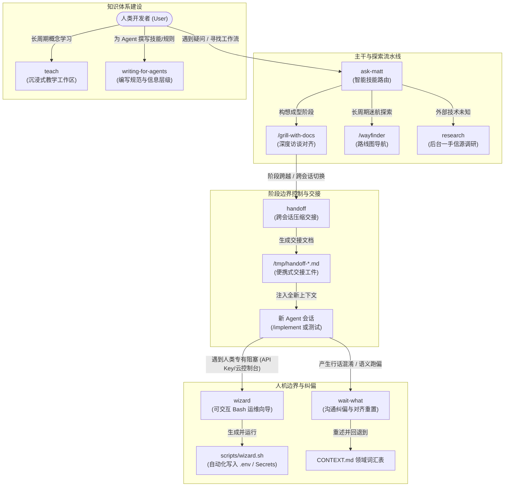
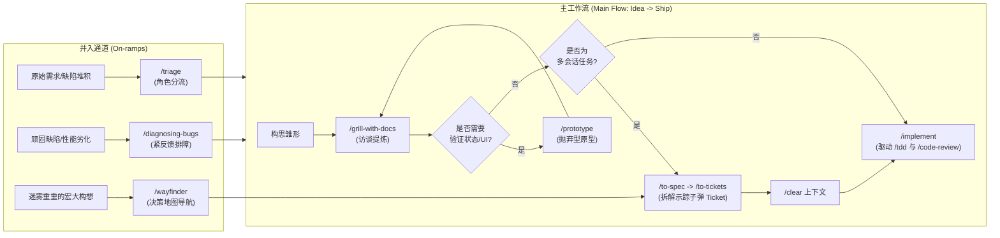
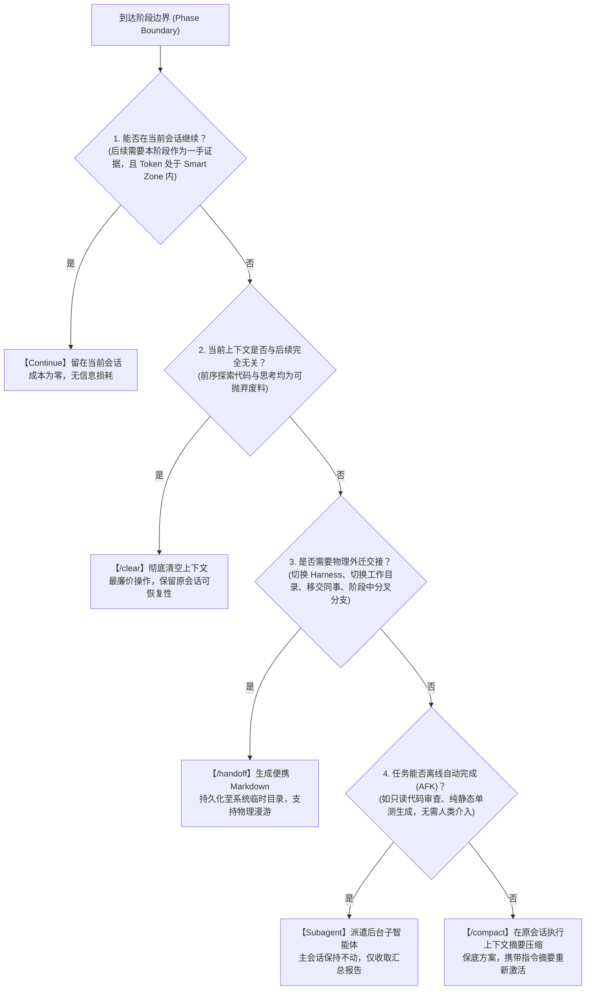
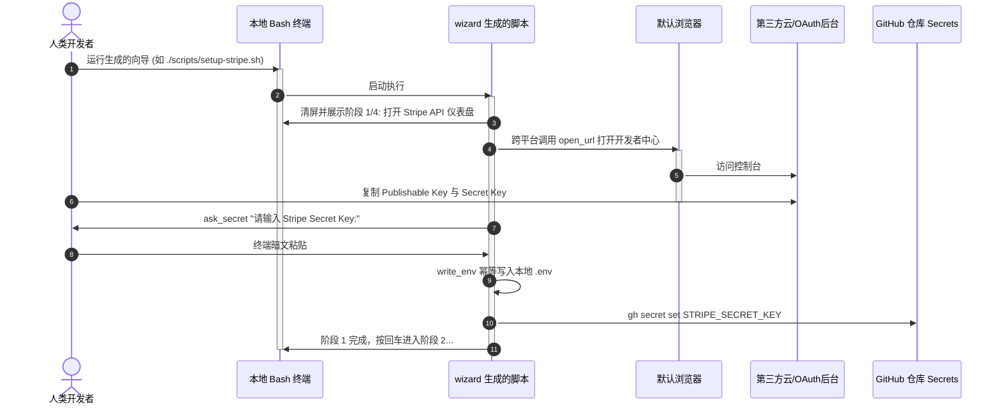
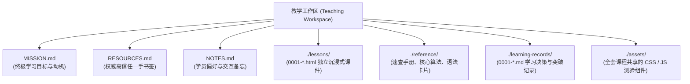
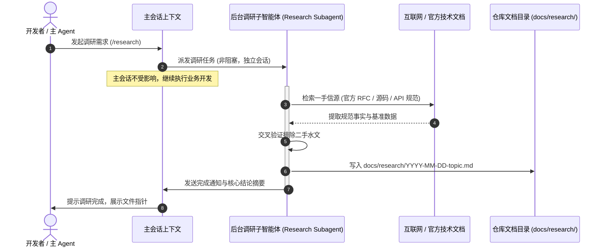
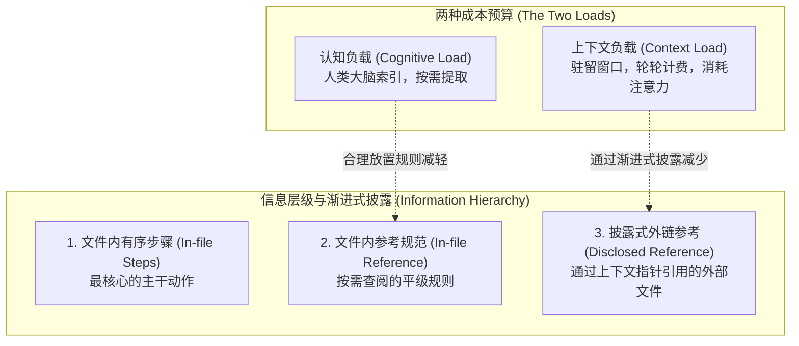
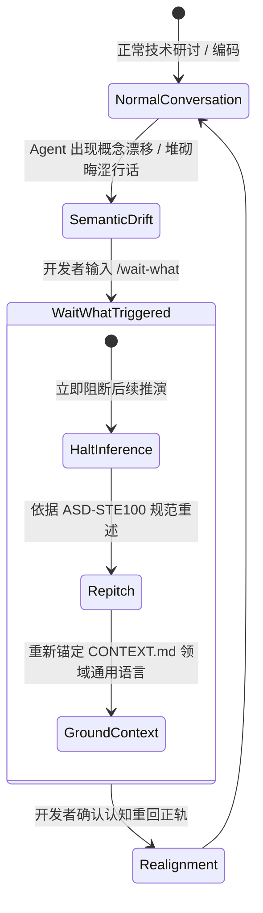

# 协同交接与辅助工具规范指南

| 属性 | 详情 |
| :--- | :--- |
| **文档类型** | 架构设计与操作指南 / 协同套件规范 |
| **当前状态** | 已归档 (Accepted) |
| **作者** | Ateng |
| **创建日期** | 2026-09-22 |
| **关联系统/模块** | Matt Pocock 协同与辅助技能套件 (`mattpocock-skills`) |

---

## 1. 概述与协同全景架构

在现代 AI Agentic 软件工程中，单一会话与孤立提示词无法应对长周期、高复杂度的软件研发。随着任务推进，上下文窗口（Context Window）的注意力衰减、认知过载、人机职责边界模糊以及沟通语义漂移，成为制约智能体自主研发的核心瓶颈。

Matt Pocock 技能套件构建了一套高度模块化、无缝衔接的协同交接与辅助工具集。该套件不依赖玄学提示词，而是通过严格的**信息层级**、**阶段边界决策**、**人机隔离向导**、**一手信源调研**和**重置纠偏机制**，为开发者与自主智能体之间搭建了坚实的工程协同桥梁。

本规范详细阐述协同与辅助套件中的 7 个核心技能：
1. **`ask-matt` (智能技能路由)**：全局技能编排与工作流分流枢纽。
2. **`handoff` (跨会话压缩交接)**：跨会话、跨 Harness、跨目录的高保真便携交接工件。
3. **`wizard` (可交互 Bash 运维向导)**：人类专有动作（鉴权、OAuth、云凭证）的交互式引导与自动化脚本。
4. **`teach` (沉浸式技能教学)**：基于工作区（Teaching Workspace）的有状态、长周期概念与技能传授体系。
5. **`research` (一手信源技术调研)**：利用后台 Agent 深度挖掘官方一手文档与源码事实的技术调查。
6. **`writing-for-agents` (编写规范 SKILL.md/AGENTS.md)**：专为 Agent 消费而设计的高效文档与规则编写工程准则。
7. **`wait-what` (沟通纠偏重置)**：当模型推理走偏或概念脱节时的即时熔断与通用语言重对齐。

### 1.1 协同辅助全景拓扑图



---

## 2. 智能技能路由：`ask-matt`

### 2.1 核心价值
面对庞大的技能生态，人类开发者和模型往往难以穷举记忆每个命令的具体适用时机。`ask-matt` 作为全局路由中心（Router），将所有零散技能收敛为清晰的工作流（Flows），消除使用者的认知记忆负担。

### 2.2 运转机制与流派架构
`ask-matt` 将软件研发活动划分为一条**主工作流 (Main Flow)**、两条**并入通道 (On-ramps)**、一套**代码库健康维护流**以及底层的**领域词汇基础设施**：



#### 上下文卫生（Context Hygiene）与 Smart Zone 约束
- **主流程上下文保持**：步骤 1 到步骤 3（访谈提炼 → 规范输出 → Ticket 拆解）必须保持在**单个未中断的上下文窗口**中，确保决策推导过程与思考背景完全对齐。
- **Smart Zone 认知边界**：主流顶尖大模型在约 150k tokens 内保持敏锐的逻辑推断能力（即“Smart Zone”）。在进入 `/to-tickets` 前，若上下文逼近上限，严禁带病推进，必须在阶段边界使用 `/compact` 压缩。
- **单 Ticket 独立执行**：Ticket 生成完毕后，进入 `/implement` 时必须执行 `/clear` 清空上下文。每一个 Ticket 都是完全自包含的“示踪子弹”，前一个 Ticket 的执行上下文应当丢弃。

### 2.3 命令与触发机制
- **触发命令**：`/ask-matt`
- **使用场景**：开发者面对当前研发困境不知该调用何种技能时调用；或者询问特定场景的最佳流转路径。

### 2.4 实战 Prompt 示例
```text
/ask-matt 我现在有一个关于支付退款重试机制的大致想法，但目前还没理清边界条件和数据库锁方案，代码库里也已经有部分订单逻辑，我下一步该调用什么流程？
```

### 2.5 路由决策矩阵
| 研发场景 | 推荐首选技能 | 后续流转路径 | 核心关注点 |
| :--- | :--- | :--- | :--- |
| **新特性从 0 到 1 构想** | `/grill-with-docs` | `→ /to-spec → /to-tickets → /implement` | 落地 `CONTEXT.md` 与 ADR 记录 |
| **未探索的宏大迷雾架构** | `/wayfinder` | `→ 绘制决策地图 → /to-spec` | 产出决策而非代码交付物 |
| **线上紧急或偶发性 Bug** | `/diagnosing-bugs` | `→ 紧反馈复现测试 → 修复 → /improve-codebase-architecture` | 先有红灯测试，严禁盲目猜想 |
| **外部提交的杂乱 Issue/PR** | `/triage` | `→ 映射五角色标签 → /implement` | 过滤不完整信息，沉淀就绪工件 |
| **跨会话/跨环境迁移** | `/handoff` | `→ 载入新 Agent 会话` | 压缩当前认知，消除冗余噪音 |

---

## 3. 跨会话压缩交接：`handoff`

### 3.1 核心价值
长对话导致模型注意力发散、Token 成本激增，且无法跨 IDE、跨 Harness（如从 Claude 切换到 Codex）迁移。`handoff` 负责将当前会话的思考全貌、决策链路与待办事项压缩为一份高密度的便携 Markdown 交付物，供全新 Agent 瞬间接管。

### 3.2 阶段边界决策树 (Phase Boundaries Protocol)
在阶段与阶段的间隙（Phase Boundary），开发者面临五种操作选择。`handoff` 绝不是盲目首选，而是严格依照以下优先级决策树自顶向下匹配：



> [!IMPORTANT]
> **一手源与二手源权衡 (Primary vs Secondary Sources)**：
> 除了 `Continue` 之外，所有操作都会将**一手记录 (Primary Source)** 转变为**二手摘要 (Secondary Source)**。一手源包含全部推导细节但噪音大、上下文拥挤；二手源空间充足但存在损耗。务必先排除 `Continue`，仅在空间耗尽或必须迁移时承受损耗。

### 3.3 命令与机制规范
- **触发命令**：`/handoff [下一个会话的聚焦目标]`
- **存储路径**：**严禁保存在当前工作区代码库中**，必须保存在操作系统临时目录（如 Linux/macOS `/tmp/handoff-YYYYMMDD-HHMMSS.md`，Windows `%TEMP%\handoff-*.md`），避免污染项目 Git 历史。
- **脱敏防御**：自动过滤 API Key、生产凭据、数据库密码及个人敏感信息（PII）。
- **工件去重**：严禁在交接文档中全文复制已经存在于仓库中的 Specs、ADR、Git Diff 或 Issue 内容，统一采用相对路径或 URL 指针引用。

### 3.4 交付物标准模版 (`handoff-template.md`)

```markdown
# 跨会话交接工件 (Session Handoff)

| 属性 | 详情 |
| :--- | :--- |
| **原始会话主题** | 订单分布式事务与幂等补偿方案设计 |
| **交接时间** | 2026-09-22 10:30:00 |
| **后续聚焦目标** | 实现基于 Redis Redlock 的防重复下单切面与单测 |

## 1. 核心上下文与既定事实 (Context & Decisions)
- 已选定采用防重 Token + Redis 分布式锁组合方案，放弃方案 A（数据库唯一索引强锁），详见决策记录 [ADR-0004](file:///docs/adr/0004-idempotent-order-token.md)。
- 关键状态机流转已在需求规范中锁定：[order-spec.md](file:///docs/specs/order-spec.md)。

## 2. 外部关联工件与指针 (Artifact Pointers)
- 当前修改分支：`feature/order-idempotency`
- 关键变更差异：对比基线 `main...HEAD`，已完成实体模型字段 `idempotent_token` 的定义。
- 关联追踪 Issue：GitHub Issue `#102`。

## 3. 下一阶段关键待办与红线 (Action Items & Guardrails)
- [ ] 编写 `IdempotentAspect.java` 切面逻辑，拦截 `@Idempotent` 注解。
- [ ] 使用 Testcontainers 搭建真实 Redis 环境编写红灯测试（TDD）。
- [!WARNING] 切面中 Redis 释放锁逻辑必须采用 Lua 脚本保证原子性，严禁直接使用 `redisTemplate.delete()`。

## 4. 推荐后续调用的技能 (Suggested Skills)
- `/tdd`：测试驱动编写切面与防重单元测试。
- `/code-review`：完成实现后沿规范与质量双轴执行代码评审。
```

---

## 4. 可交互 Bash 运维向导：`wizard`

### 4.1 核心价值
AI Agent 擅长代码编写、重构与架构设计，但在遇到**人类专属操作**（如登录云厂商控制台开启 2FA、申请企业 OAuth App、配置第三方 Webhook 密钥、执行不可逆的线上主从切换）时往往束手无策，或反复提示人类去配置而陷入上下文死循环。

`wizard` 技能颠覆了“AI 催促人类”的糟糕体验。它会自动生成一个美观、严谨且支持交互的 Bash 脚本（向导），由人类在终端运行。脚本负责自动打开指定浏览器页面、分步提示人类点击复制、暗文捕获敏感输入、幂等更新本地 `.env` 并直接调用 `gh secret` 写入 CI/CD 仓库凭证。



### 4.2 运转流程机制
1. **范围界定 (Scope the procedure)**：
   - 深入审查本地配置：`.env.example`、`docker-compose.yml`、`.github/workflows/*` 中的 `secrets.*` 与 `vars.*`。
   - 确定所有必需由人类产生的键值列表，区分公开变量与暗文凭据。
2. **旅程映射 (Map each stage's journey)**：
   - 为每个凭据绘制精准路径（例如：“登录 AWS 控制台 → IAM → 用户 → 安全凭证 → 创建访问密钥 → 复制 Access Key ID”）。
3. **脚本生成 (Author the wizard)**：
   - 基于标准模板生成。核心辅助函数库保持统一，仅需编写 `STAGES` 标记下方的具体业务步骤。
4. **验证与交接 (Verify and hand off)**：
   - 执行语法静态检查（`bash -n <script>`），赋予可执行权限（`chmod +x`），告知人类运行命令。

### 4.3 核心内置脚手架机制与函数清单
生成的 Wizard 脚本基于 `template.sh` 构建，严格禁止修改函数库源码：
- `banner "Title"`：绘制向导总览横幅与总阶段数。
- `stage "Name"`：自动终端清屏（`_clear`），显示 `▸ Stage X/N · Name` 进度指示。
- `open_url "https://..."`：智能兼容 macOS (`open`)、Linux (`xdg-open`) 与 Windows WSL (`wslview`/`powershell.exe`)。
- `ask "VarName" "Prompt"`：普通输入读取。
- `ask_secret "VarName" "Prompt"`：无回显暗文读取，防止录屏与旁路窥探泄露。
- `write_env "KEY" "VALUE"`：幂等更新本地 `.env`，存在则正则替换，不存在则追加。
- `set_secret "SECRET_NAME" "VALUE"`：调用 `gh secret set` 自动同步至 GitHub Actions 凭据库。
- `confirm "Action warning"`：针对不可逆操作（如重建生产数据库 Schema）设置强阻断确认门禁。

### 4.4 运维向导脚本实战交付物 (`setup-auth0.sh`)

```bash
#!/usr/bin/env bash
// 文件: scripts/setup-auth0.sh
set -euo pipefail

# ──────────────────────────────────────────────────────────────────────────
# Wizard 核心函数库（只读引入，标准模板定义）
# ──────────────────────────────────────────────────────────────────────────
# 此处包含 banner, stage, say, step, open_url, ask, ask_secret, 
# write_env, set_secret, confirm 等标准函数实现...

# ──────────────────────────────────────────────────────────────────────────
# STAGES: 业务步骤定义区
# ──────────────────────────────────────────────────────────────────────────
TOTAL_STAGES=3

banner "Auth0 认证集成与环境变量自动化配置向导"

# 1. 注册与获取 Domain & Client ID
stage "获取 Auth0 基础配置"
say "我们正在配置项目的 OAuth 身份认证底座。"
step "在浏览器中登录 Auth0 管理控制台并进入 Applications 页面。"
open_url "https://manage.auth0.com/#/applications"
say "点击您的 Single Page App，进入 Settings 标签页。"
ask "AUTH0_DOMAIN" "复制并粘贴 Domain (例如: dev-xxx.us.auth0.com): "
ask "AUTH0_CLIENT_ID" "复制并粘贴 Client ID: "
write_env "VITE_AUTH0_DOMAIN" "$AUTH0_DOMAIN"
write_env "VITE_AUTH0_CLIENT_ID" "$AUTH0_CLIENT_ID"

# 2. 获取 Client Secret 并写入安全凭据
stage "获取 Client Secret 并同步 CI 凭据"
say "后端 API 验签需要 Client Secret。"
step "在 Settings 页面下方找到 Client Secret 并点击复制。"
ask_secret "AUTH0_CLIENT_SECRET" "粘贴 Client Secret (输入不显示): "
write_env "AUTH0_CLIENT_SECRET" "$AUTH0_CLIENT_SECRET"
set_secret "AUTH0_CLIENT_SECRET" "$AUTH0_CLIENT_SECRET"

# 3. 配置回调白名单与确认
stage "配置允许的回调 URL (Allowed Callback URLs)"
say "为了允许本地开发环境登录，必须在控制台配置白名单。"
step "在 Application Settings 中找到 'Allowed Callback URLs'。"
say "请将以下地址添加到文本框中: http://localhost:5173/callback"
confirm "您是否已在 Auth0 控制台保存上述更改？"

say "恭喜！Auth0 运维向导配置完成。本地 .env 与 CI Secrets 均已就绪。"
```

---

## 5. 沉浸式技能教学：`teach`

### 5.1 核心价值
与简单的一问一答不同，`teach` 将当前工作区转变为一个**有状态的长期教学工坊 (Teaching Workspace)**。Agent 扮演专属技术导师，结合认知科学原理，跨会话逐步培养用户的硬核技术能力。

### 5.2 核心认知教学哲学
- **三元知识论**：
  - **知识 (Knowledge)**：源自权威、高信任的一手材料，理解核心机制。
  - **技能 (Skills)**：通过极小颗粒度的实战训练、编码挑战和即时反馈构建。
  - **智慧 (Wisdom)**：在真实技术社区中讨论、权衡与实操沉淀。
- **通畅度 vs 存储强度 (Fluency vs Storage Strength)**：
  - “当场看懂”仅代表提取通畅（Fluency），极易产生虚假精通感；
  - 长期记忆（Storage Strength）必须依赖“期望难度 (Desirable Difficulty)”——通过记忆提取练习（Retrieval Practice）、时间间隔复习（Spacing）与交叉混练（Interleaving）实现。
- **最近发展区 (Zone of Proximal Development, ZPD)**：
  - 动态分析用户当前技能边界，每次挑战仅向前推进一步（“跳一跳能够得着”），杜绝断层式教学。

### 5.3 教学工作区文件拓扑



### 5.4 关键文件规范与交付物模版

#### 1. 学习目标契约 (`MISSION.md`)
```markdown
# 学习目标契约 (Learning Mission)

## 核心目标
在 4 周内全面掌握 Rust 所有权、借用检查与生命周期机制，能够独立为高性能分布式缓存编写无内存泄露的并发并发数据结构。

## 驱动动机与业务诉求
当前团队正在将核心网络网关从 Go 重写为 Rust，需要消除 GC 引起的 P99 延迟抖动。

## 成功衡量准则
- [ ] 独立实现一个并发安全的无锁循环队列（RingBuffer）。
- [ ] 彻底通过 Rust 官方 Nomicon 高级不安全代码测试套件。
```

#### 2. 独立课件交付物 (`./lessons/0001-ownership-basics.html`)
- 课件采用 Tufte 极简高排版美学，内嵌即时交互测验小组件。
- 测验选项设计原则：**所有干扰项与正确答案字数必须保持严格一致**，避免排版长度泄露答案线索。

```html
<!DOCTYPE html>
<html lang="zh-CN">
<head>
  <meta charset="UTF-8">
  <title>Lesson 0001: Rust 所有权与移动语义</title>
  <link rel="stylesheet" href="../assets/course-style.css">
</head>
<body>
  <article class="tufte-article">
    <h1>0001: 移动语义与栈堆分配</h1>
    <p class="summary">本节掌握变量赋值时的所有权转移，以及何时发生深拷贝与移动。</p>
    
    <section>
      <h2>一手核心机制</h2>
      <p>在 Rust 中，每个值都有一个所有者（Owner）。当变量离开作用域，其内存会被立即释放。赋值操作默认产生所有权移动（Move）。</p>
      <div class="code-block">
        <pre><code>let s1 = String::from("hello");
let s2 = s1; // s1 所有权移动至 s2，s1 失效</code></pre>
      </div>
    </section>

    <section class="interactive-quiz">
      <h3>即时提取检测 (Retrieval Quiz)</h3>
      <p>执行 <code>let s2 = s1;</code> 之后立即调用 <code>println!("{}", s1);</code> 会发生什么？</p>
      <div class="quiz-option" onclick="checkAnswer(this, false)">运行时抛出空指针异常中断程序</div>
      <div class="quiz-option" onclick="checkAnswer(this, true)">编译器直接拦截并报错阻止构建</div>
      <div class="quiz-option" onclick="checkAnswer(this, false)">控制台正常打印出空字符串内容</div>
      <div class="quiz-option" onclick="checkAnswer(this, false)">触发内存泄漏导致系统资源耗尽</div>
    </section>
  </article>
  <script src="../assets/quiz-runner.js"></script>
</body>
</html>
```

#### 3. 学习突破记录 (`./learning-records/0001-ownership-insight.md`)
```markdown
# 学习突破记录: 0001-移动语义与 Copy 特征的本质区别

## 达成认知突破
- 明确了实现了 `Copy` 特征的类型（如原生标量 `i32`、`bool`）在赋值时进行位拷贝，不失去原变量访问权。
- 未实现 `Copy` 且分配在堆上的类型（如 `String`、`Vec`）必然触发移动语义。

## 遗留盲点 (下节预热)
- 借用（Borrowing）与不可变引用 `&T` 是如何在不转移所有权的前提下共享数据的？
```

---

## 6. 一手信源技术调研：`research`

### 6.1 核心价值
在技术攻坚与架构选型时，主 Agent 或开发者若亲自阅读海量外部资料，将迅速耗尽主会话的上下文容量。`research` 技能将阅读调查任务委托给**独立的后台 Agent (Subagent)**。主会话继续推进核心编码，后台 Agent 在沙箱中完成海量阅读，最终仅向仓库提交一份附带权威证据链的调研总结。



### 6.2 调研原则与规范
1. **一手信源原则 (Primary Sources First)**：
   - 严禁依赖二手技术博客或机翻水文；
   - 必须追踪至拥有事实解释权的源头：官方标准 RFC、框架源码仓库实现、第一方官方权威 API 文档。
2. **证据链引用 (Citation Discipline)**：
   - 每一个关键架构论点、性能指标或限制条件，必须精确附带官方链接与代码行号。
3. **成果原地沉淀**：
   - 统一写入仓库推荐的调研目录（如 `docs/research/` 或 `docs/spikes/`），命名规范为 `YYYY-MM-DD-<topic>.md`。

### 6.3 交付物模版 (`docs/research/YYYY-MM-DD-sample-spike.md`)

```markdown
# 技术调研报告: PostgreSQL 向量扩展 pgvector 性能与索引选型

| 属性 | 详情 |
| :--- | :--- |
| **调研人** | 后台调研 Agent |
| **审查人** | Ateng |
| **调研日期** | 2026-09-22 |
| **当前状态** | 建议采纳 (Recommended) |

## 1. 调研核心结论
针对当前 100 万级规模知识库检索，推荐生产环境采用 **HNSW (Hierarchical Navigable Small World)** 索引，放弃 **IVFFlat**。虽然 HNSW 构建时间与内存占用高出约 35%，但在召回率（Recall@10 > 98%）与并发 QPS 上具有压倒性优势。

## 2. 一手信源证据链 (Primary Evidence)
- **索引算法实现**：[pgvector GitHub Repository - src/hnsw.c](https://github.com/pgvector/pgvector)
- **官方基准测试报告**：[PostgreSQL Extension Network pgvector Benchmark (v0.7.0)](https://github.com/pgvector/pgvector#benchmarking)
- **官方内存计算模型**：依据官方文档，每个 HNSW 向量索引大小估算公式为 `rows * (dimensions * 4 + m * 8) bytes`。

## 3. 技术对比矩阵
| 索引类型 | 100w 向量构建耗时 | 内存占用 (RAM) | 查询 QPS | 召回率 (Recall@10) |
| :--- | :--- | :--- | :--- | :--- |
| **IVFFlat** | ~8 分钟 | 450 MB | 180 | 82.4% |
| **HNSW** | ~28 分钟 | 620 MB | 1,450 | 98.6% (推荐) |

## 4. 后续对主流程的输入
本调研文件已生成，建议开发者在主工作流中通过 `/grill-with-docs` 调取本结论，完善知识库架构决策记录 [ADR-0005](file:///docs/adr/0005-vector-indexing.md)。
```

---

## 7. 编写规范：`writing-for-agents`

### 7.1 核心价值
为 Agent 编写的文档（包括各类 `SKILL.md`、`AGENTS.md`、`CLAUDE.md` 以及各类系统指引）与面向人类读者的文档存在根本差异。面向人类的文档强调修辞、过渡与情感共鸣；而面向 Agent 的文档必须追求**极高的一致性控制**——确保 Agent 在每次运行时执行完全相同的标准流程，而非产生漂移的偶发输出。

### 7.2 核心概念与关键工程杠杆



#### 1. 上下文指针 (Context Pointers)
- 上下文指针是常驻在 Agent 上下文中的精炼引用（如 `AGENTS.md` 中的一行引用，或 Skill 的 Description），它指明了外部文档的位置以及**触发载入的具体条件（Branches）**。
- **编写军规**：前置核心触发动词，严禁冗余同义词堆叠，每一个分支条件必须互斥。

#### 2. 步骤与完成准则 (Steps and Completion Criteria)
- 每一个动作步骤末尾必须定义明确的**完成准则 (Completion Criterion)**。
- 模糊的完成标志（如“充分理解后”）会导致**过早收工 (Premature Completion)**，Agent 会急于跳转到后续步骤。
- 准则必须兼具**清晰度 (Clarity)**（可明确断言是/否完成）与**要求度 (Demand)**（如“确保遍历修改涉及的每一个 Entity 字段”）。

#### 3. 前导词 (Leading Words) 与反向否定规避 (Anti-Negation)
- **前导词**：调动模型预训练权重中已经凝聚的高维概念（如“示踪子弹 _Tracer Bullet_”、“红灯 _Red_”、“紧反馈 _Tight Loop_”），用单一人类成熟词汇替换整段啰嗦解释。
- **反向否定规避 (Anti-Negation)**：严禁通篇使用禁止性指令（“不要产生长方法”、“不要忘记空校验”）。心理学与大模型机制均证明，否定句中的禁止概念会被深度激活。**必须一律采用肯定式目标表达**（“每个方法控制在 20 行以内”、“所有参数入口必须首行编写非空断言卫语句”）。

#### 4. 文本修剪与除杂 (Pruning & No-op Hunting)
- **单一真实来源 (SSOT)**：同一规则严禁在多处冗余复制。
- **消除空指令 (No-op)**：如果一条提示词无论存在与否，顶尖模型默认都会这么做（例如“请写出高质量、无 Bug 的代码”），则判定为无效 No-op，坚决整句剔除。

### 7.3 编写检查清单 (Checklist)
- [ ] 文档是否采用肯定式语态？（无裸露的 `Don't ...` 诱导）。
- [ ] 每一个步骤是否包含二元可校验的完成状态？
- [ ] 是否将分支详细规则推送到外部 Markdown 并使用指针引用？
- [ ] 核心名词是否与 `CONTEXT.md` 领域通用语言保持绝对一致？

---

## 8. 沟通纠偏重置：`wait-what`

### 8.1 核心价值
在复杂对话中，Agent 有时会出现推理跃迁、过度使用虚妄的技术行话、遗漏核心业务背景，或者给出了让开发者完全摸不着头脑的宏大答复。继续在错误理解上争论会进一步污染上下文。`wait-what` 作为一个即时、轻量的**熔断器与纠偏重置器**，强行叫停当前漂移，拉回共识基线。



### 8.2 纠偏三原则
当调用 `/wait-what` 时，Agent 必须强制执行以下动作：
1. **停止辩解与后续推演**：承认最后一条消息未能有效传达意图。
2. **简明重述 (Re-pitch with ASD-STE100)**：遵循国际简明技术英语/技术汉语规范，使用短句、主动语态、明确的主谓宾结构重新陈述核心技术事实。
3. **锚定通用语言 (Ground to `CONTEXT.md`)**：严禁创造未经定义的生僻词汇，所有领域概念必须回归项目唯一的 `CONTEXT.md` 词汇表定义。

### 8.3 实战对话对比

#### ❌ 跑偏场景 (Before)
> **Agent**：针对这个数据流，我们准备引入一个非对称响应式弹性反应堆模式，通过轻量级协程反压管道对上游发布者进行高内聚聚合，同时通过自旋等待锁实现跨上下文边界的数据投递……
> 
> **开发者**：`/wait-what`

#### ✅ 纠偏重述 (After)
> **Agent**：
> 抱歉，刚才的表述脱离了实际语境。我重新用清晰直白的方式说明：
> 
> 1. **当前现状**：订单创建接口在高并发下写入数据库较慢。
> 2. **核心方案**：我们在接口与数据库之间增加一个 Redis 列表作为缓冲队列。
> 3. **具体改动**：
>    - 接口收到请求，直接写入 Redis 并返回“处理中”。
>    - 后台常驻 2 个线程，从 Redis 批量读取并写入数据库。
> 4. **领域术语**：遵循 `CONTEXT.md`，该动作称为“待支付订单缓冲”，不涉及复杂的第三方框架。

---

## 9. 协同工具链组合实战矩阵

在实际软件生命周期中，7 大协同辅助技能如何交叉配合？下表列举了常见工程场景下的全流程组合范式：

| 研发场景 | 协同工具链编排序列 | 核心交互与产物 |
| :--- | :--- | :--- |
| **引入全新未经验证的第三方基础设施** | `research` → `ask-matt` → `wizard` | 1. 后台 Agent 调研一手选型报告。<br>2. 路由到主流程确认方案。<br>3. 生成交互式向导配置云资源与密钥。 |
| **复杂核心业务逻辑重构与交接** | `grill-with-docs` → `wait-what` → `handoff` | 1. 深入访谈理清重构边界。<br>2. 遇到概念分歧时即时纠偏重置。<br>3. 跨会话压缩输出便携工件交接给全新 Agent 实现。 |
| **新人入职与代码库知识传承** | `teach` → `writing-for-agents` | 1. 在独立教学工作区建立 `MISSION.md` 进行实操教学。<br>2. 将沉淀的优秀模式编写为规范的 `SKILL.md` 与规则。 |
| **大规模遗留系统演进** | `wayfinder` → `research` → `to-spec` | 1. 绘制全局决策导航地图。<br>2. 遇到模糊点并行派发调研 Agent。<br>3. 雾气消散后收敛为严格规格并实施。 |

---

> [!TIP]
> **最佳实践总结**：协同工具的核心不在于增加步骤，而在于**划清边界**。在 Smart Zone 内果断执行，在阶段边界审慎交接，在人类专有领域使用向导，在语言模糊时即时重置。遵循本规范，可最大化释放自主 Agentic 团队与人类工程师的联合研发效能。
