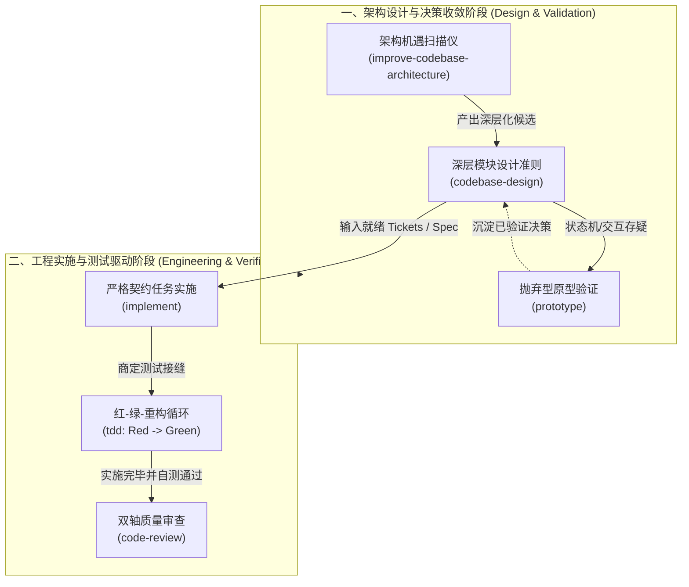
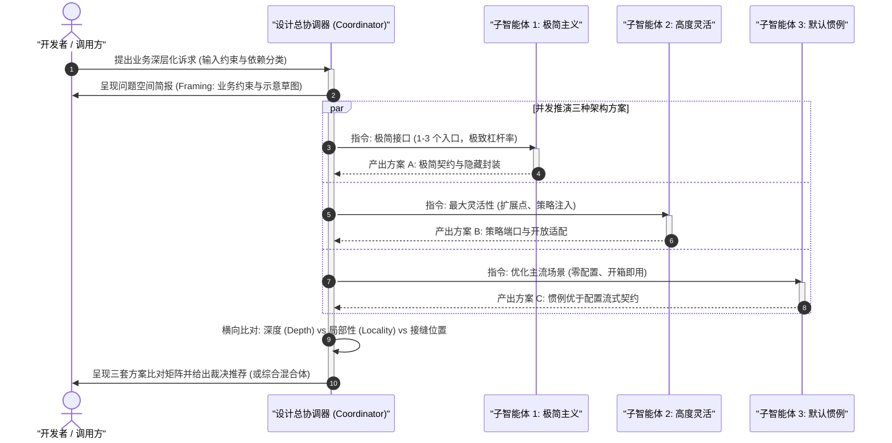
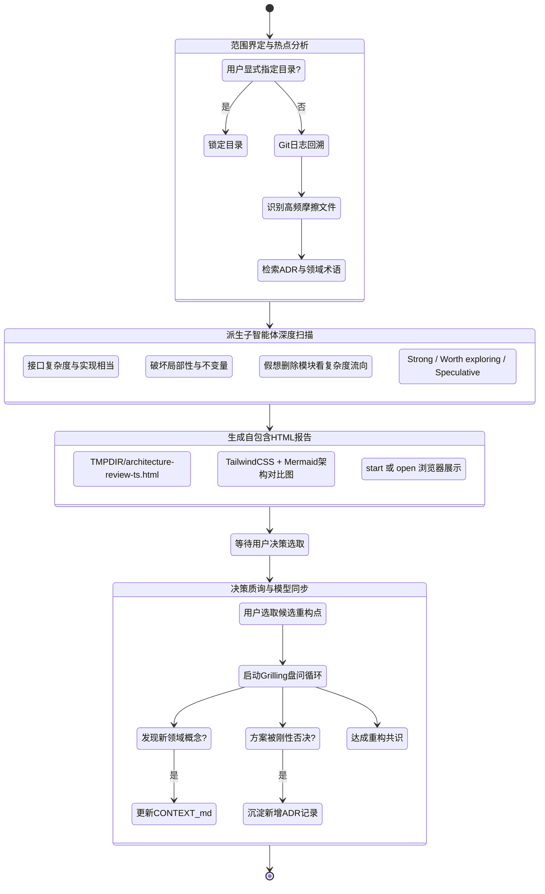
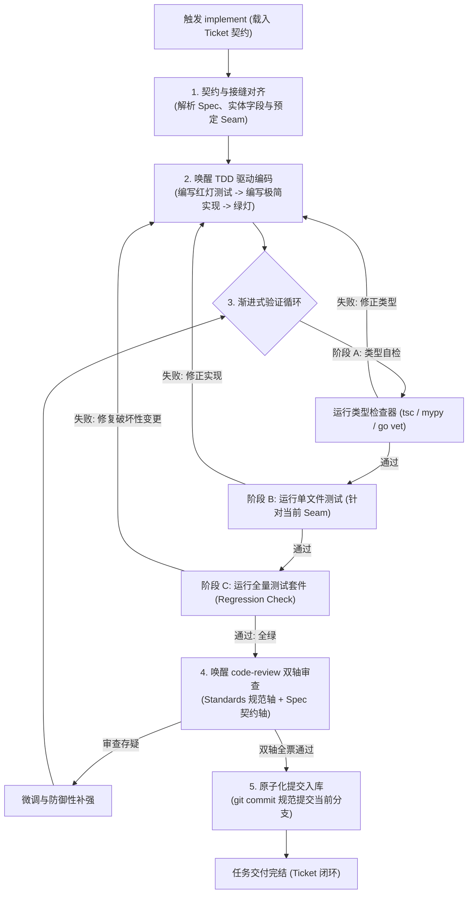
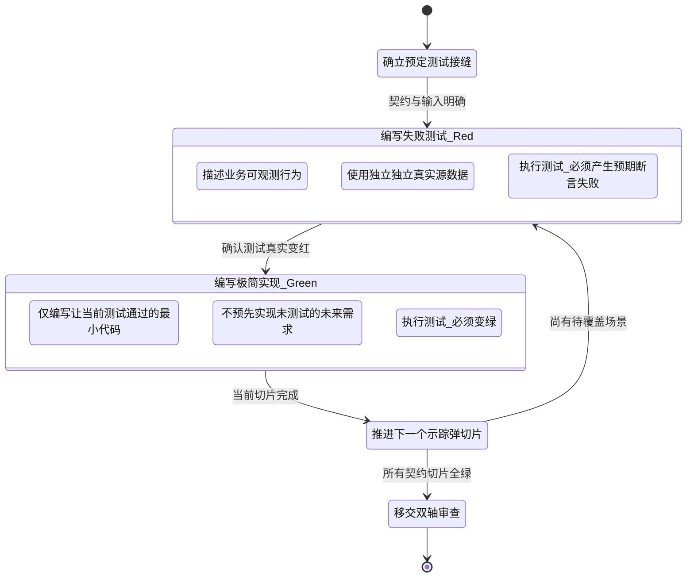
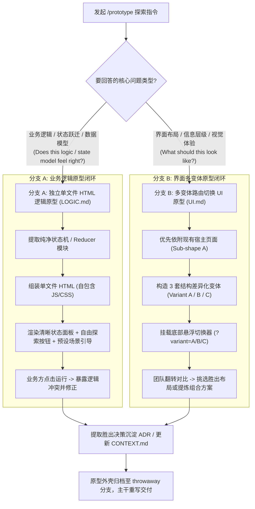

# Matt Pocock 工业级工程技能套件：架构设计与工程编码专题

| 属性 | 详情 |
| :--- | :--- |
| **文档类型** | 架构设计与工程实施技术专题 (Technical Architecture & Engineering Guide) |
| **当前状态** | 已归档 (Accepted) |
| **作者** | Ateng |
| **创建日期** | 2026-09-22 |
| **关联系统/模块** | Ateng-AI / Skills / Matt Pocock / Engineering |

---

## 一、架构设计与工程编码的核心哲学

在现代人工智能协同软件研发（AI-Assisted Software Engineering）中，团队面临的最大挑战往往不是“如何生成代码”，而是“如何避免生成表面能跑、实则快速腐化系统的脆弱代码”。大语言模型在没有严密工程纪律约束时，极易陷入两大极端：一是**设计过度浅层化与碎片化**，制造大量仅有一两行代码的贫血透传类；二是**实施缺乏契约与测试前置**，凭概率生成虚构接口，导致重构成本指数级攀升。

为了从根本上解决上述工程顽疾，Matt Pocock 工业级工程套件将经典软件工程学（John Ousterhout 的深层模块设计、Michael Feathers 的工作接缝理论、Kent Beck 的测试驱动开发）与现代智能体认知机制深度熔炼，确立了**架构设计与工程编码的四大核心支柱**：

1. **深层模块与信息隐藏（Deep Modules & Information Hiding）**：模块的价值在于“极简接口承载海量实现能力”。通过最小化对外暴露的概念，智能体为调用方提供高杠杆率（Leverage），同时为维护者提供高局部性（Locality）。
2. **主动架构扫描与视觉共识（Proactive Architecture Scanning & Visual HTML Review）**：基于代码库提交热点与领域模型，主动发现浅层化坏味道，借助自包含 HTML 报告与多维图表向团队拉齐共识。
3. **低成本抛弃型原型探索（Throwaway Prototypes to Settle Decisions）**：针对存在分歧的状态机与 UI 交互，在编码前用极低成本的独立单文件原型进行物理推演，用真实运行效果验证假设，验证完毕即丢弃，严禁原型代码污染主干。
4. **严格契约实施与红绿循环（Lossless Ticket Implementation & Red-Green TDD）**：严格消费预先商定的 Spec 与 Tickets，绝不在没有失败测试（Red Test）的前提下编写任何业务代码，测试表面严格收敛于系统预定接缝（Pre-agreed Seams）。



---

## 二、深层模块设计：`codebase-design`

### 1. 定位与核心价值
`codebase-design` 是 Matt Pocock 架构设计体系的基石哲学，其思想直接渊源于斯坦福大学教授 John Ousterhout 著作《软件设计哲学》（*A Philosophy of Software Design*）以及经典遗留系统重构理论。

在软件设计中，复杂度会随着系统演进而自然累积。传统的“盲目拆分类与函数”做法常常制造出大量的**浅层模块（Shallow Modules）**——接口极其复杂，暴露了大量方法与配置参数，内部却仅仅是几行简单的委托或数据透传。这种设计不仅没有减轻开发者的认知负担，反而强迫调用方去理解大量碎片化的内部机制。

`codebase-design` 倡导构建**深层模块（Deep Modules）**：
- **薄接口，厚实现（Small Interface, Deep Implementation）**：模块对外仅提供极其精炼的入口（极少的方法、极简的入参、严密的契约），而将繁杂的校验、缓存、状态转换、降级容错等实现细节完整封锁在模块内部。
- **杠杆率（Leverage）**：调用方每学习一个单位的接口概念，就能撬动成倍的业务处理能力。一个优秀的深层模块，能够让十几个调用端和上百个测试用例轻松复用，获得极高投资回报。
- **局部性（Locality）**：当业务规则调整、Bug 修复或性能优化发生时，所有的改动与验证完全被约束在模块实现内部，调用方接口保持纹丝不动。“一次修复，处处生效”，彻底杜绝连带修改。
- **删除测试（The Deletion Test）**：评估一个模块是否真正有价值的标准——假想将该模块删除。如果系统的复杂度直接消失了，说明它只是一个无意义的浅层透传类；如果复杂度瞬间散落并蔓延到全系统的 N 个调用端，说明该模块正在真正承担关键职责。

> [!IMPORTANT]
> **深度是接口的属性，而非代码行数的堆砌**：不要把“深层模块”误解为单纯的代码行数多。一个 100 行但向外暴露 20 个 getter/setter 的类依然是极其浅薄的；一个对外仅有单一 `pay(order)` 方法、内部精巧编排状态校验与账务对账的模块，才是真正的深层模块。

---

### 2. 触发场景与调用命令
- **调用命令**：
  - 作为基础词汇与设计法则参考时，通常在会话中引用或通过 `/codebase-design` 触发。
  - 在探索候选方案时，执行其子模式 `/codebase-design (Design-It-Twice)`。
- **适用场景**：
  - 设计新模块的核心对外接口，需要评估方法签名与抽象纯粹度时。
  - 发现业务代码库中存在大量“散弹式修改（Shotgun Surgery）”或浅层透传类时。
  - 团队就是否应该拆分某个类、服务或包产生分歧时。
  - 准备编写测试用例，需要确立系统工作接缝（Seam）与适配器（Adapter）边界时。
- **前置与禁止场景**：
  - **前置要求**：必须与 `CONTEXT.md` 中的业务统一语言对齐，严禁使用含糊的 `Manager`、`Service`、`Component` 等宽泛词汇，必须使用精准的领域概念。
  - **禁止滥用**：严禁在毫无可变性诉求（仅有单一实现且永远无需模拟替换）的内部简单逻辑处强行套用多层抽象接口。严格遵循“一个适配器代表假想接缝，两个适配器才构成真实接缝”的铁律。

---

### 3. 底层运行机制与状态机
`codebase-design` 的核心机制由**依赖四级分类模型**、**接缝纪律（Seam Discipline）**以及**二次设计（Design-It-Twice）并发博弈**三部分构成。

#### (1) 依赖四级分类模型与测试接缝
在设计模块接口时，必须先对模块依赖项进行严格分级，不同级别的依赖决定了其接缝所处的位置与测试策略：

| 依赖分类级别 | 依赖特征描述 | 接口与接缝处理准则 | 测试策略与适配器要求 |
| :--- | :--- | :--- | :--- |
| **1. 进程内依赖 (In-process)** | 纯算法运算、内存数据结构计算，无磁盘与网络 I/O。 | 完全内聚到深层模块内部，**不暴露任何外部接缝或接口**。 | 直接穿透主接口进行测试，无需任何 Mock 或适配器。 |
| **2. 本地可替换依赖 (Local-substitutable)** | 涉及外部存储，但存在高保真本地测试替身（如 SQLite、PGLite、内存文件系统）。 | 保持内部接缝，深层模块对外接口依然纯粹，不因测试而暴露存储接口。 | 在测试套件中直接运行本地测试替身，测试覆盖真实 SQL 与文件逻辑。 |
| **3. 自有远程依赖 (Remote but owned)** | 团队自有的跨网络服务（内部微服务、自建 RPC、MQ）。 | 在接缝处定义**端口（Port）**，核心业务逻辑归深层模块所有，通信层作为适配器注入。 | 生产环境注入 HTTP/gRPC 适配器，测试环境注入内存适配器（In-memory Adapter）。 |
| **4. 真正外部依赖 (True external)** | 外部第三方不受控服务（如 Stripe 支付网关、Twilio 短信、云服务商 API）。 | 定义专精的 SDK 风格端口接口，深层模块依赖该端口，严禁业务直接调用原生 SDK。 | 生产环境装配官方 SDK 适配器，测试环境装配受控 Mock 适配器。 |

#### (2) 接缝纪律（Seam Discipline）
- **真实接缝法则**：只有一个适配器的接缝纯属假想接缝（Hypothetical Seam），本质是无意义的间接层与代码浪费；只有当系统存在至少两个适配器（如 Production 适配器 + Test 适配器，或 MySQL 适配器 + In-Memory 适配器）时，该接缝才是合法的真实接缝。
- **内部接缝与外部接缝隔离**：深层模块内部可以为了自身测试的便利性划分私有内部接缝，但**严禁将内部接缝暴露在外部公有接口上**。
- **替换而非层叠（Replace, Don't Layer）**：当深层模块构建完毕后，原先散落在浅层模块上的琐碎单测已无保留价值，必须坚决删除，全面迁移至深层模块的公有接口表面。

#### (3) 二次设计（Design-It-Twice）运行状态机
当需要为核心业务设计深层接口时，`codebase-design` 拒绝单点思维，通过派生多个子智能体以不同偏好并行推演，最终通过加权比对敲定最优接口：



---

### 4. 标准交互实战示例

#### (1) 用户 Prompt 触发范例
> “我们当前的结算与订单履约模块散落成了 `OrderValidator`、`PricingCalculator`、`InventoryDeductor`、`CouponApplier` 四个类，调用方控制器必须按特定顺序手工调用这 4 个类的 12 个方法，漏掉一步就会导致账实不符。请运用 `/codebase-design` 规范，对该模块进行深层化重构设计。”

#### (2) 浅层模块坏味道 vs 深层模块重构代码实现 (TypeScript)

```typescript
// =========================================================================
// ❌ 浅层模块设计 (Shallow Module): 大接口、薄实现、调用方认知负担极重
// =========================================================================
// 调用方必须知晓所有内部步骤、执行时序与异常分支
export class ShallowCheckoutFlow {
  constructor(
    private validator: OrderValidator,
    private pricing: PricingCalculator,
    private inventory: InventoryDeductor,
    private coupon: CouponApplier
  ) {}

  // 暴露了过多细粒度方法，逻辑散落，毫无杠杆率可言
  public validate(order: OrderDto): boolean { return this.validator.check(order); }
  public applyCoupon(order: OrderDto, code: string): void { this.coupon.apply(order, code); }
  public calculateTax(order: OrderDto): number { return this.pricing.getTax(order); }
  public reserveStock(order: OrderDto): Promise<boolean> { return this.inventory.reserve(order); }
}

// =========================================================================
// ✅ 深层模块设计 (Deep Module): 极简接口、深层逻辑、内聚不变量防御
// =========================================================================

/**
 * 订单结算领域核心契约 (Interface)
 * 调用方只需提供结算请求，其余所有优惠、库存、税率、并发锁均在内部完备处理
 */
export interface CheckoutPort {
  execute(command: CheckoutCommand): Promise<CheckoutReceipt>;
}

export interface CheckoutCommand {
  readonly orderId: string;
  readonly customerId: string;
  readonly items: ReadonlyArray<{ readonly sku: string; readonly quantity: number }>;
  readonly couponCode?: string;
  readonly idempotencyKey: string;
}

export interface CheckoutReceipt {
  readonly receiptId: string;
  readonly finalAmount: number;
  readonly discountedAmount: number;
  readonly status: "CONFIRMED" | "REJECTED";
  readonly failureReason?: string;
}

/**
 * 深层模块实现 (Deep Implementation)
 * 封装在预定接缝之后，外部测试与调用完全通过 CheckoutPort
 */
export class CheckoutCoordinator implements CheckoutPort {
  constructor(
    // 依赖项严格遵循四级依赖划分，通过依赖注入进入，便于测试替换适配器
    private readonly stockAdapter: InventoryPort,     // 级别 3: 自有远程依赖 (端口适配)
    private readonly paymentGateway: PaymentPort,    // 级别 4: 真正外部依赖 (Mock 适配)
    private readonly auditLog: AuditLogger           // 级别 1: 进程内/本地日志
  ) {}

  /**
   * 核心结算执行方法
   * 内部串联状态校验、不变量防御与分布式幂等，对外仅暴露单一方法
   */
  public async execute(command: CheckoutCommand): Promise<CheckoutReceipt> {
    // 1. 前置卫语句防线: 校验业务不变量与基础边界
    if (!command.items || command.items.length === 0) {
      throw new IllegalArgumentException("结算商品明细不能为空");
    }

    // 2. 内部隐蔽编排: 库存预占 -> 账单计算 -> 外部支付调用
    const reservation = await this.stockAdapter.reserve(command.orderId, command.items);
    if (!reservation.success) {
      return {
        receiptId: `REC-FAIL-${command.orderId}`,
        finalAmount: 0,
        discountedAmount: 0,
        status: "REJECTED",
        failureReason: reservation.message,
      };
    }

    try {
      // 3. 计算最终优惠与应付金额 (纯内存领域逻辑，隐藏在内部)
      const pricingPlan = this.computePricingLocally(command.items, command.couponCode);

      // 4. 调用支付网关 (外部端口)
      const paymentResult = await this.paymentGateway.charge({
        amount: pricingPlan.payableAmount,
        token: command.idempotencyKey,
      });

      // 5. 记录审计日志并返回自解释凭据
      this.auditLog.info(`订单 ${command.orderId} 结算完成，实付 ${pricingPlan.payableAmount}`);

      return {
        receiptId: paymentResult.transactionId,
        finalAmount: pricingPlan.payableAmount,
        discountedAmount: pricingPlan.discountAmount,
        status: "CONFIRMED",
      };
    } catch (error) {
      // 防御性补偿回滚: 无论任何异常发生，保证库存释放
      await this.stockAdapter.release(command.orderId);
      throw error;
    }
  }

  // 私有核心计算逻辑: 内部凝聚，不向外部泄漏计算细节
  private computePricingLocally(
    items: ReadonlyArray<{ sku: string; quantity: number }>,
    couponCode?: string
  ): { payableAmount: number; discountAmount: number } {
    let base = items.reduce((sum, item) => sum + item.quantity * 100, 0);
    let discount = couponCode === "PROMO2026" ? 20 : 0;
    return {
      payableAmount: Math.max(0, base - discount),
      discountAmount: discount,
    };
  }
}
```

---

### 5. 关键边界与配合技能
- **前置依赖**：
  - `domain-modeling`：输入统一语言（Ubiquitous Language）与限界上下文，为深层模块命名提供领域语义支撑。
  - `grill-with-docs`：梳理核心业务边界，确保接口契约与已记录的 ADR（架构决策记录）保持一致。
- **后置流转**：
  - `tdd`：将深层模块的公有接口作为唯一的测试表面（Test Surface），严格在公有接口上编写测试。
  - `implement`：根据深层接口契约，实施无损落地编码。
- **反模式警示**：
  - 严禁为了“方便单元测试”而将深层模块内部的私有子方法或局部状态暴露为 public。
  - 严禁为只有一个实现的内部类机械化提取 Interface，制造伪抽象。

---

## 三、代码库架构扫描与交互优化：`improve-codebase-architecture`

### 1. 定位与核心价值
在长周期的工程演进中，代码库往往会因为人员更迭与紧急业务交付而逐渐积累“架构沉积物”——大量浅层透传类、过度细碎的函数、紧耦合导致的跨边界渗透，以及为了测试而生硬剥离的虚假纯函数。

`improve-codebase-architecture` 的定位是**代码库架构深层化机遇的主动雷达与体检中心**。它的核心价值体现在：
- **拒绝无差别全局扫描（Git 热点感知）**：不是机械化地扫描整个仓库，而是通过分析近期提交历史（`git log`），将注意力精准聚焦在高频变动、高摩擦的热点区域（Hot Spots）。因为对一个三年未动的稳定模块做深层化重构毫无 ROI，重构的价值只在经常发生变更的模块上才能兑现。
- **可视化沟通与无侵入报告（Visual HTML Report）**：拒绝纯文本大段长篇大论，自动在系统临时目录（`%TEMP%` 或 `/tmp`）生成自包含、高颜值的交互式 HTML 报告（Tailwind CSS + CDN Mermaid 混合渲染），让团队对架构坏味道一目了然。
- **重构前置盘问决策（Inline Grilling & Domain Alignment）**：在用户选中某一候选优化点后，立即无缝启动推演盘问，并同步将新提炼的领域概念更新至 `CONTEXT.md`，或将用户拒绝重构的刚性理由沉淀为 ADR，避免未来无谓的重复扫描。

---

### 2. 触发场景与调用命令
- **调用命令**：
  - 终端或对话输入 `/improve-codebase-architecture`。
  - 允许附加指定路径，如 `/improve-codebase-architecture src/modules/billing`。
- **适用场景**：
  - 准备承接大型新业务特性前，对即将动刀的子系统进行架构健康度体检。
  - 开发者发现理解某一个业务概念需要同时打开十几个源文件并在其间跳跃时。
  - 发现某些模块难以编写集成测试，或者测试代码中充斥着复杂的内部 Mock 时。
- **前置与禁止场景**：
  - **前置检查**：必须先检视 `CONTEXT.md` 术语表与 `docs/adr/`，避免重新讨论已有定论的架构决策。
  - **禁止场景**：严禁在扫描阶段直接在代码库中新建或修改任何代码文件；生成的 HTML 报告严禁写入 Git 仓库主干目录，必须写入系统临时文件夹并自动调用系统默认浏览器唤起。

---

### 3. 底层运行机制与状态机
`improve-codebase-architecture` 的执行过程被精巧组织为一个包含**范围界定**、**独立报告渲染**、**交互质询**与**模型回写**的三阶段状态机：



---

### 4. 标准交互实战示例

#### (1) 用户 Prompt 触发与交互流程
> **用户**：“请对我司通知中心与消息推送模块（`src/notifications/`）进行架构深层化评估，感觉当前新增一种通知渠道非常痛苦，到处都是条件判断与参数组装。”
>
> **智能体执行响应**：
> 1. 读取 `docs/adr/`，未发现与通知渠道相关的互斥决策；
> 2. 执行 `git log -n 50 --oneline -- src/notifications`，发现过去一个月该目录下有 28 次提交，属于极度高频变动的热点区域；
> 3. 扫描发现：`NotificationRouter`、`SmsPayloadBuilder`、`EmailPayloadBuilder`、`WechatPayloadBuilder`、`ThirdPartySender` 呈现经典“薄实现、大接口、浅层穿透”坏味道；
> 4. 在系统临时目录写入 `architecture-review-202609221045.html` 并调用命令启动浏览器；
> 5. 提示用户已生成可视化对比报告，并提供核心候选卡片。

#### (2) 生成的自包含 HTML 报告骨架片段 (Tailwind + Mermaid)

```html
<!DOCTYPE html>
<html lang="zh-CN">
<head>
  <meta charset="UTF-8">
  <title>代码库架构深层化审查报告 (Architecture Review)</title>
  <script src="https://cdn.tailwindcss.com"></script>
  <script type="module">
    import mermaid from 'https://cdn.jsdelivr.net/npm/mermaid@10/dist/mermaid.esm.min.mjs';
    mermaid.initialize({ startOnLoad: true, theme: 'neutral' });
  </script>
</head>
<body class="bg-slate-50 text-slate-800 p-8">
  <div class="max-w-5xl mx-auto">
    <!-- 头部摘要 -->
    <header class="mb-8 border-b pb-4">
      <div class="flex items-center justify-between">
        <h1 class="text-3xl font-bold tracking-tight text-slate-900">架构深层化机遇诊断报告</h1>
        <span class="px-3 py-1 bg-emerald-100 text-emerald-800 rounded-full text-sm font-medium">扫描完成</span>
      </div>
      <p class="text-slate-500 mt-2">基于 Git 变更热点与 John Ousterhout 深层模块设计哲学自动生成</p>
    </header>

    <!-- 候选重构卡片 1 -->
    <div class="bg-white rounded-xl shadow-sm border border-slate-200 p-6 mb-6">
      <div class="flex items-center justify-between mb-4">
        <h2 class="text-xl font-semibold text-slate-800">候选 1: 通知分派与渲染引擎深层化 (Notification Dispatcher)</h2>
        <span class="px-2.5 py-0.5 bg-indigo-100 text-indigo-800 rounded text-xs font-semibold">强烈推荐 (Strong)</span>
      </div>

      <div class="grid grid-cols-1 md:grid-cols-2 gap-4 mb-4 text-sm">
        <div>
          <span class="font-medium text-slate-600">涉及文件路径：</span>
          <code class="block mt-1 p-2 bg-slate-100 rounded text-xs text-rose-600">
            src/notifications/router.ts<br/>
            src/notifications/builders/*.ts<br/>
            src/notifications/sender.ts
          </code>
        </div>
        <div>
          <span class="font-medium text-slate-600">诊断问题 (Problem)：</span>
          <p class="mt-1 text-slate-600">目前调用方需先调用 Router 决议渠道，再手动调用各 Builder 构建 Payload，最后传给 Sender，破坏了局部性。增加一个新渠道需要修改 5 处代码。</p>
        </div>
      </div>

      <!-- Before / After 架构对比可视化 -->
      <div class="grid grid-cols-1 md:grid-cols-2 gap-4 border-t pt-4">
        <div class="bg-rose-50/50 p-4 rounded-lg border border-rose-100">
          <h3 class="text-sm font-bold text-rose-800 mb-2">重构前：浅层散弹式调用 (Shallow)</h3>
          <pre class="mermaid">
            flowchart TD
              Caller["调用端 (Caller)"] --> R["路由解析器 (Router)"]
              Caller --> B1["短信构建器 (SmsBuilder)"]
              Caller --> B2["邮件构建器 (EmailBuilder)"]
              Caller --> S["发送通道 (Sender)"]
          </pre>
        </div>
        <div class="bg-emerald-50/50 p-4 rounded-lg border border-emerald-100">
          <h3 class="text-sm font-bold text-emerald-800 mb-2">重构后：深层分发核心 (Deep Module)</h3>
          <pre class="mermaid">
            flowchart TD
              Caller["调用端 (Caller)"] -->|"dispatch(event)"| DM["深层通知中心 (NotificationHub)"]
              subgraph "深层内部封装 (Behind the Seam)"
                DM --> R2["渠道自裁决"]
                DM --> P2["模版自解析"]
                DM --> S2["统一适配通道"]
              end
          </pre>
        </div>
      </div>
    </div>
  </div>
</body>
</html>
```

---

### 5. 关键边界与配合技能
- **前置联动**：
  - `codebase-design`：提供评价深浅、杠杆率、局部性与接缝纪律的标准判据词汇。
  - `domain-modeling`：提供既有业务实体概念，确保扫描时能够准确辨识领域边界。
- **后置联动**：
  - `grilling`：一旦用户选中卡片，立即切入该候选点的可行性盘问与边界压力测试。
  - `to-tickets`：盘问收敛后，将深层化重构方案转化为具体的垂直示踪弹任务单。
- **避坑红线**：
  - 严禁在扫描报告中提前输出具体的类方法签名实现，避免在未达成宏观架构共识前陷入琐碎语法争端。
  - 若候选方案违背了既有 ADR，必须醒目标注“与 ADR-XXXX 存在冲突”，并给出是否值得重新审视该决策的严肃论证。

---

## 四、严格契约编码实施：`implement`

### 1. 定位与核心价值
在传统 AI 编程体验中，“自由发挥编码”是灾难的核心根源：智能体面对一个任务描述，往往随意猜测数据表结构、自行决定对外 API 路径、跳过既定异常规范，生成了一堆无法与现有系统无缝对接的代码。

`implement` 技能是 Matt Pocock 套件中**严格基于 Spec（规格说明书）与 Tickets（任务工单）的无损契约编码实施者**。其核心哲学是：
- **无损契约消费（Lossless Contract Consumption）**：智能体在实施阶段不具有重新定义业务需求的权力。所有的模型结构、字段命名、校验逻辑与依赖关系必须完全严格锚定在已通过评审的 Spec 与 Ticket 契约上。
- **预定接缝作业（Work at Pre-agreed Seams）**：代码改动严格在推演阶段商定的接缝（Seams）处落笔，坚决杜绝越俎代庖去修改无关模块的公有接口。
- **多道渐进防御检验（Progressive Defense Check）**：实施过程采用“高频类型检查 -> 局部单文件测试 -> 最终全套测试回归”的分级验证机制，确保改动在每一步都处于绿灯状态。
- **原子化规范提交（Atomic Conventional Commits）**：单次 Ticket 实施仅对应单一职责的代码变更，按照 Conventional Commits 规范清晰记录，坚决杜绝功能实现、格式化排版与无关重构混杂提交。

---

### 2. 触发场景与调用命令
- **调用命令**：
  - 在指定待办 Ticket 后调用 `/implement`（例如 `/implement #42` 或提供完整的 Ticket 描述）。
- **适用场景**：
  - 已经通过 `to-spec` 和 `to-tickets` 产出了清晰、无歧义的垂直切片任务单。
  - 模块接口接缝已经由 `codebase-design` 明确，且各方达成一致。
- **前置与禁止场景**：
  - **前置要求**：Ticket 必须处于就绪状态（`ready-for-agent`），且前置依赖的阻断性 Ticket 已全部处于关闭/合并状态。
  - **禁止场景**：严禁在需求依然含糊、存在未决技术分歧的情况下强行执行 `implement`。如果发现 Ticket 存在遗漏或内在矛盾，必须立刻叫停，回退至 `grilling` 或触发 `wait-what`。

---

### 3. 底层运行机制与状态机
`implement` 执行过程遵循严谨的五步交付流水线：



---

### 4. 标准交互实战示例

#### (1) 输入的标准 Ticket 契约样本
```markdown
### 任务: Ticket #104 - 用户多租户配额原子扣减实施
- **所属 Spec**: 统一租户配额管理系统 (Spec #100)
- **预定接缝 (Pre-agreed Seam)**: `src/tenancy/quota-manager.ts` 的 `TenantQuotaPort`
- **契约要求**:
  1. 方法签名: `deductQuota(tenantId: string, resource: ResourceType, amount: number): Promise<DeductResult>`
  2. 业务不变量: 租户配额不足时抛出 `InsufficientQuotaException`，扣减失败保持原子性，不可产生部分扣减。
  3. 依赖项: 依赖 `QuotaStoragePort` (级别 2: Local-substitutable)，测试环境使用内存 Map 适配器。
  4. 性能要求: 扣减过程使用行级乐观锁，检测到版本冲突时重试最多 3 次。
```

#### (2) 实施落地代码实现 (TypeScript)

```typescript
// 文件路径: src/tenancy/quota-manager.ts
import { InsufficientQuotaException, TenantNotFoundException } from "./exceptions";
import { QuotaStoragePort, DeductResult, ResourceType, TenantQuotaPort } from "./ports";

/**
 * 租户配额管控核心实现类
 * 严格按照 Ticket #104 契约实现，杜绝额外非受控能力泄漏
 *
 * @author Ateng
 * @since 2026-09-22
 */
export class TenantQuotaManager implements TenantQuotaPort {
  private static readonly MAX_RETRY_ATTEMPTS = 3;

  constructor(
    private readonly storageAdapter: QuotaStoragePort
  ) {}

  /**
   * 原子扣减租户配额
   *
   * @param tenantId 租户唯一标识
   * @param resource 资源类型枚举
   * @param amount   扣减数量 (必须大于 0)
   * @return 扣减结果凭证
   * @throws InsufficientQuotaException 当可用余额小于扣减量时抛出
   */
  public async deductQuota(
    tenantId: string,
    resource: ResourceType,
    amount: number
  ): Promise<DeductResult> {
    // 1. 前置防御校验: 参数合法性与空安全
    if (!tenantId || tenantId.trim().length === 0) {
      throw new IllegalArgumentException("租户标识 tenantId 不能为空");
    }
    if (amount <= 0) {
      throw new IllegalArgumentException("扣减配额数量 amount 必须大于 0");
    }

    // 2. 乐观锁重试循环编排: 应对高并发扣减场景
    let attempts = 0;
    while (attempts < TenantQuotaManager.MAX_RETRY_ATTEMPTS) {
      attempts++;

      // 读取当前配额快照
      const snapshot = await this.storageAdapter.getQuotaSnapshot(tenantId, resource);
      if (!snapshot) {
        throw new TenantNotFoundException(`未检索到租户 [${tenantId}] 的配额记录`);
      }

      // 业务不变量硬性校验
      if (snapshot.availableBalance < amount) {
        throw new InsufficientQuotaException(
          `租户 [${tenantId}] 资源 [${resource}] 配额不足，当前剩余: ${snapshot.availableBalance}，请求扣减: ${amount}`
        );
      }

      // 计算扣减后的最新状态并尝试乐观写入
      const updatedBalance = snapshot.availableBalance - amount;
      const success = await this.storageAdapter.compareAndSwap(
        tenantId,
        resource,
        snapshot.version,
        updatedBalance
      );

      if (success) {
        return {
          tenantId,
          resource,
          deductedAmount: amount,
          remainingBalance: updatedBalance,
          transactionVersion: snapshot.version + 1,
        };
      }
      // 发生版本碰撞，等待短暂退避后继续重试
      await this.backoffWait(attempts);
    }

    throw new ConcurrencyConflictException(`租户 [${tenantId}] 配额扣减并发重试超过最大上限 (${TenantQuotaManager.MAX_RETRY_ATTEMPTS}) 次`);
  }

  private async backoffWait(attempt: number): Promise<void> {
    const delayMs = attempt * 20;
    return new Promise((resolve) => setTimeout(resolve, delayMs));
  }
}
```

---

### 5. 关键边界与配合技能
- **前置衔接**：
  - `to-tickets`：输入拆分良好、具有单一职责与明确依赖的示踪弹 Ticket。
  - `codebase-design`：锁定接缝与端口契约，确保代码不会乱放位置。
- **内嵌执行**：
  - `tdd`：在每一个 Ticket 落地过程中，严格按照红绿循环节奏编写测试与实现。
- **后置交接**：
  - `code-review`：任务完结后，交由双轴子智能体审查 Standards 规范与 Spec 契约符合度。
  - `resolving-merge-conflicts`：当多任务并行或长期特性分支合并产生冲突时唤醒协助。

---

## 五、测试驱动开发：`tdd`

### 1. 定位与核心价值
测试驱动开发（Test-Driven Development, TDD）常被平庸地视作“先写测试后写代码的编码习惯”。而在 Matt Pocock 技能体系中，TDD 是一套**精确制导的工程反馈控制系统**，是保障智能体不发生幻觉、不编写冗余代码的最高安全准则。

`tdd` 技能的核心价值由三大支柱确立：
- **测试即规格（Test as Specification）**：测试用例不是实现逻辑的附属品，而是公有接口行为特征的最高法律。一个优秀的测试用例应当像规格说明书一样易读（例如 `user_can_checkout_with_valid_cart`），它清晰地向未来的维护者与智能体宣称“该模块具备何种能力”。
- **垂直示踪弹切片（Vertical Slicing vs. Horizontal Slicing）**：严厉禁止“先将所有测试一次性写完，再统一写实现”的水平摊大饼模式。大批量预先编写测试是对系统行为的虚构想象。TDD 强调**垂直微切片**——每个循环仅编写一个失败测试，紧接着编写刚好使其通过的极简实现，像一颗“示踪弹（Tracer Bullet）”一样穿透链路，以真实反馈修正下一轮认知。
- **测试表面严格收敛于公有接缝（The Interface is the Test Surface）**：测试代码只能站在预定公有接缝处观察系统的可观测行为，**严禁侵入内部细节**。私有方法、内部中间变量和隐藏协作类绝不是测试的目标。唯有如此，未来的内部代码重构才不会导致大面积测试脆性断裂。

---

### 2. 触发场景与调用命令
- **调用命令**：
  - 启动 TDD 循环时调用 `/tdd`。
  - 在编写新特性、缺陷修复或准备针对接缝编写自动化验证时触发。
- **适用场景**：
  - 实施新的业务逻辑，需要确保每一步演进都有即时反馈。
  - 修复线上或测试环境缺陷（与 `diagnosing-bugs` 联动：先编写确定性复现 Bug 的红灯测试，再写修复代码）。
  - 需要建立防回归防护网的核心算法与状态机实现。
- **前置与禁止场景**：
  - **前置确认**：在编写任何一行测试之前，必须写下被测接缝（Seam under test），并**向用户显式确认该接缝**。未经确认的接缝严禁编写测试。
  - **禁止场景**：严禁把重构（Refactoring）塞入红绿循环中破坏节奏，重构应当作为独立的审查与提炼步骤；严禁在公有接口之外通过旁门左道（如直接查数据库底层私有表、反射读取私有成员变量）来进行断言。

---

### 3. 底层运行机制与状态机

#### (1) 红-绿-循环微状态机
TDD 在智能体中的执行状态机由红灯（Red）、绿灯（Green）、微调收敛三个严密状态构成：



#### (2) Mock 边界纪律（When to Mock）
在 TDD 循环中，滥用 Mock 会直接导致测试失去真实性。必须坚决执行以下 Mock 铁律：
- **仅在系统物理外缘（System Boundaries）使用 Mock**：
  - 第三方不可控 HTTP/RPC API（支付、短信、外部天气等）。
  - 真实物理硬件与非确定性系统环境（当前时间戳、随机数发生器）。
  - 难以在本地低成本启动的重型外部基础设施。
- **严禁 Mock 的范围**：
  - **严禁 Mock 团队自己拥有的类与模块**。
  - **严禁 Mock 模块内部的私有协作者**。
  - 数据库操作优先使用本地测试替身（如内存 SQLite、PGLite），而非虚拟 Mock。

---

### 4. 标准交互实战示例

#### (1) 用户 Prompt 触发范例
> “我们要为电商购物车实现阶梯满减优惠计算逻辑（满 100 减 10，满 300 减 50，满 1000 减 200，不可叠加，取最大优惠）。请使用 `/tdd` 流程，先在公有接缝处确立测试用例，再逐步驱动实现。”

#### (2) 真实 TDD 红绿推进用例与对比

```typescript
// =========================================================================
// 步骤 1: 编写红灯测试 (RED) - 站在公有接缝处，描述 WHAT 而非 HOW
// =========================================================================
// 测试文件: test/pricing/tier-discount.test.ts
import { TierDiscountCalculator } from "../../src/pricing/tier-discount";
import { CartItem } from "../../src/pricing/types";

describe("阶梯满减计算模块 (TierDiscountCalculator)", () => {
  let calculator: TierDiscountCalculator;

  beforeEach(() => {
    // 实例化深层模块，不进行任何内部私有 Mock
    calculator = new TierDiscountCalculator();
  });

  // ✅ 优秀测试: 独立真实源数据，测试可观测行为，命名清晰如 Spec
  test("当购物车总金额未达到最低满减门槛 100 时，优惠金额应为 0", () => {
    const items: CartItem[] = [{ sku: "SKU-01", price: 40, quantity: 2 }]; // 40 * 2 = 80
    const result = calculator.calculate(items);
    
    // 断言直接使用自解释字面量 0，严禁在测试中重新按代码逻辑算一遍
    expect(result.discountAmount).toBe(0);
    expect(result.payableAmount).toBe(80);
  });

  test("当购物车总金额达到 350 时，应命中满 300 减 50 档位，而非满 100 档位", () => {
    const items: CartItem[] = [
      { sku: "SKU-01", price: 100, quantity: 3 },
      { sku: "SKU-02", price: 50, quantity: 1 },
    ]; // 300 + 50 = 350
    const result = calculator.calculate(items);

    expect(result.discountAmount).toBe(50);
    expect(result.payableAmount).toBe(300);
  });
});

// =========================================================================
// ❌ 常见反模式测试警示 (Bad Test Patterns to Avoid)
// =========================================================================
// 反模式 A: 重言式测试 (Tautological Test) - 预期值按代码同款算法推导，毫无独立客观性
test("【反模式】重言式断言", () => {
  const items = [{ price: 100, quantity: 2 }];
  const expectedSum = items.reduce((acc, i) => acc + i.price * i.quantity, 0); // 错误! 测试与实现雷同
  expect(calculator.sum(items)).toBe(expectedSum);
});

// 反模式 B: 实现细节耦合 (Coupled to Implementation) - 校验内部调用私有步骤
test("【反模式】耦合内部实现", () => {
  const mockRule = jest.spyOn(calculator as any, "internalSortRules");
  calculator.calculate([]);
  expect(mockRule).toHaveBeenCalled(); // 错误! 一旦重构私有排序方式测试必裂
});

// =========================================================================
// 步骤 2: 编写极简生产实现让测试变绿 (GREEN)
// =========================================================================
// 源码文件: src/pricing/tier-discount.ts
export interface DiscountResult {
  readonly originalTotal: number;
  readonly discountAmount: number;
  readonly payableAmount: number;
}

export class TierDiscountCalculator {
  // 静态满减阶梯规则: 内部隐藏不变量，按降序排列
  private static readonly RULES = [
    { threshold: 1000, discount: 200 },
    { threshold: 300, discount: 50 },
    { threshold: 100, discount: 10 },
  ];

  public calculate(items: CartItem[]): DiscountResult {
    // 1. 基础防护卫语句
    if (!items || items.length === 0) {
      return { originalTotal: 0, discountAmount: 0, payableAmount: 0 };
    }

    // 2. 汇总原始总额
    const total = items.reduce((sum, item) => sum + item.price * item.quantity, 0);

    // 3. 匹配最大命中阶梯
    let matchedDiscount = 0;
    for (const rule of TierDiscountCalculator.RULES) {
      if (total >= rule.threshold) {
        matchedDiscount = rule.discount;
        break; // 规则已排好序，首次命中即最大优惠
      }
    }

    return {
      originalTotal: total,
      discountAmount: matchedDiscount,
      payableAmount: total - matchedDiscount,
    };
  }
}
```

---

### 5. 关键边界与配合技能
- **上游承接**：
  - `implement`：作为实施阶段的核心工作范式，每一颗示踪弹都由 TDD 循环直接制导。
  - `codebase-design`：测试接缝严格依附于深层模块的外部接口，严禁自行在模块内部挖洞写单测。
- **缺陷修复联动**：
  - `diagnosing-bugs`：排障四步法在第三步隔离出根因后，交由 TDD 先编写能稳定复现 Bug 的红灯测试，修复后再使之变绿，永久沉淀为防回归资产。
- **三大反模式黑名单**：
  1. **实现耦合（Implementation-coupled）**：窥探私有方法或断言内部函数调用次数。
  2. **重言式（Tautological）**：测试代码复制了一遍生产代码的算法来生成预期值。
  3. **水平摊大饼（Horizontal slicing）**：先写全部测试再写代码，丧失示踪弹敏捷演进反馈。

---

## 六、探索性抛弃型原型验证：`prototype`

### 1. 定位与核心价值
在软件工程中，最昂贵的浪费莫过于“以极度严谨的工业级规范，极其高效地实现了一个完全错误、毫无价值或体验反人类的功能”。对于存在高度不确定性的需求（如：复杂业务状态转换是否会死锁？新的数据结构能否优雅表达极端多态？新版仪表盘信息密度是否合理？），直接编写生产代码不仅成本极高，而且一旦沉淀为代码资产，团队往往会因为沉没成本而不愿推倒重来。

`prototype` 技能的本质是**通过编写“明确标定为即可抛弃的代码”，用最低成本回答特定设计疑问**。其核心哲学包括：
- **目标由问题裁决（The Question Decides the Shape）**：原型不是“缩水版生产系统”，而是“回答特定疑问的实验仪器”。一个原型只针对一个明确的问题展开。
- **从第一天起就注定抛弃（Throwaway from Day One）**：原型代码必须被清晰标注为抛弃型，绝不添加多余的抽象层、错误降级和边缘用例处理。
- **非开发人员可直观感知（Driver for Everyone）**：原型必须能让非技术人员（产品经理、业务专家、UI 设计师）独立操作并观察状态跃迁。如果业务专家看不懂原型，它就无法验证业务假设。
- **探索成果沉淀，原型代码归档（Absorb the Answer, Trash the Shell）**：原型一旦回答了核心问题，验证通过的状态机或算法核心将被提取并使用 `tdd` 重新以生产标准实现；而原型的 HTML 外壳或临时路由分支将被打上标签提交至临时归档分支，严禁直接 Merge 到生产主干。

---

### 2. 触发场景与调用命令
- **调用命令**：
  - 发现设计模糊时调用 `/prototype`。
- **适用场景**：
  - **逻辑分支存疑**：“我无法确定如果用户在退款中途突然点击换货，状态机是否会产生冲突状态？”
  - **数据模型表达力存疑**：“我们提议的新租户配额模型，能否表达跨部门共享且支持透支的边界情况？”
  - **UI 呈现选型分歧**：“设置页面是使用侧边栏折叠面板好，还是使用卡片网关流式排版更好？”
- **前置与禁止场景**：
  - **必须二选一分支**：必须在一开始明确进入**分支 A（业务逻辑与状态机原型）**还是**分支 B（UI 交互与多变体原型）**，严禁混杂。
  - **禁止持久化**：默认状态必须驻留内存，严禁连接生产真实数据库（除非验证的问题本身与数据库特性强绑定，此时也只能使用带标记的本地临时数据库）。
  - **禁止编写测试**：一个需要写单元测试的原型，说明它已经逾越了原型的边界，必须立刻叫停。

---

### 3. 底层运行机制与状态机

#### (1) 原型分支二叉判定树
启动 `prototype` 时，首先判定所要回答的问题本质：



#### (2) 逻辑原型与 UI 原型的规范约束对比

| 规范维度 | 分支 A: 逻辑与状态机原型 (LOGIC.md) | 分支 B: 界面与交互原型 (UI.md) |
| :--- | :--- | :--- |
| **交付载体** | **纯单文件 HTML**（内联 CSS 与 JS），无任何打包依赖，双击即跑。 | 依附于项目当前前端工程体系，渲染在真实宿主页面中。 |
| **切换机制** | 页面内 Tab 式典型引导场景（Guided Walkthroughs）+ 自由点击按钮。 | 底部固定悬浮条（Floating Switcher）+ URL 参数 `?variant=A/B/C`。 |
| **语言风格** | 纯粹的**业务领域语言**，严禁出现 Reducer、Dispatch 等程序员黑话。 | 真实的业务组件密度、真实文案，拒绝低质量 Lorem ipsum 占位。 |
| **变体要求** | 针对快乐路径、死锁边界、非法非法操作提供定制预置场景。 | 必须是**结构差异化**（布局、信息层级不同），严禁仅换配色或文字。 |
| **生产回收** | 提取验证通过的纯 JS/TS 纯函数或状态机；HTML 容器完全丢弃。 | 胜出变体按生产规范重写并补齐测试；落选变体及悬浮条从主干彻底删除。 |

---

### 4. 标准交互实战示例

#### (1) 逻辑原型实战：审批流状态机单文件 HTML 原型 (LOGIC.md 规范)

```html
<!-- 文件保存为: d:/My/dev/Ateng-AI/scratch/approval-prototype.html -->
<!DOCTYPE html>
<html lang="zh-CN">
<head>
  <meta charset="UTF-8">
  <title>采购审批流状态机决策原型 (Prototype Demo)</title>
  <style>
    body { font-family: -apple-system, BlinkMacSystemFont, "Segoe UI", Roboto, sans-serif; background: #f8fafc; color: #1e293b; padding: 2rem; }
    .card { background: white; border-radius: 8px; border: 1px solid #e2e8f0; padding: 1.5rem; max-width: 650px; margin: 0 auto; box-shadow: 0 1px 3px rgba(0,0,0,0.05); }
    .badge { display: inline-block; padding: 0.25rem 0.75rem; border-radius: 9999px; font-weight: bold; font-size: 0.875rem; }
    .btn { background: #3b82f6; color: white; border: none; padding: 0.5rem 1rem; border-radius: 6px; cursor: pointer; margin-right: 0.5rem; margin-bottom: 0.5rem; font-weight: 500; }
    .btn:hover { background: #2563eb; }
    .btn:disabled { background: #cbd5e1; cursor: not-allowed; }
    .state-panel { background: #f1f5f9; padding: 1rem; border-radius: 6px; margin: 1rem 0; font-family: monospace; font-size: 0.9rem; }
    .tab-bar { display: flex; border-bottom: 2px solid #e2e8f0; margin-bottom: 1rem; }
    .tab-btn { padding: 0.5rem 1rem; border: none; background: transparent; cursor: pointer; font-weight: 600; color: #64748b; }
    .tab-btn.active { color: #3b82f6; border-bottom: 2px solid #3b82f6; margin-bottom: -2px; }
  </style>
</head>
<body>
  <div class="card">
    <h2 style="margin-top: 0;">探索核心疑问：当采购单在“财务终审”阶段被驳回时，是否应允许采购员直接修改金额并重新触发初审？</h2>
    
    <!-- 状态展示面板: 面向业务人员渲染，拒绝原生 JSON dump -->
    <div class="state-panel">
      <div>当前状态: <span id="display-state" class="badge" style="background: #e2e8f0; color: #0f172a;">草稿中 (DRAFT)</span></div>
      <div style="margin-top: 0.5rem;">审批链路历史: <span id="display-history">无</span></div>
      <div style="margin-top: 0.5rem;">当前采购金额: <strong id="display-amount">¥ 5,000</strong></div>
    </div>

    <!-- 自由交互按钮区 -->
    <h3>自由推演操作 (Free-play)</h3>
    <div>
      <button class="btn" onclick="dispatch('SUBMIT')">提交初审</button>
      <button class="btn" onclick="dispatch('DEPT_APPROVE')">部门主管批准</button>
      <button class="btn" onclick="dispatch('FINANCE_REJECT')">财务终审驳回</button>
      <button class="btn" onclick="dispatch('MODIFY_AMOUNT')">修改采购金额为 ¥15,000</button>
      <button class="btn" style="background: #64748b;" onclick="resetModel()">重置状态</button>
    </div>

    <!-- 预设场景引导 -->
    <h3 style="margin-top: 1.5rem;">典型边界场景测试 (Guided Scenarios)</h3>
    <div class="tab-bar">
      <button class="tab-btn active" onclick="loadScenario(1)">场景 1: 正常流程</button>
      <button class="tab-btn" onclick="loadScenario(2)">场景 2: 财务驳回后篡改金额漏洞测试</button>
    </div>
    <div id="scenario-desc" style="font-size: 0.9rem; color: #64748b; margin-bottom: 1rem;">
      测试财务驳回后，若采购员擅自将金额从 5,000 改为 15,000，是否能直接绕过部门主管进入财务审批。
    </div>
  </div>

  <script>
    // =========================================================================
    // 纯状态机逻辑模块 (Pure Logic Module) - 验证成功后可直接剥离沉淀至生产代码
    // =========================================================================
    let state = { status: 'DRAFT', amount: 5000, history: [] };

    function machineReducer(current, action) {
      switch (current.status) {
        case 'DRAFT':
          if (action === 'SUBMIT') return { ...current, status: 'DEPT_PENDING', history: [...current.history, '提交审批'] };
          if (action === 'MODIFY_AMOUNT') return { ...current, amount: 15000 };
          break;
        case 'DEPT_PENDING':
          if (action === 'DEPT_APPROVE') return { ...current, status: 'FINANCE_PENDING', history: [...current.history, '部门主管已同意'] };
          break;
        case 'FINANCE_PENDING':
          if (action === 'FINANCE_REJECT') return { ...current, status: 'REJECTED', history: [...current.history, '财务审核已驳回'] };
          break;
        case 'REJECTED':
          // 关键决策点验证: 驳回后一旦修改金额，强制必须回归 DEPT_PENDING 而不是直接提交财务
          if (action === 'MODIFY_AMOUNT') {
            return { ...current, amount: 15000, status: 'DRAFT', history: [...current.history, '修改金额，已退回草稿重新走全链路'] };
          }
          break;
      }
      return current;
    }

    // 页面呈现驱动
    function dispatch(action) {
      state = machineReducer(state, action);
      render();
    }

    function resetModel() {
      state = { status: 'DRAFT', amount: 5000, history: [] };
      render();
    }

    function render() {
      document.getElementById('display-state').innerText = state.status;
      document.getElementById('display-amount').innerText = '¥ ' + state.amount.toLocaleString();
      document.getElementById('display-history').innerText = state.history.join(' -> ') || '无';
    }
  </script>
</body>
</html>
```

#### (2) UI 原型实战：多变体底部悬浮切换器代码 (React / Next.js 范例)

```tsx
// 组件路径: src/components/prototype/PrototypeSwitcher.tsx
"use client";
import React, { useEffect } from "react";
import { useRouter, useSearchParams, usePathname } from "next/navigation";

interface PrototypeSwitcherProps {
  readonly variants: ReadonlyArray<{ readonly key: string; readonly label: string }>;
  readonly current: string;
}

/**
 * 抛弃型 UI 变体底部悬浮切换条 (严禁在生产构建中泄漏)
 */
export function PrototypeSwitcher({ variants, current }: PrototypeSwitcherProps) {
  const router = useRouter();
  const pathname = usePathname();
  const searchParams = useSearchParams();

  // 生产环境安全熔断守卫
  if (process.env.NODE_ENV === "production") {
    return null;
  }

  const currentIndex = variants.findIndex((v) => v.key === current);

  const switchVariant = (key: string) => {
    const params = new URLSearchParams(searchParams.toString());
    params.set("variant", key);
    router.replace(`${pathname}?${params.toString()}`);
  };

  const handlePrev = () => {
    const nextIdx = (currentIndex - 1 + variants.length) % variants.length;
    switchVariant(variants[nextIdx].key);
  };

  const handleNext = () => {
    const nextIdx = (currentIndex + 1) % variants.length;
    switchVariant(variants[nextIdx].key);
  };

  return (
    <aside className="fixed bottom-6 left-1/2 -translate-x-1/2 z-50 flex items-center gap-3 px-4 py-2 bg-slate-900/90 text-white backdrop-blur shadow-2xl rounded-full border border-slate-700 text-sm select-none">
      <button onClick={handlePrev} className="p-1 hover:text-blue-400 font-bold" title="按左箭头切换">←</button>
      <span className="font-mono font-medium px-2 border-x border-slate-700">
        变体 [{current}] : {variants[currentIndex]?.label}
      </span>
      <button onClick={handleNext} className="p-1 hover:text-blue-400 font-bold" title="按右箭头切换">→</button>
    </aside>
  );
}
```

---

### 5. 关键边界与配合技能
- **前置衔接**：
  - `grilling`：当在方案推演期间发现某处业务流程或页面交互团队各执一词、无法在纸面上达成共识时，果断打断长篇争论，直接调用 `prototype`。
- **后置沉淀**：
  - `domain-modeling` 与 `to-spec`：原型验证得出的有效结论，以 ADR 形式固化，并将精确状态转换填入技术规格书。
  - `implement` 与 `tdd`：将原型中的核心纯函数提取，彻底丢弃原型 HTML/临时路由外壳，使用 TDD 重新进行严格的生产编码与单测交付。
- **六大禁止反模式**：
  1. **严禁为原型写单元测试**：原型需要测试证明它失去了抛弃型价值。
  2. **严禁直连生产数据库**：全部使用内存假数据。
  3. **严禁过度通用化设计**：拒绝“未来可能支持扩展”的空想，原型只解决当前这一个问题。
  4. **严禁把逻辑与 DOM 强行耦合**：分支 A 中的业务逻辑必须保持为纯函数/纯模块，确保能单独抽走。
  5. **严禁引入复杂构建工程**：分支 A 必须单文件双击可跑。
  6. **严禁将原型代码直接合并进主干**：必须在专用临时分支归档。

---

## 七、架构设计与工程编码全景协同矩阵与工程避坑指南

### 1. 五大技能横向协同对照矩阵

| 技能名称 | 核心角色定位 | 标准输入契约 | 核心交付产出物 | 关联下游技能 | 核心设计哲学基石 |
| :--- | :--- | :--- | :--- | :--- | :--- |
| **`codebase-design`** | 深层模块设计导师 | 业务边界、依赖清单、候选接缝 | 极简公有接口契约、四级依赖划分标准 | `implement`, `tdd` | John Ousterhout 深度理论（高杠杆率、高局部性、删除测试） |
| **`improve-codebase-architecture`** | 架构深层化机遇雷达 | 仓库近期 Git 变更热点、`CONTEXT.md` | 临时交互式 HTML 诊断报告（Tailwind + Mermaid） | `grilling`, `to-tickets` | 价值驱动重构（拒绝全局乱翻，聚焦高摩擦热点） |
| **`implement`** | 严格契约实施执行者 | 已审定的 Spec、就绪状态的 Ticket | 原子化 Conventional Commit 业务代码 | `code-review` | 示踪弹落地与无损契约消费（绝不脱离 Ticket 自由发挥） |
| **`tdd`** | 测试驱动开发领航员 | 预定测试接缝（Pre-agreed Seam）、业务不变量 | 红绿演进的防回归测试集、最小生产实现 | `implement`, `code-review` | Kent Beck TDD 铁律（测试即规格、垂直切片、接口即测试表面） |
| **`prototype`** | 探索性抛弃型原型师 | 存疑的状态转移疑问、UI 布局备选集 | 独立单文件 HTML 逻辑原型、`?variant=` 路由变体 | ADR, `implement` | 抛弃型实验哲学（低成本消除分歧，验证完毕即丢弃外壳） |

---

### 2. 智能体工程落地的五大工程避坑红线

> [!CAUTION]
> **红线 1：未经用户确认测试接缝，严禁编写任何测试代码**
> 在 `tdd` 实施中，必须首先明确被测接缝是模块公有接口。严禁测试私有方法、严禁为测试暴露内部数据结构。
>
> **红线 2：严禁将 `prototype` 原型代码直接合并入主干仓库**
> 原型代码是在零测试、零错误处理和零安全防御下写成的，只能作为验证结论的“一手信源（Primary Source）”沉淀到临时分支，主干实现必须由 `implement` + `tdd` 重新规范构建。
>
> **红线 3：严禁在 `implement` 实施阶段借机进行大范围无关联重构**
> 实施智能体必须严格坚守“最小爆炸半径（Minimal Blast Radius）”原则，改动严格局限在当前 Ticket 范围，严禁顺手修改其他文件的排版或格式化无关代码。
>
> **红线 4：严禁在单适配器场景下制造虚假架构接缝**
> “一个适配器等于假想接缝，两个适配器才构成真实接缝”。严禁在只有一种数据库、一种通道且永无替换可能的内部逻辑处套用多层冗余 Interface。
>
> **红线 5：严禁跳过渐进类型检查直接提交代码**
> 实施代码完成前，必须按顺序执行“类型检查 -> 单文件测试 -> 全量回归测试”，严禁在测试未全绿或存在类型隐患的情况下盲目执行 Git 提交。

---

## 八、全套专题文档扩展导航

本专题文档隶属于 Matt Pocock 工业级工程技能套件，与其他子专题紧密联动。开发者与架构师可根据研发生命周期快速跳转：

- 📖 **前置阶段**：[需求推演与方案规划专题 (Planning & Inception)](planning.md)
  - 了解苏格拉底式盘问（`grilling`）、一手信源调研（`research`）、统一语言沉淀（`domain-modeling`）与示踪弹任务切分（`to-tickets`）。
- 🔍 **后置阶段**：[质量把控与排障审查专题 (Review, Quality & Triage)](review-quality.md)
  - 了解编码实施完毕后的双轴审查机制（`code-review`）以及四步科学排障侦探法（`diagnosing-bugs`）。
- 🤝 **协同支撑**：[协同交接与辅助工具专题 (Collaboration & Auxiliary)](collaboration.md)
  - 掌握智能体跨会话无损交接（`handoff`）、技能全景路由（`ask-matt`）以及人类专属向导（`wizard`）。
- ⚙️ **工程基石**：[工程初始化与配置规范专题 (Setup & Baseline)](setup.md)
  - 查阅仓库 Issue Tracker、分流标签状态机与单上下文架构的初始化落地标准。
- 🧭 **全局总览**：[Matt Pocock 工业级工程技能套件全景导读](index.md)
  - 纵览 25 个技能全景矩阵与端到端研发状态机闭环流程。
