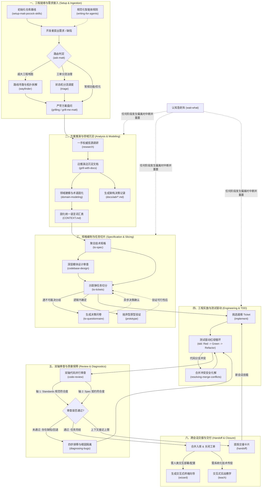

# Matt Pocock 工业级工程技能套件全景导读

| 属性 | 详情 |
| :--- | :--- |
| **文档类型** | 技能套件全景导读 (Overview & Catalog) |
| **当前状态** | 已归档 (Accepted) |
| **作者** | Ateng |
| **创建日期** | 2026-09-22 |
| **关联系统/模块** | Ateng-AI / Skills / Matt Pocock |

---

## 一、套件背景与设计哲学

在现代生成式人工智能（Generative AI）驱动的软件工程实践中，传统“基于单次 Prompt 进行大段代码生成”的范式正面临严峻挑战。随着代码库规模与业务复杂度的增长，开发者频繁遭受**幻觉级联堆叠（Hallucination Compounding）**、**架构隐形腐化（Architecture Erosion）**以及**长上下文记忆衰退（Context Saturation）**的困扰。智能体如果缺乏确定性的工程规则约束，极易生成表面语法正确、实则破坏深层系统一致性的“脆弱代码”。

为了攻克上述工程痛点，著名技术专家 Matt Pocock 提炼了一套**面向工业级 AI Agent 研发的闭环方法论**。这套方法论不仅是一组工具函数的集合，更是将传统高水平软件工程实践（如敏捷垂直切片、领域驱动设计、测试驱动开发、双轴审查）与现代智能体认知架构深度融合的系统化方案。其核心设计哲学由以下三大支柱构成：

### 1. 预先推演与消除幻觉 (Pre-Implementation Grilling)
- **拒绝盲目编码**：智能体在接触业务代码前，必须接受无死角的严苛盘问（Grilling）。通过多轮启发式质询，强迫开发者和智能体厘清边界条件、异常分支、失败回滚与性能预期。
- **高信度溯源验证**：对于技术选型与 API 使用，严格依赖一手权威信源（Primary Sources）进行深入调研，从源头杜绝语言模型基于概率生成的“虚构 API”与过时用法。
- **概念与契约固化**：在编码前提取通用语言（Ubiquitous Language）并写入领域术语表与 ADR（架构决策记录），使方案在落笔编码前就具备数学与逻辑层面的自洽性。

### 2. 状态机驱动与离散化流转 (State Machine Transitions)
- **研发流程状态化**：研发活动被建模为严谨的角色分流状态机。每个 Issue 或 Pull Request 都清晰流转于标准化生命周期标签（如 `needs-triage` -> `ready-for-agent` -> `ready-for-human` -> `wontfix`）。
- **无状态离散演进**：将庞大、模糊的宏观目标切分为单个独立会话可稳定承载的离散微任务。每一次智能体调用都具备明确的前置条件（Preconditions）、输入工件（Inputs）、转化规则（Transitions）与产出物（Artifacts），避免会话过长导致的上下文污染。

### 3. 垂直切片与示踪弹架构 (Vertical Slicing & Tracer Bullets)
- **示踪弹切片（Tracer Bullets）**：彻底摒弃“先建全部数据层、再写全部服务层、最后拼前端”的传统水平摊大饼模式，采用端到端穿透的垂直切片任务单。每个任务都是一颗贯穿全链路的示踪弹，能够独立构建、独立运行并立即交付验证。
- **深层模块隔离（Deep Modules）**：遵从 John Ousterhout 的软件设计哲学，鼓励构建“薄接口、厚实现（Thin Interface, Deep Module）”的深层模块。智能体只暴露极简的外部调用契约，将不可避免的实现复杂度安全封锁在模块内部，显著提升系统的可测试性与后续智能体维护效率。

> [!IMPORTANT]
> **工业级开发铁律**：永远不要在未达成 Spec 共识前编写业务逻辑；永远不要在没有失败测试（Red Test）的前提下添加功能代码；永远不要让单个智能体会话跨越超过其有效注意力窗口的工程跨度。

---

## 二、25 个技能全景分类矩阵

Matt Pocock 技能套件共收录 **25 个高内聚、专精化** 的智能体技能，全面覆盖现代软件开发生命周期的每一个关键跃迁点。以下为套件技能全景矩阵：

| 序号 | 技能名称 (Slug) | 中文角色定位 | 所属阶段 | 一句话核心价值 |
| :---: | :--- | :--- | :--- | :--- |
| 1 | `setup-matt-pocock-skills` | 工程基线初始化专员 | 环境与基础设施 | 自动化配置代码库的 Issue Tracker、分流标签字典与领域文档架构基线。 |
| 2 | `writing-for-agents` | 智能体文档规范师 | 环境与基础设施 | 按照高可解析度与低歧义标准，编撰面向 AI 调用的规则、Prompt 与技能定义文件。 |
| 3 | `grilling` | 方案压力测试盘问官 | 需求推演与方案规划 | 通过无情、密集的连续追问，暴露并消灭设计草案中的隐藏假设与技术盲区。 |
| 4 | `grill-me-matt` | 深度访谈推演官 | 需求推演与方案规划 | 采用苏格拉底式互动访谈，逐步挖掘、收敛并打磨复杂功能设计的细节边界。 |
| 5 | `grill-with-docs` | 边盘问边文档架构师 | 需求推演与方案规划 | 在高强度推演过程中同步沉淀生产级 ADR 架构决策记录与业务术语词汇表。 |
| 6 | `research` | 权威信源溯源研究员 | 需求推演与方案规划 | 穿透至官方一手文档与代码仓库进行技术验证，产出高信度研究报告。 |
| 7 | `domain-modeling` | 领域建模与统一语言专家 | 需求推演与方案规划 | 梳理系统核心实体与关系，确立全团队统一语言（Ubiquitous Language）与边界上下文。 |
| 8 | `to-spec` | 技术规格综合提炼官 | 需求推演与方案规划 | 将散落的方案讨论与推演成果一键聚合为标准结构化 Spec，并发布至 Issue 跟踪器。 |
| 9 | `to-tickets` | 示踪弹任务切分编排员 | 需求推演与方案规划 | 将 Spec 拆解为具有 DAG 依赖图谱的垂直示踪弹 Ticket 集合，清晰声明阻塞边界。 |
| 10 | `to-questionnaire` | 决策问卷生成助手 | 需求推演与方案规划 | 将无法在单点完成的技术裁决转化为结构化问卷，便于异步向利益相关者征询意见。 |
| 11 | `wayfinder` | 宏大工程拓扑寻路向导 | 需求推演与方案规划 | 将超大跨度工程绘制为决策票据拓扑地图，指引团队按依赖顺序逐个攻克破局。 |
| 12 | `codebase-design` | 深层模块设计导师 | 架构设计与原型验证 | 提供深层模块设计词汇表与评估准则，指导接口最小化与逻辑深层化设计。 |
| 13 | `prototype` | 抛弃型原型探索师 | 架构设计与原型验证 | 低成本构建实验性验证原型，快速验证状态机模型、复杂算法或 UI 交互的可行性。 |
| 14 | `improve-codebase-architecture` | 架构深层化机遇扫描仪 | 架构设计与原型验证 | 深度扫描代码库中的架构浅层化坏味道，输出交互式 HTML 诊断报告并启动重构推演。 |
| 15 | `implement` | 任务落地实施执行者 | 工程编码与测试驱动 | 严格对照已裁决的 Spec 与任务清单，实施精确的代码改动并完成闭环交付。 |
| 16 | `tdd` | 测试驱动开发领航员 | 工程编码与测试驱动 | 贯彻红-绿-重构（Red-Green-Refactor）铁律，先确立失败测试再编写生产代码。 |
| 17 | `resolving-merge-conflicts` | 分支合并冲突调解员 | 工程编码与测试驱动 | 深入解析多分支变更意图与语义差异，安全、干净地消解 Git 衍合与合并冲突。 |
| 18 | `code-review` | 双轴代码质量审查官 | 质量把控与排障审查 | 启动并行子智能体，沿“规范轴（Standards）”与“需求轴（Spec）”展开并排深度评审。 |
| 19 | `diagnosing-bugs` | 疑难故障四步诊断侦探 | 质量把控与排障审查 | 运用科学排障循环（复现、假设、检测、隔离），严禁盲猜盲改，快速定位根因。 |
| 20 | `triage` | 工单与 PR 分流调度官 | 质量把控与排障审查 | 驱动 Issue 按照标准五角色标签流转状态机演进，确保所有待办就绪且责任到人。 |
| 21 | `ask-matt` | 技能路由智能调度总管 | 协作协同与交互辅助 | 分析用户当前工程上下文与困境，精准路由匹配最佳技能与协同工作流。 |
| 22 | `handoff` | 跨会话状态无缝交接官 | 协作协同与交互辅助 | 将当前长会话状态、未决分歧与下一步行动高保真提炼为交接卡片，供后续会话继承。 |
| 23 | `teach` | 交互式技术实战导师 | 协作协同与交互辅助 | 在当前工程环境内采用渐进引导式教学法，手把手带领开发者掌握新概念或工具栈。 |
| 24 | `wait-what` | 认知偏离紧急纠偏器 | 协作协同与交互辅助 | 当智能体理解出现严重偏差时紧急叫停，重置对话节奏并重新对齐业务意图。 |
| 25 | `wizard` | 人类独占操作向导生成器 | 协作协同与交互辅助 | 针对仅限人类完成的高敏感/交互操作（如配置密钥、云平台审核），生成交互式执行向导。 |

---

## 三、智能体全生命周期闭环流程图

在工业级研发流程中，25 个技能并非孤立存在，而是形成严丝合缝的闭环流水线。下图展示了一个需求从最初模糊概念到最终合并归档的全生命周期流转机制：



> [!NOTE]
> **流程特征解析**：
> 1. **双向反馈环（Closed Loop）**：若在审查阶段（`code-review`）发现回归问题，不会随意修补，而是触发 `diagnosing-bugs` 形成复现用例后交回 `tdd` 修复，确保测试覆盖率持续提升。
> 2. **认知熔断器（Cognitive Breaker）**：任何执行阶段若发现智能体偏离初始设计目标，可通过 `wait-what` 瞬间刹车并回退，杜绝沉没成本累积。

---

## 四、基于工作场景的技能速查路由表

当开发者或团队在实际研发中面临不同场景诉求时，无需生记 25 个技能，可对照下表直达最佳调用序列：

| 研发场景 | 痛点与目标 | 推荐技能调用链路 | 关键产出与里程碑 |
| :--- | :--- | :--- | :--- |
| **大型特性从 0 到 1 开发** | 业务逻辑盘根错节，涉及多个底层系统交互，极易发生架构腐化与推倒重来。 | `grill-with-docs`<br/>⬇️ `domain-modeling`<br/>⬇️ `to-spec`<br/>⬇️ `to-tickets`<br/>⬇️ `implement`<br/>⬇️ `code-review` | • 产出 1 篇以上系统 ADR 与统一语言词汇表<br/>• 在 Issue Tracker 建立具备阻塞关系的示踪弹工单拓扑<br/>• 双轴审查报告确保 100% 契约满足度 |
| **超大工程重构与技术换代** | 工程规模超出一个会话窗口承载极限，技术债务与隐式耦合难以梳理。 | `wayfinder`<br/>⬇️ `improve-codebase-architecture`<br/>⬇️ `codebase-design`<br/>⬇️ `to-tickets`<br/>⬇️ `handoff` | • 输出系统级深层架构改进 HTML 报告<br/>• 将巨型重构拆解为独立演进的子路线图地图<br/>• 跨多个智能体会话接力推进 |
| **紧急排查线上故障 / 性能退化** | 系统报错或吞吐量骤降，开发者倾向于“试探性改代码”，容易引发连带灾难。 | `diagnosing-bugs`<br/>⬇️ `tdd`<br/>⬇️ `code-review` | • 锁定最小确定性复现步骤与失败单测<br/>• 形成假设-测试-隔离的排障日志<br/>• 编写针对性修复并通过双轴审查 |
| **多分支合并冲突严重** | 长期特性分支合并产生大量冲突，涉及业务意图交叉，手工合码容易遗漏逻辑。 | `resolving-merge-conflicts`<br/>⬇️ `code-review` | • 理清两端变更的真实业务诉求<br/>• 产出清晰干净的冲突解决方案与审查比对 |
| **方案陷入僵局或需外部确认** | 团队对技术选型或业务边界存在分歧，智能体无法代替人类做商业决策。 | `to-questionnaire`<br/>⬇️ `prototype` | • 生成清晰简明的决策选项调查问卷<br/>• 构建极简可丢弃验证原型辅助团队决策 |
| **上下文饱和或跨班次交接** | 当前会话消息过多导致回复质量下降，或需转交他人/新会话继续推进。 | `handoff`<br/>⬇️ （新会话）`implement` | • 提炼高密度的上下文压缩交接卡片<br/>• 零损耗还原现场并实现无缝续写 |
| **涉及敏感凭据与人工云平台配置** | 部署或配置依赖开发者个人生产凭据、短信验证码或云控制台手工点击。 | `wizard` | • 自动化生成交互式 Bash/PowerShell 执行脚本<br/>• 引导开发者逐步完成手工操作且不泄露凭据 |
| **面对新系统或生疏技术栈** | 开发者需要快速理解某模块设计理念或掌握特定技术框架的正确姿势。 | `teach` | • 结合当前工作区实际代码展开交互式启发式带教<br/>• 避免纯理论灌输，边教边练 |
| **不确定该用什么技能** | 遇到研发疑难，不知如何启动智能体工程工作流。 | `ask-matt` | • 智能体根据上下文自动推荐最佳技能与切入姿势 |

> [!TIP]
> 在任何场景执行中，如果智能体给出的答复完全偏离重点或出现胡言乱语，请直接使用 `/wait-what` 命令，强制其暂停并重新陈述意图。

---

## 五、子专题文档快速跳转指南

为了便于深度查阅具体技能的详细执行协议、Prompt 模版、参数契约与实战案例，全套导读已细化为以下五个专业子专题页面：

```
                              d:\My\dev\Ateng-AI\skills\mattpocock\
                                                │
         ┌──────────────────┬───────────────────┼───────────────────┬──────────────────┐
         ▼                  ▼                   ▼                   ▼                  ▼
    [planning]        [engineering]      [review-quality]    [collaboration]        [setup]
  需求推演与规划      架构设计与工程实施    审查把控与质量排障    跨会话协同与向导    工程基线与配置
```

### 1. [需求推演与方案规划 (Planning & Inception)](planning.md)
- **专题职责**：将模糊的初始需求转化为坚固如磐石的技术规格与切片工单。
- **涵盖技能**：`grilling`, `grill-me-matt`, `grill-with-docs`, `research`, `domain-modeling`, `to-spec`, `to-tickets`, `to-questionnaire`, `wayfinder`。
- **重点内容**：苏格拉底式追问技巧、一手文献调研准则、统一语言表与 ADR 自动化模版、Tracer-Bullet 任务图谱拆分标准。

### 2. [架构设计与工程编码 (Architecture & Engineering)](engineering.md)
- **专题职责**：落实深层模块化设计哲学，以严格的 TDD 节奏推进高质量代码编写。
- **涵盖技能**：`codebase-design`, `prototype`, `implement`, `tdd`, `improve-codebase-architecture`, `resolving-merge-conflicts`。
- **重点内容**：深层模块（Deep Module）设计量化评估、红绿重构执行循环、抛弃型原型探索、Git 语义级冲突安全化解。

### 3. [质量把控与排障审查 (Review, Quality & Triage)](review-quality.md)
- **专题职责**：构建独立于编写过程的严格质量防线，科学诊断疑难杂症与规范工单流转。
- **涵盖技能**：`code-review`, `diagnosing-bugs`, `triage`。
- **重点内容**：并行子智能体双轴审查机制（Standards 轴 vs Spec 轴）、四阶段科学排障法（复现/假设/检测/隔离）、五状态工单分流机。

### 4. [协同交接与辅助工具 (Collaboration & Auxiliary)](collaboration.md)
- **专题职责**：打通长周期研发中的上下文继承障碍，保障人机顺畅协作与渐进成长。
- **涵盖技能**：`ask-matt`, `handoff`, `teach`, `wait-what`, `wizard`。
- **重点内容**：技能全景路由表算法、上下文压缩与交接卡片规范、认知刹车机制、人机边界保护向导。

### 5. [工程初始化与配置规范 (Setup & Baseline)](setup.md)
- **专题职责**：定义项目集成 Matt Pocock 技能套件的前置约束与基础设施配置。
- **涵盖技能**：`setup-matt-pocock-skills`, `writing-for-agents`。
- **重点内容**：GitHub CLI（`gh`）工单系统打通、五大标准角色标签（Triage Labels）创建、单上下文架构与领域文档目录标准。
