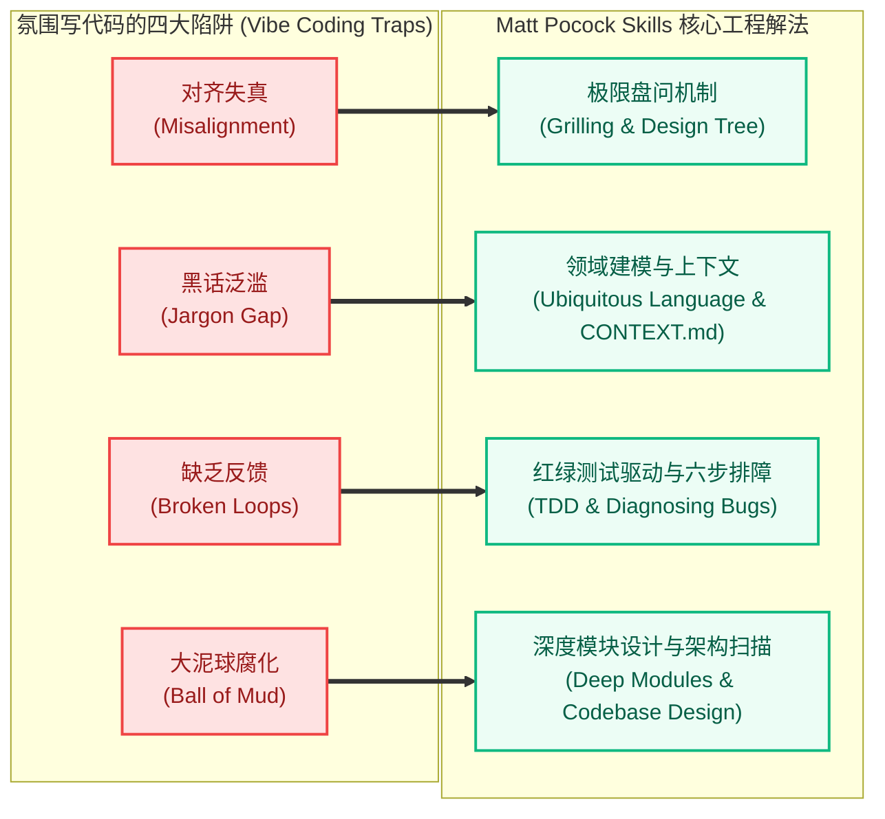
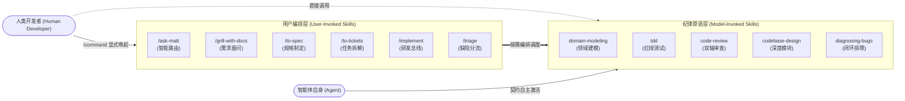
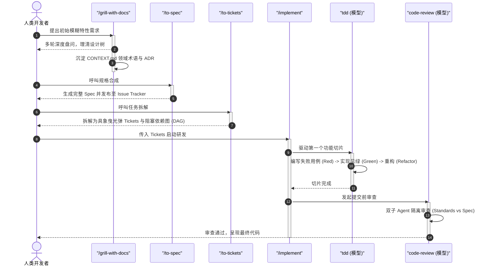
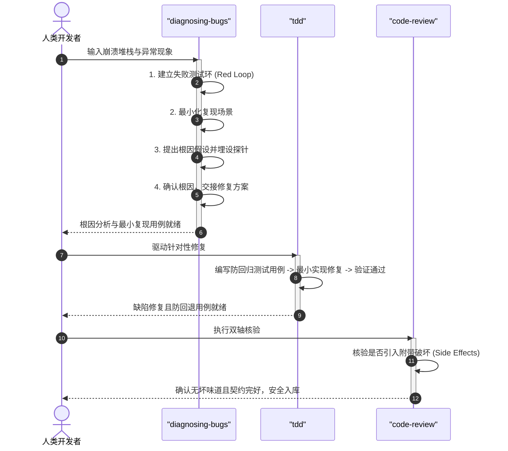

# Matt Pocock Skills 全景导读与快速入门指南

| 属性 | 详情 |
| :--- | :--- |
| **文档类型** | 全景导读 / 技术指南 |
| **当前状态** | 已归档 (Accepted) |
| **作者** | Ateng |
| **创建日期** | 2026-09-23 |
| **关联系统/模块** | Matt Pocock Skills / Index |

---

## 1. 真实软件工程的范式转移 (Paradigm Shift)

随着大语言模型（LLM）在软件研发领域的深度渗透，生成代码的门槛被大幅拉低。然而，以无序提示、黑盒全自动生成为代表的“氛围写代码 (Vibe Coding)”正在快速撞上工程天花板。Matt Pocock 提出的 Agent Skills 体系，正是为了将主流软件工程数十年来沉淀的核心纪律引入 AI 辅助研发，推动智能体协作回归严谨的“真实软件工程 (Real Engineering)”。

### 1.1 氛围写代码 (Vibe Coding) 的四大失败陷阱

在缺乏严密工程契约与流程约束的环境中，开发者与智能体协作时普遍面临以下四种致命缺陷：

1. **认知失真与对齐失效 (Misalignment)**：
   - **痛点现象**：开发者给出一两句简要需求，Agent 便直接生成数百行代码。开发者满怀期待地检阅，却发现 Agent 理解的方向南辕北辙。
   - **工程根源**：人类往往在需求初期存在大量隐含假设，而未经“盘问对齐”的 Agent 会以概率最大的通用实现填补空白，导致根本意图错位。
2. **黑话泛滥与上下文失焦 (Jargon Gap & Verbosity)**：
   - **痛点现象**：Agent 缺乏对具体业务领域的精准认知，为了描述一个简单的概念往往耗费 20 个以上的泛化词汇，且在多轮对话中随意切换同义词。
   - **工程根源**：缺乏领域统一语言（Ubiquitous Language）与明确的反向词汇清单，不仅造成巨大的 Token 浪费，还会导致关键业务约束被歧义稀释。
3. **反馈断裂与缺陷堆积 (Broken Feedback Loops)**：
   - **痛点现象**：Agent 声称“已修复 Bug 并完成功能”，但代码在实际运行时抛出大量运行时异常，甚至破坏现有既有逻辑。
   - **工程根源**：研发过程缺乏自动化的反馈闭环，未落实红绿测试驱动（TDD），Agent 依靠幻觉在盲飞状态下写代码。
4. **代码腐化与大泥球架构 (Ball of Mud & Architecture Erosion)**：
   - **痛点现象**：随着 AI 生成代码量的激增，代码库的复杂度和熵值呈指数级增长，模块间高度耦合、接口庞大泄漏，维护成本失控。
   - **工程根源**：缺乏对代码设计的持续守护，未遵循“深度模块 (Deep Modules)”与信息隐藏原则，盲目追求局部功能的堆砌。

### 1.2 Matt Pocock Skills 的设计哲学与核心解法

Matt Pocock Skills 摒弃了由单一笨重框架接管一切的黑盒思路，确立了以下四项核心设计哲学：

- **小巧可组合 (Small, Easy to Adapt & Composable)**：每个 Skill 均保持高内聚与单一职责，不绑架整体工作流。开发者可按需自由组合，适配任何主流模型。
- **保留人类控制权 (Human in the Driver's Seat)**：严禁 Agent 擅自进行不可逆决策。在关键接缝（Seam）与分支节点，强制引入人机对齐与显式确认机制。
- **倡导深度模块 (Deep Modules over Shallow Modules)**：遵循 John Ousterhout 在《软件设计哲学》中的核心理念，引导 Agent 构建“简单精炼接口、强大丰满实现”的高质量工程架构。
- **严格测试驱动 (Strict Test-Driven Development)**：在动手编写生产代码前，必须先建立能稳定复现失败的红灯测试，借助客观反馈速度作为研发的真实安全边界。



---

## 2. Skills 全景矩阵与分类全景 (The Complete Matrix)

### 2.1 双轴调用分类模型 (User-Invoked vs Model-Invoked)

Matt Pocock Skills 遵循清晰的调用权责隔离原则，将所有技能严格划分为两大阵营：

1. **用户显式唤起技能 (User-Invoked Skills)**：
   - **定位**：流程编排者（Orchestrator）。
   - **触发规则**：只能由人类开发者通过斜杠命令（如 `/grill-with-docs`、`/to-spec`、`/implement`）显式调用，智能体**严禁擅自主动调用**。
   - **职责**：负责管理长流程上下文、推进多轮用户对话、驱动下游纪律原语，并在关键节点停下等待确认。
2. **模型自主调用技能 (Model-Invoked Skills)**：
   - **定位**：工程纪律与复用原语（Discipline Primitives）。
   - **触发规则**：既可由人类在特定场景下直接输入命令调用，亦可在满足意图契约时由 Agent 在后台自主激活。
   - **职责**：执行特定的工程刚性规约（如 TDD 测试循环、深入调研、并行双轴代码审查）。

> [!IMPORTANT]
> **单向依赖红线 (Strict Dependency Ceiling)**：
> 用户显式唤起技能（编排者）可以调用模型自主技能（纪律原语），但用户显式技能**严禁相互嵌套调用**；模型自主技能之间保持原子独立，杜绝形成递归调用死锁。



### 2.2 25 个 Skills 完整属性速查矩阵

整个技能套件共包含 **25 个专业技能**，分为工程类 (Engineering) 与效能类 (Productivity)：

| 序号 | 技能标识符 (Skill Name) | 调用轴 | 所属分类 | 核心输入契约 | 核心交付产出 | 职责定位简述 |
| :---: | :--- | :---: | :---: | :--- | :--- | :--- |
| 1 | `ask-matt` | User | 工程 | 模糊诉求/工作流疑问 | 推荐的最佳技能与路径 | 技能路由器，帮助开发者快速研判调用哪个技能 |
| 2 | `setup-matt-pocock-skills` | User | 工程 | 仓库当前环境与远端 | `docs/agents/` 配置文件 | 初始化项目级基础设施契约（跟踪器、标签、文档） |
| 3 | `grill-with-docs` | User | 工程 | 初始设计想法/变更意图 | `CONTEXT.md` / ADR 决策记录 | 带领域建模与架构决策记录产出的深度盘问对齐 |
| 4 | `grill-me` | User | 效能 | 业务想法/计划草案 | 收敛的设计树与明确结论 | 纯文本与业务逻辑极限盘问（不生成代码资产） |
| 5 | `grilling` | Model | 效能 | 待研判方案或问题分支 | 澄清提问与决策分支收敛 | 所有盘问技能共享的核心交互与设计树收敛底座 |
| 6 | `domain-modeling` | Model | 工程 | 业务对话/术语演进 | `CONTEXT.md` 词汇更新 | 提取领域统一语言，建立反义词列表与场景压测 |
| 7 | `codebase-design` | Model | 工程 | 模块接口/重构代码段 | 深度模块评估与接缝定义 | 衡量接口深度，指导信息隐藏与良好架构接缝设计 |
| 8 | `improve-codebase-architecture` | User | 工程 | 目标代码库上下文 | 交互式 HTML 架构体检报告 | 扫描代码库浅模块与加深机会，并引导重构盘问 |
| 9 | `prototype` | Model | 工程 | 待验证的状态或 UI 假设 | 单文件 HTML / 激进 UI 路由 | 构建高效率抛弃型原型，快速验证状态逻辑与交互 |
| 10 | `to-spec` | User | 工程 | 当前会话形成的成熟方案 | Issue Tracker 上的 Spec 文档 | 无需额外面试，将当前上下文直接提炼为标准规格书 |
| 11 | `to-tickets` | User | 工程 | 方案设计或 Spec 文档 | 曳光弹 Tickets 及其阻塞依赖 | 将大任务拆解为具象可验证、带 DAG 关系的曳光弹票据 |
| 12 | `wayfinder` | User | 工程 | 跨越单会话的超大型项目 | 决策地图 `wayfinder:map` | 面对迷雾工程，生成决策树票据并支持跨会话逐一攻克 |
| 13 | `triage` | User | 工程 | Issue 列表或缺陷清单 | 标签状态机变更与指派 | 按照五角色标准模型分流 Issues 并补充缺失上下文 |
| 14 | `implement` | User | 工程 | Spec 或一组 Tickets | 可工作的代码与完备测试 | 研发总线：驱动 TDD 实现功能，并在提交前触发审查 |
| 15 | `tdd` | Model | 工程 | 功能切片或缺陷复现需求 | 红绿测试用例与实现代码 | 严谨红绿重构测试循环，杜绝无断言与脆弱测试用例 |
| 16 | `diagnosing-bugs` | Model | 工程 | 报错堆栈/偶发缺陷报告 | 最小复现场景与根因修复代码 | 拒绝盲猜，通过六阶段严谨闭环定位并修复复杂故障 |
| 17 | `code-review` | Model | 工程 | Git Diff 与基线 Commit | 双轴审查对比报告 | 规范轴 (Standards) 与契约轴 (Spec) 双子 Agent 并行审查 |
| 18 | `resolving-merge-conflicts` | Model | 工程 | 处于冲突状态的代码工作区 | 无冲突的代码与合理解析记录 | 溯源双端真实意图，块级消解 Git 冲突，严禁直接放弃 |
| 19 | `research` | Model | 工程 | 技术调研命题或选型疑问 | 带权威信源引用的技术调研报告 | 派发后台轻量级 Agent 深度挖掘 Tier 1 官方文档依据 |
| 20 | `wizard` | Model | 工程 | 需人类手动操作的基础设施任务 | 交互式引导 Bash 脚本 | 为权限申请、控制台交互等生成防御性引导脚本 |
| 21 | `handoff` | User | 效能 | 当前冗长复杂的排障/研发会话 | 结构化交接 Markdown 文档 | 压缩会话状态并提取未决任务，供接力 Agent 瞬时恢复 |
| 22 | `teach` | User | 效能 | 目标学习主题或技能 | 状态化练习与引导代码 | 以当前工作区为课堂，提供多会话渐进式交互教学 |
| 23 | `to-questionnaire` | User | 效能 | 需要外部决策者拍板的问题 | 面向特定干系人的结构化问卷 | 提炼关键选项与权衡，供异步发给业务方或架构师填写 |
| 24 | `wait-what` | User | 效能 | 产生误解或看不懂的 Agent 输出 | 基于领域大白话的重塑解释 | 当沟通陷入僵局时，依托领域模型用通俗语言重述上下文 |
| 25 | `writing-for-agents` | Model | 效能 | 面向 Agent 的规则或指南需求 | 高信噪比的 `AGENTS.md` / `SKILL.md` | 编写高执行力、低歧义、防漂移的 Agent 交互契约指南 |

---

## 3. 快速上手路线图 (Getting Started & Workflows)

### 3.1 30 秒安装与全局加载基线

Matt Pocock Skills 提供了两种主流分发模式，满足不同开发者的治理偏好：

```bash
# 模式 A: 作为 Claude Code 官方受管插件全局安装（推荐，自动更新）
claude plugins install mattpocock-skills

# 或在会话内直接输入命令
/plugin install mattpocock-skills
```

```bash
# 模式 B: 本地源码化植入（适合需要针对团队深度二开或内网隔离环境）
npx skills@latest add mattpocock/skills
```

> [!TIP]
> 两种安装方式二选一即可。若两者同时安装，会导致每个技能出现重复注册与提示冲突。

### 3.2 典型研发黄金流 (Golden Flows)

在实际工程研发中，技能通常串联成高效流水线运作。以下为最常用的两大标准流水线：

#### 黄金流一：特性开发全周期流水线 (Feature Lifecycle Flow)



#### 黄金流二：线上紧急故障闭环流水线 (Bugfix Flow)



---

## 4. 模块化指南套件导航 (Modular Suite Navigation)

为了帮助开发者系统化掌握各项技能，本使用文档按工程生命周期与实战场景拆分为 7 篇深度专题指南：

| 专题序号 | 文档名称与直达链接 | 核心覆盖技能 | 重点解决问题 |
| :---: | :--- | :--- | :--- |
| **01** | [体系架构、基础设施与初始化配置](01-architecture-and-setup.md) | `setup-matt-pocock-skills`, `ask-matt` | 仓库契约架构、多 Issue Tracker（GitHub / GitLab / Local）适配与全局智能路由 |
| **02** | [需求对齐、极限盘问与深度模块设计](02-alignment-and-design.md) | `grilling`, `grill-with-docs`, `grill-me`, `domain-modeling`, `codebase-design`, `improve-codebase-architecture`, `prototype` | 消除对齐鸿沟、统一语言构建、Ousterhout 深度模块哲学、架构体检扫描与原型验证 |
| **03** | [规范制定、曳光弹任务拆解与分流管理](03-planning-and-triage.md) | `to-spec`, `to-tickets`, `wayfinder`, `triage` | 免面试规格合成、曳光弹切片与 DAG 阻塞依赖、超大会话战略寻路罗盘及五角色分流 |
| **04** | [工程研发、红绿测试与双轴审查](04-engineering-execution-and-quality.md) | `implement`, `tdd`, `diagnosing-bugs`, `code-review`, `resolving-merge-conflicts` | 研发执行总线、红-绿-重构刚性铁律、六阶段科学排障、双子 Agent 隔离审查及意图级 Git 冲突消解 |
| **05** | [深度调研、自动化向导与运维支撑](05-research-and-devops.md) | `research`, `wizard` | 后台高信任度深度技术调研（Tier 1 信源）与人机运维边界下的防错交互向导脚本 |
| **06** | [效能协作、教学传承与 Agent 文档编写](06-productivity-and-collaboration.md) | `handoff`, `to-questionnaire`, `wait-what`, `teach`, `writing-for-agents` | 跨会话上下文压缩交接、外部决策异步问卷、语境重塑、状态化互动教学及面向 Agent 的文档工程 |
| **07** | [多场景组合协同与端到端实战](07-composite-workflows-and-practical-scenarios.md) | 全套 25 个 Skills（涵盖 20 大跨界实战场景） | 25 个技能全场景组合协同、20 大实战场景（覆盖软件研发、架构重构、排障熔断、商业产品、SRE 应急、合规审计、AI 智能体评测、数仓治理、网络安全、物联网、金融量化风控、3D 渲染、研发效能度量、医疗临床数据质控等）、端到端综合案例与防翻车全景指南 |

---

## 5. 权威参考资料与事实依据 (References & Grounding)

### 5.1 核心依赖与引用信源

- [[Tier 1]] [Matt Pocock Skills 官方文档与发布仓库](https://skills.sh/mattpocock/skills) - 全套技能权威定义与使用契约 (核验日期: 2026-09-23)
- [[Tier 1]] [GitHub 官方源码仓库 (mattpocock/skills)](https://github.com/mattpocock/skills) - v1.2.3 规范与技能拓扑实现 (核验日期: 2026-09-23)
- [[Tier 1]] [Claude Code 插件体系官方标准](https://code.claude.com/docs/en/plugins) - 插件安装规范与生命周期 (核验日期: 2026-09-23)
- [[Tier 2]] [A Philosophy of Software Design (John Ousterhout)](https://web.stanford.edu/~ouster/cgi-bin/book.php) - 深度模块理论与信息隐藏设计基础 (核验日期: 2026-09-23)

### 5.2 事实核查矩阵

| 核查对象 (组件/配置/版本) | 官方基准事实 (Ground Truth) | 对应官方依据 (Tier 1 链接) | 状态 |
| :--- | :--- | :--- | :--- |
| Matt Pocock Skills 当前版本 | 插件规范版本为 `1.2.3`，涵盖 25 个 Skills | [plugin.json](https://github.com/mattpocock/skills/blob/main/plugin.json) | 已核实真实有效 |
| 双轴调用模型 (User vs Model) | User 技能仅响应显式输入；Model 技能具备独立工程纪律可自主调用 | [skills/README.md](https://github.com/mattpocock/skills/blob/main/README.md) | 已核实真实有效 |
| 仓库自包含契约路径 | 统一初始化在项目 `docs/agents/` 下，实现项目零代码侵入 | [setup-matt-pocock-skills.md](https://github.com/mattpocock/skills/tree/main/skills/setup-matt-pocock-skills) | 已核实真实有效 |
