# 需求推演与任务规划专题指南 (Requirements Elicitation & Task Planning)

| 属性 | 详情 |
| :--- | :--- |
| **文档类型** | 技术专题指南 (Technical Guide) |
| **当前状态** | 已归档 (Accepted) |
| **作者** | Ateng |
| **创建日期** | 2026-09-22 |
| **关联系统/模块** | Ateng-AI / Skills / Matt Pocock / Planning |

---

## Executive Summary

在传统的人工与大语言模型（LLM）协同研发过程中，软件工程常常面临严重的认知不对称与执行偏差：
1. **隐性假设陷阱**：开发者与智能体各自暗含不同的边界假设，导致代码落盘后发现架构方向完全跑偏。
2. **术语概念漂移**：同一个业务名词（如“订单”、“用户”、“账户”）在对话中含义模糊、随处变动，引发领域模型坍塌。
3. **任务粒度失衡**：直接抛给智能体一个宏大的史诗任务，导致单次会话 Token 上下文超载（Context Exhaustion）或代码改动“横向切片”，破坏构建状态。
4. **长周期断片失忆**：跨会话、超大复杂工程缺乏自适应路线图（Roadmap），智能体在多次会话重启后迷失全局方向。

Matt Pocock 技能套件的**需求推演与任务规划（Planning）专题**针对上述痼疾，构建了一套高确定性、严谨闭环的工程推演方法论体系。该体系由 6 个紧密咬合的核心技能构成，通过**设计树推演（Design Tree）**、**领域统一语言（Ubiquitous Language）**、**轻量架构决策（ADR）**、**纯净规格合成（No-interview Spec Synthesis）**、**示踪弹任务拆解（Tracer-bullet Tickets）**以及**路线图导航与战争迷雾系统（Wayfinder）**，将模糊、宏大、高风险的需求逐步收敛为清晰、具备依赖拓扑、单会话可落地的高质量工程任务。

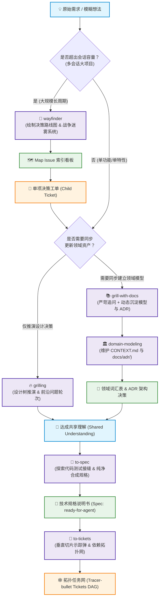

---

## 1. grilling —— 深度追问与设计树推演

### 1.1 定位与核心价值

`grilling` 是 Matt Pocock 规划套件的“智力先锋”，其核心定位是**通过结构化、无情的高频多轮采访，彻底消灭未明说的心智假设**。
- **业务价值**：防止在需求分析阶段由智能体随意替业务方做主，在代码落盘前通过低成本问答暴露潜在业务冲突、边缘工况与交互歧义。
- **工程价值**：采用**设计树（Design Tree）**与**问题前沿（Frontier）**数学模型，将网状的架构决策转化为严密的依赖推演算法，保证每一轮提问互不依赖、并行作答，彻底告别零散、低效的单发式追问。

### 1.2 触发场景与调用命令

#### 触发时机
- 开发者产生了一个初步的技术设计方案，但感觉细节尚未完全闭环。
- 即将开展复杂重构，需要明确向后兼容性、故障降级路径及数据迁移策略。
- 启动新特性开发前，消除“既可以这样做，也可以那样做”的技术分歧。

#### 调用格式
```bash
# 1. 基础调用（基于当前会话上下文直接展开推演）
/grilling

# 2. 携带特定议题启动专项追问
/grilling "重构用户认证模块，由单体 Session 迁移至分布式双 Token 架构"

# 3. 针对特定文件或已有设计方案启动追问
/grilling docs/proposals/distributed-cache-plan.md
```

> [!TIP] 传参技巧
> 当把已有草案路径作为参数传给 `/grilling` 时，智能体不会要求你重复陈述内容，而是会先静默阅读草案，直接计算出该草案尚未提及的第一轮前沿问题。

### 1.3 底层运行机制与状态机

#### 设计树与前沿算法原理
1. **设计树（Design Tree）**：将技术方案建模为一棵决策树。顶层决策衍生次级决策，次级决策继续衍生边缘工况分支。
2. **前沿（Frontier）计算**：所有“前置依赖条件已被用户完全确认”的待决问题集合称为前沿。智能体**严禁在一次轮次中提出相互依赖的问题**（例如：在未确认使用 Redis 还是数据库前，绝不提问 Redis 集群的哨兵配置）。
3. **事实与决策分流**：
   - **事实探针（Fact-finding）**：属于智能体职责，严禁向用户提问。如需确认“当前依赖版本”、“现有数据库索引结构”，智能体派发后台只读子智能体检索环境。
   - **架构决策（Decisions）**：属于用户职责，智能体负责提纲化列出方案选项、利弊并给出明确推荐。
4. **终止判据**：当问题前沿为空（Frontier is empty），所有分支均已到达叶子节点，会话自动达到**共享理解（Shared Understanding）**状态。

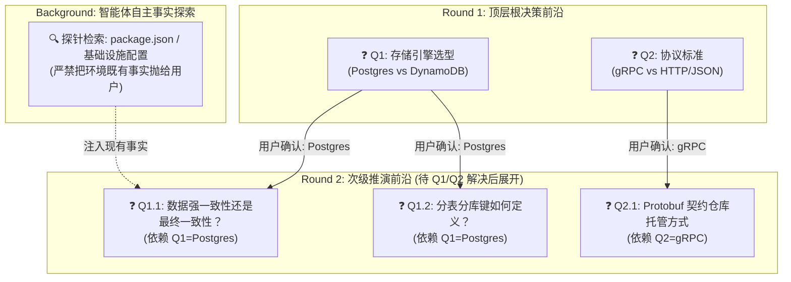

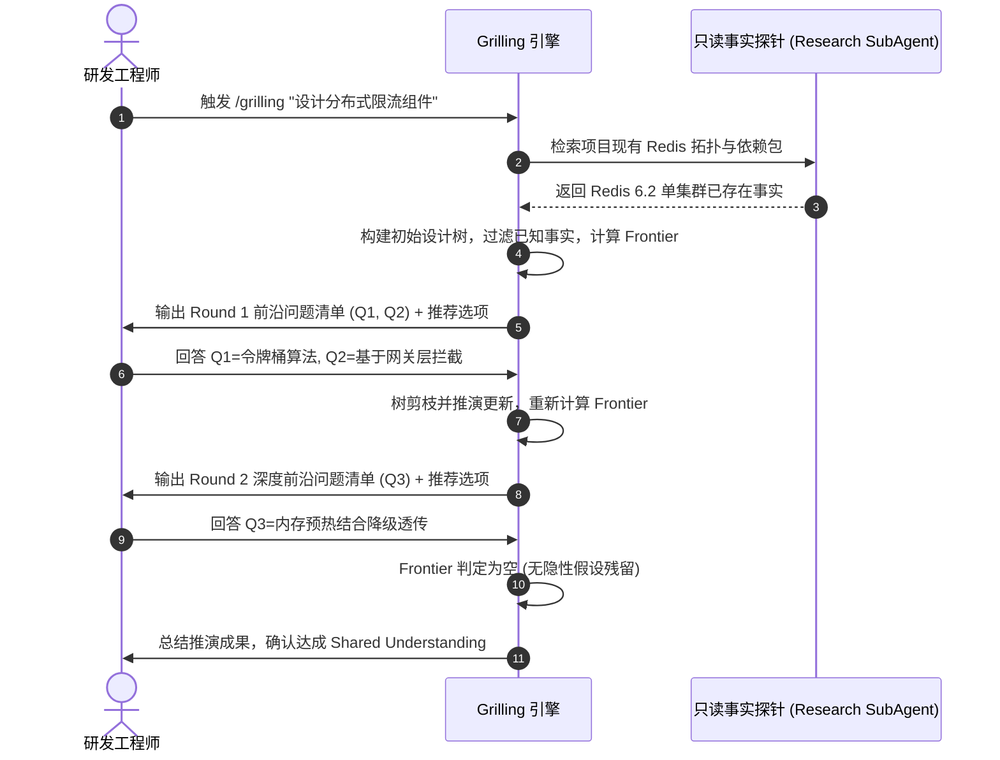

### 1.4 标准交互实战示例

#### 用户 Prompt
```text
/grilling 我们计划在电商结算中心增加一个针对高净值用户的“信用额度后付”能力，允许先提货后扣款。
```

#### Agent 回复样例（首轮追问）
```markdown
基于您的需求，我已检索了工程内现有的支付结算模块 `payment-service`。当前系统仅支持“微信支付”、“支付宝”与“银行卡代扣”同步扣款模式。

为构建“信用额度后付”方案，我们需要解决设计树顶层的核心依赖。以下是 **Round 1** 的前沿问题清单：

❓ **Q1** - **额度授信与风险控制的同步性边界**：
在用户下单支付时刻，系统是同步向风控中心 RPC 请求实时扣减信用额度，还是基于本地缓存额度先发货并由事件流异步扣减？
- A. 强一致性同步 RPC 校验：延迟较高（约 100-200ms），但杜绝超额透支。
- B. 异步最终一致性：本地快照预占，若风控扣减失败触发补偿取消订单。
- C. 混合模式：大额（>¥5000）同步校验，小额（<=¥5000）异步准实时校验。

➡️ **推荐策略**：采用 **A**。结算链路金融属性极强，工程现有架构未建设完备的逆向分布式事务冲正系统，强一致同步调用能以极小架构复杂度杜绝坏账。

---

❓ **Q2** - **多币种结算与汇率锁定策略**：
系统支持境外买家结算。信用额度的基础货币单位是固定按账户注册地单一法币结算，还是支持动态货币额度？
- A. 固定人民币（CNY）基础额度，外币结算时按支付当时汇率折算冻结。
- B. 多币种多账套独立授信，各币种互不挤占。

➡️ **推荐策略**：采用 **A**。现有账户系统主键余额表为单一币种模型，折算冻结对账本改造侵入最小。

请针对上述前沿问题回复您的决策（可直接输入题号及选项，如：`Q1: A, Q2: A`），我将基于您的回复计算下一轮次问题。
```

### 1.5 关键边界与配合技能
- **前置技能**：无强制前置，可独立启动；若需求极为庞大模糊，前置建议为 `wayfinder`。
- **后置技能**：
  - 推演结束后若需要沉淀规范，转入 `to-spec`。
  - 若在追问过程中发现核心术语出现分歧，应无缝融入 `domain-modeling`。
- **边界底线**：
  > [!IMPORTANT] 行为红线
  > - 严禁自问自答：智能体绝不能替用户拍板做决策。
  > - 严禁询问可在代码中探查到的事实（如“你们是用什么 ORM ？”）。
  > - 严禁在 Frontier 为空前擅自落盘业务代码。

---

## 2. grill-with-docs —— 结合领域建模与 ADR 沉淀的严苛追问

### 2.1 定位与核心价值

`grill-with-docs` 是 `grilling` 与 `domain-modeling` 的双核复合装甲。
- **核心定位**：将“无情追问”与“即时架构沉淀”合二为一，**在提问推进的同时动态改写领域词汇表（`CONTEXT.md`）并在满足准则时落盘架构决策记录（ADR）**。
- **业务价值**：彻底解决“会话推演很热烈，会话关闭全忘光”的割裂问题。确保每一轮问答碰撞出的术语收敛与关键技术裁决，在回答生效的瞬间直接转化为持久化受管资产。

### 2.2 触发场景与调用命令

#### 触发时机
- 项目处于从 0 到 1 的核心领域层设计，不仅需要敲定实现，更需要确立团队的统一语言。
- 团队迎来关键技术底座重构，所作决策具有显著的“不可逆性”与“跨模块影响”。

#### 调用格式
```bash
# 1. 针对新领域模型构建启动追问与文档沉淀
/grill-with-docs

# 2. 针对复杂业务线重构启动
/grill-with-docs "梳理仓储中心履约拆单与波次拣选领域模型"
```

> [!NOTE] 自动化行为
> 当调用此命令时，系统会自动将模型调用策略切换为复合执行状态，在每一轮 Frontier 问答闭环后，立即检查是否有新术语定义或高价值 ADR 触发条件。

### 2.3 底层运行机制与状态机

#### 双向驱动状态机
1. **推演前沿展开**：执行 `grilling` 的 Frontier 提问逻辑。
2. **术语捕获器（Term Interceptor）**：在用户应答中，一旦提炼出确切的领域概念，立即以行内（Inline）方式修改当前工作空间的 `CONTEXT.md`。
3. **ADR 评估门禁**：对用户做出的关键技术权衡，严格套用“ADR 铁三角（Hard to reverse / Surprising / Real trade-off）”。只要三项全部命中，立即在 `docs/adr/` 创建递增编号的 ADR 文件。

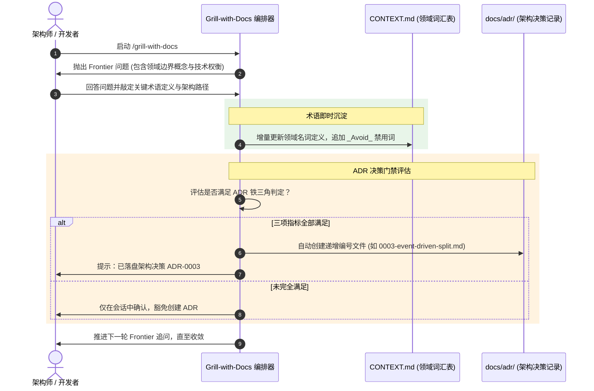

### 2.4 标准交互实战示例

#### 用户 Prompt
```text
/grill-with-docs 我们要重新梳理计费结算中的“发票”逻辑，现在代码里乱七八糟，有人叫 Invoice，有人叫 Bill，还有人叫 Receipt。我们这次要定死：只有履约完成后、客户要求报销才开具有税务效力的电子发票。
```

#### Agent 执行过程与生成的交付物

##### 第一步：Agent 交互响应
```markdown
收到。已感知到您对结算计费领域的统一语言诉求。

### 📝 领域模型即时沉淀
已更新根目录下的 `CONTEXT.md`，锁定核心术语，消除歧义词。

### ❓ Frontier Round 1 追问
围绕开票时机与税务底座对接，我们需要明确以下前沿决策：

❓ **Q1** - **第三方税控接口超时降级与重试机制**：
税控服务提供商（如航天信息）响应迟缓且偶尔发生网络抖动。当开具发票请求超时（>5s）时：
- A. 同步失败拦截：向用户前端抛错，要求稍后在“开票记录”中手动重试。
- B. 异步事务消息队列驱动：接口快速响应“开票处理中”，由后台消费组按指数退避重试，直至税控接口返回确切成功或终态错误。

➡️ **推荐策略**：采用 **B**。税控属于外部脆弱不可控依赖，异步化削峰能极大提升前台结算体验。

请告知您的决定。
```

##### 第二步：增量沉淀的交付物片段
智能体在磁盘直接生成/更新两个关键文件：

**交付物 1：`CONTEXT.md`（局部更新）**
```markdown
# Billing Context

结算与计费子领域，负责费用核算与税务发票全生命周期管理。

## Language

**Invoice**:
客户在履约完成后申请开具的具备国家法定税务效力的电子发票凭单。
_Avoid_: Bill, Receipt, PaymentRequest, 账单
```

**交付物 2：`docs/adr/0002-async-invoice-generation.md`**
```markdown
# 0002. 采用基于事务消息的异步税控发票开具架构

- **当前状态**：已接受 (Accepted)
- **决策时间**：2026-09-22
- **决策者**：Ateng & 架构委员会

## 上下文与问题陈述
外部税控服务商网络波动剧烈，同步 HTTP 开票平均耗时 2.4 秒，P99 达 7.8 秒，偶发超时直接导致前端结算确认页面假死与重试风暴。

## 决策内容
全面废弃原有同步 HTTP 开票，改为“本地事务写表 + 发送 Transactional Outbox 领域事件 + 后台 MQ 消费重试”的异步解耦架构。

## 决策依据与权衡 (Trade-offs)
1. **难以逆转 (Hard to reverse)**：改变了对外 API 的同步确认契约，前端需要对接轮询/WebSocket 状态推送机制。
2. **缺乏上下文易引起困惑 (Surprising without context)**：新接手开发者可能会疑问为何开票操作不直接返回 PDF 下载地址，而是返回 `202 Accepted`。
3. **真实权衡 (Real trade-off)**：牺牲了极少数场景下的即时出票体验，换取了整个计费中枢系统的吞吐量与故障隔离韧性。
```

### 2.5 关键边界与配合技能
- **前置技能**：适用于已明确进入需求深水区的工程任务。
- **后置技能**：推演与文档沉淀完毕后，直接调用 `to-spec` 将上下文直接转化为正式规格说明书。
- **配合核心**：该技能严格遵守**懒加载创建**（Lazy Creation），在项目尚未需要时绝不预建空目录。

---

## 3. domain-modeling —— 领域模型建模、统一词汇表与 ADR 决策

### 3.1 定位与核心价值

`domain-modeling` 是一项**主动式的软件工程建模规程**。
- **核心定位**：守护软件代码库的领域模型纯洁性。它不是被动地翻看文档，而是在对话、审查与设计过程中，**主动挑战术语冲突、消灭模糊用语、用极限工况推演业务边界，并将不可逆的技术选择沉淀为 ADR**。
- **业务价值**：消灭领域沟通中的“巴别塔效应”，避免因同名异义（Polysemy）或同义异名导致的数据污染与接口误用。
- **工程价值**：严格把控 ADR 的生成门槛，避免文档泛滥，保证 `CONTEXT.md` 永远只包含“业务是什么”，杜绝实现细节（如代码路径、数据表字段名）污染领域模型。

### 3.2 触发场景与调用命令

#### 触发时机
- 发现开发者与产品经理或历史代码在关键概念上存在名称混乱。
- 架构发生重大演进（如引入事件溯源、拆分微服务上下文、更换持久化底层存储）。
- 跨团队协作定义限界上下文（Bounded Context）的边界与交互契约。

#### 调用格式
```bash
# 1. 激活主动领域建模审查与维护
/domain-modeling

# 2. 对特定子领域进行限界上下文建模
/domain-modeling "梳理物流履约 (Fulfillment) 与库存管理 (Inventory) 的交互边界"
```

### 3.3 底层运行机制与状态机

#### 1. 架构拓扑发现机制
该技能首先自动探测工程的上下文拓扑结构：
- **单上下文架构（Single-Context）**：绝大多数项目在根目录仅有单个 `CONTEXT.md` 和 `docs/adr/`。
- **多上下文架构（Multi-Context）**：若根目录下存在 `CONTEXT-MAP.md`，则表明项目属于大型单体仓库（Monorepo）或多子域架构。技能将定位到对应的子模块目录下进行精准更新。

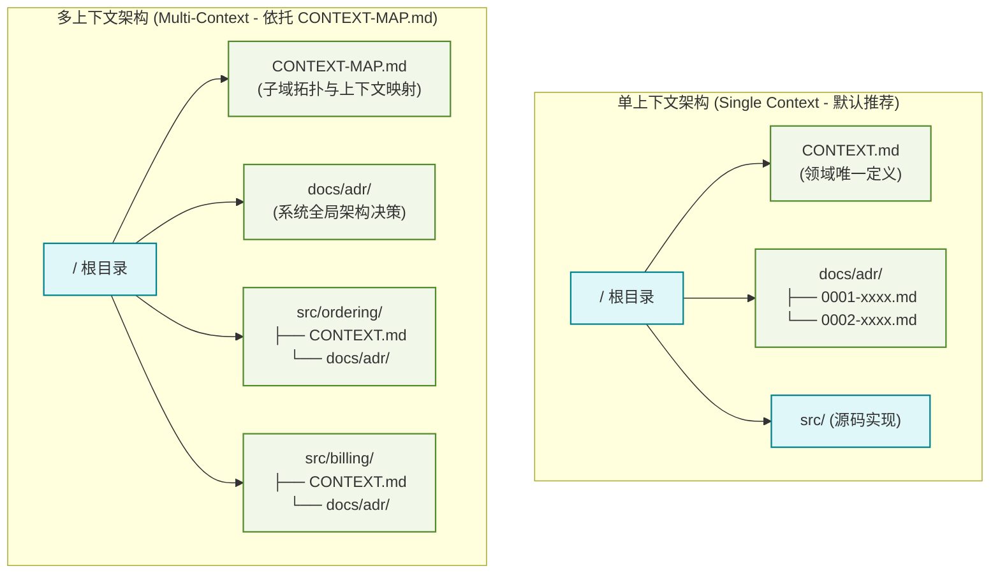

#### 2. 会话中的四项主动挑战机制
- **术语冲突挑战**：当对话中出现的词与 `CONTEXT.md` 违背，立即打断并要求明确：“在您的词汇表中‘取消’指全额退款作废，但您刚才陈述时似乎包含了退货中转，请问具体指哪个？”
- **收敛模糊词汇**：对含糊的泛词（如“用户”、“数据”、“记录”）强制提案精准的规范术语。
- **具体场景施压**：构造严苛的边缘案例考验业务规则（如：“如果订单在出库装车途中用户申请取消，系统状态机如何流转？”）。
- **代码对齐纠偏**：主动拉取现有代码比对：“代码中方法 `cancelOrder()` 会物理删除行项目，但您刚才说需要保留审计痕迹，应以代码为准还是以新规则为准？”

#### 3. ADR 决策铁三角判定流
技能严格遵循 ADR 生成三大黄金法则，只要任何一条不满足，坚决不建 ADR：

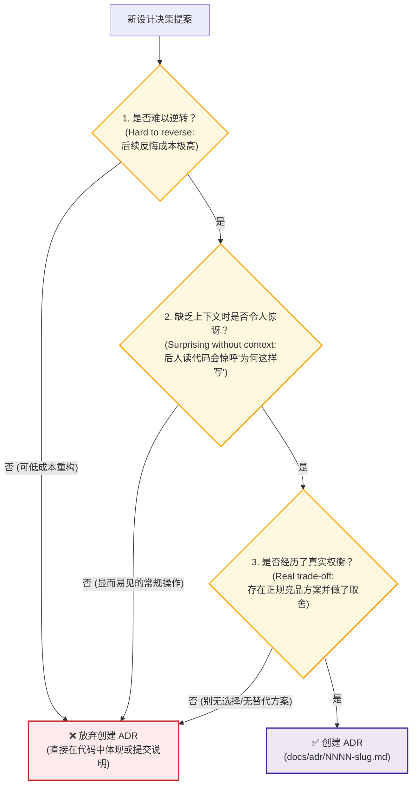

### 3.4 标准交互实战示例

#### CONTEXT.md 规范范本（纯业务定义，绝不掺杂代码与表结构）
```markdown
# Ordering Context

负责电商平台从购物车结算、意向锁定到最终订单生成的生命周期管理。

## Language

**Order**:
买家与平台之间订立的具有法律约束力的购买契约。
_Avoid_: Purchase, Transaction, 交易单

**Fulfillment**:
仓储与物流中心将订单内商品完成出库、分拣、打包与配送的全过程。
_Avoid_: Shipping, Delivery, 发货

**Active Customer**:
过去 90 天内至少发生过一次成功付款订单的已实名认证用户。
_Avoid_: User, Account, 会员
```

> [!WARNING] CONTEXT.md 纯粹性红线
> `CONTEXT.md` 绝不是技术实现草稿本！严禁在此处书写数据库表名（如 `t_order_info`）、接口路由（如 `/api/v1/orders`）或类字段名。它唯一允许存在的内容就是**业务领域的规范语言定义与禁用词清单**。

### 3.5 关键边界与配合技能
- **前置技能**：任何涉及业务术语变动的开发阶段。
- **后置技能**：为 `to-spec` 提供精准的概念输入；为 `code-review` 提供术语合规性审查依据。

---

## 4. to-spec —— 会话共识转换为技术规格说明书

### 4.1 定位与核心价值

`to-spec` 的核心使命是**将当前会话中已经达成的设计共识，快速、纯净地合成为工业级技术规格说明书（Spec）并发布到 Issue 跟踪器**。
- **核心定位**：**纯净合成器（Synthesis Only, No Interview）**。在执行本技能时，智能体**严禁发起新的盘问**，所有事实与决策均从先前的会话记录、探索结果与领域词汇表中抽取。
- **业务价值**：将散落于数十轮聊天记录中的共识提炼固化，形成具有可交付约束的产品与技术契约，作为下游开发实施的唯一真理源。
- **工程价值**：推崇**“最高测试接缝原则（Highest Seam Principle）”**，在撰写规格时率先定义行为验证的切入点，避免后续测试沦为脆弱的 Mock 堆叠。

### 4.2 触发场景与调用命令

#### 触发时机
- 通过 `grilling` 或 `grill-with-docs` 彻底达成共识，问题前沿清空后。
- 复杂特性方案推演完毕，准备切分具体任务工单前。

#### 调用格式
```bash
# 1. 直接将当前会话提炼为规格说明书并发布
/to-spec

# 2. 结合特定原型或参考文档生成
/to-spec "结合刚刚讨论的并发锁定方案，生成发票防重开规格"
```

### 4.3 底层运行机制与状态机

#### 规格合成全流程
1. **静默探索代码库现状**：确认既有模块结构、既有 ADR 规范及领域词汇，不向用户提问。
2. **测试接缝（Test Seams）勘测与敲定**：
   - 识别能够验证该特性的最高外部行为边界（优先复用既有接缝，极力避免横向多点开花）。
   - 核心原则：**全工程最好只有唯一的顶层测试接缝**（如系统外部 API 门面），严禁针对私有内部细节设计测试。
   - 向用户进行单点确认：“我们拟在 `OrderController` 层作为端到端核心测试接缝，是否符合预期？”
3. **结构化模板合成**：严格按照标准模板输出（Problem Statement, Solution, User Stories, Implementation Decisions, Testing Decisions, Out of Scope, Further Notes）。
4. **发布并打标**：直接调用配置的 Issue 跟踪器（如 GitHub Issues），打上 `ready-for-agent` 标签，标明该规格已具备智能体或工程师独立接单能力。

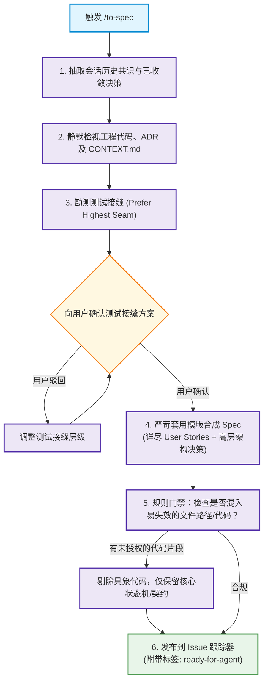

> [!CAUTION] 易失效信息红线 (No Code Path Rule)
> 在撰写 `Implementation Decisions` 时，**严禁书写具体的文件绝对/相对路径或具体方法代码实现**！这类信息极易随着重构迅速失效。
> **唯一例外**：若推演阶段产出了状态机转换规则、类型声明或 Schema 定义，且该精炼片段比纯文本更能无歧义地表达契约，允许内联展示，但必须注明源自原型设计。

### 4.4 标准交互实战示例

#### 发布到 Issue Tracker 的 Spec 真实范本
```markdown
# Spec: 订单结算中心信贷后付支付通道支持

## Problem Statement
当前海外企业采购客户在进行大宗物资采购时，受限于企业网银每日转账限额与审批流延迟，无法在促销锁定周期内完成即时转账，导致大促订单频繁因支付超时被自动取消。

## Solution
在现有支付结算引擎中新增“信用额度后付”专用通道。针对风控评级通过的企业客户，允许其使用预授信额度即时锁定货源并进入履约流，账期到期后统一汇总结算。

## User Stories
1. As an 活跃企业客户, I want 在结算收银台看到“信用后付”选项, so that 我可以在无需即时转账的情况下完成下单。
2. As an 活跃企业客户, I want 当额度不足以支付全额订单时系统给出明确差额提示, so that 我能知晓需要先清偿历史账单或采用组合支付。
3. As a 财务对账人员, I want 系统每日自动生成后付挂账凭单, so that 我能精准掌握应收账款总额并推送到总账系统。
4. As a 风险控制专员, I want 当客户授信状态被冻结时代扣系统立即拒绝新后付请求, so that 企业能免受恶意拖欠风险。
5. As an 运维工程师, I want 外部风控 RPC 调用具备毫秒级熔断机制, so that 第三方故障不会拖垮核心结算收银台。

## Implementation Decisions
- **结算门面解耦**：在支付通道编排层抽象 `CreditPayChannelProvider`，实现标准 `PayChannel` 契约，与现有微信、支付宝通道同级。
- **状态机流转契约**：
  引入明确的挂账支付状态迁移矩阵：
  ```
  [CREATED] ---> [CREDIT_FROZEN] ---> [SETTLED]
                      |
                      +-------------> [SETTLE_FAILED] ---> [REVERSED]
  ```
- **异步对账流**：额度实际扣减采用强一致 RPC，但对账明细记录采用本地事务表持久化后通过定时任务批量向中台归集。
- **数据一致性保证**：若额度预占成功但订单主库写入异常，强制通过分布式调用逆向冲正接口释放额度。

## Testing Decisions
- **测试标准**：秉持黑盒测试理念，仅验证结算通道向外暴露的 HTTP 契约与回调状态，严禁对内部私有辅助类进行单元 Mock。
- **目标测试模块**：`billing-payment-integration-test`。
- **代码库既有先例**：参考 `ApplePayChannelIntegrationTest` 中对于第三方通道返回超时及幂等重放的测试套件。

## Out of Scope
- 个人消费者的消费金融分期支持（白条类业务）。
- 客户在前端自行动态申请调整信贷额度的审批工作流（由风控中台独立系统承载）。

## Further Notes
- 上线前需由 DBA 配合评估日增 50 万条结算流水对归档表空间的影响。
```

### 4.5 关键边界与配合技能
- **前置技能**：`grilling` 或 `grill-with-docs`。
- **后置技能**：生成的 Spec 是 `to-tickets` 的唯一输入；严禁跳过 Spec 直接粗暴切分工单。

---

## 5. to-tickets —— 技术规格切分为具备依赖拓扑的示踪弹任务

### 5.1 定位与核心价值

`to-tickets` 是将技术设计向工程落地的**任务编排器**。
- **核心定位**：将庞大的 Spec 技术规格，切分为若干个由依赖边（Blocking Edges）紧密交织的**示踪弹任务（Tracer-bullet Tickets）**。
- **业务价值**：杜绝“先花一个月写底层数据库，再花一个月写 API，最后一周赶工 UI”的横向堆砌模式。每个示踪弹任务完成后，业务方均能端到端看到一个真实可点击、可验证的闭环切片。
- **工程价值**：严格约束单任务粒度，确保**每个 Ticket 的上下文跨度完全适配单个 100K Token 智能体会话**；并对全库扩散的破坏性改动提供独特的**Expand-Contract（展开-收缩）**宽幅重构支持。

### 5.2 触发场景与调用命令

#### 触发时机
- 技术规格（Spec）已在 Issue Tracker 上发布且打上 `ready-for-agent` 标签。
- 需要将一个包含多层依赖的复杂研发计划拆解给多智能体或研发团队并行推进。

#### 调用格式
```bash
# 1. 直接切分当前会话中的 Spec
/to-tickets

# 2. 传入特定 Issue 编号或路径进行切分
/to-tickets #42
/to-tickets docs/specs/credit-payment-spec.md
```

### 5.3 底层运行机制与状态机

#### 示踪弹垂直切片四原则 (Vertical Slice Rules)
1. **纵向全层贯穿**：每一发“示踪弹”必须自上而下纵向切穿全部架构层（Schema 变更、底层 Service、API 暴露、前端交互组件、集成测试）。坚决反对“只建表”或“只写接口”的水平切片。
2. **端到端独立可演示**：单个 Ticket 合并进入主干后，CI/CD 必须全绿，且具备独立演示和测试闭环能力。
3. **适配单会话上下文**：工作量严格控制在一个全新、无干扰的 100K Token 会话内可以完美构建完毕。
4. **前置重构先行（Prefactoring First）**：奉行 Kent Beck 名言：*“Make the change easy, then make the easy change”*。如果既有架构不好插桩，首个 Ticket 必须是无业务改动的纯前置重构。

#### 宽幅重构异常机制 (Wide Refactors & Expand-Contract)
当重构涉及全库符号改名、基础字段重命名等具有巨大**爆炸半径（Blast Radius）**的改动时，垂直切片会导致大面积构建失败。此时系统自动切换为 **Expand-Contract（展开-收缩）**三阶段机制：

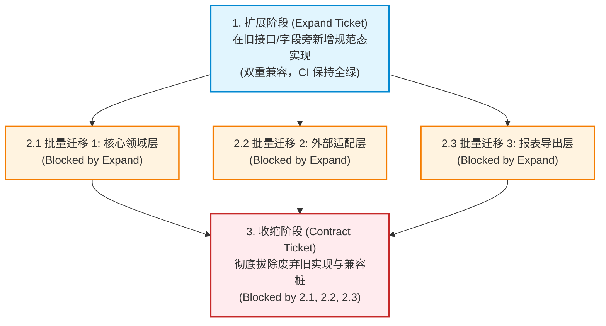

#### 依赖拓扑网与 Quiz 交互提问
在任务入库前，智能体必须以提纲向用户进行 **Quiz 考核与对齐**：
- 粒度是否合适？（太粗还是太细）
- 阻断依赖（Blocked by）是否真实必要？是否存在过度串行化？
- 是否需要进一步拆分或合并？

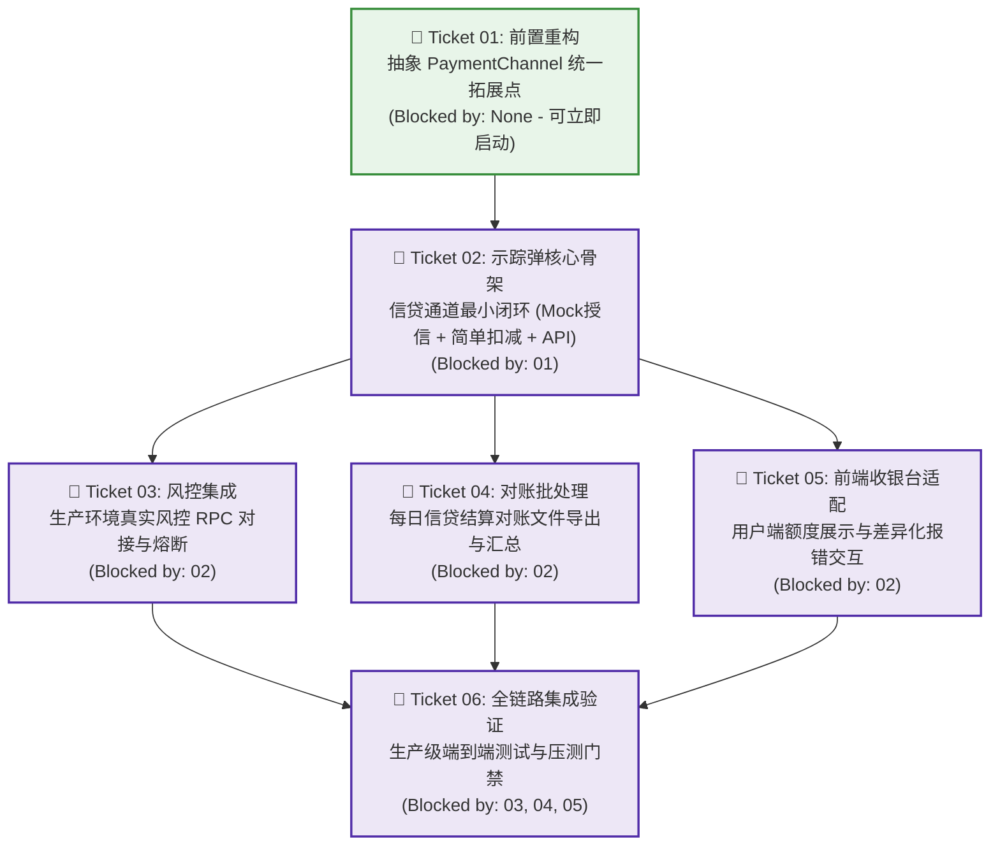

### 5.4 标准交互实战示例

#### 步骤 1：Agent 呈现 Quiz 提纲
```markdown
我已解析 Spec 并完成了代码库勘测。为了支持“信用后付支付通道”，我设计了 5 个示踪弹任务。请确认拆解拓扑：

1. **[T01] 前置重构：抽离并统一现有支付通道调度门面**
   - **Blocked by**: 无（可立即启动）
   - **交付价值**: 将硬编码的 `if-else` 渠道分发重构为策略模式注册表，不改变现有业务行为，为信贷通道插桩铺平道路。
2. **[T02] 垂直示踪弹：信贷后付核心下单履约最小闭环**
   - **Blocked by**: T01
   - **交付价值**: 包含最小数据库表、桩数据风控、收银台选择通道及成功生成挂账订单的端到端路径。
3. **[T03] 生产风控中台真实接入与故障熔断**
   - **Blocked by**: T02
   - **交付价值**: 替换桩逻辑，接入真实风控 RPC，增加 Resilience4j 熔断与本地降级。
4. **[T04] 收银台前端差异化交互与错误回显**
   - **Blocked by**: T02
   - **交付价值**: 前端额度提示、余额不足置灰拦截及文案国际化。
5. **[T05] 每日异步对账与流水导出集成**
   - **Blocked by**: T02
   - **交付价值**: 实现挂账流水与中台财务对账文件的批量生成与 SFTP 上传。

**Quiz 确认：**
- 任务粒度是否合适？
- 阻断依赖关系（Blocked by）是否合理？
- 是否允许现在将上述工单发布至跟踪器？
```

#### 步骤 2：发布到 Tracker 的单工单交付物范本
```markdown
# 02 — 垂直示踪弹：信贷后付核心下单履约最小闭环

## Parent
Ref: #45 (Spec: 订单结算中心信贷后付支付通道支持)

## What to build
实现信贷支付通道的纵向端到端第一发示踪弹。
用户在结算页选择信贷通道后，系统基于内嵌的信用额度规则完成校验并冻结额度，将订单流转至“已付款待发货”状态，并生成一条处于 PENDING 状态的待对账凭单。此任务涵盖数据库变更、业务门面、测试 Controller 以及一条覆盖全流程的自动化集成测试。

## Acceptance criteria
- [ ] 数据库变更执行成功，新增 `payment_credit_ledger` 凭单表。
- [ ] 针对白名单测试用户，调用 `/api/checkout/pay` 传入通道标识 `CREDIT` 返回 `SUCCESS`。
- [ ] 订单主表状态正确变为 `PAID`，账本表生成一条匹配的挂账流水。
- [ ] 自动化测试套件 `CreditPaymentTracerTest` 运行全绿。

## Blocked by
- #46 (01 — 前置重构：抽离并统一现有支付通道调度门面)
```

### 5.5 关键边界与配合技能
- **前置技能**：`to-spec`。
- **后置技能**：生成的 Tickets 直接打上 `ready-for-agent`，交由下游编码技能（如 `implement` 或 `tdd`）逐一认领解决。
- **协同约束**：工单只能由底层阻断任务向顶层顺次执行；严禁在依赖前置未完成时抢跑下游任务。

---

## 6. wayfinder —— 超大跨会话复杂项目的路线图导航

### 6.1 定位与核心价值

`wayfinder`（寻路者）是针对**远超单个会话上下文（>100K Tokens）、笼罩在未知迷雾中的超大型工程项目**设立的高阶战略规划技能。
- **核心定位**：**规划而非动手（Plan, don't do）**。当一个宏大目标降临时，盲目冲刺只会导致智能体越走越偏。Wayfinder 的定位是**在 Issue Tracker 上动态绘制一张共享路线图（Map Issue）并分步探路，直到通往目的地的每一步都被完全照亮**。
- **业务价值**：为横跨数周、由多个开发者或多轮智能体会话接力的大型项目提供单一真理索引，彻底杜绝多智能体协作中的“目标漂移”与“各自为政”。
- **工程价值**：首创**“战争迷雾（Fog of war）”与“工单毕业（Graduation）”机制**，允许模糊的远期任务先以低精度停留在迷雾区，随着前沿推进逐步清晰化为具象决策工单。

### 6.2 触发场景与调用命令

#### 触发时机
- 接到一个极度宽泛复杂的需求，例如：“将项目从微服务架构完全迁移回模块化单体（Modular Monolith）”。
- 系统重构涉及跨越 5 个以上的子系统，且第一步要做什么完全不清晰。
- 接手超大历史遗留代码库（Legacy Codebase）的整体治理。

#### 调用格式
```bash
# 模式 A: 绘制全新路线图 (Chart the map)
/wayfinder "将整个账单系统的底层存储从 MongoDB 零停机迁移至 PostgreSQL"

# 模式 B: 推进已有路线图 (Work through the map)
/wayfinder #108
/wayfinder https://github.com/my-org/my-repo/issues/108
```

### 6.3 底层运行机制与状态机

#### 1. 双层实体结构：Map Issue 与 Child Tickets
- **路线图看板（Map Issue）**：带有 `wayfinder:map` 标签的中心 Issue，是整个远征的**低分辨率索引（Low-res Index）**。它不存储细节，只记录全局目的地、已知决策结果（Decisions so far）以及未解迷雾。
- **决策子工单（Child Ticket）**：Map 的子 Issue，每个工单仅聚焦于**解决一个具体决策或调查（One session, one decision）**，体量严格限定在一个 100K 会话内。

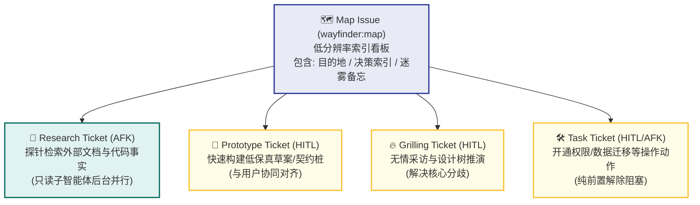

#### 2. 工单分类矩阵（AFK vs HITL）
所有子工单分为两大流派：
| 类型 | 交互模式 | 执行机制 |
| :--- | :--- | :--- |
| **Research** | **AFK** (Agent Free Key / 脱机自主) | 由 `/research` 子智能体自主在后台并发执行，在抛弃型分支上产出结论，无需人类干预。 |
| **Prototype**| **HITL** (Human in the Loop / 人机交互) | 通过制作粗糙低保真原型（Stub/Schema/Draft）拉齐人类认知。 |
| **Grilling** | **HITL** (默认交互) | 激活 `/grilling` 和 `/domain-modeling` 展开针对性现场决策答辩。 |
| **Task**     | **HITL 或 AFK** | 纯体力操作（如申请第三方云凭证、导出一批脱敏数据），为后续决策铺路。 |

#### 3. 战争迷雾（Fog of War）与工单毕业
- **判定准则（Fog or Ticket?）**：
  - 如果这个问题**现在就能用精准的语言提问**，即便它的执行被阻断，也必须**立即建立具象 Ticket** 并挂接阻塞关系。
  - 如果这个问题**目前仅是一个粗略模糊的直觉方向**，绝不能强行切碎，必须保留在 Map 的 `Not yet specified`（迷雾区）。
- **毕业机制（Graduation）**：当前置 Ticket 得到解决，原本笼罩在迷雾中的某个条目被照亮，它将从 `Not yet specified` 中移除，“毕业”为一个或多个崭新的 Child Tickets。

```mermaid
stateDiagram-v2
    [*] --> Fog: 识别到模糊的远期架构演进方向
    note right of Fog: 记录在 Map 的 ## Not yet specified
    
    Fog --> ChildTicket: 前置决策清晰化照亮迷雾 (Graduation)
    note right of ChildTicket: 带有 wayfinder:<type> 标签及 Blocking 边
    
    ChildTicket --> Claimed: 开发者/智能体认领 (Assign)
    Claimed --> Resolving: 单会话针对性突破 (Grilling/Research)
    
    Resolving --> Closed: 产出结论并记录 Resolution Comment
    Closed --> DecisionIndex: 追加到 Map 的 ## Decisions so far
    
    Closed --> FogClarified: 触发下一批迷雾毕业
    FogClarified --> ChildTicket
    
    Resolving --> OutOfScope: 发现位于目的地范围之外
    OutOfScope --> MapOutOfScope: 移入 Map 的 ## Out of scope
```

#### 4. 路线图导航两大模式流程

##### 模式 1：绘制路线图 (Chart the map)
1. **锚定目的地（Name destination）**：与用户答辩，用 1~2 句话写死终局是什么，圈定边界。
2. **广度优先勘测（Breadth-first frontier）**：铺开整个领域空间，若发现毫无迷雾且单会话可完成，直接退出并建议使用普通规划。
3. **创建 Map 看板**：填充 Destination 与 Notes，清空 Decisions so far，将模糊直觉记入 Not yet specified。
4. **两阶段子工单建立与编排**：第一阶段批量创建清晰的子 Issues；第二阶段拉取真实 Issue ID 编排 native blocking 依赖拓扑。
5. **并发派发探针**：为所有 `research` 工单直接派发后台子智能体，结束本次 Session。

##### 模式 2：推进路线图 (Work through the map)
1. **加载低分辨率 Map**：只看顶层状态，绝不一次性拉取所有工单详情，节约 Token。
2. **认领前沿（Claim the frontier）**：自动抓取一个无阻断的工单，立即 `assign` 给当前执行者，建立防并发独占锁。
3. **单点突破（One ticket per session）**：本会话全力以赴攻克该决策，严禁贪多跨越到第二个工单。
4. **归档沉淀**：提交详细 Resolution 评论，关闭该 Issue，在 Map 的 `Decisions so far` 追加单行索引。
5. **照亮迷雾**：检查是否有迷雾条目可毕业为新 Ticket，若发现超范围工作直接转入 Out of scope。

### 6.4 标准交互实战示例

#### Map Issue 完整规范范本 (GitHub Issue #108)
```markdown
## Destination
完成结算中枢从底层单体 MySQL 事务表平滑无缝割接到基于 TiDB 的分布式高并发分布式架构，达成双写校验全绿并具备单键一键回滚能力。

## Notes
- 核心领域文档参考：`src/billing/CONTEXT.md`
- 架构指导规范：遵循 ADR-0012 双写一致性校验要求
- 任何涉及资损的边界工况优先使用 `/grilling` 深入答辩

## Decisions so far
- [#109 数据同步方案选型](https://github.com/my-org/repo/issues/109) — 选定 Canal 监听 Binlog 准实时异步同步，废弃应用层多写方案。
- [#110 历史数据回溯方案](https://github.com/my-org/repo/issues/110) — 采用分片批次冷归档策略，以每批次 5000 条加行锁快照导出。

## Not yet specified
- 线上流量金丝雀灰度（1% -> 5% -> 20% -> 100%）切流时的动态降级与比对报警阈值设定。
- 异构数据库在毫秒级并发下的自增序列与雪花算法主键冲突仲裁机制。

## Out of Scope
- 伴随数据库重构全面重写前端结算 UI（明确维持现有协议契约不变）。
- 将老旧的 MongoDB 历史日志归档同步迁移至 TiDB（保留在冷备集群）。
```

#### 解决 Child Ticket 时的关闭总结（Resolution Comment）
```markdown
### 决策结论与决议备案 (Wayfinder Resolution)

**针对问题**：Canal 增量同步与历史全量导入并发交织时的幽灵数据覆盖问题。

**决议内容**：
经与架构团队推演，确认引入基于物理更新时间戳（`update_time_ns` 纳秒）的乐观覆盖拦截器：
1. TiDB 端的消费者在执行 Upsert 前，强制比对消息时间戳是否大于等于当前记录存储的时间戳。
2. 若晚到（Binlog 重放慢于全量同步），静默丢弃该变更并计入审计指标。

**影响与后续动作**：
- 成功解除 [#111 消费端幂等组件接入](https://github.com/my-org/repo/issues/111) 的阻塞状态。
- 将 Map 看板中的对应迷雾条目照亮，毕业为新工单 `#115 金丝雀比对容差规则设定`。

Closes #109
```

### 6.5 关键边界与配合技能
- **前置技能**：无。通常作为史诗级巨型工程项目的**总指挥所**。
- **后置技能**：
  - 调度子任务时动态调用 `grilling`、`domain-modeling` 与 `prototype`。
  - 当路线图中的决策完全照亮，抵达目的地需要落地交付时，顺理成章地将具体实施切片交由 `to-spec` 与 `to-tickets` 全面接管。
- **治理法则**：
  > [!IMPORTANT] 规划与实施的黄金分界
  > Wayfinder 的第一天职是**“绘制路线与解决决策”**，而不是挽起袖子写业务代码。一旦你在一个会话中既做高层决议又写了几千行业务交付物，意味着路线图设计已经失控，应立即拆出独立的交付 Ticket。

---

## 7. 综合实战：从模糊想法到拓扑任务图的端到端演练

为了展示 6 大技能在现代 AI Agent 研发协作中的无缝连带效果，以下呈现一个完整的工程演进流水线：

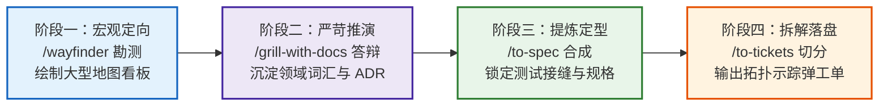

### 阶段协同操作规程 (Playbook)

1. **第一阶段：迷雾穿透与路线图锚定 (`wayfinder`)**
   - 团队面临“计费中枢全面升级”的宏大议题，调用 `/wayfinder`。
   - 经过广度勘测，创建 Map Issue `#200`，明确全局终局目标，将尚未看清的计费模型保留在 `Not yet specified` 迷雾区，优先派发出第一个核心决策工单 `#201`：“账户分账与资金池计费模型选型”。
2. **第二阶段：严苛答辩与资产内联沉淀 (`grill-with-docs` + `domain-modeling`)**
   - 开发者认领工单 `#201`，触发 `/grill-with-docs`。
   - 智能体基于前沿算法抛出 Round 1、Round 2 决策，严苛盘问分账实时性、资金隔离与退款链路。
   - 在问答过程中，即时更新 `src/billing/CONTEXT.md`，确立 `MerchantSubAccount`、`LedgerPool` 等 5 个统一概念，严禁使用含混的 `Money`、`Wallet`；
   - 命中 ADR 铁三角，落盘 `docs/adr/0004-isolated-merchant-ledger-pools.md`。工单 `#201` 关闭，结论反哺 Map。
3. **第三阶段：纯净规格提炼与测试接缝敲定 (`to-spec`)**
   - 方案已获充分共识，调用 `/to-spec`。
   - 智能体静默勘测既有代码，提议在 `LedgerFacadeEndpoint` 设立工程唯一的最高测试接缝并获用户批准。
   - 严格依照模板，提炼 12 条端到端 User Stories，整理高层实现契约，发布规格说明书 Issue `#205 (ready-for-agent)`。
4. **第四阶段：垂直切片与示踪弹任务网发布 (`to-tickets`)**
   - 针对 Issue `#205` 调用 `/to-tickets`。
   - 智能体规划出先行重构（`T01: 抽象账户账本事件驱动桩`）及 4 发端到端垂直示踪弹。
   - 通过 Quiz 交互与开发者对齐依赖边，最终将 5 个具备 `Blocked by` 拓扑关系的子任务发布至 Issue 跟踪器，每个任务均具备单会话独立执行能力。

---

## 8. 附录与最佳实践速查表

### 8.1 六大规划技能核心要素横向对比

| 技能名称 | 核心职责 | 默认交互模式 | 核心交付产物 | 典型违规禁忌 |
| :--- | :--- | :--- | :--- | :--- |
| **`grilling`** | 深度追问与设计树推演 | HITL (多轮问答) | 达成共享理解 (Shared Understanding) | 智能体自问自答；询问代码库中已有的已知事实 |
| **`grill-with-docs`** | 推演与领域文档同步沉淀 | HITL (答辩+更新) | `CONTEXT.md` 增量 / `docs/adr/*.md` | 脱离追问单独写文档；批量延迟记录而不是即时落盘 |
| **`domain-modeling`** | 领域统一语言与架构决策守护 | HITL / 静默审查 | 标准词汇表定义 / ADR 架构决策记录 | 将技术实现/表结构/代码路径写进 `CONTEXT.md`；滥建非关键 ADR |
| **`to-spec`** | 纯净合成技术规格说明书 | 极轻 HITL (仅确认 Seam) | 格式化技术规格说明书 (带 `ready-for-agent`) | 重新采访用户；在规格中书写具体文件绝对路径或临时代码 |
| **`to-tickets`** | 切分垂直示踪弹任务拓扑 | HITL (Quiz 确认) | 具备阻塞拓扑的任务工单网 (Local / Tracker) | 水平切片（只建表或只写UI）；单任务上下文超出 100K 承载力 |
| **`wayfinder`** | 跨会话超大项目路线图导航 | HITL + AFK (混合) | Map Issue 索引看板 / 状态机 Child Tickets | 在路线图会话中直接编写业务实现；一次会话尝试解决多个决策 |

### 8.2 研发日常速查决策树

> [!TIP] 什么时候用什么技能？
> - 当脑中只有一个模糊想法，且评估需耗费数天、跨多个会话时 ➔ **首先输入 `/wayfinder` 绘图**。
> - 当方案细节不确定，想找专家把关、挑刺、找漏洞时 ➔ **直接输入 `/grilling` 答辩**。
> - 当设计涉及核心业务概念，需要定死专业术语并沉淀架构决议时 ➔ **输入 `/grill-with-docs`**。
> - 当方案已完全聊透，需要形成正式规格分发时 ➔ **输入 `/to-spec`**。
> - 当手上已有完备规格，需要变成明天就能开工的工程任务时 ➔ **输入 `/to-tickets`**。
