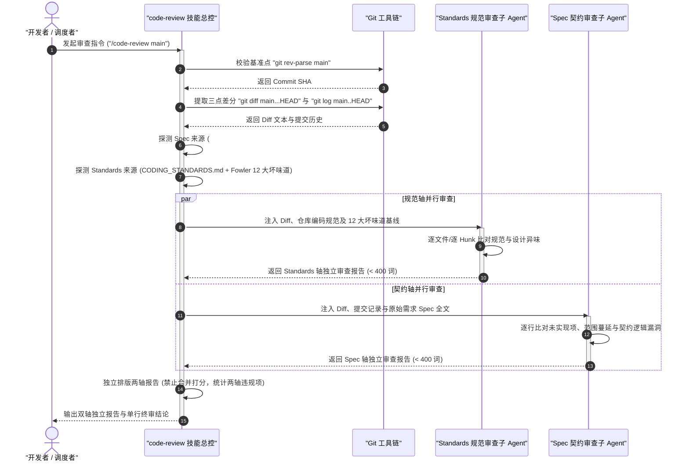
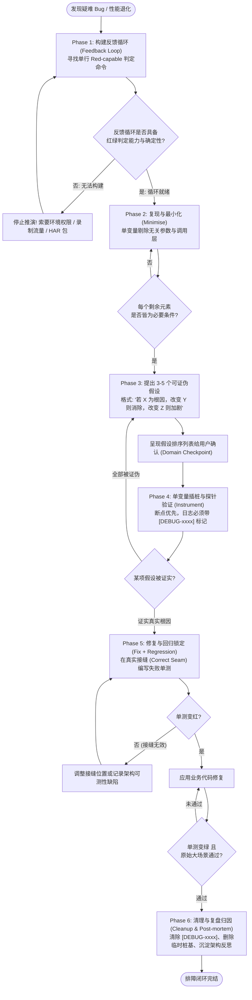
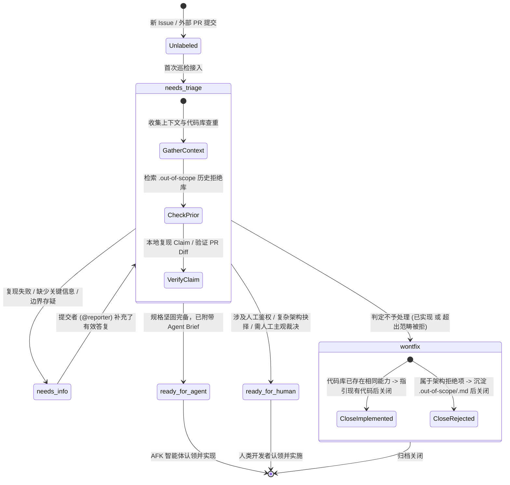
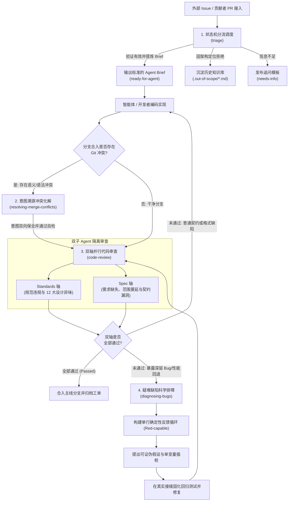

# 质量把控与排障审查专题指南 (Review & Quality)

| 属性 | 详情 |
| :--- | :--- |
| **文档类型** | 技能套件专题指南 (Topic Guide) |
| **当前状态** | 已归档 (Accepted) |
| **作者** | Ateng |
| **创建日期** | 2026-09-22 |
| **关联系统/模块** | Ateng-AI / Skills / Matt Pocock / Review & Quality |

---

## 概述与质量防护网体系

在现代 AI Agent 驱动的工业级软件研发体系中，编写代码往往只占整体工程生命周期的一小部分。随着生成式智能体编码速度的指数级提升，代码库所承受的质量压力急剧增大——未经审查的业务幻觉、语义割裂的合并冲突、无确定性抓手的疑难 Bug，以及缺乏治理、不断淤积的工单与 Pull Request，会迅速蚕食系统的健壮性，最终导致项目架构陷入隐形腐化。

为了构筑坚不可摧的软件交付防线，Matt Pocock 技能套件在**质量把控与排障审查（Review & Quality）**维度确立了一套闭环严密的方法论体系。该专题涵盖以下 4 个核心专精技能：

1. **`code-review`**：双轴并行代码审查（规范 Standards 轴与契约 Spec 轴，双子 Agent 上下文隔离机制）。
2. **`diagnosing-bugs`**：疑难缺陷与性能退化排障循环（四阶段假设验证法与紧凑反馈循环构建）。
3. **`resolving-merge-conflicts`**：智能 Git 合并与变基冲突化解（意图溯源与双向保全机制）。
4. **`triage`**：工单与外部 PR 状态机分流调度（五角色生命周期流转与持久化知识库沉淀）。

本文档严格按照 `tech-doc` 工业级规范，深度剖析上述 4 大技能的核心价值、触发时机、底层运行机制、交互实战范例及关键协作边界。

---

## 一、`code-review`：双轴并行代码审查

### 1. 定位与核心价值

#### 1.1 传统单轴审查的致命盲区
在传统人工或单一智能体代码审查过程中，审查者往往在同一会话中试图同时兼顾“代码风格规范（Style & Standards）”与“业务契约实现（Business Spec）”。这种单轴混杂审查模式在工程实践中极易产生严重的**注意力锚定与相互遮蔽**：
- **规范掩盖契约**：审查者或智能体的注意力极易被表面细节（如命名拼写、代码缩进、函数长度、局部重构）吸附，耗费大量精力纠结排版与坏味道，却完全忽视了代码“根本做错了需求”或“丢失了关键边界条件校验”；
- **契约掩盖规范**：审查者一旦确认功能在主流程上能跑通，就倾向于放行一切，直接忽视了代码中引入的隐蔽依赖腐化、大方法、类型擦除等代码坏味道。

#### 1.2 双轴并行与双子 Agent 隔离哲学
`code-review` 技能基于严格的**双轴正交审查原则**：
- **规范轴（Standards Axis）**：独立审查代码是否完全遵从仓库显式文档（如 `CODING_STANDARDS.md`、`CONTRIBUTING.md`），并在此基础上叠加 Fowler 12 大经典代码坏味道基线（Smell Baseline）。仓库显式规则具有最高优先级；坏味道基线作为启发式审查依据；静态分析与代码格式化工具已覆盖的条目自动跳过。
- **契约轴（Spec Axis）**：独立对照原始需求工单或技术规格（来自 Git Commit 关联的 `#123`、用户显式传入路径或 `docs/specs/` 下的规格文档）。重点挖掘三类隐患：
  1. 规格要求但未实现或仅部分实现的需求；
  2. 规格未要求但私自扩展的行为（范围蔓延 / Scope Creep）；
  3. 貌似已实现但逻辑边界存在缺陷的行为。

为了防止两轴审查思维发生交叉污染，该技能启动**两个完全独立的并行子智能体（Parallel Sub-agents）**，各自注入专属上下文与差异化 Prompt。最终报告按双轴并排呈现，**严禁跨轴合并与加权折中**，确保两类工程风险均被无死角暴露。

> [!IMPORTANT]
> **双轴独立性公理**：
> - 符合规范但需求做错的代码 ➡️ **Standards 轴通过，Spec 轴否决**；
> - 完全满足需求但破坏架构规范的代码 ➡️ **Spec 轴通过，Standards 轴否决**；
> 任何一轴未能通过，变更均不得合入主线。

---

### 2. 触发场景与调用命令

#### 2.1 触发场景
- **特性分支合入前自检**：在发起或合并 Pull Request 前，针对目标基线进行最终体检。
- **阶段性提交评审**：针对本地未推送的最近若干次提交（WIP）或指定提交区间进行质量把关。
- **持续集成（CI）流水线审查**：由 CI 触发机器人对外部提交的 PR 执行全自动化双轴审查。

#### 2.2 调用命令与形态
```bash
# 对比当前分支与 main 分支的基准点进行双轴审查
/code-review main

# 指定基准 Commit SHA 进行审查
/code-review a1b2c3d4

# 审查最近 3 次提交，并显式指定需求规格文档来源
/code-review HEAD~3 --spec docs/specs/order-service.md

# 自然语言交互形式
"请对我当前的改动与 main 分支执行双轴代码审查，原始需求见 Issue #45"
```

---

### 3. 底层运行机制与状态机

`code-review` 的底层执行严格遵循五步标准化流水线：锁定基准点、定位 Spec 来源、定位 Standards 来源、并行派发双子 Agent、聚合呈现双轴报告。



#### 3.1 Fowler 12 大代码坏味道基线
在规范轴审查中，即使代码库未显式编写 `CODING_STANDARDS.md`，Standards 子 Agent 也会强制加载以下 Fowler 12 大经典设计异味作为启发式排查准则：

| 异味名称 (Smell) | 核心特征 (What it is) | 修复重构策略 (How to fix) |
| :--- | :--- | :--- |
| **Mysterious Name** | 变量、函数或类型命名晦涩，无法直接体现业务语义。 | 立即重命名；若无法提取清晰命名，说明职责拆分混乱。 |
| **Duplicated Code** | 相同或高度相似的逻辑片段散落在不同文件或代码块中。 | 抽取公共方法或深层模块复用。 |
| **Feature Envy** | 某个方法频繁跨越边界读取另一个对象的数据字段。 | 将该方法迁移至其所依赖的数据所有者对象内部。 |
| **Data Clumps** | 若干字段或参数总是形影不离地一起传递。 | 封装为独立的值对象（Value Object）或类型。 |
| **Primitive Obsession** | 频繁使用裸字符串、基本类型代替专有领域概念（如把订单号当 `string`）。 | 为核心领域概念定义独立的专有类型或包装类。 |
| **Repeated Switches** | 相同的 `switch` 或多层 `if-else` 条件分支在多处重复出现。 | 使用多态（Polymorphism）或策略映射表替代。 |
| **Shotgun Surgery** | 修改单一业务概念不得不零散修改大量文件（散弹式修改）。 | 重新归拢内聚点，将协同变更的逻辑集中至单一模块。 |
| **Divergent Change** | 单个文件/类因为多个完全不相干的业务原因频繁发生改动。 | 拆分类与模块，确保每个模块仅因单一原因而变更。 |
| **Speculative Generality** | 代码中充斥着当前 Spec 根本不需要的抽象层、预留钩子与泛型。 | 果断删除无用抽象，内联回归最简设计（YAGNI 原则）。 |
| **Message Chains** | 出现过长的深层链式调用 `a.getB().getC().getD()`。 | 引入中介委托方法，隐藏深层导航细节（迪米特法则）。 |
| **Middle Man** | 某个类或函数几乎不做实质逻辑，只是一味将调用转交他人。 | 移除中介，调用方直接访问真实目标。 |
| **Refused Bequest** | 子类继承了父类，却大量覆盖为空实现或显式抛出不支持异常。 | 破除继承关系，改用组合（Composition）模式。 |

---

### 4. 标准交互实战示例

#### 4.1 审查派发 Prompt 示例（总控派发给 Spec 子 Agent）
```markdown
你现在扮演严格的代码审查员，负责针对本次变更执行【需求契约轴 (Spec Axis)】专项审查。

【输入数据】
1. 比对基准：git diff main...HEAD
2. 关联提交列表：git log main..HEAD --oneline
3. 原始需求规格：docs/specs/order-timeout-cancel.md

【审查职责】
请逐项对照需求规格全文，审查 Diff 是否忠实履行了契约。严格汇报以下三类问题：
(a) 规格中明确要求，但在 Diff 中缺失或仅部分实现的要求（引用规格原文行）；
(b) 规格中从未提及，属于私自添加的行为与范围蔓延（Scope Creep）；
(c) 表面上已实现，但逻辑判定、边界条件或异常处理与规格相违背的行为。

【输出约束】
- 聚焦实质问题，不要发表客套套话；
- 严禁评价代码缩进、格式或命名风格（该职责由 Standards 轴独立负责）；
- 篇幅严格控制在 400 词以内。
```

#### 4.2 双轴并行审查终审报告输出范例
```markdown
# 代码双轴审查报告: feature/order-timeout-cancel (vs main)

## Standards (代码规范轴)
- **[Hard Violation] 异常堆栈外泄** (`src/service/OrderService.ts#L84`)
  违反仓库 `CODING_STANDARDS.md` 第 3.2 节“严禁向接入层抛出原始 SQL/ORM 异常”。此处 catch 块直接将原始 DB 错误透传，应封装为语义化的 `OrderDomainException`。
- **[Smell: Feature Envy] 依恋情结** (`src/handler/TimeoutJob.ts#L42-L51`)
  `TimeoutJob` 直接抓取 `Order` 实体的 5 个内部字段计算超时惩罚金额，属于典型的依恋情结。建议提取 `order.calculatePenalty()` 方法。
- **[Smell: Primitive Obsession] 基本类型偏执** (`src/types/order.ts#L12`)
  订单超时阈值采用裸 `number`（毫秒），易引发单位混淆。建议采用带单位约束的 `Duration` 类型。

## Spec (需求契约轴)
- **[Missing Requirement] 遗漏通知触发**
  规格要求：“订单自动取消后，必须向消息队列广播 `order.cancelled` 事件通知库存服务释放预占锁”（`docs/specs/order-timeout-cancel.md#L45`）。Diff 中完成数据库状态修改后直接返回，缺少事件发布逻辑。
- **[Scope Creep] 范围蔓延** (`src/service/OrderService.ts#L112-L130`)
  Diff 中包含了对未支付用户自动下调信用积分的逻辑。该逻辑在原始 Issue #88 与规格文档中均未出现，属于未经评审私自扩充的功能，应予剥离。
- **[Incorrect Implementation] 边界判定错误** (`src/utils/time.ts#L22`)
  规格明确声明：“超时判断采用闭区间，即当前时间大于等于到期时间即判定超时”。代码中采用了严格大于号（`now > expireAt`），导致临界点产生状态延迟。

---
**终审结论**: 规范轴发现 1 处硬性违规与 2 处设计异味；契约轴发现 1 处关键功能缺失、1 处范围蔓延与 1 处临界点判定错误。**本次审查未通过 (Blocked)**，请修复上述问题后重新发起评审。
```

---

### 5. 关键边界与配合技能

- **职责边界**：`code-review` 聚焦于“静态分析与深度比对”，只负责客观指认问题与出具裁决，**严禁在审查过程中顺手修改业务代码**。此外，已被 Linter、Prettier 或编译器类型检查拦截的问题，不在本技能中重复上报。
- **协同链路**：
  - 若审查发现契约不符或缺失用例 ➡️ 交接给 `tdd` 编写失败测试用例并补充实现；
  - 若审查暴露出隐蔽并发故障或性能退化 ➡️ 交接给 `diagnosing-bugs` 启动严谨排障；
  - 若因分支偏离过久产生合并歧义 ➡️ 联动 `resolving-merge-conflicts`。

---

## 二、`diagnosing-bugs`：疑难缺陷与性能退化排障循环

### 1. 定位与核心价值

#### 1.1 盲目猜测（Shotgun Debugging）的危害
当系统出现深层崩溃、并发竞态、内存泄漏或吞吐量骤降等疑难故障时，开发者和智能体最常犯的错误就是**“直接阅读代码，凭借直觉猜测原因，并在生产代码中散弹式添加试探性改动”**。这种做法不仅定位命中率极低，还会破坏历史正常逻辑，甚至因改动掩盖了真实的故障线索。

#### 1.2 反馈循环与科学假设验证哲学
`diagnosing-bugs` 技能确立了一条工业级排障铁律：**“建立紧凑的反馈循环（Tight Feedback Loop）是解决 Bug 90% 的关键，其余工作纯属机械执行。”**
在没有找到或构建出一个能够在当前缺陷上**稳定变红（Red-capable）**的单行执行命令之前，任何阅读代码空想假说的行为都被严格禁止！

排障过程被严格规范为**科学假说演绎循环**：
1. 先构建秒级响应的确定性反馈工具；
2. 最小化复现环境，剔除所有无关干扰项；
3. 生成多条具备**可证伪性（Falsifiable）**的排他假设；
4. 运用单变量探针与带标记日志进行验证；
5. 在正确接缝处固化回归测试，复原清理现场。

> [!CAUTION]
> **排障安全红线 (Redaction Rule)**：排障过程中捕获的网络抓包、日志与配置文件，往往包含敏感认证信息（Token、Cookie、密码、私钥）。在向终端输出或展示任何排障工件前，必须将敏感凭据全量替换为 `<REDACTED>`。

---

### 2. 触发场景与调用命令

#### 2.1 触发场景
- **偶发性/并发性故障**：如线上偶发死锁、数据一致性错乱、竞态条件。
- **性能断崖式退化**：接口延迟暴增、CPU 尖刺、数据库慢查连接池打满。
- **跨模块复杂链路报错**：调用栈深长且抛出模糊异常（如 `NullPointerException`、`InternalError`）。

#### 2.2 调用命令与形态
```bash
# 启动疑难排障技能
/diagnosing-bugs

# 针对特定报错启动排查
"用户在并发高频下单时偶发扣库存超出，请排查原因"

# 针对性能退化排查
"接口 /api/v1/analytics 耗时从 100ms 恶化至 3500ms，启动性能排障循环"
```

---

### 3. 底层运行机制与状态机

`diagnosing-bugs` 严密串联了六大阶段（构建反馈循环 ➡️ 复现与最小化 ➡️ 提出假设 ➡️ 单变量插桩 ➡️ 修复与回归 ➡️ 清理与复盘）：



#### 3.1 构建反馈循环的 10 种武器
在 Phase 1 中，按优先级尝试以下手段构建闭环：
1. **失败测试（Failing Test）**：在能够触及 Bug 的最深接缝处编写单元、集成或端到端测试；
2. **Curl / HTTP 自动化脚本**：直接针对开发服务器发起包含异常 Payload 的请求；
3. **CLI 命令行桩基**：注入测试 Fixture 并针对输出结果与基线做快照 Diff；
4. **Headless 浏览器脚本**：使用 Playwright 驱动 UI 并监听 Console/网络错误；
5. **网络录制流量重放（Replay Captured Trace）**：加载抓包文件或事件日志在隔离环境中重放；
6. **一次性抛弃型脚手架（Throwaway Harness）**：启动最小子系统（单服务+Mock 依赖）；
7. **属性/模糊测试循环（Property/Fuzz Loop）**：针对偶发性问题生成 1000 组随机用例捕获边界；
8. **自动化二分定位（Git Bisect Harness）**：编写判定脚本配合 `git bisect run` 定位引入 Commit；
9. **差分对比循环（Differential Loop）**：将相同输入同时灌入新老版本比对响应差异；
10. **人机交互脚本（HITL Script）**：当必须人工点击时，通过结构化引导脚本约束输入并采集反馈。

#### 3.2 判定循环完成的验收标准（Phase 1 Completion Criterion）
必须能够明确给出一个**已经执行过至少一次的单行命令**，且满足：
- [x] **具备变红能力（Red-capable）**：在当前 Bug 存在时必然报错/断言失败，修复后必然成功通过；
- [x] **确定性（Deterministic）**：每次运行结论完全一致（偶发 Bug 必须通过加压/压测将复现率提升至可调试水平）；
- [x] **极速响应（Fast）**：执行时间在数秒以内，严禁单次等待数分钟；
- [x] **智能体可无人值守执行（Agent-runnable）**：无需手工交互切屏。

---

### 4. 标准交互实战示例

#### 4.1 场景：高并发下单偶发超卖 Bug 排查

##### Phase 1 & 2: 反馈循环构建与最小化
智能体编写了一段并发扣减脚本 `scripts/repro-stock-bug.sh`，在终端运行并截获输出：
```bash
# 执行并发触发命令
./scripts/repro-stock-bug.sh --sku SKU-10086 --concurrency 20 --stock 5
```
输出捕获：
```
[RUN] 正在对 SKU-10086 发起 20 线程并发扣减，初始库存: 5
[ERROR] 最终扣减成功总数: 8，剩余库存记录: -3
[FAIL] 确定性变红：检测到超卖异常，实际超卖 3 件！
```
经过最小化剔除（去除了鉴权中间件、优惠券计算与订单持久化），发现只要 2 个并发线程即可稳定复现该症状。

##### Phase 3: 生成可证伪假设（展示给用户 Checkpoint）
```markdown
基于最小复现脚本，提炼出以下 3 个具可证伪性的排他假设：

| 序号 | 假设内容 (Hypothesis) | 预测检验逻辑 (Prediction) |
| :---: | :--- | :--- |
| **H1** | 数据库事务隔离级别为 Read Committed，两事务并行执行先查后扣产生读写偏序（Lost Update）。 | 若将扣减逻辑改为原子更新语句 `SET stock = stock - 1 WHERE stock >= 1`，则超卖 Bug 必然彻底消失。 |
| **H2** | Redis 分布式锁 Key 粒度过粗，或锁续期失效导致并发租期重叠。 | 若将 Redis 锁 TTL 延长至 60 秒并观察锁抢占日志，若依然超卖则证明与锁超时无关。 |
| **H3** | ORM 本地二级缓存未失效，第二次更新基于脏内存对象覆盖。 | 若在事务开始前显式调用 `entityManager.clear()`，若 Bug 仍存则可证伪 H3。 |
```

##### Phase 4: 单变量精准插桩验证
在目标方法内嵌入带唯一标签的探针日志（严禁污染全量日志）：
```java
// 文件: src/main/java/com/ateng/service/StockService.java
log.debug("[DEBUG-a4f2] 线程: {}, 当前查询所得库存: {}", Thread.currentThread().getName(), currentStock);
// 执行扣减
int rows = stockMapper.updateStock(skuId, currentStock - 1);
log.debug("[DEBUG-a4f2] 线程: {}, 更新受影响行数: {}", Thread.currentThread().getName(), rows);
```
运行 `./scripts/repro-stock-bug.sh`，抓取输出：
```
[DEBUG-a4f2] 线程: Thread-1, 当前查询所得库存: 1
[DEBUG-a4f2] 线程: Thread-2, 当前查询所得库存: 1
[DEBUG-a4f2] 线程: Thread-1, 更新受影响行数: 1
[DEBUG-a4f2] 线程: Thread-2, 更新受影响行数: 1
```
**根因确证**：两个线程均读到了 `stock=1`，且分别执行了 `SET stock = 0`，导致丢失更新。**假设 H1 得证**！

##### Phase 5 & 6: 修复、单测固化与清理
在正确的服务接缝处补全集成测试用例，实施原子 SQL 改造；运行测试由红转绿。
最终执行全量清理命令：
```bash
# 清理所有调试插桩
git grep "[DEBUG-"
# 确认无任何残留后提交
```

---

### 5. 关键边界与配合技能

- **职责边界**：
  - 若环境确实无法复现（如缺少特定三方物理硬件），必须主动叫停并向用户索要录制数据，**严禁无循环硬猜**；
  - 性能排查严禁依靠“打印大量日志”，因为 I/O 探针会严重篡改原本的耗时分布（Heisenbug），必须采用 Profiler 或基准测试套件。
- **协同链路**：
  - 排查过程中发现代码深层耦合、缺乏测试接缝（Seam） ➡️ 记录缺陷并移交 `codebase-design` 进行模块深层化改造；
  - 根因定位后 ➡️ 联动 `tdd` 编写回归用例；
  - 修复完成后 ➡️ 联动 `code-review` 审查修复代码。

---

## 三、`resolving-merge-conflicts`：智能 Git 合并与变基冲突化解

### 1. 定位与核心价值

#### 1.1 语法合并 vs 语义冲突的本质矛盾
在多分支协作或长生命周期特性分支演进中，Git 冲突不可避免。市面上多数简易辅助工具或新手开发者处理冲突时，往往只关注 Git 标出的冲突标记（`<<<<<<< HEAD`、`=======`、`>>>>>>> incoming`），然后生硬地选择“保留当前更改”、“接受传入更改”或机械地前后拼接代码。

这种操作最可怕的后果在于制造**隐形语义冲突（Semantic Conflict）**：
- 代码在语法上完全能够通过编译；
- 但是两方代码背后的**业务意图（Business Intent）**产生了致命矛盾。例如：分支 A 将权限校验迁移到了网关层并废弃了本地 Session，而分支 B 在本地接口中为新增接口强化了 Session 读取。如果机械拼合，系统将面临安全穿透或空指针灾难。

#### 1.2 意图溯源与双向保全哲学
`resolving-merge-conflicts` 技能确立了**“意图溯源优先（Intent-Preserving）”**的冲突消解原则：
- **查阅一手信源**：不孤立看几行冲突代码，而是穿透至冲突双方的 Commit 信息、Pull Request 讨论以及绑定的需求 Issue，搞清楚双方“为什么这么改”；
- **尽最大可能双向保全**：如果两方意图是互补的（如一方扩展参数，另一方优化性能），必须合成出兼顾双方诉求的代码；
- **目标为先与显式妥协**：如果两方业务意图在逻辑上不可调和，必须坚定以“本次合并/变基的核心目标”为基准进行取舍，并显式记录妥协代价（Trade-offs）；
- **铁律约束**：**严禁凭空发明未经授权的新业务行为，严禁随意 `--abort` 逃避冲突，化解后必须全自动化运行项目检验工具链**。

---

### 2. 触发场景与调用命令

#### 2.1 触发场景
- 执行 `git merge` 或 `git rebase` 时终端停滞并提示 `CONFLICT (content)`；
- PR 页面显示状态为“This branch has conflicts that must be resolved”；
- 多人并行修改核心配置文件或核心领域实体模型。

#### 2.2 调用命令与形态
```bash
# 遇到冲突后直接调用技能
/resolving-merge-conflicts

# 自然语言交互方式
"我们在 rebase main 分支时在认证模块发生了冲突，请协助安全化解"
```

---

### 3. 底层运行机制与状态机

`resolving-merge-conflicts` 运行机制包含五个严密的递进步骤：

```mermaid
stateDiagram-v2
    [*] --> SurveyState: 检测到 Merge / Rebase 中途冲突
    
    state SurveyState {
        direction LR
        [*] --> ListConflicts: git status 扫描冲突文件
        ListConflicts --> InspectHunks: 审查未合并代码块 (Hunks)
    }
    
    SurveyState --> TraceSources: 锁定冲突清单
    
    state TraceSources {
        direction TB
        ReadCommits: 阅读双方提交历史 (git log -p)
        ReadTickets: 检索关联 PR 与 Issue 意图
        ReadCommits --> ReadTickets
    }
    
    TraceSources --> ResolveHunks: 意图与上下文对齐
    
    state ResolveHunks {
        direction TB
        AssessCompatibility: 判定两方意图是否兼容?
        PreserveBoth: 兼容 -> 融合两方意图 (Synthesize)
        PickGoal: 冲突 -> 以合并目标为主并记录 Trade-off
        AssessCompatibility --> PreserveBoth: 互补
        AssessCompatibility --> PickGoal: 互斥
    }
    
    ResolveHunks --> RunChecks: 所有 Hunk 处理完毕
    
    state RunChecks {
        direction LR
        TypeCheck: 静态类型检查
        RunTests: 执行测试套件
        Format: 代码格式化
        TypeCheck --> RunTests --> Format
    }
    
    RunChecks --> ResolveHunks: 存在测试红灯 / 语法断裂
    RunChecks --> FinishFlow: 全套自动化检查 Green
    
    state FinishFlow {
        direction TB
        StageFiles: git add 暂存已解决文件
        CommitOrContinue: git commit 或 git rebase --continue
        StageFiles --> CommitOrContinue
    }
    
    FinishFlow --> [*]: 冲突彻底化解，分支就绪
```

---

### 4. 标准交互实战示例

#### 4.1 场景：订单上下文与折扣策略冲突消解

##### 步骤 1 & 2: 扫描冲突并溯源意图
`git status` 显示 `src/domain/OrderContext.ts` 冲突。
查看冲突内容：
```typescript
<<<<<<< HEAD (来自分支 feature/vip-discount: 引入 VIP 专属折扣策略)
export interface OrderContext {
  userId: string;
  items: OrderItem[];
  vipLevel: number;
  discountStrategy: VipDiscountStrategy;
}
=======
export interface OrderContext {
  userId: string;
  items: OrderItem[];
  couponCode?: string;
  couponAmount: BigNumber;
  appliedCurrency: CurrencyCode;
}
>>>>>>> main (主线合入了国际化与优惠券模块)
```
- **信源溯源分析**：
  - 当前分支意图：需要 `vipLevel` 和 `discountStrategy` 驱动 VIP 折扣规则计算；
  - 传入分支（main）意图：为了支持跨境多币种结算与平台级优惠券，引入了 `couponCode`、`couponAmount` 与 `appliedCurrency`。
  - **兼容性裁定**：两者完全正交且互补，系统既需要支持多币种优惠券，也需要支持会员折扣！

##### 步骤 3: 语义级双向保全化解
人工/智能体综合两者诉求，产出合成代码：
```typescript
// 文件: src/domain/OrderContext.ts
// 意图融合: 同时保全 VIP 会员折扣策略与国际化多币种优惠券能力
export interface OrderContext {
  userId: string;
  items: OrderItem[];
  // 继承自 feature/vip-discount
  vipLevel: number;
  discountStrategy: VipDiscountStrategy;
  // 继承自 main 分支能力
  couponCode?: string;
  couponAmount: BigNumber;
  appliedCurrency: CurrencyCode;
}
```

##### 步骤 4 & 5: 自动化检验与提交
执行工具链自检：
```bash
# 1. 运行 TypeScript 编译检查
npm run typecheck
# 2. 运行相关单测
npm test -- test/domain/OrderContext.test.ts
# 3. 标记暂存并继续 Rebase
git add src/domain/OrderContext.ts
git rebase --continue
```
控制台输出：`Applying: feat: add vip discount strategy... Successfully rebased and updated refs/heads/feature/vip-discount.`，冲突圆满解决。

---

### 5. 关键边界与配合技能

- **职责边界**：
  - 严格聚焦于消除当前冲突，**绝对禁止夹带私货进行不相关的重构或功能追加**；
  - 若发现两方存在无法靠代码层妥协的业务冲突（例如一方决定下线商品评论，另一方重构了评论审核），必须立即挂起并向人类架构师抛出决策点，严禁智能体代做商业战略决断。
- **协同链路**：
  - 冲突化解并提交后 ➡️ 必须派发 `code-review` 进行全量双轴审查，确保语义融合后没有破坏代码规范与原有业务契约。

---

## 四、`triage`：工单与外部 PR 状态机分流调度

### 1. 定位与核心价值

#### 1.1 混乱的分流与 Agent 误伤风险
在维护活跃代码库或开源项目时，大量质量参差不齐的 Issue 与外部贡献者 PR 源源不断涌入。传统的工单处理常常存在两大痛点：
1. **模糊不清直接指派**：用户提交一句“我的接口报错了，快修”，若直接指派给自动化编码 Agent，Agent 会在缺少重现步骤、缺少上下文的泥潭中不断瞎猜和打转，产生高昂的模型 Token 消耗与无效提交；
2. **重复拒绝与历史失忆**：某些需求早已因架构定位问题被多次驳回，但因为缺乏持久化组织记忆，每次不同用户重新提议时，维护团队又不得不重新开会争论。

#### 1.2 核心价值与“PR 即附带代码的 Issue”
`triage` 技能将工单分流抽象为严谨的**角色状态机（Role State Machine）**，并确立了统一处理模型：
- **PR 本质统一论**：在分流视角下，**一个外部 Pull Request 就是一个附带了现成代码（Diff）的 Issue**。二者遵循完全一致的角色分类与状态流转规则；
- **五大标准生命周期角色**：严格规范任务在不同责任主体间的权属流转；
- **AI 声明强制准则**：所有由分流技能在 GitHub/GitLab 跟踪器上发布的评论，必须以 `> *This was generated by AI during triage.*` 开头，杜绝机器冒充人类；
- **知识库沉淀（`.out-of-scope/`）**：凡是被正式拒绝的需求，均系统化归档至知识库，形成团队集体认知记忆。

---

### 2. 触发场景与调用命令

#### 2.1 触发场景
- **每日/每迭代待办巡检**：维护者需要迅速了解哪些工单需要自己裁决，哪些可以交由 Agent 闭环处理；
- **新工单与外部 PR 准入**：对新到达的代码库诉求进行真实性复现与分类标注；
- **需求规格打磨就绪**：将经过充分推演的任务转化为持久化的 `Agent Brief` 交付执行。

#### 2.2 调用命令与形态
```bash
# 查看所有需要关注的工单与外部 PR 看板
/triage "Show me anything that needs my attention"

# 针对特定 Issue 或 PR 展开深度分流评估
/triage "Let's look at #42"

# 快速覆盖流转状态
/triage "Move #42 to ready-for-agent"

# 检索当前可以直接交付给 Agent 自动执行的任务清单
/triage "What's ready for agents to pick up?"
```

---

### 3. 底层运行机制与状态机

#### 3.1 五角色状态机架构
每个被分流的 Issue 或 PR 必须具有**一个类别角色**（`bug` 或 `enhancement`）以及**一个状态角色**：



#### 3.2 五大状态角色的核心定义与流转准则

| 状态角色 (Role) | 核心语义与责任主体 | 准入前置条件 (Preconditions) | 离开跃迁路径 |
| :--- | :--- | :--- | :--- |
| **`needs-triage`** | 待评估分流（责任人：维护者 / 分流智能体）。 | 未经分类的新工单，或 `needs-info` 获得提交者补充回复后的重申项。 | 转向 `needs-info`、`ready-for-agent`、`ready-for-human` 或 `wontfix`。 |
| **`needs-info`** | 待补充反馈（责任人：提交者 / 外部贡献者）。 | 描述含糊、无法稳定复现、或者未对齐预期行为。必须向提交者发布包含已确认事实与具体待答清单的标准 Triage Notes。 | 提交者回复有效信息后，**自动跳回 `needs-triage`**；长期无反馈则超时关闭。 |
| **`ready-for-agent`** | 智能体可执行就绪（责任人：离线自主 Agent）。 | 需求已严格完成验证与推演，**必须在工单顶部附加标准的持久化 Agent Brief**。智能体无需向人类追问即可独立实现。 | 任务被 Agent 认领实现并合入。 |
| **`ready-for-human`** | 需人工介入（责任人：团队人类工程师）。 | 任务涉及私有安全凭据、需要人类主观 UI 审美偏好裁定、需要第三方平台后台手动操作，或涉及不可自动化的架构重大分歧。 | 人工实施完毕并关闭。 |
| **`wontfix`** | 不予处理 / 关闭归档（状态终结）。 | 触发两类场景之一：<br/>1. **已在系统中实现**（指出代码位置直接关闭，**严禁**写入知识库）；<br/>2. **架构方向冲突而拒绝**（必须将决策逻辑沉淀至 `.out-of-scope/` 知识库后关闭）。 | 永久归档（除非维护者主动重置）。 |

---

### 4. 标准交互实战示例

#### 4.1 `needs-info` 标准回复模板范例
当提交的缺陷缺少复现要素时，分流技能自动发布规范化追问，保留已确立成果，杜绝无意义的“请提供更多信息”：
```markdown
> *This was generated by AI during triage.*

## Triage Notes

**我们目前已确立并验证的事实 (What we've established so far):**
- 我们已经确认了您提到的异常堆栈确实发生在 `PaymentGatewayService.process()`；
- 在沙箱单线程环境下以标准 JSON 载荷调用时，该方法能够正常返回 `200 OK` 并完成扣款。

**我们仍需要向您 (@reporter) 确认的关键信息 (What we still need from you):**
- 请提供触发该报错时的请求 Header 中的 `Content-Type` 与 `Idempotency-Key` 设置样例；
- 您是否在同一个幂等 Key 下并发发起了多次并发重试？如果具备，请提供并发客户端数量估值。
```

#### 4.2 `ready-for-agent` 的标准工单持久化契约：Agent Brief 范例
Agent Brief 是交给后续无人值守 Agent 的终极合约，**严格遵循“行为契约而非实现步骤”、“耐久性优于脆弱行号”原则**：
```markdown
> *This was generated by AI during triage.*

## Agent Brief

**Category:** bug
**Summary:** 修复批量数据导入时超过 1000 条引发的数据库参数超限崩溃

**Current behavior:**
当用户通过批量上传接口导入超过 1000 个实体时，系统底层直接生成单条携带上千参数的 `INSERT INTO ... VALUES` SQL 语句，触发 PostgreSQL 单查询参数上限崩溃（`PreparedStatement can have at most 65535 parameters`），导致整批导入失败且无友好提示。

**Desired behavior:**
数据导入模块必须支持流式或固定批次（Chunking）持久化机制。针对任意规模的数据切片为每批最多 500 条进行事务内分批写入；若任意分批发生数据校验异常，当前批次独立报错回滚，并返回明确的行级错误详情。

**Key interfaces:**
- `BatchImportExecutor.execute(dataStream)`：处理入参流式分批分块；
- `BatchImportResult`：记录成功行数、失败行数与分批异常原因。

**Acceptance criteria:**
- [ ] 灌入包含 2500 条有效数据的测试 Fixture 时，导入成功且在日志中可观察到 5 次独立的分批提交；
- [ ] 单次写入参数数量严格受控在 500 个条目以内，杜绝底层数据库参数越界异常；
- [ ] 当第 1200 条数据格式错误时，前两批（1000 条）持久化状态符合配置的容错策略，并返回针对第 1200 行的具体错误报告；
- [ ] 针对低于 500 条的小规模数据导入，行为与原有吞吐量保持一致。

**Out of scope:**
- 改造上传前端 UI 进度条组件；
- 支持 Excel 文件的异步解析（当前仅限已解析好的 JSON/CSV 数据流）。
```

#### 4.3 `wontfix` 拒绝沉淀范例：`.out-of-scope/graphql-gateway.md`
当维护者决定拒绝某项特性提议时，分流技能自动创建/更新知识库文件，供未来查重使用：
```markdown
# GraphQL API Gateway

本项目定位为高吞吐微服务底层通信中间件，不提供亦不接受 GraphQL 网关层的集成支持。

## 为什么这项需求超出范围 (Why this is out of scope)

团队经过架构推演与技术评估，决定保持协议层极简（专精于 gRPC 与紧凑 REST/JSON），拒绝引入 GraphQL：
1. **架构复杂度溢出**：支持 GraphQL 需要在核心调度层引入深层 AST 解析与动态 DataFetcher 编排，这破坏了现有流水线无状态、零内存拷贝的极速吞吐设计目标；
2. **N+1 查询隐患不可控**：微服务下游存储模型高度异构，在网关层开放任意字段深层嵌套查询极易引发下游微服务级联雪崩；
3. **定位聚焦原则**：API 聚合与裁剪属于上游 BFF（Backend For Frontend）层的职责，应由外部网关实现，不应下沉至本中间件。

## 历史关联请求 (Prior requests)
- #102 — "Add GraphQL interface for flexible entity querying"
- #158 — "Support Apollo Federation subgraph endpoint"
```

---

### 5. 关键边界与配合技能

- **职责边界**：
  - `triage` 的核心定位是“工单分流与规格裁定”，**不负责实际业务代码的编写与实现**；
  - 遇到维护者明确下达越权指令时（如“立刻将 #42 标记为 ready-for-agent”），信任并执行维护者意图，跳过盘问；但若尚未编写 Agent Brief，需主动提示维护者补全。
- **协同链路**：
  - 若在工单准入阶段发现需求概念含糊、边界未清 ➡️ 协同调度 `/grilling` 与 `/domain-modeling` 展开苏格拉底式盘问与领域统一语言提取；
  - 任务一旦被打上 `ready-for-agent` 标签 ➡️ 后续会话可由 `implement` 技能直接拉取 Agent Brief 投入正式代码实施；
  - 外部贡献者提交的 PR 经由分流验证后 ➡️ 交付给 `code-review` 进行双轴深度审查。

---

## 五、四大技能的协同联动闭环流

在实际工程落地中，上述 4 个技能并非相互割裂的孤岛，而是紧密咬合形成了一套**覆盖“需求准入 ➡️ 冲突消解 ➡️ 双轴审查 ➡️ 科学排障”的全周期闭环流水线**。



### 联动协作规则总结
1. **准入有门槛（Triage First）**：未经 `triage` 给出 `ready-for-agent` 且没有 Agent Brief 的工单，严禁智能体擅自投入编码；
2. **合码有溯源（Intent-Preserving Merge）**：遇到冲突绝不暴力二选一，由 `resolving-merge-conflicts` 完成意图提炼与保全，并通过全套测试；
3. **把关有双轴（Dual-Axis Review）**：提交前必须由 `code-review` 启动独立双子 Agent，规范轴（防腐化）与契约轴（防做错）一票否决；
4. **排障有循环（Loop-Driven Diagnostics）**：一旦暴露疑难 Bug，严禁瞎猜，由 `diagnosing-bugs` 确立单行确定性变红命令，假设验证后回归锁定。

四重防线紧密咬合，确保 AI Agent 驱动的高速开发始终运行在工业级稳固轨道之上。
