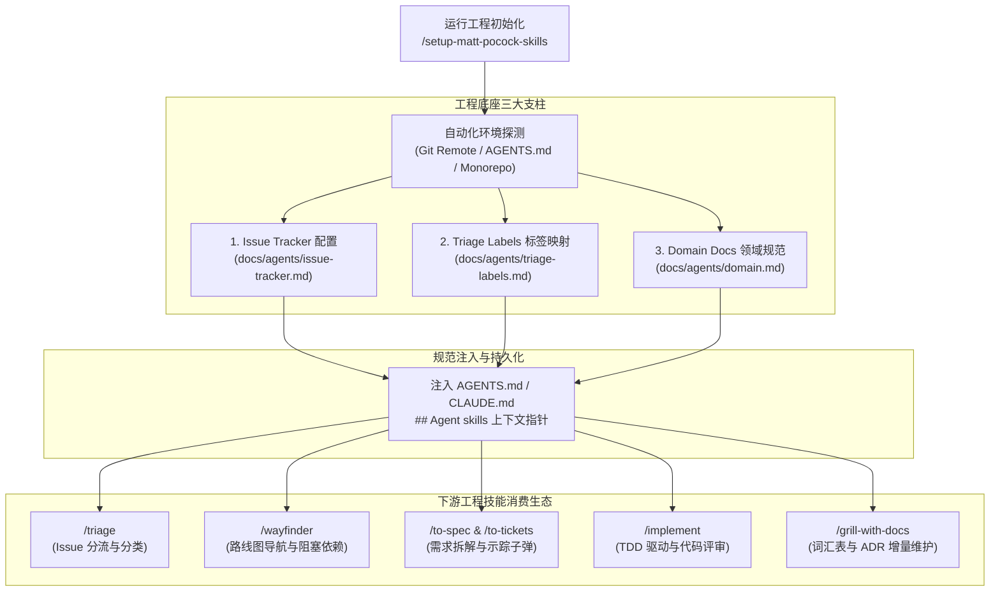
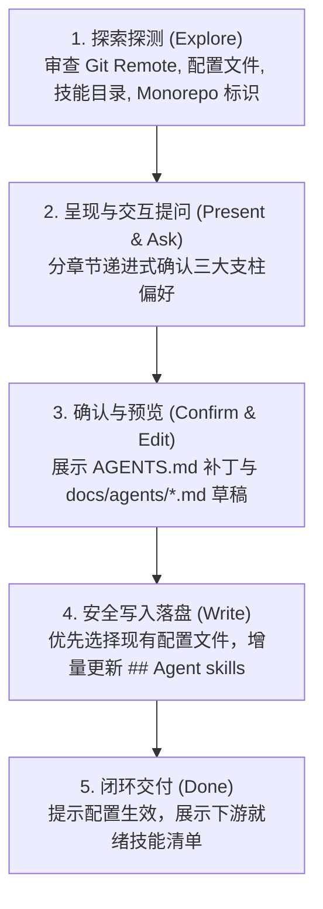
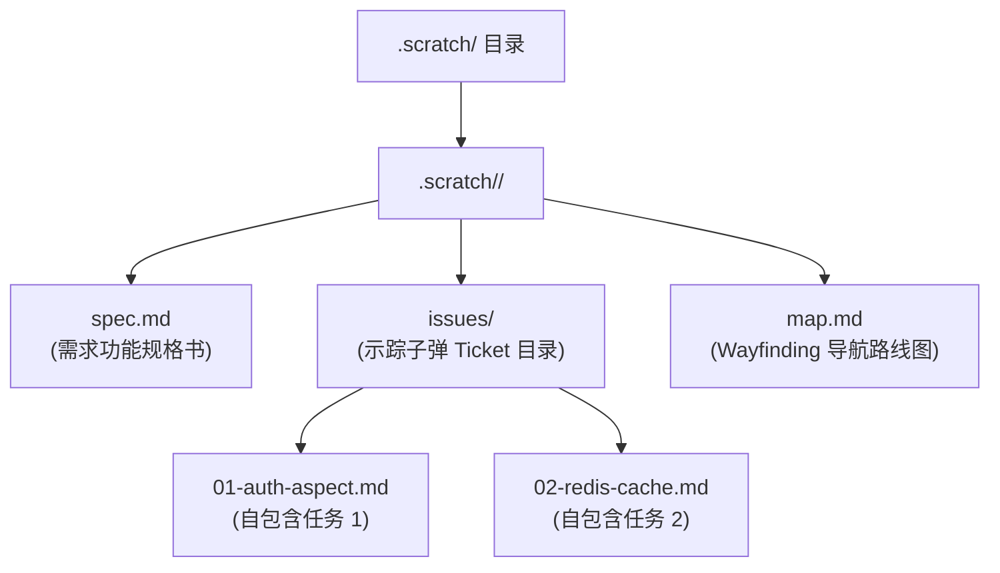
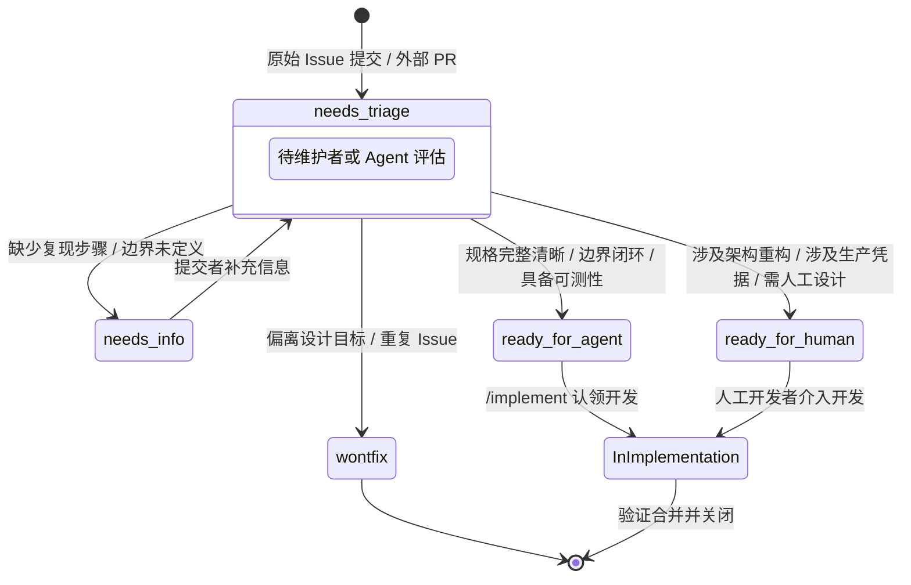
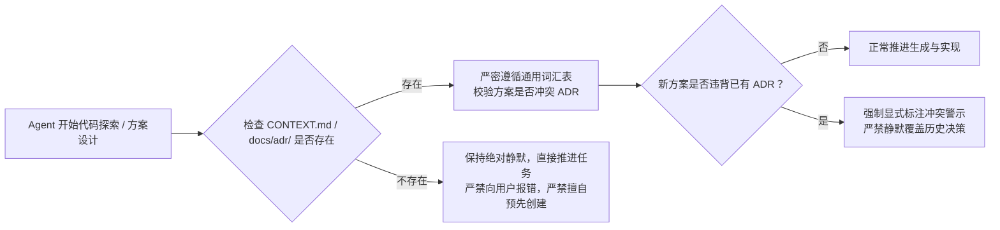

# 工程初始化与配置规范指南

| 属性 | 详情 |
| :--- | :--- |
| **文档类型** | 架构设计与配置工程规范 |
| **当前状态** | 已归档 (Accepted) |
| **作者** | Ateng |
| **创建日期** | 2026-09-22 |
| **关联系统/模块** | Matt Pocock 工程脚手架与 Agent 规范体系 (`setup-matt-pocock-skills`) |

---

## 1. 概述与工程底座设计思想

在自主智能体（Autonomous Agents）介入软件工程前，最常见的问题是“配置漂移”与“上下文盲目探索”。缺乏统一约定时，Agent 往往不知道在哪里读取业务需求、不知道何种任务属于自己（还是属于人类）、在方案设计中胡乱臆造业务术语，甚至在出现架构冲突时静默覆盖既有设计。

`setup-matt-pocock-skills` 为代码库提供了标准化的**工程基础设施脚手架**。它的核心职责是在首次执行任何工程技能（如 `/implement`、`/triage`、`/wayfinder`、`/to-spec`、`/grill-with-docs`）之前，一次性确立三大工程支柱：
1. **任务与需求追踪器 (Issue Tracker)**：定义 Ticket 存放位置、自动化 CLI 工具链交互规范与路线图导航机制。
2. **分流角色标签体系 (Triage Labels)**：建立抽象的“五角色分流模型”，解耦 Agent 行为与团队具体标签命名。
3. **领域文档体系 (Domain Docs)**：确立单上下文或多上下文的通用语言词汇表（`CONTEXT.md`）与架构决策记录（`docs/adr/`），为 Agent 设定不可逾越的业务语言红线。

### 1.1 工程底座全景拓扑图



---

## 2. `setup-matt-pocock-skills` 脚手架执行流程实战

### 2.1 核心价值
`setup-matt-pocock-skills` 是一个**提示词驱动（Prompt-driven）而非僵硬写死**的智能脚手架。它遵循“先全面探测、再对齐确认、最后安全写入”的原则，具备极强的环境适应性。

### 2.2 五阶段执行流水线



#### 阶段 1：探索探测 (Explore)
Agent 必须静态检查当前仓库的物理状态，严禁无根据地盲猜：
- 检查 `git remote -v` 与 `.git/config`：判断是 GitHub 仓库、GitLab 仓库还是无远端本地仓库。
- 检查根目录下是否存在 `AGENTS.md` 或 `CLAUDE.md`，检查内部是否已包含 `## Agent skills`。
- 检查根目录下是否存在 `CONTEXT.md`、`CONTEXT-MAP.md`、`docs/adr/` 或 `src/*/docs/adr/`。
- 检查 `docs/agents/` 目录：确认是否已有历史初始化文件。
- 检查是否存在 `.scratch/` 目录：探测是否已有本地 Markdown 追踪习惯。
- 检查 `triage` 技能是否安装（检查插件技能目录或环境可用技能）。若未安装，后续自动跳过分流标签配置。
- 探测 Monorepo 特征：检查是否存在 `pnpm-workspace.yaml`、`package.json` 中的 `workspaces` 数组，或者包含 `src/` 的多级 `packages/*`。

#### 阶段 2：呈现与交互提问 (Present findings and ask)
摘要展示已存在项与缺失项，按顺序推进三节提问：
- **Section A（Issue Tracker）**：根据 Git 远端类型提出首选建议（若为 GitHub 则推荐 GitHub Issues，配合 `gh` CLI；若是离线则推荐本地 Markdown）。
- **Section B（Triage Labels）**：仅在安装了 `triage` 技能时触发。询问是否保持 5 大标准角色命名，若用户已有自建标签（如 `bug:triage`），则记录映射。
- **Section C（Domain Docs）**：绝大多数项目默认推荐单上下文（`Single-context`，即根目录 `CONTEXT.md` + `docs/adr/`）。仅在探测到多 Package Monorepo 时才提议多上下文（`Multi-context`）。

#### 阶段 3：确认与预览 (Confirm and edit)
在实际修改任何文件之前，生成并展示两项预览供开发者审核：
1. 即将注入到 `AGENTS.md` 中的 `## Agent skills` 文本块；
2. 即将写入到 `docs/agents/` 目录下的 3 个规范文件具体草稿。

#### 阶段 4：安全写入落盘 (Write)
- **目标文件选择铁律**：
  - 若 `CLAUDE.md` 存在，优先修改 `CLAUDE.md`；
  - 否则若 `AGENTS.md` 存在，修改 `AGENTS.md`；
  - 若两者均不存在，必须主动询问用户创建哪一个，严禁擅自做主。
  - **严禁在已有 `CLAUDE.md` 的情况下创建 `AGENTS.md`（反之亦然）**。
- **增量合流原则**：若目标文件中已存在 `## Agent skills` 章节，必须**原地增量替换**其内容，严禁重复追加，且绝对不能破坏周围已有的其它工程指令。

#### 阶段 5：闭环交付 (Done)
向开发者汇报写入结果，告知后续工程技能可直接读取 `docs/agents/*.md`。

---

## 3. Issue Tracker 跟踪器接入规范与多模式深度对比

Issue Tracker 是 Agent 工作的任务看板。无论是在 `/triage` 分流、`/to-tickets` 发单、还是在 `/wayfinder` 绘制探索路线图，Agent 都需要与跟踪器交互。

### 3.1 模式一：GitHub Issues 规范与操作

这是 Matt Pocock 技能体系的首选原生方案，深度集成 GitHub 官方 `gh` CLI。

#### 1. 核心约定与基础 CLI 操作
所有操作均在终端通过结构化命令或 JSON 解析完成：
- **创建 Issue**：`gh issue create --title "..." --body "..."`（复杂内容推荐使用 Heredoc）。
- **读取 Issue 与评论**：`gh issue view <number> --comments`。
- **结构化过滤列出 Issue**：
  ```bash
  gh issue list --state open --json number,title,body,labels,comments \
    --jq '[.[] | {number, title, body, labels: [.labels[].name], comments: [.comments[].body]}]'
  ```
- **评论与互动**：`gh issue comment <number> --body "..."`
- **打标与去标**：`gh issue edit <number> --add-label "ready-for-agent"` / `--remove-label "needs-triage"`
- **解决并关闭**：`gh issue close <number> --comment "..."`

#### 2. PR 作为需求受理入口 (PRs as a request surface)
在 `docs/agents/issue-tracker.md` 中配置开关：`PRs as a request surface: no`（默认关闭）。
- 当团队开启该特性（设为 `yes`）时，外部开源贡献者的 PR 也被视为功能需求一并纳入 `/triage` 分流。
- **外部贡献者过滤**：使用 `gh pr list` 读取待分流 PR 时，必须基于 `authorAssociation` 严格过滤：仅处理 `CONTRIBUTOR`、`FIRST_TIME_CONTRIBUTOR` 或 `NONE`，排除内部团队（`OWNER`、`MEMBER`、`COLLABORATOR`）。
- **编号容错**：GitHub 中 Issue 与 PR 共享同一套自增 ID（例如 `#42`）。检索时优先执行 `gh pr view 42`，若报错则自动回退执行 `gh issue view 42`。

#### 3. 路线图导航操作规范 (Wayfinding Operations)
高级探索技能 `/wayfinder` 在 GitHub 上运转时的核心协议：
- **导航主图 (Map)**：一个打上 `wayfinder:map` 标签的独立主 Issue。正文维护三大部分：`Notes`（备忘笔记）、`Decisions-so-far`（已做出的架构决策）、`Fog`（尚未驱散的迷雾边界）。
- **子任务 Ticket (Child ticket)**：
  - 优先作为 GitHub 原生 Sub-issues 关联到主图；若企业版或仓库未开启 Sub-issues，则在主图正文的任务列表中增加 Checkbox，并在子 Ticket 顶部注明 `Part of #<map>`。
  - 标签格式为 `wayfinder:<type>`（可选类型：`research`、`prototype`、`grilling`、`task`）。
- **原生依赖阻塞机制 (Blocking)**：
  > [!IMPORTANT]
  > **必须使用数值型数据库 ID (Database ID)**：
  > 调用 GitHub 原生依赖 API 时：
  > ```bash
  > gh api --method POST repos/<owner>/<repo>/issues/<child-number>/dependencies/blocked_by \
  >   -F issue_id=<blocker-db-id>
  > ```
  > 这里的 `<blocker-db-id>` 是通过 `gh api repos/<owner>/<repo>/issues/<blocker-number> --jq .id` 获取的系统全局整型 ID，**严禁传入 Issue 编号 `#42` 或 GraphQL `node_id`**！
  > 若接口不可用，降级为在子 Ticket 正文顶部添加 `Blocked by: #12, #15`。
- **前沿就绪查询 (Frontier Query)**：列出主图下所有开启且未被认领的子项，排除掉处于阻塞状态的 Ticket（`issue_dependencies_summary.blocked_by > 0`），按主图顺序提取首个就绪 Ticket 开展工作。
- **认领 (Claim)**：工作开始前首要动作：`gh issue edit <n> --add-assignee @me`。
- **完成关闭 (Resolve)**：追加答案评论 `gh issue comment <n>`，关闭 Ticket，并将包含链接的上下文指针追加到主图的 `Decisions-so-far` 中。

---

### 3.2 模式二：本地 Markdown 跟踪器规范

适用于脱网内网环境、个人单兵原型开发，或不愿将未成熟想法同步至远端的场景。全部工件统一存储在当前仓库的 `.scratch/` 目录下。



#### 本地 Markdown 约定与字段语法
1. **一个特性一目录**：`.scratch/<feature-slug>/`。
2. **严禁合并存储**：Ticket 必须严格按每个文件一个任务存放于 `issues/<NN>-<slug>.md`（从 `01` 开始自增序号），严禁合并为一个庞大的单文件。
3. **状态与阻塞行头规范**：
   - 任务状态：在文件顶部声明 `Status: ready-for-agent` 或 `Status: claimed` / `Status: resolved`。
   - 阻塞声明：在文件顶部声明 `Blocked by: 01, 02`。当引用的文件状态均变为 `resolved` 时，该任务自动解禁。
4. **追加评论记录**：后续对话、测试记录与进展统一在文件末尾通过 `## Comments` 或 `## Answer` 章节持续追加。

---

### 3.3 技术选型与权衡矩阵

| 维度 | GitHub Issues | 本地 Markdown (.scratch/) | GitLab Issues | 第三方 (Jira / Linear) |
| :--- | :--- | :--- | :--- | :--- |
| **网络依赖** | 必须联网且需要 GitHub Token | 完全离线，零网络依赖 | 需连接私有/公有 GitLab | 依赖相应 SaaS API |
| **工具链复杂度**| 需要安装 `gh` CLI 与 `jq` | 仅依赖文件系统读写 | 需要安装 `glab` CLI | 需要专用 MCP Server |
| **依赖可视化** | 原生支持有向无环图与依赖阻断 | 文本正则解析 `Blocked by` | 原生 Issue 关联关系 | 原生 Issue 链接机制 |
| **团队协同性** | ⭐⭐⭐⭐⭐ (极高，多人协同) | ⭐⭐ (仅限本地或 Git 共享) | ⭐⭐⭐⭐⭐ (极高) | ⭐⭐⭐⭐⭐ (企业级) |
| **推荐指数** | ⭐⭐⭐⭐⭐ (核心推荐) | ⭐⭐⭐⭐ (单人敏捷首选) | ⭐⭐⭐⭐ (私有部署推荐) | ⭐⭐⭐ (需定制协议) |

---

## 4. Triage Labels 五角色分流体系与定制映射

### 4.1 五角色抽象模型设计哲学
不同的公司和项目团队对标签的命名千差万别（有的叫 `status:todo`，有的叫 `p0-urgent`，有的叫 `agent-ok`）。为了让 Matt Pocock 的自动化分流与执行技能具有通用性，套件设计了一套**抽象的五角色分流体系**，并通过 `docs/agents/triage-labels.md` 实现团队标签与抽象角色的自由映射。



### 4.2 标准五角色语义定义与映射表

下表为标准规范映射表。技能在逻辑层直接使用第一列的角色名称，在实际调用 `gh issue edit` 或写入文件时，自动替换为第二列的项目实际标签字符串：

| 抽象角色 (mattpocock/skills) | 仓库实际标签 (Label in our tracker) | 角色核心语义说明 | 下游动作与流转 |
| :--- | :--- | :--- | :--- |
| **`needs-triage`** | `needs-triage` | 刚提交的原始工件，待维护者或 Agent 初审评估。 | 触发 `/triage` 技能读取并分析。 |
| **`needs-info`** | `needs-info` | 信息不全、缺少最小复现用例或需求意图模糊。 | 挂起等待提交者反馈，Agent 暂停介入。 |
| **`ready-for-agent`** | `ready-for-agent` | 规格完备、依赖解清，可由自主 Agent 全自动实现。 | 允许 `/implement` 技能直接拉取并执行。 |
| **`ready-for-human`** | `ready-for-human` | 涉及重大架构裁决、主观视觉审美或高危生产环境。 | 明确打标并转交人工工程师排期。 |
| **`wontfix`** | `wontfix` | 无效缺陷、重复提交或团队明确拒绝的功能建议。 | 附带理由直接关闭 Ticket。 |

### 4.3 团队既有标签定制映射实战案例
若某企业既有 GitHub 仓库已强制推行了一套企业级 Label 规范，**绝不需要修改 Agent 源码**，仅需在 `docs/agents/triage-labels.md` 中修改映射：

```markdown
# 分流标签规范 (Triage Labels)

| Label in mattpocock/skills | Label in our tracker | 含义说明 |
| -------------------------- | -------------------- | ---------------------------------------- |
| `needs-triage`             | `status:待分流`       | 待架构师与维护者评估与分流 |
| `needs-info`               | `status:待补充`       | 待反馈，等待提交者提供补充数据 |
| `ready-for-agent`          | `bot:可全自动执行`    | 规格完备，可由自主 Agent 自动实现 |
| `ready-for-human`          | `team:需人工处理`     | 需要人工开发者介入实现 |
| `wontfix`                  | `status:拒绝处理`     | 不予处理并关闭 |
```

---

## 5. Domain Docs 领域文档与 ADR 沉淀规范

### 5.1 核心价值：消除 Agent 幻觉与架构冲突
大模型在编写业务代码时极易产生两类灾难性偏差：
1. **术语幻觉 (Ubiquitous Language Drift)**：对同一业务实体自造名词（例如把系统统一定义的 `BillingAccount` 擅自写为 `UserWallet` 或 `PaymentProfile`）。
2. **架构违规 (Architectural Regression)**：推翻团队早已达成的架构共识（例如把 ADR 明确约定的事件驱动架构悄悄重构为同步 REST 调用）。

`docs/agents/domain.md` 确立了统一的领域探索与约束规范。



### 5.2 单上下文架构 (Single-Context Layout)
适用于业界 95% 以上的标准单体应用、单一微服务服务或典型模块化仓库：

```
/
├── CONTEXT.md                       ← 整个仓库唯一的通用语言词汇表 (Glossary)
├── docs/adr/                        ← 系统级架构决策记录 (ADRs)
│   ├── 0001-event-sourced-orders.md
│   └── 0002-postgres-for-write-model.md
└── src/
```

- **`CONTEXT.md` 核心规范**：包含核心概念精准定义，并显式声明“**避免使用的近义词清单 (Synonyms to Avoid)**”。
- **强行约束**：当 Agent 生成代码、注释、测试用例或 Issue 时，必须严格使用词汇表中定义的术语；若发现概念缺失，必须通过 `/domain-modeling` 技能增量补齐，严禁随意自造。

### 5.3 多上下文架构 (Multi-Context Layout)
适用于大型 Monorepo、微前端、多领域驱动设计（DDD）独立限界上下文（Bounded Contexts）：

```
/
├── CONTEXT-MAP.md                   ← 全局上下文拓扑路由图
├── docs/adr/                        ← 全局跨领域系统级决策
└── src/
    ├── ordering/                    ← 订单独立上下文
    │   ├── CONTEXT.md               ← 订单域专有词汇表
    │   └── docs/adr/                ← 订单域局部架构决策
    └── billing/                     ← 计费独立上下文
        ├── CONTEXT.md               ← 计费域专有词汇表
        └── docs/adr/                ← 计费域局部架构决策
```

- 根目录的 `CONTEXT-MAP.md` 充当导航总线，Agent 根据任务目标文件路径自动路由到对应子上下文的 `CONTEXT.md`。

### 5.4 ADR 沉淀与纪律红线
1. **命名与编号规范**：统一采用递增的四位数字格式：`docs/adr/NNNN-<dash-case-title>.md`（如 `0003-redis-distributed-lock.md`）。
2. **显式冲突标注纪律 (Flag ADR Conflicts)**：
   若 Agent 经过最新评估，认为既有的某条历史 ADR 需要被推翻或升级，**严禁私自静默修改已有文件**，必须在生成的方案正文顶部使用引用块醒目标注：
   > _与 ADR-0002 (postgres-for-write-model) 存在冲突 —— 拟升级为分布式时序库 ClickHouse，原因是写入吞吐量超过 50w QPS……_
3. **缺失静默原则 (Silent on Missing)**：
   若在全新仓库中尚未创建 `CONTEXT.md` 或 `docs/adr/`，Agent **必须保持静默并直接推进当前开发任务**。严禁向开发者报错弹窗，也严禁主动提议“为了规范我们先建一堆空文件”。只有当真实业务术语或重构方案达成共识时，由后续专门技能按需懒加载创建。

---

## 6. 当前仓库 `docs/agents/` 与 `AGENTS.md` 实战解剖

结合当前 `Ateng-AI` 仓库实际生成的配置结构，拆解规范的落地实现：

### 6.1 根目录 `AGENTS.md` 声明块拆解
打开项目根目录的 [AGENTS.md](file:///d:/My/dev/Ateng-AI/AGENTS.md)，其内部包含标准上下文指针：

```markdown
# 项目规范与 Agent 配置

## Agent skills

### Issue tracker

GitHub Issues（通过 `gh` CLI 管理）。详见 `docs/agents/issue-tracker.md`。

### Triage labels

标准五角色分流标签体系 (`needs-triage`, `needs-info`, `ready-for-agent`, `ready-for-human`, `wontfix`)。详见 `docs/agents/triage-labels.md`。

### Domain docs

单上下文架构（`CONTEXT.md` 与 `docs/adr/`）。详见 `docs/agents/domain.md`。
```

> **架构深度点评**：
> 这一结构完美践行了 `writing-for-agents` 中的**渐进式披露 (Progressive Disclosure)** 原则。`AGENTS.md` 仅消耗极少的常量上下文负载（Context Load），通过精准的上下文指针（Context Pointers）将具体的 CLI 命令、标签映射和目录路径推送到 `docs/agents/*.md` 中。只有当相关技能触发时，Agent 才会按需加载详细文档。

### 6.2 规范文件实装矩阵
当前仓库已完备落地三大基础设施文件：
- [docs/agents/issue-tracker.md](file:///d:/My/dev/Ateng-AI/docs/agents/issue-tracker.md)：配置了以 GitHub Issues 为核心的单兵与团队协作规范，定义了 `gh` 指令集，关闭了外部 PR 自动受理，并固化了 `/wayfinder` 基于 DB ID 的依赖阻塞机制。
- [docs/agents/triage-labels.md](file:///d:/My/dev/Ateng-AI/docs/agents/triage-labels.md)：定义了 5 个核心分流角色与当前仓库标签 1:1 的精准映射。
- [docs/agents/domain.md](file:///d:/My/dev/Ateng-AI/docs/agents/domain.md)：声明了单上下文架构规范，定义了 `CONTEXT.md` 词汇表的排他性使用准则，以及 ADR 冲突必须显式标注的防腐机制。

---

## 7. 运维演进与常见故障排查 SOP

在项目演进过程中，基础设施规范可能需要调整与迁移。以下为标准运维操作规程（SOP）：

### 7.1 SOP 1：从本地 Markdown 迁移到 GitHub Issues
当本地预研的原型项目准备开源或团队协同，需将追踪器切换为 GitHub：
1. **创建远端并配置**：在 GitHub 上创建 Repository 并完成远端关联（`git remote add origin ...`）。
2. **运行脚手架重新对齐**：执行 `/setup-matt-pocock-skills`，脚手架探测到 GitHub Remote 后会自动提议将 Issue Tracker 变更为 GitHub。
3. **确认覆盖 `docs/agents/issue-tracker.md`**：脚本将自动把本地 `.scratch/` 模板替换为标准的 GitHub CLI 模板。
4. **历史任务平滑迁移**：通过 `gh issue create` 将 `.scratch/<feature>/issues/*.md` 中的历史 Ticket 批量导入为 GitHub Issue，并删除已归档的 `.scratch/` 历史。

### 7.2 SOP 2：单上下文平滑演进为多上下文 Monorepo
当单一服务裂变为多服务大仓时：
1. **创建根目录路由图**：创建根目录 `CONTEXT-MAP.md`，画出子模块拓扑。
2. **分裂领域词汇表**：将原根目录 `CONTEXT.md` 中属于各子系统的术语，拆分迁移至 `src/<domain>/CONTEXT.md`。
3. **ADR 归属划分**：全局通用技术决策保留在根目录 `docs/adr/`，子域专属决策迁移至 `src/<domain>/docs/adr/`。
4. **更新指针声明**：修改 `docs/agents/domain.md`，将结构声明由“单上下文”调整为“多上下文”。

### 7.3 常见故障与防坑指南 (Troubleshooting)

#### 坑点 1：GitHub API 报 422 依赖错误
- **现象**：调用 `gh api .../dependencies/blocked_by` 失败，返回参数非法或资源不存在。
- **原因**：向 `issue_id` 传递了前端看到的 Issue 序号（如 `#12`）或字符串。
- **修复**：先运行 `gh api repos/<owner>/<repo>/issues/12 --jq .id` 获取数值型的原生 Database ID，然后再传入该接口。

#### 坑点 2：Agent 在无 `CONTEXT.md` 的仓库中拒绝工作
- **现象**：Agent 报错提示“缺少 `CONTEXT.md`，无法理解领域模型”。
- **原因**：Agent 违背了 `docs/agents/domain.md` 中的“缺失静默原则”。
- **修复**：向 Agent 强调 `docs/agents/domain.md` 约定——在文件不存在时必须保持静默，直接以常识和上下文代码继续推进。

---

> [!TIP]
> **总结**：工程初始化与规范配置是保障 Agent 稳定产出高质量工程交付物的地基。一次规范的配置，将让后续的 TDD 编码、代码审查、Issue 分流以及长周期探索如行云流水般协同运转。
