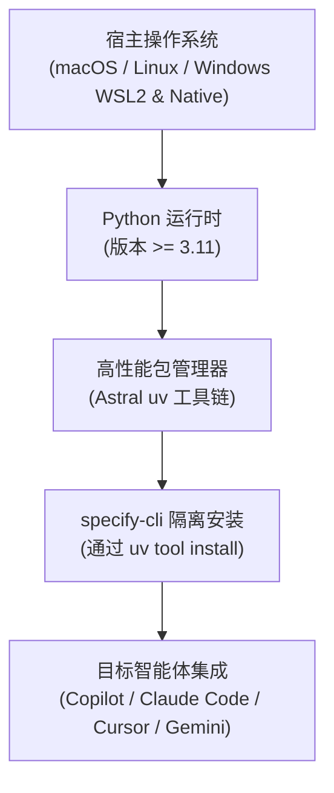
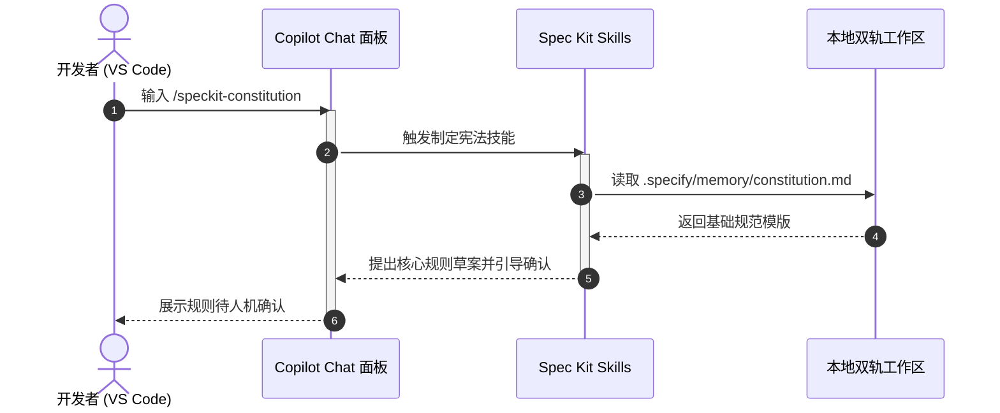

# Spec Kit 环境基准与多 Agent 集成配置指南

| 属性 | 详情 |
| :--- | :--- |
| **文档类型** | 技术专题指南 / 安装部署手册 |
| **当前状态** | 已归档 (Accepted) |
| **作者** | Ateng |
| **创建日期** | 2026-09-24 |
| **关联系统/模块** | Spec Kit (`github/spec-kit`) |

---

## 1. 运行环境基准与前置依赖

`specify-cli` 作为 Spec Kit 的核心命令行工具，专为现代工程研发环境设计，具有严密的前置依赖基准。



### 1.1 Python 3.11+ 与 `uv` 包管理器基线

1. **Python 运行时要求 (>= 3.11)**：
   - Spec Kit 采用现代 Python 类型标注系统，并重度依赖标准库内建的 `tomllib`（TOML 格式解析器）以及增强的异步与异常回溯机制。
   - 确保宿主机已安装 Python 3.11 或更高版本：
     ```bash
     python --version
     # 输出示例: Python 3.11.8 或 Python 3.12.x
     ```

2. **高性能包管理器 `uv`**：
   - 官方强烈推荐并默认依托由 Astral 打造的 Rust 编写极速 Python 包管理器 `uv`。
   - 相比传统的 `pip` 与全局环境，`uv tool` 提供了完全沙箱化的 CLI 运行空间，不会污染系统的全局 Python site-packages，且解析与安装耗时缩短达 10~100 倍。

#### 各平台安装 `uv` 指南

- **macOS / Linux / WSL2**：
  ```bash
  curl -LsSf https://astral.sh/uv/install.sh | sh
  ```
- **Windows (PowerShell)**：
  ```powershell
  powershell -ExecutionPolicy ByPass -c "irm https://astral.sh/uv/install.ps1 | iex"
  ```
- **通过通用包管理器 (Homebrew / Winget)**：
  ```bash
  # macOS / Linux (Homebrew)
  brew install uv

  # Windows (Winget)
  winget install --id=astral-sh.uv -e
  ```

安装完成后，执行版本自检以确认 `PATH` 环境变量生效：
```bash
uv --version
# 输出示例: uv 0.4.x (或更高)
```

---

### 1.2 跨平台兼容性规范

Spec Kit 原生支持 Linux、macOS 与 Windows，但在不同系统下应注意以下环境基线：

| 操作系统环境 | 终端推荐 | 字符编码要求 | 路径分隔符与配置注意事项 |
| :--- | :--- | :--- | :--- |
| **Linux (Ubuntu/Debian/CentOS)** | Bash / Zsh | `UTF-8` (必须) | 标准 POSIX 路径，确保用户拥有 `~/.local/bin` 的执行权限 |
| **macOS (Apple Silicon / Intel)** | Zsh | `UTF-8` (必须) | 若通过 Homebrew 安装，确保 `/opt/homebrew/bin` 在系统 `PATH` 中 |
| **Windows Native (PowerShell)** | PowerShell 7+ | `UTF-8` (推荐) | 建议开启全局 UTF-8 支持；路径中使用正斜杠或双反斜杠进行配置 |
| **Windows (WSL2)** | Bash / Zsh | `UTF-8` (必须) | 强烈建议将代码仓库置于 Linux 文件系统 (`~/...`) 而非挂载盘 (`/mnt/c/...`) |

---

## 2. `specify-cli` 安装与环境自检

### 2.1 通过 `uv tool` 独立隔离安装

推荐使用 `uv tool` 命令将 `specify-cli` 作为独立隔离的 CLI 工具安装至用户级可执行路径：

```bash
# 1. 官方推荐发布版本安装
uv tool install specify-cli

# 2. 或从 GitHub 源码主干安装最新预览版本
uv tool install specify-cli --from git+https://github.com/github/spec-kit.git
```

#### CLI 常用生命周期维护命令

```bash
# 查看已安装的工具列表与入口点
uv tool list

# 升级 specify-cli 到最新稳定版本
uv tool upgrade specify-cli

# 卸载 specify-cli
uv tool uninstall specify-cli
```

> [!NOTE]
> 安装完成后，如果终端提示找不到 `specify` 命令，请检查 `uv tool` 的安装二进制目录（通常为 `~/.local/bin` 或 Windows 下的 `%USERPROFILE%\.local\bin`）是否已加入系统的 `PATH` 环境变量中。

---

### 2.2 环境健康自检 `specify check`

在初始化任何项目或排查问题前，运行 `specify check` 命令可以对当前宿主环境的兼容性进行全方位扫描：

```bash
specify check
```

#### 检查项诊断与解析示例

```text
🔍 Spec Kit Environment Diagnostics
-----------------------------------
[✓] Python Runtime: 3.12.2 (Supported >= 3.11)
[✓] Package Manager: uv 0.4.18 detected
[✓] Git Version: git version 2.44.0 (Repository tools ready)
[✓] Agent Ecosystem: GitHub Copilot CLI & VS Code Extension available
[✓] Network Connectivity: GitHub Pages & PyPI registries accessible
-----------------------------------
Status: All systems ready for Spec-Driven Development.
```

#### 常见异常诊断与处置对策表

| 诊断告警标识 | 产生诱因 | 针对性根治方案 |
| :--- | :--- | :--- |
| `[!] Python version outdated` | 当前默认 Python 低于 3.11 | 使用 `uv python install 3.12` 安装新版本，并指定 `uv tool install --python 3.12 specify-cli` |
| `[!] Git executable not found` | 宿主机缺少 Git 或未在 `PATH` | 安装系统级 Git（如 `sudo apt install git` 或 Windows 安装 Git for Windows） |
| `[!] Missing agent integration` | 未检测到指定的 AI 编码智能体 | 确保已在 IDE 中安装对应插件（如 GitHub Copilot 扩展）或在 CLI 登录该 Agent |

---

## 3. 主流 AI 编程 Agent 集成配置实战

Spec Kit 设计为智能体中立（Agent-Agnostic），支持与当下主流的各种 AI 编码助手深度联动。通过 `specify init` 的 `--integration` 参数即可一键注入适配配置。

### 3.1 GitHub Copilot (VS Code / JetBrains / CLI) 深度集成

GitHub Copilot 是 Spec Kit 的核心原生首发支持平台。

#### 新建项目初始化
```bash
specify init my-app --integration copilot
cd my-app
```

#### 集成机理与生成资产
初始化命令会在工程中注入针对 GitHub Copilot 的上下文指示文件与技能清单：
- **`.github/copilot-instructions.md`**：向 Copilot 注入项目宪法规则，告知其必须严格遵循 SDD 流程。
- **`.vscode/settings.json`**（可选）：配置 Copilot Chat 的相关提示词建议与 Slash Command 自动补全。

#### 在 VS Code 中激活与验证
1. 使用 VS Code 打开刚初始化的 `my-app` 目录。
2. 按 `Ctrl+Shift+I`（或 `Cmd+Shift+I`）打开 **GitHub Copilot Chat** 面板。
3. 确保 Copilot 模型处于 Agent 模式（或具备 Skills 支持）。
4. 在输入框键入 `/speckit-`，若自动弹出候选列表（如 `/speckit-constitution`、`/speckit-specify` 等），即表明集成成功。



---

### 3.2 Claude Code / Cursor / Gemini CLI 适配指南

除了 Copilot，Spec Kit 同时提供了对其他业界领先 Agent 的接入支持：

#### 1. Claude Code
Anthropic 推出的终端 Agent 工具：
```bash
specify init my-app --integration claude-code
```
- **工作机制**：在项目根目录生成 `CLAUDE.md` 与 `.claude/` 工具技能描述文件，使 Claude Code 在启动交互式会话时自动载入宪法原则与任务执行逻辑。

#### 2. Cursor
专为 AI 编程打造的代码编辑器：
```bash
specify init my-app --integration cursor
```
- **工作机制**：在 `.cursorrules` 文件中固化规范约束，并在 `.cursor/rules/` 下生成模块化提示词规约，让 Cursor 的 Composer / Agent 功能在生成代码前强制查询 `specs/` 目录。

#### 3. Gemini CLI
Google 研发的终端智能体：
```bash
specify init my-app --integration gemini-cli
```
- **工作机制**：通过配置 `GEMINI.md` 与 Agent 上下文规则，使 Gemini CLI 支持结构化规格推演。

---

### 3.3 存量工程 (Existing Projects) 增量引入策略

在已存在大量业务源码的成熟工程中引入 Spec Kit 时，遵循**零侵入性**与**增量演进**原则：


#### 实施步骤

1. **进入存量仓库根目录**：
   ```bash
   cd /path/to/existing-enterprise-repo
   ```

2. **执行就地初始化**：
   通过指定当前目录（`.`）进行初始化，Spec Kit 不会修改任何业务源文件，仅会增量添加 `.specify/` 与 `specs/` 目录：
   ```bash
   specify init . --integration copilot
   ```

3. **配置 `.gitignore` 规则**：
   将以下标准规则追加到项目的 `.gitignore` 文件中，确保仅将有价值的规格与宪法纳入版本控制，同时排除运行时临时文件：
   ```gitignore
   # ==========================================
   # Spec Kit 配置与追踪规则
   # ==========================================
   # 必须纳入 Git 版本控制的核心规范资产:
   # !.specify/memory/constitution.md
   # !.specify/templates/
   # !specs/**

   # 临时状态与缓存文件 (忽略)
   .specify/.cache/
   .specify/tmp/
   ```

4. **渐进式过渡策略**：
   - **无需全量重构**：严禁试图将整个存量老项目一次性全量逆向规格化。
   - **从下一个新需求开始**：针对即将开发的下一个 Feature（例如 `feature/user-export`），通过 `/speckit-specify` 建立第一个规范，以增量方式逐步在团队中铺开 SDD 实践。

---

## 4. 下一步向导

完成环境部署与智能体集成后，您已具备进入规格驱动开发的基础设施。

👉 **请继续阅读**：[02-core-workflow-sdd.md](./02-core-workflow-sdd.md)，系统学习从制定宪法（Constitution）、特性规格化（Specify）、架构方案（Plan）、任务拆解（Tasks）到实施验证（Implement）的 5 阶段完整实战。

---

## 5. 权威参考资料与事实依据 (References & Grounding)

| 事实/决策点 | 采信依据/权威文档 | 信源等级 | 验证状态 |
| :--- | :--- | :--- | :--- |
| **Python 3.11+ 基线要求** | [Spec Kit Prerequisites](https://github.github.io/spec-kit/) | Tier 1 官方文档 | 已核实 |
| **uv 工具链安装与隔离管理** | [Astral uv Official Documentation](https://docs.astral.sh/uv/) | Tier 1 官方文档 | 已核实 |
| **specify-cli 命令行与自检命令** | [github/spec-kit Repository README](https://github.com/github/spec-kit) | Tier 1 官方仓库 | 已核实 |
| **多 Agent 集成清单与机制** | [Spec Kit Integrations Reference](https://github.github.io/spec-kit/reference/integrations.html) | Tier 1 官方文档 | 已核实 |
