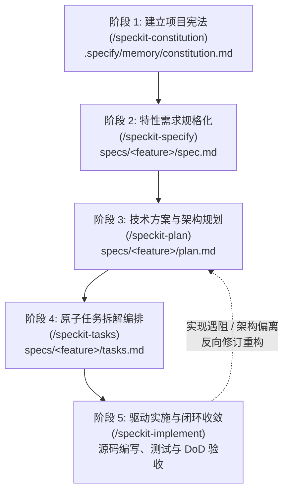
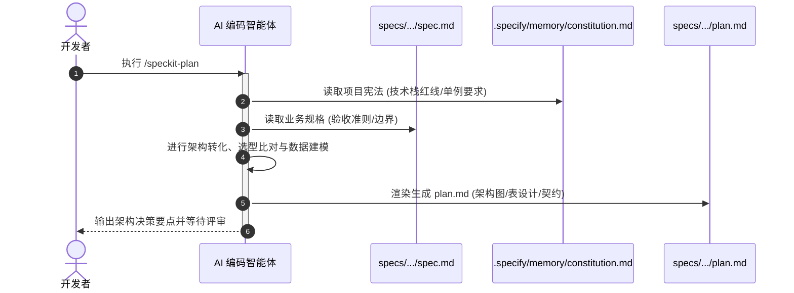
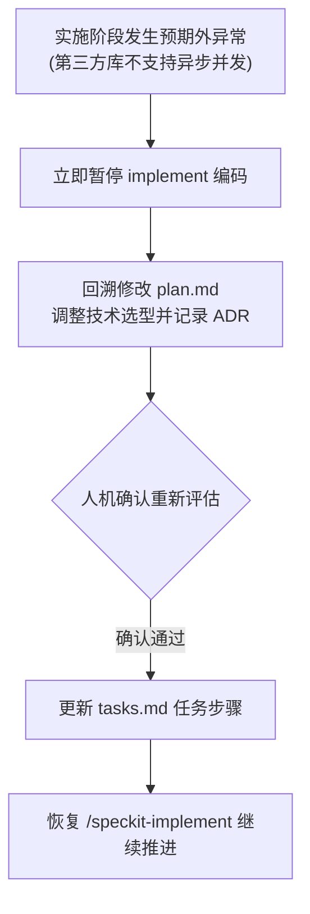

# Spec Kit 核心工作流：从 Constitution 到 Implement 全生命周期实战

| 属性 | 详情 |
| :--- | :--- |
| **文档类型** | 技术专题指南 / 核心工作流实战 |
| **当前状态** | 已归档 (Accepted) |
| **作者** | Ateng |
| **创建日期** | 2026-09-24 |
| **关联系统/模块** | Spec Kit (`github/spec-kit`) |

---

## 1. 核心工作流状态机与全景链路

Spec Kit 的核心是**规格驱动开发 (Spec-Driven Development, SDD)**。它将原本混沌的对话式编码拆解为五个严格递进、具备强约束且可追溯的阶段状态机：



每个阶段均产生标准化的 Markdown 文档资产，既作为人类工程评审的闸门，也作为驱动 AI 编码智能体的只读上下文输入。

---

## 2. 阶段一：建立项目宪法 (Constitution)

### 2.1 项目宪法的定位与非协商性原则

项目宪法落盘于 `.specify/memory/constitution.md`，它是整个工程的“最高基本法”和智能体的“长期工作记忆”。

> [!IMPORTANT]
> **非协商性原则 (Non-Negotiable Rules)**：  
> 宪法中声明的规则具有最高优先级。无论是哪位开发者提问，或是 AI 生成哪个特性的代码，都必须无条件服从宪法。任何违背宪法的代码生成提议都会被智能体前置驳回或在审查阶段被拦截。

宪法通常锁定的工程红线包括：
- **技术栈与版本基准**：严格限制语言版本（如 Python 3.12、JDK 21、Node 20）、核心框架、禁止随意引入外部重型依赖。
- **架构范式与分层规范**：如纯函数优先、单例无状态、Controller 层不得穿透调用 DAO。
- **质量与测试铁律**：如核心业务单测覆盖率需达到 80%+、严禁空的异常捕获块（Catch Block）。
- **版本控制与协作红线**：如严禁 Agent 私自执行 `git push`、必须使用 Conventional Commits。

### 2.2 `/speckit-constitution` 交互实战与模板范例

在 AI 编码助手（如 Copilot Chat）中输入以下指令发起宪法制定：

```text
/speckit-constitution 请根据我们当前项目的技术定位（Python 3.12 + FastAPI + PostgreSQL），制定一套生产级项目宪法。
```

智能体会引导开发者逐项确认规则，最终在 `.specify/memory/constitution.md` 中生成如下标准宪法结构：

```markdown
# 项目工程宪法 (Project Constitution)

## 1. 核心技术栈与运行时基准
- 编程语言: Python 3.12+ (强制开启严苛类型标注与类型守卫)
- Web 框架: FastAPI 0.110+ (结合 Pydantic V2)
- 持久层: SQLAlchemy 2.0 (全异步 async engine + asyncpg 驱动)
- 严禁引入任何未经技术委员会评审的第三方 ORM 或辅助工具包

## 2. 代码质量与工程红线
- 错误处理: 严禁使用裸 except: pass；必须抛出明确继承自 AppBaseException 的业务异常。
- 并发与状态: 所有 Service 单例必须保持完全无状态 (Stateless)；并发操作强制使用分布式锁或原子更新。
- 数据库访问: 禁止在循环体 (Loop) 内发起单条 SQL 查询，批量数据必须使用 bulk 操作。

## 3. 测试与验证标准
- 核心用例: 业务领域模型单元测试覆盖率 >= 85%。
- 契约验证: 所有对外暴露的 REST 接口必须具备自动化端到端测试用例。
```

---

## 3. 阶段二：功能特性规格化 (Specify)

### 3.1 需求分析与 `spec.md` 交付物标准

当启动一个新功能特性（Feature）时，首先明确“**做什么 (What)**”与“**为什么做 (Why)**”，坚决不在此阶段讨论具体技术实现细节（如用什么类、什么表结构）。

规格文件存放在 `specs/<feature-name>/spec.md` 中，其标准结构包含以下 5 大核心模块：

| 模块名称 | 职责说明 | 审查硬性指标 |
| :--- | :--- | :--- |
| **背景与目标 (Context & Goals)** | 说明业务背景、要解决的核心痛点与商业价值 | 目标可量化，痛点真实明确 |
| **用户故事 (User Stories)** | 以 `As a... I want to... So that...` 范式描述场景 | 角色清晰，覆盖主要操作动线 |
| **功能性需求 (Functional Requirements)** | 详细罗列系统必须具备的输入、处理逻辑与输出 | 逻辑自闭环，杜绝模糊主观词汇（如“响应很快”） |
| **明确排除范围 (Out of Scope)** | 显式列出本次开发坚决不做的衍生特性 | 防止范围蔓延与过度设计 |
| **验收准则 (Acceptance Criteria)** | 采用 Given-When-Then 格式描述的可断言验收标准 | 必须具备可自动化测试验证性 |

### 3.2 `/speckit-specify` 交互指令与技巧

向智能体发起规格生成：

```text
/speckit-specify 用户手机验证码快捷登录功能。支持发送 6 位验证码、防刷频率限制（60 秒一次）、验证码 5 分钟有效，并支持新用户自动完成注册。
```

#### 引导 Agent 消除二义性的高阶技巧
1. **主动设防边缘异常**：要求 Agent 补充“验证码连续输错 5 次如何处理”、“网络超时降级策略”。
2. **审查非目标范围**：重点检查生成的 `Out of Scope`，确保诸如“第三方社交登录绑定”、“邮箱登录”被明确排除出第一期排期。

---

## 4. 阶段三：技术方案与架构规划 (Plan)

### 4.1 从功能到技术的架构转化：`plan.md`

在规格定稿后，进入“**如何做 (How)**”的规划阶段。技术方案落盘于 `specs/<feature-name>/plan.md`。



#### `plan.md` 核心组成部分
1. **架构拓扑设计**：包含模块调用依赖与时序流转图。
2. **数据模型与存储方案**：实体设计、数据表 DDL、Redis Key 命名空间与 TTL 策略。
3. **接口契约定义**：明确 HTTP Method、URI、入参校验规则、返回值 Schema 与错误码矩阵。
4. **架构决策记录 (ADR)**：记录关键技术权衡（如“为什么选 Redis 字符串而非 Hash 存储验证码”）。

### 4.2 方案评审与宪法合规性自检

在确认 `plan.md` 之前，必须进行**人机联合双向自检**：
- [ ] **是否违背宪法**：方案中引用的组件是否被宪法明令禁止？
- [ ] **是否满足所有验收准则**：`spec.md` 中的每个 User Story 在技术方案中是否有对应的数据流承接？
- [ ] **是否存在破坏性变更**：是否对存量接口造成不可兼容的破坏？

---

## 5. 阶段四：任务拆解与编排 (Tasks)

### 5.1 可执行的原子任务分解：`tasks.md`

`tasks.md` 是最终实施的施工蓝图。它将宏观的架构方案拆解为可被快速执行、独立断言的原子操作序列（通常每个任务耗时 10~30 分钟）。

```markdown
# 实施任务清单 (Implementation Tasks: 001-user-auth)

## 阶段 1: 基础设施与契约定义
- [ ] 1.1 创建数据模型与数据迁移脚本
  - 产物: `src/models/user.py`, `migrations/versions/001_create_user.py`
  - 验证: 执行 `alembic upgrade head` 成功创建数据表
- [ ] 1.2 定义 Pydantic 请求与响应 Schema
  - 产物: `src/schemas/auth.py`
  - 验证: 编写单元测试验证非法手机号格式被正确拦截

## 阶段 2: 核心服务与业务逻辑实现
- [ ] 2.1 实现短信验证码服务 (SmsVerificationService)
  - 包含 Redis 60s 防刷限流逻辑与 5 分钟过期校验
  - 产物: `src/services/sms.py`
  - 验证: 单元测试覆盖率达到 90%
- [ ] 2.2 实现用户快捷登录核心事务逻辑
  - 产物: `src/services/auth.py`
  - 验证: 模拟新用户与老用户并发登录用例均通过

## 阶段 3: API 控制层与端到端集成
- [ ] 3.1 编写 AuthController 并挂载路由
  - 产物: `src/api/v1/auth.py`
  - 验证: 通过 pytest-httpx 进行全链路 API Mock 测试
```

### 5.2 `/speckit-tasks` 指令与任务编排纪律

在 Chat 中输入 `/speckit-tasks` 触发自动拆解。审查任务清单时需注意：
1. **测试先行 (TDD) 显式化**：确保每个业务功能任务紧跟对应的测试用例任务，坚决杜绝“最后集中补测试”的面条式编排。
2. **依赖无环性**：阶段 1 的产物必须是阶段 2 的纯前置，避免任务间产生循环依赖。

---

## 6. 阶段五：实施落地与收敛验证 (Implement & Convergence)

### 6.1 依据规范驱动代码生成：`/speckit-implement`

执行阶段是智能体大显身手的主场，但其行为被严格限定在 `tasks.md` 的范围之内。

```bash
# 在智能体对话框中按序推进执行
/speckit-implement 推进阶段 1 的任务 1.1 与 1.2
```

#### 实施流转纪律
1. **单任务聚焦 (Single-Task Focus)**：智能体一次仅执行 1~2 个原子任务，完成对应代码编写并立即运行配套测试。
2. **状态自动推进**：任务测试通过后，智能体就地修改 `tasks.md`，将对应项标记为 `[x]`。
3. **严禁越权修改**：智能体不得在 `implement` 阶段私自擅改 `spec.md` 或引入未报备的依赖。

---

### 6.2 规范与代码的双向对齐与回归验证 (Convergence)

在软件工程实际落地中，计划赶不上变化是客观规律（例如第三方 SDK 接口废弃、底层网络库异步兼容性问题）。



> [!CAUTION]
> **绝对禁止私自掩盖问题**：  
> 当实现遇到阻塞时，绝不能允许 AI 采取“临时用硬编码绕过”、“注释掉单测断言”等恶劣手段强行交卷。必须严格触发双向对齐，通过修改 `plan.md` 并在人机确认后更新 `tasks.md`，使工程重回稳健闭环。

#### 完工定义矩阵 (Definition of Done, DoD)
当所有任务均被标记为 `[x]` 后，项目进入最终收敛验证：
- [x] 所有单元测试与集成测试 100% 通过（Green Build）。
- [x] 代码符合项目宪法 (`constitution.md`) 规范，无裸打印、无死循环隐患。
- [x] 特性目录下的 `spec.md`、`plan.md` 与实际生成的代码 100% 保持一致，无残留未决项。

---

## 7. 权威参考资料与事实依据 (References & Grounding)

| 事实/决策点 | 采信依据/权威文档 | 信源等级 | 验证状态 |
| :--- | :--- | :--- | :--- |
| **Spec Kit SDD 5 阶段模型** | [GitHub - github/spec-kit README](https://github.com/github/spec-kit) | Tier 1 官方仓库 | 已核实 |
| **宪法记忆机制 (.specify/memory)** | [Spec Kit Architecture Documentation](https://github.github.io/spec-kit/) | Tier 1 官方文档 | 已核实 |
| **Markdown 驱动的结构化任务清单** | [Spec Kit Templates Guide](https://github.github.io/spec-kit/) | Tier 1 官方文档 | 已核实 |
| **双向收敛与防漂移架构设计** | [GitHub Blog: Spec-Driven Development](https://github.blog/) | Tier 1 官方发布 | 已核实 |
