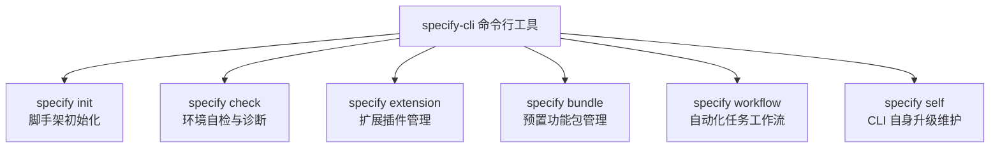
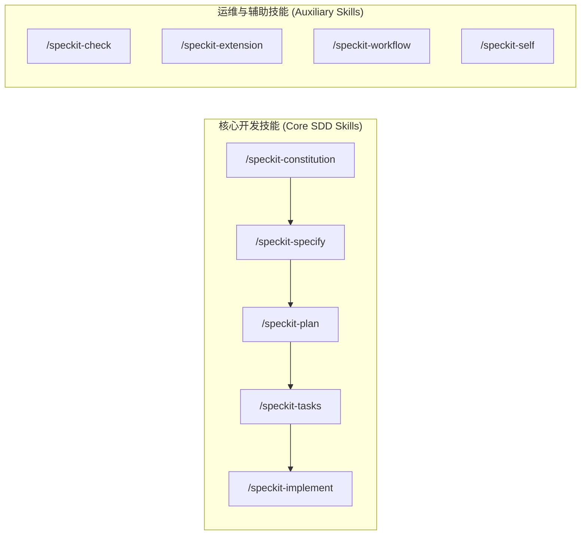

# Spec Kit CLI 命令行与 Agent Skills 深度参考手册

| 属性 | 详情 |
| :--- | :--- |
| **文档类型** | 接口契约 / 命令行与技能参考手册 |
| **当前状态** | 已归档 (Accepted) |
| **作者** | Ateng |
| **创建日期** | 2026-09-24 |
| **关联系统/模块** | Spec Kit (`github/spec-kit`) |

---

## 1. `specify-cli` 命令行接口全量字典

`specify-cli` 是 Spec Kit 的底层工程驱动工具，负责项目脚手架搭建、工作区健康探测、模板渲染与扩展管理。



---

### 1.1 `specify init [project-name]`：脚手架初始化

用于在新目录或存量目录中搭建 Spec Kit 双轨工作区环境。

#### 语法格式
```bash
specify init [PROJECT_NAME] [OPTIONS]
```

#### 参数与选项字典

| 参数 / 选项 | 简写 | 必填 | 默认值 | 详细功能与语义说明 |
| :--- | :--- | :--- | :--- | :--- |
| `PROJECT_NAME` | - | 否 | `.` | 目标工程名称或目录路径。若为 `.` 则在当前工作目录就地初始化。 |
| `--integration` | `-i` | 否 | `copilot` | 指定目标 AI 编码智能体。可选值：`copilot`、`claude-code`、`cursor`、`gemini-cli`。 |
| `--preset` | `-p` | 否 | `default` | 预置配置模板包。用于引入特定领域（如 web-app, backend-api, library）的基础规则。 |
| `--template` | `-t` | 否 | `builtin` | 指定自定义 Markdown 模板仓库的 Git URL 或本地路径。 |
| `--force` | `-f` | 否 | `false` | 强制覆盖模式。若目标目录已存在旧的 `.specify/`，将备份并重写。 |
| `--no-git` | - | 否 | `false` | 跳过自动执行 `git init`（默认情况下若目标目录非 Git 仓库会自动初始化）。 |

#### 典型应用范例

```bash
# 场景 1: 使用 GitHub Copilot 模板初始化全新的微服务工程
specify init user-service --integration copilot

# 场景 2: 在已有存量 Git 仓库中非破坏性引入 Spec Kit
cd my-legacy-repo
specify init . --integration copilot

# 场景 3: 指定 Claude Code 并引入企业定制模板
specify init analytics-engine --integration claude-code --template https://github.com/my-org/spec-templates.git
```

---

### 1.2 `specify check`：环境自检与依赖诊断

扫描宿主操作系统的运行环境、Git 状态、AI Agent 插件激活度及网络连通性。

#### 语法格式
```bash
specify check [OPTIONS]
```

#### 选项字典

| 选项 | 必填 | 默认值 | 详细功能说明 |
| :--- | :--- | :--- | :--- |
| `--verbose` / `-v` | 否 | `false` | 输出全量诊断细节（包含具体检测路径、动态库加载信息与环境变量值）。 |
| `--fix` | 否 | `false` | 尝试自动修复可自动解决的环境问题（如自动修正权限、补齐缺失的默认配置文件）。 |
| `--format` | 否 | `text` | 输出格式。可选值：`text`、`json`（方便 CI/CD 流水线自动化解析）。 |

#### 典型应用范例

```bash
# 日常自检输出文本报告
specify check

# CI/CD 门禁流水线输出 JSON 用于质量网关拦截
specify check --format json > spec-check-report.json
```

---

### 1.3 `specify extension`：扩展与插件管理

管理 Spec Kit 的外挂扩展（如 Bug 修复专用工作流、创新想法评估流等）。

#### 语法格式
```bash
specify extension <SUBCOMMAND> [OPTIONS]
```

#### 子命令字典

| 子命令 | 语义功能 | 典型示例 |
| :--- | :--- | :--- |
| `list` | 列出已安装及官方支持的所有扩展插件 | `specify extension list` |
| `add <name>` | 安装并激活指定的扩展插件 | `specify extension add bugfix` |
| `remove <name>` | 卸载指定的扩展插件 | `specify extension remove bugfix` |
| `update [name]` | 更新指定或全量已安装扩展 | `specify extension update --all` |

---

### 1.4 `specify bundle`：功能预置包管理

用于批量装配特定开发场景所需的规则包、模板与自动化脚本集合。

```bash
# 列出可用的 bundle
specify bundle list

# 安装官方推荐的平台快速起步包
specify bundle install platform-starter
```

---

### 1.5 `specify workflow`：自动化工作流执行

驱动预设的工程自动化任务流，将 Markdown 规格资产与第三方研发协同平台打通。

#### 语法格式与典型场景
```bash
# 将当前特性的 tasks.md 自动拆解并同步至 GitHub Issues
specify workflow run taskstoissues --feature 001-user-auth

# 校验当前特性的 spec 与代码实现覆盖度
specify workflow run verify-convergence
```

---

### 1.6 `specify self`：CLI 自身生命周期管理

```bash
# 检查当前 specify-cli 是否存在新版本
specify self check

# 平滑自动升级至最新稳定版本
specify self update
```

---

## 2. Agent Skills 交互全景速查手册

Spec Kit 将复杂的规范流程映射为面向智能体的 Slash Command。在 IDE 的 Agent 对话面板中，通过输入 `/speckit-*` 即可驱动对应的工程技能。



---

### 2.1 核心过程类 Skills 深度速查

#### 1. `/speckit-constitution` (项目宪法制定)
- **触发时机**：项目初期立项，或团队技术架构/规范发生重大调整时。
- **输入指令范例**：
  ```text
  /speckit-constitution 基于 Go 1.22 + Gin + GORM 技术栈，确立包含分层解耦、错误码规范及单元测试覆盖率 >= 80% 的项目宪法。
  ```
- **核心交付物**：`.specify/memory/constitution.md`
- **审查重点**：是否包含不可协商的架构底线；是否明确了代码规范与测试红线。

#### 2. `/speckit-specify` (需求特性规格化)
- **触发时机**：启动新功能特性开发前。
- **输入指令范例**：
  ```text
  /speckit-specify 商品秒杀扣库存服务。需支持高并发防超卖、一人一单限制、秒杀倒计时以及订单超时自动关单返还库存。
  ```
- **核心交付物**：`specs/<feature-name>/spec.md`
- **审查重点**：`User Stories` 角色是否清晰；`Out of Scope` 是否明确排除了衍生需求；`Acceptance Criteria` 是否具备自动化可测性。

#### 3. `/speckit-plan` (技术方案与架构规划)
- **触发时机**：`spec.md` 评审通过后，编码实施前。
- **输入指令范例**：
  ```text
  /speckit-plan 为秒杀扣库存服务设计高可用技术方案。重点设计 Redis 预扣库存 Lua 脚本、RocketMQ 异步削峰下单以及分布式事务一致性保障。
  ```
- **核心交付物**：`specs/<feature-name>/plan.md`
- **审查重点**：数据模型设计是否合理；选型是否服从项目宪法；是否包含明确的 ADR 决策。

#### 4. `/speckit-tasks` (原子任务拆解)
- **触发时机**：`plan.md` 评审定稿后。
- **输入指令范例**：
  ```text
  /speckit-tasks 将秒杀扣库存方案拆解为具备 TDD 驱动特性的实施任务清单，每个任务执行时间控制在 20 分钟内。
  ```
- **核心交付物**：`specs/<feature-name>/tasks.md`
- **审查重点**：任务粒度是否细小原子化；是否每个核心逻辑均配套了对应的单元测试任务；任务先后依赖拓扑是否清晰。

#### 5. `/speckit-implement` (驱动实施落地)
- **触发时机**：任务清单确认后，开始编写业务代码。
- **输入指令范例**：
  ```text
  /speckit-implement 按照 tasks.md 依序实施阶段 1 的任务 1.1 与 1.2，生成代码并立即执行单元测试。
  ```
- **核心交付物**：业务源码、单元测试用例及状态更新为 `[x]` 的 `tasks.md`。
- **审查重点**：AI 是否严格依照 `plan.md` 生成代码；测试是否全部跑通（Green Build）；严禁擅自引入未在规范中声明的依赖。

---

### 2.2 辅助运维与扩展类 Skills

| 技能名称 | 对应底层 CLI | 交互指令范例 | 语义功能说明 |
| :--- | :--- | :--- | :--- |
| `/speckit-check` | `specify check` | `/speckit-check` | 在当前会话中触发环境诊断，快速发现工具链或环境异常 |
| `/speckit-extension` | `specify extension` | `/speckit-extension add bugfix` | 在当前工程中安装或列出扩展模块 |
| `/speckit-bundle` | `specify bundle` | `/speckit-bundle install starter` | 一键安装特定开发场景的配置模板包 |
| `/speckit-workflow` | `specify workflow` | `/speckit-workflow taskstoissues` | 执行自动化流处理，如将任务转换为 GitHub Issues |
| `/speckit-self` | `specify self` | `/speckit-self check` | 检查并提示是否有更新的 Spec Kit 版本 |

---

## 3. 常见报错与故障排除矩阵 (Troubleshooting)

在实际工程落地过程中，若遇到异常状态，可参考下表进行快速定位与根治：

| 故障现象 / 报错信息 | 根因剖析 (Root Cause) | 排查命令 / 诊断步骤 | 标准根治方案 (Fix) |
| :--- | :--- | :--- | :--- |
| **IDE Chat 输入 `/speckit-` 无自动补全** | 智能体插件未识别当前工作区的 Skills 规约，或 IDE 索引尚未刷新 | 检查工作区是否存在 `.github/copilot-instructions.md` 或 `.vscode/` | 1. 执行 `specify check`<br/>2. 重启 IDE 或按 `Ctrl+Shift+P` 执行 `Developer: Reload Window` |
| **`specify check` 提示 Python 版本不满足** | 系统默认激活的 Python 解释器低于 3.11 | 执行 `python --version` 查看当前激活版本 | 使用 `uv python install 3.12`，并通过 `uv tool install --python 3.12 specify-cli --force` 重建安装 |
| **执行 `/speckit-plan` 提示 active feature 未锁定** | `specs/` 目录下存在多个未完成特性，或 `.specify/feature.json` 状态丢失 | 查看 `.specify/feature.json` 内容 | 在指令中显式指明特性名：`/speckit-plan feature=001-user-auth`，系统将重新绑定活跃上下文 |
| **Windows 终端中文乱码或特殊符号报错** | Windows 控制台代码页非 UTF-8，导致 Markdown 模板渲染失败 | 在 PowerShell 运行 `chcp` 查看代码页 | 运行 `chcp 65001` 切换为 UTF-8；或在 PowerShell 启动配置中加入 `[Console]::OutputEncoding = [System.Text.Encoding]::UTF8` |
| **任务实施中 AI 陷入死循环或擅改宪法** | AI 上下文窗口受到过多脏历史污染，产生认知漂移 | 观察 AI 是否在修改 `.specify/memory/` | 立即在新窗口开辟全新会话，直接输入 `/speckit-implement 推进 tasks.md 中的任务 2.1`，重新载入干净只读上下文 |

---

## 4. 权威参考资料与事实依据 (References & Grounding)

| 事实/决策点 | 采信依据/权威文档 | 信源等级 | 验证状态 |
| :--- | :--- | :--- | :--- |
| **specify-cli 命令与参数体系** | [github/spec-kit CLI Source](https://github.com/github/spec-kit) | Tier 1 官方仓库 | 已核实 |
| **Agent Skills 机制与 Slash Commands** | [GitHub Copilot Custom Skills Documentation](https://docs.github.com/copilot/) | Tier 1 官方文档 | 已核实 |
| **PyPI specify-cli 发行参数** | [PyPI - specify-cli](https://pypi.org/project/specify-cli/) | Tier 1 官方仓库 | 已核实 |
| **Task 自动化工作流与 GitHub Issues 联动** | [Spec Kit Workflows Guide](https://github.github.io/spec-kit/) | Tier 1 官方文档 | 已核实 |
