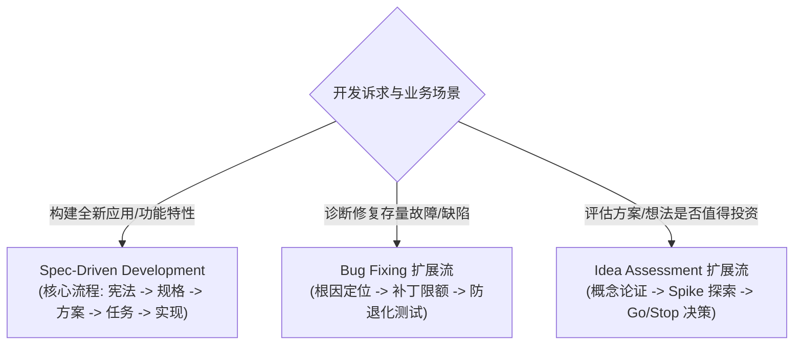
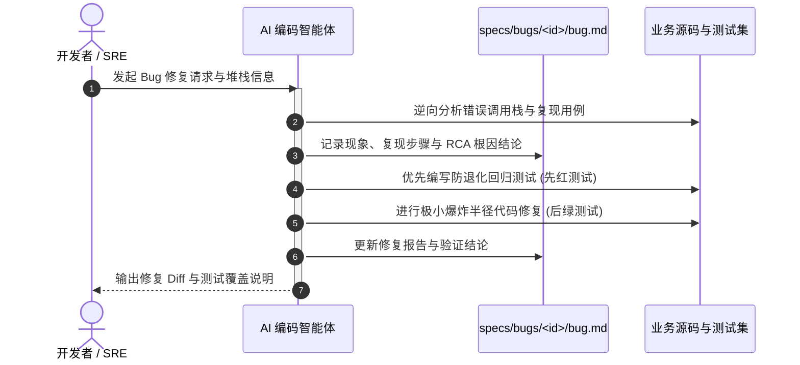
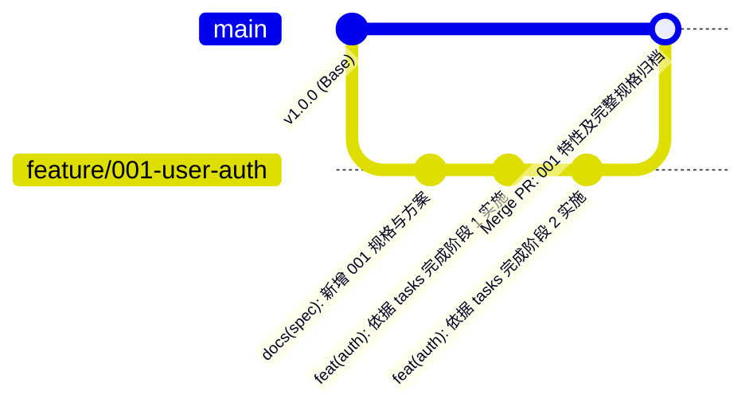
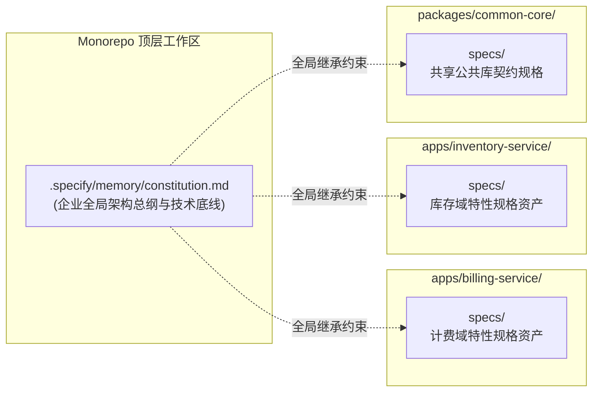

# Spec Kit 扩展生态、高级工作流与企业级实战指南

| 属性 | 详情 |
| :--- | :--- |
| **文档类型** | 技术专题指南 / 进阶架构与实战 |
| **当前状态** | 已归档 (Accepted) |
| **作者** | Ateng |
| **创建日期** | 2026-09-24 |
| **关联系统/模块** | Spec Kit (`github/spec-kit`) |

---

## 1. 官方扩展模式实战 (Bundled Extensions)

除了核心的规格驱动开发（SDD）用于构建新特性外，Spec Kit 还内置了针对排障诊断与早期决策的专属扩展流程。它们作为独立入口，无需走完完整的 SDD 周期。



---

### 1.1 缺陷修复流 (Bug Fixing Workflow)

在排查线上故障或修复严重缺陷时，盲目让 AI 修改代码极易引发次生灾难（打破未预见的不变量、掩盖真正根因）。Bug Fixing 扩展流强制 AI 遵循严谨的故障诊断三原则。

#### 流程推进阶段



#### 核心阶段与规范动作
1. **故障现象与环境捕获**：记录触发 Bug 的输入参数、系统状态与完整错误堆栈。
2. **根因分析 (Root Cause Analysis, RCA)**：AI 必须从底层逻辑推导为什么会发生该问题，杜绝仅仅通过 `try-catch` 或简单的判空来掩耳盗铃。
3. **极小爆炸半径补丁 (Scoped Fix)**：修改范围严格限制在引发 Bug 的关键逻辑上，严禁趁机做大面积代码格式化或重构。
4. **防退化回归测试 (Regression Test)**：在动笔修复前，强制编写一个能稳定复现该 Bug 的失败测试（Red Test）；修复完成后该测试变绿（Green Test），并作为长效测试资产留存。

---

### 1.2 创新提案与可行性评估流 (Idea Assessment Workflow)

当产品或技术团队涌现一个新点子，尚不确定是否具备可行性或投入产出比（ROI）时，启动评估流。

#### 评估决策矩阵
评估流最终产出一份结构化的评估结论报告，协助架构师作出决断：

| 评估维度 | 考察要点 | 决策权重 |
| :--- | :--- | :--- |
| **技术可行性 (Feasibility)** | 现有底层架构能否支撑？是否需要重构存量系统？ | 35% |
| **依赖与风险 (Dependencies & Risks)** | 是否引入许可协议有争议的开源组件？是否有厂商锁定风险？ | 25% |
| **投入成本与工期 (Effort Estimation)** | 预估原子任务规模与人天成本 | 20% |
| **架构契合度 (Architectural Alignment)** | 是否违背 `.specify/memory/constitution.md` 设定的工程原则？ | 20% |

#### 终局三岔路决策 (Terminal Decisions)
- **🟢 Go (准予立项)**：证据充分且风险可控，系统自动将评估产物转化为特性目录，无缝接入 `/speckit-specify` 启动正式开发。
- **🟡 Clarify (延期补充)**：存在关键未决技术点（如外部 API 计费未知、压测数据缺失），生成补充 Spike 任务。
- **🔴 Stop (果断止损)**：投入产出比过低或严重破坏现有架构，记录否决原因并归档，避免资源浪费。

---

## 2. 团队协作与 CI/CD 自动化集成

为了在大规模团队协作中防止开发者或 AI 绕过规格直接提交“未报备代码”，必须在自动化流水线中配置守门员机制。

### 2.1 GitHub Actions 工作流与规格合规门禁

在工程的 `.github/workflows/spec-governance.yml` 中配置如下流水线，实现代码与规格的强制协同审查：

```yaml
# 文件: .github/workflows/spec-governance.yml
name: Spec Kit Governance & Lint

on:
  pull_request:
    branches: [main, master, develop]
    paths:
      - 'src/**'
      - 'specs/**'
      - '.specify/**'

jobs:
  verify-spec-compliance:
    name: Verify SDD Compliance & Convergence
    runs-on: ubuntu-latest

    steps:
      - name: Checkout Code
        uses: actions/checkout@v4
        with:
          fetch-depth: 0

      - name: Set up Python 3.12
        uses: actions/setup-python@v5
        with:
          python-version: '3.12'

      - name: Install uv & specify-cli
        run: |
          curl -LsSf https://astral.sh/uv/install.sh | sh
          echo "$HOME/.local/bin" >> $GITHUB_PATH
          uv tool install specify-cli

      - name: Run Environment Check
        run: specify check

      - name: Check Spec-Code Convergence
        run: |
          # 验证 PR 中若包含业务代码变更，必须同时包含或存在对应的 specs/ 规约更新
          python - << 'EOF'
          import sys, subprocess
          
          # 获取本次 PR 变动的文件列表
          result = subprocess.check_output(["git", "diff", "--name-only", "origin/${{ github.base_ref }}", "HEAD"]).decode("utf-8")
          changed_files = result.splitlines()
          
          has_src_changes = any(f.startswith("src/") for f in changed_files)
          has_spec_changes = any(f.startswith("specs/") for f in changed_files)
          
          if has_src_changes and not has_spec_changes:
              print("❌ [门禁拦截] 检测到业务代码发生了变更，但未在 specs/ 目录下提供或更新对应的规格说明文档！")
              print("请遵循规格驱动开发 (SDD) 纪律，提交相应的 spec.md 或 tasks.md 更新。")
              sys.exit(1)
              
          print("✅ [通过] 业务代码变更与规格文档保持对齐。")
          EOF
```

---

### 2.2 规格文档的版本控制策略与 Git 分支模型

在团队 Git 协作中，推荐采用“**特性规格随分支同生共死**”的模型：



1. **同分支协同**：特性的 `specs/<feature>/` 文档与实现它的业务代码存放在同一个 Git 分支中。
2. **Review 先行**：代码审查（Code Review）时，审阅人先阅读 `spec.md` 与 `plan.md` 理解意图，再审查代码 Diff，大幅降低沟通成本。
3. **主干活文档 (Living Documentation)**：当分支合并入主干后，`specs/` 下累积的历史规格成为系统最真实、永远不过期的架构活文档资产。

---

## 3. 企业级治理与定制模板最佳实践

### 3.1 定制公司级专属 `.specify/templates/`

为了将企业的安全合规审计、监控打点规范和技术中台标准固化给 AI，企业架构组可以定制集中式模板包。

#### 定制模板目录结构
```text
my-enterprise-templates/
├── spec-template.md           # 注入合规性审查章节 (GDPR/数据脱敏/PII 检查)
├── plan-template.md           # 强制包含 Prometheus 指标定义与链路追踪 TraceId 规范
├── tasks-template.md          # 强制包含安全扫描与压力测试任务节点
└── constitution-template.md   # 锁定企业级私有包仓库与内网安全认证规范
```

#### 项目引用企业模板
```bash
# 从内部 Git 仓库拉取模板创建新项目
specify init order-service --integration copilot --template https://git.internal.corp/arch/spec-templates.git
```

---

### 3.2 大规模项目多模块 / Monorepo 适配范式

在包含数十个微服务或大型前端 Monorepo 的仓库中，Spec Kit 推荐采用**分层联邦式目录布局**：



- **全局统一宪法**：在 Monorepo 根目录下维护唯一的 `.specify/memory/constitution.md`，对代码命名风格、版本控制标准和公共安全规范实施集中管控。
- **模块独立资产**：各个独立业务模块（`apps/*`、`packages/*`）各自拥有独立的 `specs/` 目录，隔离各自的特性演进，避免巨型单体规格膨胀。

---

## 4. 全套技术文档套件全景总结

至此，Spec Kit 工业级技术文档套件已完整交付：

1. **[全景导读与 SDD 范式 (index.md)](./index.md)**：建立了规格驱动开发的核心三大公理与双轨架构体系。
2. **[环境基准与多 Agent 集成 (01-installation-and-setup.md)](./01-installation-and-setup.md)**：提供了 Python 3.11+ / uv 工具链、主流 Agent 接入与存量工程引入指南。
3. **[核心工作流全景实战 (02-core-workflow-sdd.md)](./02-core-workflow-sdd.md)**：深入剖析了 Constitution → Specify → Plan → Tasks → Implement 5 阶段模型。
4. **[CLI 命令与技能速查手册 (03-cli-and-commands.md)](./03-cli-and-commands.md)**：提供了全量参数参考、Skills 触发词及故障排查矩阵。
5. **[扩展生态与企业实战 (04-extensions-and-advanced.md)](./04-extensions-and-advanced.md)**：赋能了 Bug 修复、可行性评估、CI/CD 自动化门禁与大型 Monorepo 治理。

---

## 5. 权威参考资料与事实依据 (References & Grounding)

| 事实/决策点 | 采信依据/权威文档 | 信源等级 | 验证状态 |
| :--- | :--- | :--- | :--- |
| **Bug Fixing & Idea Assessment 扩展流程** | [Spec Kit Official Process Guide](https://github.github.io/spec-kit/) | Tier 1 官方文档 | 已核实 |
| **GitHub Actions CI/CD 自动化集成** | [GitHub Actions Documentation](https://docs.github.com/actions) | Tier 1 官方文档 | 已核实 |
| **Spec Kit 自定义模板机制** | [Spec Kit Templates Guide](https://github.github.io/spec-kit/) | Tier 1 官方文档 | 已核实 |
| **Monorepo 与多包管理架构设计** | [GitHub - github/spec-kit Issues & Discussions](https://github.com/github/spec-kit) | Tier 1 官方仓库 | 已核实 |
