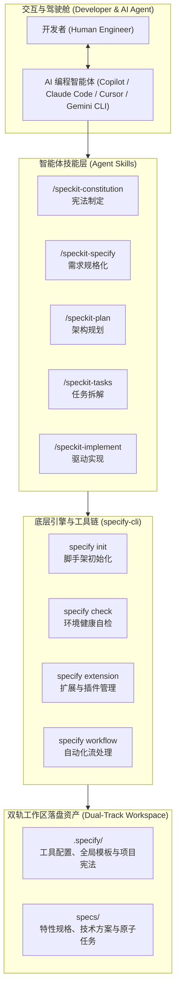

# Spec Kit 全景导读与规格驱动开发 (SDD) 范式

| 属性 | 详情 |
| :--- | :--- |
| **文档类型** | 全景导读 / 核心范式规范 |
| **当前状态** | 已归档 (Accepted) |
| **作者** | Ateng |
| **创建日期** | 2026-09-24 |
| **关联系统/模块** | Spec Kit (`github/spec-kit`) |

---

## 1. 规格驱动开发 (Spec-Driven Development, SDD) 范式演进

在生成式人工智能（Generative AI）深度融入软件工程研发的当下，开发者与 AI 协同编码的方式经历了剧烈的范式变迁。


### 1.1 从“凭感觉写代码 (Vibe Coding)”到“精准工程落地”

在早期或非受控的 AI 辅助编码中，开发者通常采用“Vibe Coding”（即兴对话编码）模式：直接向大模型输入自然语言描述，期待 AI 瞬间生成满足需求的代码。然而在严肃的企业级工程中，这种粗放模式暴露出不可调和的工程痛点：

1. **认知漂移与幻觉累积 (Context Drift & Hallucination)**：随着对话轮次增加，模型上下文窗口遗忘关键约束，频繁产生不存在的 API 调用或破坏存量架构。
2. **范围蔓延与无休止返工 (Scope Creep)**：没有前置规格验收准则（Acceptance Criteria），AI 容易“过度工程（Over-engineering）”或遗漏核心边缘场景，导致大量时间耗费在调试与重构中。
3. **知识不可溯 (No Audit Trail)**：对话历史一旦关闭，整个功能的决策动机、技术权衡与实施步骤全部丢失，项目沦为黑盒遗留代码（Legacy Code）。

为此，GitHub 开源了 **Spec Kit**，系统化地提出了 **规格驱动开发 (Spec-Driven Development, SDD)** 范式：**将软件开发的核心重心从“直接催生代码”前置并锚定在“构建精准规格”之上**。

| 比较维度 | 随意提问模式 (Vibe Coding) | 规格驱动开发 (Spec-Driven Development) |
| :--- | :--- | :--- |
| **真理之源** | 散落在多轮即时对话中的临时提示词 | 结构化落盘的 Markdown 规格文件 (`spec.md`, `constitution.md`) |
| **需求边界** | 模糊、动态变化，随模型发挥而波动 | 前置锁定，具备清晰的范围界限与明确的非目标 (Out of Scope) |
| **设计权衡** | 由 AI 黑盒隐式决策，缺乏技术选型记录 | 通过 `plan.md` 显式呈现架构设计、数据模型与 ADR 决策 |
| **执行可控度** | 单次倾泻数百行代码，难以审查与精准回滚 | 拆解为原子任务 (`tasks.md`)，逐项实现并可自动化断言 |
| **演进可维护性** | 极差，二次修改极易引发隐蔽回归 | 优异，后续 Agent 或开发者可基于存量规格精准增量迭代 |

---

### 1.2 SDD 核心三大公理与单一真理之源

Spec Kit 的运行体系构建在三大底层公理之上：

> [!IMPORTANT]
> **公理一：规格即契约 (Specification as Contract)**  
> 任何业务代码的编写，必须且仅能以经过人机确认的规格说明书 (`spec.md`) 为唯一事实依据。未被规格显式声明的特性不得擅自实现，杜绝 AI 主观脑补。

> [!IMPORTANT]
> **公理二：机器可读与结构化编排 (Machine-Readable & Structured Orchestration)**  
> 所有的约束（宪法）、需求（规格）、架构（方案）与执行计划（任务）均采用严谨的 Markdown 结构化呈现，既供人类开发者快速审阅，也天然作为 Agent 的强约束 Prompt 模板。

> [!IMPORTANT]
> **公理三：双向对齐与闭环收敛 (Bi-directional Alignment & Convergence)**  
> 实施过程并非单向瀑布，当实际编码遇到未预期的技术阻塞时，必须反向修订 `plan.md` 或 `spec.md` 并获得确认，保证“文档-设计-代码”100% 同步收敛。

---

## 2. Spec Kit 架构全景与目录布局

Spec Kit 在工程实现上采用了分层解耦的架构设计，由底层的命令行脚手架工具 `specify-cli` 与面向各主流编程智能体的 Agent Skills 交互层构成。

### 2.1 整体架构拓扑



- **底层引擎 (`specify-cli`)**：基于 Python 3.11+ 构建，通过高性能 `uv` 工具分发，负责工程初始化、多智能体配置注入、扩展安装以及环境自检。
- **智能体技能层 (`/speckit-*`)**：将规范流程封装为智能体原生的 Slash Command 技能，使开发者无需频繁跳出编辑器终端，在对话窗口即可驱动复杂的工程脚手架。
- **资产存储层 (双轨工作区)**：物理落盘所有规范文件，将工程全局规则与具体特性演进清晰隔离。

---

### 2.2 工作区双轨分离机制 (`.specify/` vs `specs/`)

当在项目中执行 `specify init` 之后，Spec Kit 会在项目根目录下建立清晰的双轨目录体系：

```text
my-project/
├── .specify/                       # [轨道 1] Spec Kit 基础设施与全局约束目录
│   ├── memory/
│   │   └── constitution.md        # 项目全局宪法 (开发规范、架构红线、核心原则)
│   ├── templates/                 # 规格、规划与任务的标准 Markdown 模板
│   │   ├── spec-template.md
│   │   ├── plan-template.md
│   │   └── tasks-template.md
│   ├── scripts/                   # 自动化辅助运维脚本
│   └── feature.json               # 当前活跃特性的状态追踪元数据
└── specs/                         # [轨道 2] 业务特性规格与交付物产出目录
    ├── 001-user-authentication/    # 特性目录 (以序号或特性名组织)
    │   ├── spec.md                # 业务需求与功能规格
    │   ├── plan.md                # 架构设计、数据结构与 ADR 决策
    │   └── tasks.md               # 原子化实施任务清单与执行断言
    └── 002-payment-gateway/
        ├── spec.md
        ├── plan.md
        └── tasks.md
```

#### 双轨架构的设计哲学与价值
1. **基础设施与业务资产解耦**：`.specify/` 目录属于工具配置资产，未来升级 `specify-cli` 或更换规范模板时，仅需更新 `.specify/` 目录；而 `specs/` 承载了项目完整的历史业务资产，两者互不污染。
2. **渐进式团队协作**：团队可以在 `.specify/memory/constitution.md` 中固化技术委员会（Tech Lead）的硬性规定；各业务特性的开发者（及 AI）在 `specs/` 下独立推进不同 Feature，避免 Git 冲突。

---

## 3. 快速上手最小实践 (Quickstart in 3 Minutes)

通过以下三步即可体验完整的规格驱动开发闭环：

### 步骤一：安装 CLI 工具链
在终端中通过 `uv` 隔离安装 `specify-cli`：
```bash
uv tool install specify-cli
```

### 步骤二：初始化工程或集成到现有项目
在目标目录中初始化 Spec Kit（以 GitHub Copilot 为例）：
```bash
specify init my-awesome-project --integration copilot
cd my-awesome-project
```

### 步骤三：启动智能体并开启 SDD 之旅
在 VS Code 或支持的 IDE 中打开该工程，呼出 Copilot Chat 对话框：
1. 输入 `/speckit-constitution`：与 Agent 协作制定并确立项目的技术栈与质量基线。
2. 输入 `/speckit-specify 用户注册登录服务`：自动生成 `specs/001-user-auth/spec.md`。
3. 输入 `/speckit-plan`：生成架构技术方案与依赖说明。
4. 输入 `/speckit-tasks`：拆解原子实施任务列表。
5. 输入 `/speckit-implement`：Agent 依序执行编码与自测。

---

## 4. 文档套件知识地图与后续章节导览

本套件包含以下专业指南，建议根据当前工作阶段按需深入研读：

- **环境搭建与多 Agent 配置**：请参阅 [01-installation-and-setup.md](./01-installation-and-setup.md)，获取 Python / uv 安装细节、VS Code / Claude Code / Cursor 的具体集成配置与现有项目的增量引入指南。
- **核心开发工作流实战**：请参阅 [02-core-workflow-sdd.md](./02-core-workflow-sdd.md)，深入了解 Constitution、Specify、Plan、Tasks、Implement 五大阶段的标准模板、提问技巧与审查要点。
- **CLI 命令行与技能速查**：请参阅 [03-cli-and-commands.md](./03-cli-and-commands.md)，获取 `specify-cli` 全量命令参数、所有 `/speckit-*` Skills 的 Prompt 触发词与故障排除矩阵。
- **扩展生态与企业级实战**：请参阅 [04-extensions-and-advanced.md](./04-extensions-and-advanced.md)，掌握 Bug 快速修复流、Idea 可行性评估、CI/CD 自动化合规门禁及 Monorepo 治理方案。

---

## 5. 权威参考资料与事实依据 (References & Grounding)

| 事实/决策点 | 采信依据/权威文档 | 信源等级 | 验证状态 |
| :--- | :--- | :--- | :--- |
| **Spec Kit 官方开源仓库** | [GitHub - github/spec-kit](https://github.com/github/spec-kit) | Tier 1 官方仓库 | 已核实 |
| **Spec-Driven Development 范式定义** | [GitHub Blog - Spec-Driven Development](https://github.blog/) | Tier 1 官方发布 | 已核实 |
| **工作区双轨目录规范 (`.specify` & `specs`)** | [Spec Kit Architecture Documentation](https://github.github.io/spec-kit/) | Tier 1 官方文档 | 已核实 |
| **specify-cli 安装基准** | [PyPI - specify-cli Package Details](https://pypi.org/project/specify-cli/) | Tier 1 官方仓库 | 已核实 |
