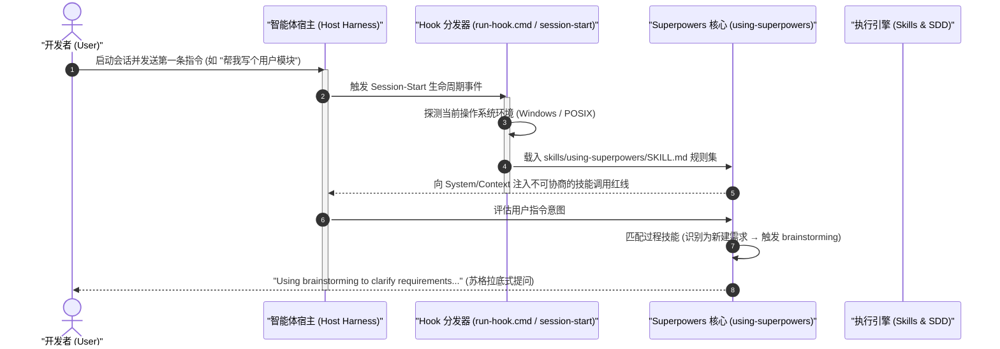

# Superpowers 多平台环境部署与集成指南

| 属性 | 详情 |
| :--- | :--- |
| **文档类型** | 运维指南 / 环境部署手册 |
| **当前状态** | 已归档 (Accepted) |
| **作者** | Ateng |
| **创建日期** | 2026-09-23 |
| **关联系统/模块** | Ateng-AI / Superpowers |

---

## 1. 多平台生态安装实战 (Cross-Platform Installation)

Superpowers 采用了“单一逻辑核心、多宿主自适应”的跨平台架构。根据开发者所使用的智能体运行容器（Harness），选择对应的安装与激活方式。若在同一工作环境中混合使用多个 Harness，需针对每个平台分别执行安装。

### 1.1 官方插件市场安装体系 (Claude Code / Codex / Cursor / Grok)

对于内置了官方插件市场的现代智能体客户端，推荐优先通过其原生市场命令一键安装：

#### 1. Claude Code
- **通过 Anthropic 官方插件市场安装**（推荐）：
  ```bash
  /plugin install superpowers@claude-plugins-official
  ```
- **通过 Superpowers 专属市场安装**（获取实验性功能）：
  ```bash
  # 1. 注册 Superpowers 官方源市场
  /plugin marketplace add obra/superpowers-marketplace

  # 2. 从该市场安装最新插件
  /plugin install superpowers@superpowers-marketplace
  ```

#### 2. OpenAI Codex (Codex App & Codex CLI)
- **Codex 桌面应用 (Codex App)**：
  1. 打开 Codex 客户端，点击左侧导航栏的 **Plugins**；
  2. 在 **Coding** 分类中找到 `Superpowers`；
  3. 点击其右侧的 `+` 号并根据弹窗提示完成授权安装。
- **Codex 命令行终端 (Codex CLI)**：
  ```bash
  # 打开交互式插件管理界面
  /plugins
  # 搜索并选择 superpowers，确认安装
  ```

#### 3. Cursor IDE (Cursor Agent)
- 在 Cursor Composer 或 Agent 对话面板中直接输入指令：
  ```text
  /add-plugin superpowers
  ```
- 或在 Cursor 扩展设置的 Plugin Marketplace 中直接检索 `superpowers` 并启用。

#### 4. Grok Build CLI (xAI)
- 在 xAI 官方终端环境中执行：
  ```bash
  grok plugin install superpowers@xai
  ```

---

### 1.2 Git 直链与扩展安装体系 (Antigravity / Gemini CLI / Devin / Copilot / Factory Droid)

对于支持通过 Git 仓库链接或专属 CLI 扩展命令加载的平台，可直接指向官方仓库地址：

#### 1. Google Antigravity (AGY)
Antigravity 原生支持插件扩展机制。在终端中执行以下命令：
```bash
agy plugin install https://github.com/obra/superpowers
```
> [!TIP]
> Antigravity 会在会话创建阶段自动触发插件内的 `session-start` 生命周期钩子，安装后无需任何额外前置命令，首条交互即可自动生效。若需更新至最新版本，重新执行上述同款命令即可。

#### 2. Google Gemini CLI
```bash
# 安装扩展
gemini extensions install https://github.com/obra/superpowers

# 后续升级
gemini extensions update superpowers
```

#### 3. Devin CLI (Cognition)
```bash
# 安装插件
devin plugins install obra/superpowers

# 升级至最新版
devin plugins update superpowers
```

#### 4. GitHub Copilot CLI
```bash
# 注册 Superpowers 市场源
copilot plugin marketplace add obra/superpowers-marketplace

# 执行安装
copilot plugin install superpowers@superpowers-marketplace
```

#### 5. Factory Droid
```bash
# 添加官方源
droid plugin marketplace add https://github.com/obra/superpowers

# 从源中安装插件
droid plugin install superpowers@superpowers
```

---

### 1.3 自托管与开源生态安装 (Kimi Code / OpenCode / Pi / Hermes / Muse)

针对自托管、企业内网部署或新兴开源智能体架构，Superpowers 在仓库根目录下提供了专用的元数据与桥接脚本：

- **Kimi Code**：项目根目录已预置 `.kimi-plugin/plugin.json`。将 Superpowers 仓库 Clone 到智能体的配置插件目录（如 `~/.kimi/plugins/superpowers`），Kimi 即可自动解析技能清单。
- **OpenCode**：依赖 `.opencode/plugins/superpowers.js`。执行如下软链接或在配置文件中引入：
  ```bash
  mkdir -p ~/.config/opencode/plugins
  ln -s $(pwd)/.opencode/plugins/superpowers.js ~/.config/opencode/plugins/superpowers.js
  ```
- **Pi Agent**：依赖 `.pi/extensions/superpowers.ts`，由 TypeScript 运行时动态加载。
- **Hermes Agent**：包含 `.hermes-plugin/__init__.py` 与 `plugin.yaml`，在 Python 运行时中直接通过扩展加载器导入。
- **Muse**：包含 `.muse-plugin/plugin.json`，支持标准化声明式加载。

---

## 2. 运行时 Hooks 机制与跨平台启动架构 (Hooks Architecture)

Superpowers 能够在各类智能体中实现“全自动介入”且“无需用户手动提醒”，其底层核心机制在于**声明式生命周期钩子（Lifecycle Hooks）**。

### 2.1 Session-Start Hook 自动激活原理
在支持 Hook 机制的智能体容器（如 Antigravity、Claude Code 等）中，当新会话初始化或进程启动时，宿主环境会自动检索并执行插件声明的 `session-start` 钩子。



其核心执行链路解析如下：
1. **钩子声明 (`hooks/hooks.json`)**：
   ```json
   {
     "hooks": {
       "session-start": {
         "type": "command",
         "command": "./hooks/session-start"
       }
     }
   }
   ```
2. **规则强制注入**：`session-start` 脚本执行后，会将 `skills/using-superpowers/SKILL.md` 的内容推入会话首要上下文。该文件明确规定：智能体在给出**任何代码、文件读取甚至澄清问题之前**，必须先声明并调用适用的过程技能。

---

### 2.2 Polyglot 跨平台启动适配 (POSIX Shell / Windows CMD / PowerShell)

为了防范 Windows 环境下脚本执行权限受阻、换行符差异（CRLF / LF）以及编码解析乱码问题，Superpowers 引入了 **Polyglot 双轨包装器机制**：

- **Windows 环境桥接器 (`hooks/run-hook.cmd`)**：
  在 Windows 平台下，宿主优先调用 CMD 包装器，自动寻找系统中已安装的 Bash（如 Git Bash、WSL 或 MSYS2），并将环境变量与工作目录安全透传。
- **POSIX 原生脚本 (`hooks/session-start`)**：
  在 Linux / macOS 或 POSIX 兼容环境下，直接使用 `#!/usr/bin/env bash` 运行。
- **编码与 BOM 防御**：
  > [!IMPORTANT]
  > 依据 Windows 平台规范，所有在 Windows 控制台或 PowerShell 下流转的 Hook 输出均严格遵循 UTF-8 编码传输，杜绝因 GBK 乱码导致智能体解析指令失败。

---

## 3. 插件生命周期管理与健康诊断 (Lifecycle & Troubleshooting)

### 3.1 插件更新与回滚策略
由于 Superpowers 处于持续演进中，建议定期更新以获得最新的提示词调优与子代理协同补丁。

- **快速全量更新表**：
  | 平台 | 更新命令 |
  | :--- | :--- |
  | **Claude Code** | `/plugin update superpowers` |
  | **Antigravity** | `agy plugin install https://github.com/obra/superpowers` (原地覆盖升级) |
  | **Gemini CLI** | `gemini extensions update superpowers` |
  | **Devin CLI** | `devin plugins update superpowers` |
  | **Cursor** | 在 Plugin 界面点击 `Check for Updates` 或重新执行 `/add-plugin` |

- **回滚与版本锁定**：
  若特定企业项目需要锁定稳定版本，可通过 Git 检出指定 Release Tag：
  ```bash
  # 检出特定的 Release Tag (如 v1.2.0)
  git clone --branch v1.2.0 https://github.com/obra/superpowers.git ~/.superpowers-stable
  ```

---

### 3.2 常见环境报错与排障 SOP

#### 故障 1：Hook 启动报错 `Permission denied` (POSIX / Linux / macOS)
- **现象**：启动会话时智能体报错提示 `hooks/session-start: Permission denied`。
- **原因**：通过 Git Clone 或压缩包解压时，文件的可执行权限位丢失。
- **解决步骤**：
  ```bash
  # 进入 superpowers 安装目录，重新赋予执行权限
  chmod +x hooks/session-start hooks/run-hook.cmd
  ```

#### 故障 2：Node.js 运行时缺失导致 Visual Companion 无法启动
- **现象**：在头脑风暴阶段，智能体提示 `node: command not found` 或 Visual Companion 服务器启动失败。
- **原因**：Superpowers 的可视化画板服务（`skills/brainstorming/scripts/server.cjs`）依赖本地 Node.js 运行时。
- **基线要求**：系统需安装 Node.js >= 18.0.0。
- **验证命令**：
  ```bash
  node -v
  # 输出应形如 v18.x.x / v20.x.x / v22.x.x
  ```

#### 故障 3：Git Worktree 支持异常
- **现象**：执行 SDD 流程时提示 `git worktree add failed`。
- **排查与解决**：
  1. 检查 Git 版本是否满足基线（推荐 Git >= 2.20+）：`git --version`；
  2. 确保当前项目本身已被 Git 初始化（包含 `.git` 目录），严禁在未版本控制的裸目录下运行 SDD；
  3. 确保当前没有冲突的锁文件存在（如 `.git/index.lock`）。

---

## 4. 权威参考资料与事实依据 (References & Grounding)

- [[Tier 1 官方文档]] [Superpowers Installation Guide](https://github.com/obra/superpowers#installation) - 官方各 Harness 安装语法契约 (核验日期: 2026-09-23)
- [[Tier 1 官方源码]] [hooks/hooks.json & hooks/session-start](https://github.com/obra/superpowers/tree/main/hooks) - 声明式 Hook 结构与跨平台启动脚本 (核验日期: 2026-09-23)
- [[Tier 1 官方规范]] [docs/porting-to-a-new-harness.md](https://github.com/obra/superpowers/blob/main/docs/porting-to-a-new-harness.md) - 新 Harness 适配与扩展接入协议 (核验日期: 2026-09-23)

### 核查摘要表格
| 核查对象 (组件/配置/版本) | 官方基准事实 (Ground Truth) | 对应官方依据 (Tier 1 链接) | 状态 |
| :--- | :--- | :--- | :--- |
| **Claude 市场安装命令** | `/plugin install superpowers@claude-plugins-official` | [README.md Claude Code 章节](https://github.com/obra/superpowers#claude-code) | 已核实真实有效 |
| **Antigravity 安装命令** | `agy plugin install https://github.com/obra/superpowers` | [README.md Antigravity 章节](https://github.com/obra/superpowers#antigravity) | 已核实真实有效 |
| **Hook 触发机制** | 依赖 `session-start` 脚本在首条消息前自动注入 `using-superpowers` | [hooks/session-start 源码](https://github.com/obra/superpowers/blob/main/hooks/session-start) | 已核实真实有效 |
