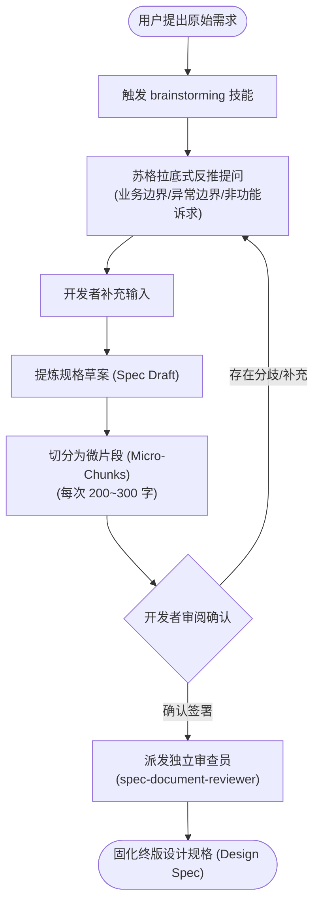

# Superpowers 需求澄清与计划制定指南

| 属性 | 详情 |
| :--- | :--- |
| **文档类型** | 技术专题指南 / 架构设计指南 |
| **当前状态** | 已归档 (Accepted) |
| **作者** | Ateng |
| **创建日期** | 2026-09-23 |
| **关联系统/模块** | Ateng-AI / Superpowers |

---

## 1. 交互式头脑风暴实战 (`brainstorming` 技能)

在常规软件开发中，最昂贵的错误往往不是语法拼写或局部代码缺陷，而是在尚未理解真实意图时就盲目投入编码。Superpowers 的核心铁律之一是：**“任何新特性的构建，必须以头脑风暴（Brainstorming）作为不可逾越的第一步。”**

### 1.1 苏格拉底式需求探寻与反推
当用户说“我想给系统加个缓存”或“开发一个批量导入接口”时，普通 Agent 会立即开始写 Redis 模板或 Controller。而在 Superpowers 体系下，Agent 会退后一步，通过结构化提问消除二义性：

- **业务语义澄清**：数据的生命周期是怎样的？命中率预期是多少？
- **边界防御与故障模式**：底层数据源宕机或并发击穿时如何降级？是否允许弱一致性？
- **技术栈与约束确认**：现存工程中是否有已引入的依赖？是否受到网络或物理资源限制？

> [!NOTE]
> 提问必须聚焦高信息密度，单次提问控制在 2~3 个最具决定性的核心决策点上，杜绝抛出数十个泛化问题给开发者造成认知负担。

### 1.2 分块反馈与渐进式需求锁定 (Progressive Spec Extraction)
人类无法高效审阅长达数千字的连续文本草案。Superpowers 规定，从对话中提炼出的规格文档必须采用**微片段渐进式呈现**：
1. **分段输出**：按“核心契约”、“数据模型”、“错误处理”分别呈现，每段控制在易于快速扫读的体量（$\le 300$ 字）；
2. **段落确认**：在用户确认当前分段无误后，再推进下一章节，杜绝未经确认的假想蔓延；
3. **最终收敛**：所有分段达成共识后，聚合成完整的系统设计文档（Design Spec）。

---

## 2. Visual Companion 本地可视化辅助引擎 (Visual Brainstorming Server)

对于涉及用户界面（UI）、交互流程或拓扑架构的需求，纯文字描述极其容易产生认知偏差。Superpowers 独创性地内置了 **Visual Companion** 机制，通过极简的本地轻量服务器实现“边聊边看、图文互证”。

### 2.1 零依赖架构与轻量服务 (`server.cjs`)
为了杜绝引入庞大的 `node_modules` 依赖树，Visual Companion 采用了**零外部依赖（Zero-Dependency）**的工程设计：
- **纯 Node.js 原生 API**：直接基于 Node.js 内置的 `http` 模块与手写轻量 WebSocket 帧解析器实现；
- **安全鉴权与端口防护**：服务启动时动态生成随机高强度 Token，所有浏览器访问与 WebSocket 握手必须校验 Token，严格防范本地端口扫描与 CSRF 攻击；
- **跨平台生命周期脚本**：提供 `start-server.sh` 与 `stop-server.sh`（配合 Windows 批处理适配），支持后台无缝拉起与退出清理。

### 2.2 网页画板与实时 UI 原型双向联动实操
1. **启动服务**：在头脑风暴需要视觉辅助时，智能体自动执行启动脚本；
2. **实时推送原型**：智能体将构思的前端 HTML/CSS 微组件或 SVG 拓扑结构推送到本地端口；
3. **开发者交互反馈**：开发者在浏览器中不仅能实时预览组件渲染效果，还可直接通过页面交互或画板圈点，意见实时回传至智能体终端，使方案在第一分钟就契合预期。

---

## 3. 高严密性实施计划制定 (`writing-plans` 技能)

一旦 Design Spec 获得签署，下一步便是将其转化为可落地执行的工程计划（Implementation Plan）。

### 3.1 面向“无经验初级工程师”的防呆计划设计哲学
Superpowers 提出了著名的计划编写基线：
> [!IMPORTANT]
> **初级工程师测试原则**：
> “制定的实施计划，其细节必须详尽、严密、明确到——即使交给一个毫无工程品味、缺乏全局判断力、对代码上下文一无所知且极度排斥测试的狂热初级工程师，他只要严格机械执行，就能产出 100% 健壮、符合架构且自带全量测试的代码。”

一份标准的 Superpowers 实施计划具备以下硬性要素：
1. **任务原子性 (Atomic Tasks)**：每个任务的执行耗时控制在 10~20 分钟以内，职责单一；
2. **红绿测试前置定义**：每个任务必须精确声明**拟编写的测试文件路径**、**测试用例名**及**断言逻辑**，严禁模糊带过；
3. **文件变更清单**：显式列出新建（`[NEW]`）、修改（`[MODIFY]`）或删除（`[DELETE]`）的精准文件绝对/相对路径；
4. **铁律契约**：严格贯彻 YAGNI（不写计划之外的代码）、DRY（杜绝大段复制代码）与完整防御性校验。

### 3.2 独立规格审查机制 (Spec & Plan Reviewers)
为了防范制定计划的主控代理陷入“自圆其说”的思维盲区，Superpowers 配备了专门的独立审查提示词：
- **`spec-document-reviewer-prompt.md`**：作为刁钻的技术评审员，对 Spec 中的边界遗漏、不切实际的性能假设、隐式状态依赖进行无情批驳；
- **`plan-document-reviewer-prompt.md`**：审查实施计划中的步骤顺序、测试充分性、任务解耦性与接口兼容性。

审查员以独立身份介入，只有当其审查意见被逐条修复后，计划才被视作达标。

### 3.3 计划批准卡点 (Approval Gate) 契约
在实施计划完全定稿后，智能体必须强制触发 **Approval Gate**：
- **禁止偷跑**：在未获得人类伙伴明确发出“批准”、“开始执行”或“Go”指令之前，智能体**严禁调用任何写文件工具或执行实施命令**；
- **范围固化**：一旦计划批准，该计划成为后续执行的权威基准，后续任何重大方向调整必须重新走审批闭环。

---

## 4. 权威参考资料与事实依据 (References & Grounding)

- [[Tier 1 官方源码]] [skills/brainstorming/SKILL.md](https://raw.githubusercontent.com/obra/superpowers/main/skills/brainstorming/SKILL.md) - 头脑风暴工作流规范与阶段定义 (核验日期: 2026-09-23)
- [[Tier 1 官方源码]] [skills/brainstorming/scripts/server.cjs](https://github.com/obra/superpowers/blob/main/skills/brainstorming/scripts/server.cjs) - Visual Companion 零依赖服务器核心实现 (核验日期: 2026-09-23)
- [[Tier 1 官方源码]] [skills/writing-plans/SKILL.md](https://raw.githubusercontent.com/obra/superpowers/main/skills/writing-plans/SKILL.md) - 实施计划编写规范与初级工程师测试原则 (核验日期: 2026-09-23)
- [[Tier 1 官方规范]] [skills/writing-plans/plan-document-reviewer-prompt.md](https://github.com/obra/superpowers/blob/main/skills/writing-plans/plan-document-reviewer-prompt.md) - 独立计划审查员提示词契约 (核验日期: 2026-09-23)

### 核查摘要表格
| 核查对象 (组件/配置/版本) | 官方基准事实 (Ground Truth) | 对应官方依据 (Tier 1 链接) | 状态 |
| :--- | :--- | :--- | :--- |
| **头脑风暴输出格式** | 强制采用分块渐进式输出，禁止一次性倾泻长篇草案 | [brainstorming/SKILL.md](https://raw.githubusercontent.com/obra/superpowers/main/skills/brainstorming/SKILL.md) | 已核实真实有效 |
| **Visual Companion 架构** | 基于 Node.js 原生 http/ws 实现零依赖轻量服务器，Token 鉴权 | [server.cjs 源码](https://github.com/obra/superpowers/blob/main/skills/brainstorming/scripts/server.cjs) | 已核实真实有效 |
| **实施计划防呆准则** | 面向初级工程师无歧义执行，每任务包含明确 TDD 测试用例与文件范围 | [writing-plans/SKILL.md](https://raw.githubusercontent.com/obra/superpowers/main/skills/writing-plans/SKILL.md) | 已核实真实有效 |
