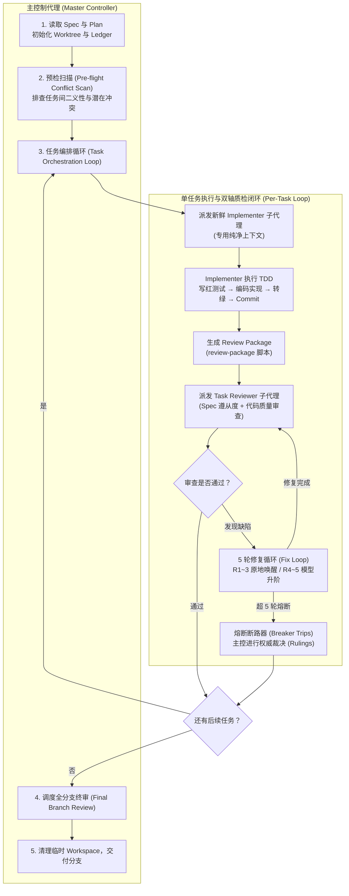
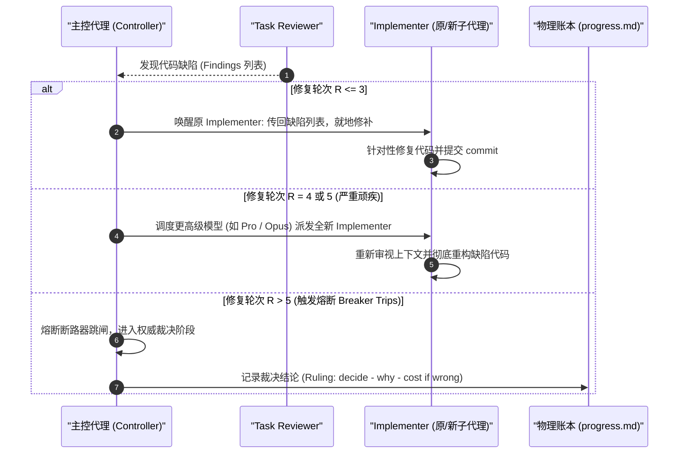

# Superpowers 子代理驱动开发核心实战 (SDD)

| 属性 | 详情 |
| :--- | :--- |
| **文档类型** | 架构设计 / 核心实战指南 |
| **当前状态** | 已归档 (Accepted) |
| **作者** | Ateng |
| **创建日期** | 2026-09-23 |
| **关联系统/模块** | Ateng-AI / Superpowers |

---

## 1. SDD 核心架构与设计哲学 (SDD Architecture)

**子代理驱动开发 (Subagent-Driven Development, SDD)** 是 Superpowers 框架中最具革命性的工程创新。在面对中大型复杂重构或多任务开发时，它彻底打破了传统的“单上下文流水账执行”模式。



### 1.1 为什么需要 Subagents：打破长上下文崩溃
在传统的单会话模式下，当智能体连续执行 5 个以上的开发任务后，上下文窗口往往已被前序任务的大量终端报错、中间文件读取和临时调试日志占满。这会导致三大致命缺陷：
1. **指令遗忘与关注点漂移**：智能体由于注意力机制分散，遗忘了计划中的全局约束；
2. **上下文污染与复读**：前序任务的失败尝试被后续任务反复重蹈覆辙；
3. **高昂的 Token 成本**：每次与用户交互都要携带巨额的历史上下文。

**SDD 的核心法则**：
> [!IMPORTANT]
> **主控与执行分离 (Separation of Concerns)**：
> - **主控制代理 (Controller)**：只负责进度协调、读取计划、工作区管理与审查裁决，绝不亲自写代码；
> - **执行子代理 (Implementer)**：按任务分配，只给其当前任务的精准描述、目标文件路径与关联 Spec，执行完毕立即释放，保持上下文极致纯净。

### 1.2 SDD vs Executing-Plans (Inline) 权衡矩阵

| 评估维度 | SDD 模式 (Subagent-Driven) | Executing-Plans (Inline 单会话) |
| :--- | :--- | :--- |
| **上下文纯净度** | ⭐⭐⭐⭐⭐ (每个任务独立的全新上下文) | ⭐⭐ (单上下文持续累积，易被污染) |
| **质量防护门禁** | ⭐⭐⭐⭐⭐ (每任务独立的双轴自动化质检) | ⭐⭐⭐ (仅在全部任务完成后做单次终审) |
| **容灾恢复能力** | ⭐⭐⭐⭐⭐ (基于物理 Ledger 与 Git Log 无损恢复) | ⭐⭐ (依赖会话历史，易被 Compaction 冲掉) |
| **Token 消耗** | 中等 (虽然子代理数量多，但单次上下文极短) | 高 (后期单轮输入 Token 爆炸) |
| **适用场景** | 包含多个独立任务的中大型功能实现、复杂重构 | 仅 1~2 个简单改动的微型补丁，或无子代理工具的环境 |

---

## 2. 物理工作区与状态防失忆体系 (Worktree & Ledger Mechanics)

### 2.1 Git Worktree 隔离机制 (`scripts/sdd-workspace`)
为了确保开发过程完全不影响开发者当前正在操作的工作区与分支，SDD 默认要求在隔离工作区中运行：
- **专属工作区定位**：运行 `bash scripts/sdd-workspace <PLAN_FILE>`，该脚本会根据 Plan 文件路径计算 Hash，并在 `.superpowers/sdd/<plan-id>/` 下创建一个独立的 Git Worktree。
- **物理隔离优势**：
  - 开发者可以在主目录继续修改其它文件，而不会与智能体的编译构建产生文件锁或编辑冲突；
  - 该目录在 `.gitignore` 中被默认忽略，临时构建产物与测试数据库不会污染源码主干。

### 2.2 持久化进度账本 (`progress.md`) 应对上下文压缩 (Compaction)
现代 AI 客户端当上下文达到阈值时，会自动执行**上下文压缩（Context Compaction / Truncation）**。在真实工程中，曾出现过主控代理因失忆而将已经做完的 10 个任务重新派发一遍的灾难性故障。

为此，SDD 强制建立了基于物理文件的**进度账本 (Ledger)**：
- **账本路径**：`<workspace>/progress.md`；
- **首行身份锚定**：
  ```markdown
  # SDD ledger — plan: docs/plans/2026-09-23-user-module.md
  ```
- **账本规则**：
  1. 账本记录了每个 Task 的执行状态（如 `Task 1: complete - commit: 3f8a9bc`）；
  2. 若会话意外中断或被压缩，主控代理重新上线的第一步是**读取物理账本与 `git log`**，而不是相信自己的模糊记忆；
  3. 账本中已标记 `complete` 的任务**绝对严禁重复派发**，直接从第一个未完成的任务断点续跑。

---

## 3. 单任务双轴闭环与多轮修复实操 (Task Execution & Fix Loop)

### 3.1 任务派发与 Implementer 子代理引导 (`implementer-prompt.md`)
当启动某个任务时，主控代理会按照 `implementer-prompt.md` 模板精心构造 Prompt：
- **输入提供**：当前任务的目标描述、需要修改/新建的文件路径、输入输出契约；
- **执行纪律**：
  1. **TDD 测试先行**：先写测试用例并运行，必须亲眼见证测试“**红（失败）**”；
  2. **最小化实现**：编写恰好能让测试转“**绿（通过）**”的生产代码；
  3. **自测重构**：运行全量回归，确保不破坏已有功能；
  4. **原子提交**：在 Worktree 中提交规范的 Git Commit。

### 3.2 审查包生成与 Task Reviewer 质检 (`task-reviewer-prompt.md`)
Implementer 完成工作后，主控代理执行自动化命令：
```bash
bash scripts/review-package
```
该命令会自动提取当前任务产生的 Git Diff、Git Log 与测试输出，随后派发一个**独立的 Task Reviewer 子代理**。

Task Reviewer 遵循严格的**双轴审查准则**：
1. **轴一：Spec 遵从性 (Spec Compliance)**：是否完全实现了计划要求的功能？是否存在多写（违反 YAGNI）或少写？
2. **轴二：代码工程质量 (Code Quality)**：是否有脆弱的无断言测试？是否有隐藏的空指针异常风险？是否引入了未经声明的硬编码？

### 3.3 5 轮修复循环 (Fix Loop) 与熔断断路器 (Breaker Trips)
若 Task Reviewer 提出缺陷（Findings），系统进入严密的修复循环：



> [!CAUTION]
> **权威裁决铁律 (Rulings, Not Stalls)**：
> 当任务修复陷入胶着或计划与实现出现二义性时，主控代理**不得无休止挂起等待人类回复**。主控代理必须依据原始 Spec 行使架构裁决权，在账本中明确记录：
> `Ruling: <裁决内容> — <决策原因> — <若决策错误可能付出的代价>`，随后继续推进！因为在自动化研发中，一个可被回退的错误裁决最多带来局部重构，而会话彻底挂起等待会导致整个工程流水线瘫痪。

---

## 4. 分支综合验收与收尾交付 (Branch Review & Handoff)

当计划中的所有任务全部执行并通过原子验收后，主控代理执行最后的系统级收尾：

1. **全分支终审 (Final Whole-Branch Review)**：
   调度全局代码审查员（`skills/requesting-code-review/code-reviewer.md`），站在跨模块整合与架构一致性的全局视角对整条分支发起全面质检；
2. **残留缺陷一次性清理**：
   若终审有非阻塞建议，集中进行单次派发修复与再审查；
3. **工作区解绑与收尾衔接**：
   审查完全达标后，系统安全删除临时 Git Worktree（保留 Git Commits），并自动无缝调用 `superpowers:finishing-a-development-branch` 技能，协助开发者完成 PR 提交、合并与主干同步。

---

## 5. 权威参考资料与事实依据 (References & Grounding)

- [[Tier 1 官方源码]] [skills/subagent-driven-development/SKILL.md](https://raw.githubusercontent.com/obra/superpowers/main/skills/subagent-driven-development/SKILL.md) - SDD 规范、Ledger 容灾机制与 5 轮修复模型 (核验日期: 2026-09-23)
- [[Tier 1 官方源码]] [skills/subagent-driven-development/implementer-prompt.md](https://github.com/obra/superpowers/blob/main/skills/subagent-driven-development/implementer-prompt.md) - Implementer 子代理引导提示词契约 (核验日期: 2026-09-23)
- [[Tier 1 官方源码]] [skills/subagent-driven-development/task-reviewer-prompt.md](https://github.com/obra/superpowers/blob/main/skills/subagent-driven-development/task-reviewer-prompt.md) - Task Reviewer 双轴审查提示词契约 (核验日期: 2026-09-23)
- [[Tier 1 官方脚本]] [skills/subagent-driven-development/scripts/sdd-workspace](https://github.com/obra/superpowers/blob/main/skills/subagent-driven-development/scripts/sdd-workspace) - Worktree 自动计算与分配脚本 (核验日期: 2026-09-23)

### 核查摘要表格
| 核查对象 (组件/配置/版本) | 官方基准事实 (Ground Truth) | 对应官方依据 (Tier 1 链接) | 状态 |
| :--- | :--- | :--- | :--- |
| **SDD 核心机制** | 每任务派发 Fresh Subagent，执行完毕调度 Task Reviewer 进行双轴质检 | [subagent-driven-development/SKILL.md](https://raw.githubusercontent.com/obra/superpowers/main/skills/subagent-driven-development/SKILL.md) | 已核实真实有效 |
| **Ledger 容灾设计** | 首行标注 Plan 路径，任务完成记录 Commit，防范会话 Compaction 失忆 | [subagent-driven-development/SKILL.md](https://raw.githubusercontent.com/obra/superpowers/main/skills/subagent-driven-development/SKILL.md) | 已核实真实有效 |
| **5 轮修复与断路器** | R<=3 恢复原 Agent，R=4~5 换高阶模型，超 5 轮触发 Ruling 熔断裁决 | [subagent-driven-development/SKILL.md](https://raw.githubusercontent.com/obra/superpowers/main/skills/subagent-driven-development/SKILL.md) | 已核实真实有效 |
