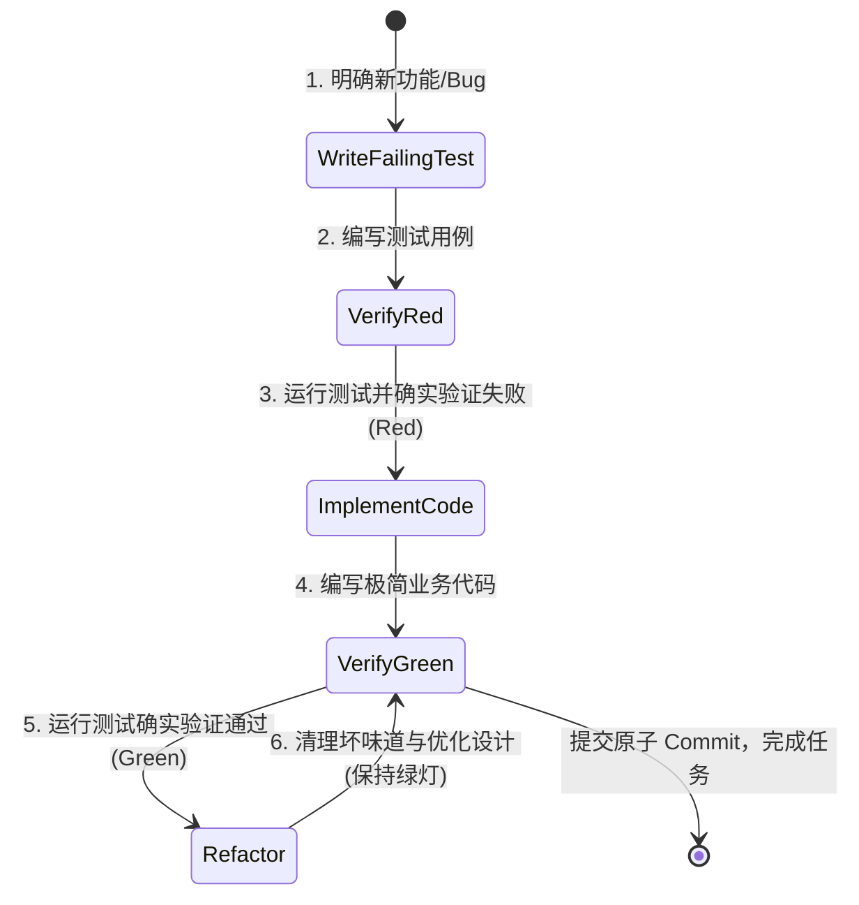
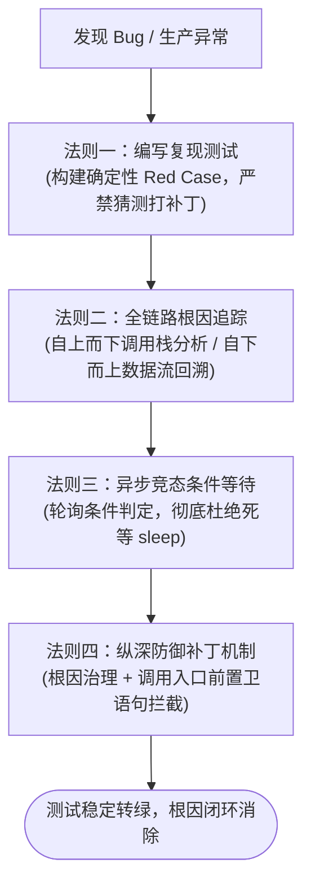

# Superpowers 质量保障与系统性排障指南 (TDD & Debugging)

| 属性 | 详情 |
| :--- | :--- |
| **文档类型** | 质量工程指南 / 排障实战手册 |
| **当前状态** | 已归档 (Accepted) |
| **作者** | Ateng |
| **创建日期** | 2026-09-23 |
| **关联系统/模块** | Ateng-AI / Superpowers |

---

## 1. 测试驱动开发铁律 (`test-driven-development` 技能)

在未经严密测试约束的 AI 辅助编程中，智能体极易产生“看似合理但暗藏缺陷”的幻觉代码。Superpowers 将**测试驱动开发 (Test-Driven Development, TDD)** 确立为不可逾越的底层工程红线。



### 1.1 Red-Green-Refactor 绝对红线
Superpowers 对 TDD 施加了三阶段强制约束：
1. **见红阶段 (Red Phase)**：
   > [!CAUTION]
   > **严禁在未见红前编写业务代码**：
   > 智能体必须先编写测试文件，并执行该测试，亲眼在控制台看到测试**断言失败**（报错原因必须与拟实现的功能缺失相符）。如果测试直接通过，说明该测试无效或已被其他逻辑短路，必须立即推倒重来。
2. **转绿阶段 (Green Phase)**：
   只编写恰好能让当前测试转绿的最小代码量，坚决贯彻 **YAGNI（You Aren't Gonna Need It）** 原则，严禁凭空前瞻扩展未声明的代码逻辑。
3. **重构阶段 (Refactor Phase)**：
   在测试绿灯的保护网下，消除冗余重复（DRY）、提取清晰命名与自解释方法。每次微小重构后必须立即复测，确保始终维持绿灯状态。

### 1.2 编写高质量测试准则 (`writing-good-tests.md`)
普通智能体常犯的测试反模式是编写“表面覆盖率很高但毫无断言能力”的伪测试。Superpowers 规定了优质测试的基线标准：
- **严格断言业务边界**：每个测试必须包含具体的输入断言与输出校验，禁止编写只有方法调用而没有 `assert` / `expect` 的假用例；
- **防范过度 Mocking (Over-Mocking)**：优先使用纯函数、内存数据结构或真实组件测试；过度 Mock 外部行为会导致系统重构时测试全部失效，或者测试全绿但生产环境全面崩溃；
- **测试用例自解释与独立性**：测试用例命名必须表达明确的业务意图（如 `should_reject_transfer_when_balance_is_insufficient`），用例之间彼此独立，严禁依赖执行次序。

---

## 2. 系统性排障四大法则 (`systematic-debugging` 技能)

面对线上或测试集抛出的复杂 Bug，普通智能体往往倾向于凭直觉在报错点附近随机修改代码试错（Shotgun Debugging）。Superpowers 强制要求遵循**系统性排障四大法则**：



### 2.1 法则一：拒绝无根据猜测与盲目打补丁 (No Speculative Patches)
- **禁止试错式修改**：在未找到根本原因前，绝对禁止随意修改业务代码；
- **建立最小复现用例 (Minimal Reproduction Case)**：第一步必须编写一个能稳定触发该 Bug 的自动化测试，并在本地稳定复现失败现象。

### 2.2 法则二：调用链路与根因追踪 (`root-cause-tracing.md`)
通过最小化精准插桩或跟踪堆栈，顺藤摸瓜：
1. **报错点不是起因点**：NullPointer 或非法状态通常只是下游受害者，真正的根因往往是上游数据转换或并发竞态遗留了坏数据；
2. **数据流双向回溯**：自异常发生点沿调用链反向溯源，直到定位到产生非法状态的最初发生地。

### 2.3 法则三：防范异步竞态的条件等待 (`condition-based-waiting.md`)
在多线程、微服务或前端 UI 渲染测试中，异步竞态（Race Conditions）是导致测试偶发失败（Flaky Tests）的首要原因。
- **严禁使用固定延迟（No Fixed Sleep）**：
  ```typescript
  // 错误示范：极其脆弱且白白浪费测试耗时
  await sleep(2000);
  expect(button.isEnabled()).toBe(true);
  ```
- **推行条件轮询等待（Condition-Based Waiting）**：
  ```typescript
  // 正确范式：基于真实状态轮询，超时即时抛出明确上下文
  await waitForCondition({
    predicate: () => button.isEnabled() === true,
    timeoutMs: 3000,
    intervalMs: 50,
    failureMessage: "按钮在预期 3000ms 内未能激活"
  });
  ```

### 2.4 法则四：纵深防御补丁机制 (`defense-in-depth.md`)
根治缺陷不仅要修复出问题的具体方法，更要在上下游构建纵深防御：
- 在修复根因的同时，在公有 API 入口处补充前置卫语句（Guard Clauses），拦截未来同类脏数据的注入；
- 增加结构化异常告警与日志上下文，便于下一次异常发生时秒级定位。

---

## 3. 测试污染排查与完成前契约 (Pollution Isolation & Verification)

### 3.1 测试状态污染定位实战 (`find-polluter.sh`)
在大型测试套件中，常出现“**单个测试文件单独运行完全通过，但全量跑套件却随机报错**”的诡异现象。这通常是因为某个前序测试修改了单例全局变量、静态状态、数据库共享记录或未清理临时文件，形成了“测试污染源（Polluter）”。

Superpowers 内置了自动化二分定位工具：
```bash
# 执行测试污染定位脚本
bash skills/systematic-debugging/find-polluter.sh \
  --victim "tests/order/checkout.test.ts" \
  --suite "tests/**/*.test.ts"
```
- **工作机制**：该脚本通过二分法（Binary Search）排列组合前置运行的测试清单，自动收敛并揪出导致目标测试失败的唯一罪魁祸首用例，精准修复全局状态重置缺失。

---

### 3.2 完成前全量核验契约 (`verification-before-completion` 技能)

在任务即将完工之际，智能体最常出现的劣化行为是：“代码写完后，只口头向用户宣称修改完成，甚至连编译或单元测试都没有跑一次”。

> [!CAUTION]
> **全量核验铁律 (Verification Gate)**：
> 在向开发者交接前，智能体**绝对必须在终端中亲自运行项目构建与全量测试命令**（如 `pnpm test`、`mvn test`、`cargo test`），并捕获真实的 0 错误退出码。严禁通过推理假定“这几行修改肯定不会出问题”。

---

## 4. 权威参考资料与事实依据 (References & Grounding)

- [[Tier 1 官方源码]] [skills/test-driven-development/SKILL.md](https://raw.githubusercontent.com/obra/superpowers/main/skills/test-driven-development/SKILL.md) - TDD 红绿循环铁律契约 (核验日期: 2026-09-23)
- [[Tier 1 官方规范]] [skills/test-driven-development/writing-good-tests.md](https://github.com/obra/superpowers/blob/main/skills/test-driven-development/writing-good-tests.md) - 高质量测试编写标准 (核验日期: 2026-09-23)
- [[Tier 1 官方源码]] [skills/systematic-debugging/SKILL.md](https://raw.githubusercontent.com/obra/superpowers/main/skills/systematic-debugging/SKILL.md) - 系统化排障四大法则与根因追踪 (核验日期: 2026-09-23)
- [[Tier 1 官方脚本]] [skills/systematic-debugging/find-polluter.sh](https://github.com/obra/superpowers/blob/main/skills/systematic-debugging/find-polluter.sh) - 全局测试状态污染排查脚本 (核验日期: 2026-09-23)
- [[Tier 1 官方规范]] [skills/verification-before-completion/SKILL.md](https://raw.githubusercontent.com/obra/superpowers/main/skills/verification-before-completion/SKILL.md) - 完成前全量核验强卡点规范 (核验日期: 2026-09-23)

### 核查摘要表格
| 核查对象 (组件/配置/版本) | 官方基准事实 (Ground Truth) | 对应官方依据 (Tier 1 链接) | 状态 |
| :--- | :--- | :--- | :--- |
| **TDD 红绿流程** | 强制先写失败测试并确认见红，再编写最小生产代码转绿 | [test-driven-development/SKILL.md](https://raw.githubusercontent.com/obra/superpowers/main/skills/test-driven-development/SKILL.md) | 已核实真实有效 |
| **调试排障原则** | 严禁凭空盲猜打补丁，第一步必须建立可复现自动化用例 | [systematic-debugging/SKILL.md](https://raw.githubusercontent.com/obra/superpowers/main/skills/systematic-debugging/SKILL.md) | 已核实真实有效 |
| **测试污染排查** | 内置 `find-polluter.sh` 二分法自动定位造成全局状态污染的测试 | [systematic-debugging/find-polluter.sh](https://github.com/obra/superpowers/blob/main/skills/systematic-debugging/find-polluter.sh) | 已核实真实有效 |
