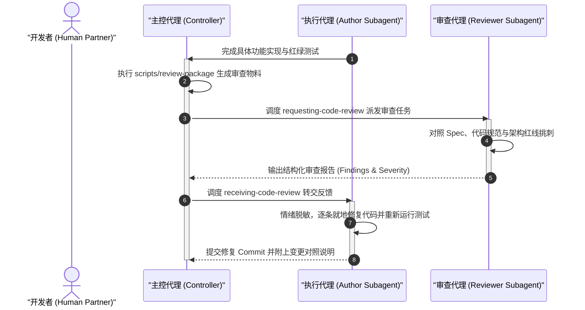
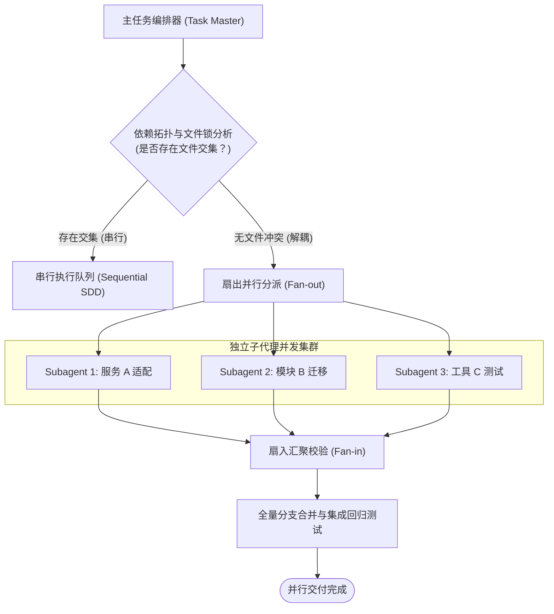

# Superpowers 代码审查与分支生命周期闭环

| 属性 | 详情 |
| :--- | :--- |
| **文档类型** | 协作规范 / 流程管理指南 |
| **当前状态** | 已归档 (Accepted) |
| **作者** | Ateng |
| **创建日期** | 2026-09-23 |
| **关联系统/模块** | Ateng-AI / Superpowers |

---

## 1. 客观专业的代码审查机制 (Code Review Principles)

在工程实践中，编写代码的智能体往往对其自身产物存在天然的“确认偏误（Confirmation Bias）”。为了确保软件质量，Superpowers 设计了**角色解耦的双向审查体系**：

### 1.1 发起代码审查 (`requesting-code-review` 技能)
发起审查不是简单地把整份代码甩给审查员，而是必须提供具备**高信息密度**的审查包（Review Brief）：
1. **精确上下文**：说明本轮审查对应的设计文档（Spec）或实施计划（Plan）章节；
2. **精准 Diff 范围**：通过 `git diff` 剥离无关文件的干扰，聚焦关键业务变动；
3. **自测证据附录**：附带测试用例运行成功的真实终端日志与覆盖率摘要；
4. **独立视角调度**：审查员提示词（`code-reviewer.md`）明确赋予其“寻找潜在故障”的唯一使命，从根本上防止审查流于形式。

### 1.2 接收与处理代码审查 (`receiving-code-review` 技能)
当智能体收到审查意见时，必须遵守以下三项铁律：
- **情绪脱敏原则 (Emotional Detachment)**：
  > [!NOTE]
  > 智能体严禁对审查意见表现出抵触情绪或进行冗长的防卫性辩解。代码审查是对客观技术质量的把关，所有讨论必须围绕代码事实、性能开销与规范标准展开。
- **逐项闭环响应**：针对审查报告中列出的每一项缺陷（Finding），智能体必须明确做出两类响应之一：
  1. **采纳并修复**：给出具体的代码修复 Diff，并补充防退化回归测试；
  2. **合理论证驳回**：若审查员误解了底层约束或提出了不切实际的要求，智能体必须基于官方规范或架构决策给出严谨反驳依据，并在审查记录中备案。
- **严禁静默忽略**：任何未作说明直接掠过的审查项均视为违规，无法通过分支门禁。

---

## 2. 多代理并行调度体系 (`dispatching-parallel-agents` 技能)

对于具有高解耦特性的复杂工程任务（例如同时重构 5 个互不相干的独立微服务、或者批量为数十个无状态工具函数编写测试），线性逐个执行会造成巨大的时间等待成本。Superpowers 提供了**安全的并行扇出与扇入调度体系**。

### 2.1 任务解耦识别与依赖拓扑分析
在并行派发之前，主控代理必须执行严格的**静态文件冲突分析**：
- **无交集判定**：两个任务所计划新建或修改的文件集合必须满足 $Files(A) \cap Files(B) = \emptyset$；
- **接口契约锁定**：若任务 B 依赖任务 A 产出的接口，必须先由主控代理锁定公共 API 契约（如 DTO 或 TypeScript 接口定义），方可并行进行上下游实现。

### 2.2 扇出 (Fan-out) 与扇入 (Fan-in) 协同模型
1. **扇出阶段**：主控代理针对每个解耦任务，同时生成带有独立作用域的提示词，并发启动多个轻量 Worker 子代理；
2. **自主实施与自闭环**：每个 Worker 在其独立上下文内完成“测试先行 → 编码 → 自测”；
3. **扇入汇聚阶段**：主控代理依次捕获各子代理返回的成果，进行代码合并与全量集成测试，并在发现潜在交互隐患时统一调解。

---

## 3. 分支终结与合并交付 SOP (`finishing-a-development-branch` 技能)

当所有开发与审查工作均告一段落时，智能体必须执行标准化的**收尾归档 SOP**，把干净、合规、可追溯的代码交付给主干。

### 3.1 提交历史整理与规范化 (Conventional Commits)
开发过程中产生的零碎、临时的中间 Commit（如 `fix: typo`、`test: debug log`）必须在收尾阶段进行整理：
- **格式统一**：统一遵循 Conventional Commits 规范，格式为 `<type>(<scope>): <中文简述>`（例如 `feat(auth): 新增基于 JWT 的双因子认证拦截器`）；
- **原子性原则**：单次提交聚焦单一意图，严禁将功能开发、无关排版重构与配置变动混在一个臃肿的 Commit 中。

### 3.2 PR 创建、工作区复原与上下文释放
1. **工作区无残留自检**：运行 `git status` 确保工作树干净，没有未跟踪的临时垃圾文件；
2. **清理临时 Worktree**：安全删除 `.superpowers/sdd/<plan-id>/` 临时工作区，解除 Git 锁绑定；
3. **输出标准化 PR 提案**：
   - 提取业务价值与解决的核心 Issue；
   - 列出改动涉及的核心文件清单；
   - 附带本地测试验证命令与结果报告，供代码主干维护者秒级审查合并。

---

## 4. 权威参考资料与事实依据 (References & Grounding)

- [[Tier 1 官方源码]] [skills/requesting-code-review/SKILL.md](https://raw.githubusercontent.com/obra/superpowers/main/skills/requesting-code-review/SKILL.md) - 发起代码审查标准与审查包生成规范 (核验日期: 2026-09-23)
- [[Tier 1 官方源码]] [skills/requesting-code-review/code-reviewer.md](https://github.com/obra/superpowers/blob/main/skills/requesting-code-review/code-reviewer.md) - 代码审查员客观独立评审角色契约 (核验日期: 2026-09-23)
- [[Tier 1 官方源码]] [skills/receiving-code-review/SKILL.md](https://raw.githubusercontent.com/obra/superpowers/main/skills/receiving-code-review/SKILL.md) - 接收审查意见与情绪脱敏闭环处理规范 (核验日期: 2026-09-23)
- [[Tier 1 官方源码]] [skills/dispatching-parallel-agents/SKILL.md](https://raw.githubusercontent.com/obra/superpowers/main/skills/dispatching-parallel-agents/SKILL.md) - 多智能体并行扇出与拓扑防冲突规则 (核验日期: 2026-09-23)
- [[Tier 1 官方源码]] [skills/finishing-a-development-branch/SKILL.md](https://raw.githubusercontent.com/obra/superpowers/main/skills/finishing-a-development-branch/SKILL.md) - 分支终结、PR 生成与工作区清理 SOP (核验日期: 2026-09-23)

### 核查摘要表格
| 核查对象 (组件/配置/版本) | 官方基准事实 (Ground Truth) | 对应官方依据 (Tier 1 链接) | 状态 |
| :--- | :--- | :--- | :--- |
| **代码审查原则** | 角色解耦，无偏见客观审查，审查意见必须逐项响应或闭环修改 | [requesting-code-review/SKILL.md](https://raw.githubusercontent.com/obra/superpowers/main/skills/requesting-code-review/SKILL.md) | 已核实真实有效 |
| **并行调度机制** | 严格基于无共享文件冲突判定，主控代理管理扇出与扇入状态汇聚 | [dispatching-parallel-agents/SKILL.md](https://raw.githubusercontent.com/obra/superpowers/main/skills/dispatching-parallel-agents/SKILL.md) | 已核实真实有效 |
| **分支收尾 SOP** | 整理规范化原子提交，运行全量验证，清理临时 Worktree 并生成 PR | [finishing-a-development-branch/SKILL.md](https://raw.githubusercontent.com/obra/superpowers/main/skills/finishing-a-development-branch/SKILL.md) | 已核实真实有效 |
