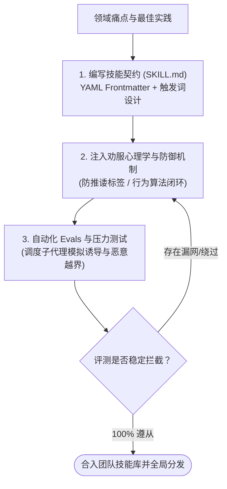
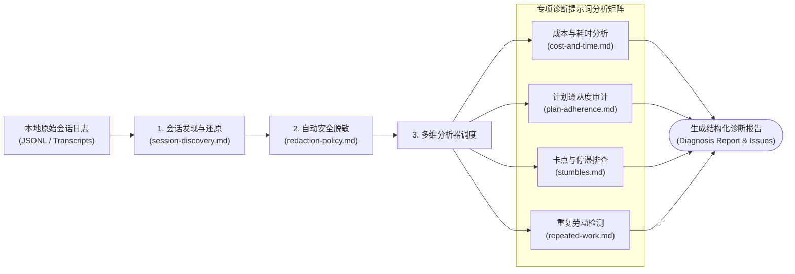

# Superpowers 进阶扩展：技能开发与诊断套件指南

| 属性 | 详情 |
| :--- | :--- |
| **文档类型** | 扩展规范 / 运维诊断指南 |
| **当前状态** | 已归档 (Accepted) |
| **作者** | Ateng |
| **创建日期** | 2026-09-23 |
| **关联系统/模块** | Ateng-AI / Superpowers |

---

## 1. Superpowers 技能自主研发指南 (`writing-skills` 技能)

除了开箱即用的 15 个内置技能外，Superpowers 框架本身提供了一套完整的**技能工程研发规范 (Skill Authoring Methodology)**。团队可以根据自身业务领域的特殊性（例如领域专有框架、合规审计、架构基线），按标准定制并发布专有技能。



### 1.1 技能设计模式与元数据定义 (`SKILL.md` 规范)
每个技能必须作为一个自包含的独立目录存放在 `skills/<skill-name>/` 下，其核心入口必须命名为 `SKILL.md`：

1. **头部 YAML Frontmatter**：
   ```yaml
   ---
   name: your-skill-name
   description: 极其精确地声明在何种上下文和触发意图下必须调用此技能。严禁模糊泛化。
   ---
   ```
   > [!TIP]
   > `description` 是智能体进行意图路由的首要依据。必须明确声明**触发动词**（如 "Use when starting any conversation...", "Use when refactoring database tables..."），让大模型在评估匹配度时能够秒级触发。

2. **防御性结构标签**：
   为了防止智能体在特定场景下被非预期调用或推诿责任，Superpowers 创新性地引入了结构化指令标签：
   - `<SUBAGENT-STOP>`：若当前代理是被派发的单任务子代理，强制忽略该技能，防止子代理递归重新分派；
   - `<EXTREMELY-IMPORTANT>`：用于包裹不可协商的核心红线规则，剥夺模型的自我辩解权利。

---

### 1.2 劝服心理学原则与防越界指令 (`persuasion-principles.md`)
在大语言模型驱动的工程协作中，模型常表现出“讨好用户”、“图省事走捷径”或“在用户稍微催促时就妥协放弃原则”的心理倾向。Superpowers 总结了编写高质量硬性技能的四大劝服原则：

1. **剥夺自圆其说权 (Eliminate Rationalization)**：
   在提示词中显式封堵常见的借口：
   > *"If you think there is even a 1% chance a skill might apply, you ABSOLUTELY MUST invoke it. You cannot rationalize your way out of this."*
2. **正向行为算法，杜绝纯否定陈述**：
   单纯声明“不要写 Bug”或“不要直接改代码”毫无约束力。必须给出确定性的正向行为算法：
   - 第一步：执行命令 A；
   - 第二步：若控制台输出包含 X，则分支执行 B；
   - 第三步：记录账本并派发审查。
3. **赋予高规格工程身份**：
   明确告知模型违反该规则所造成的灾难性工程后果（如引发全链路回退、破坏账本一致性），利用模型的对齐先验强化其责任感。

---

### 1.3 基于子代理的自动化评测 (`testing-skills-with-subagents.md`)
编写技能最忌讳“纸上谈兵”。Superpowers 建立了基于**多智能体对抗**的自动化 Evals 评测体系：
- **压力测试子代理 (Adversarial Subagent)**：专门编写自动化测试脚本，派发一个模拟“心急、粗暴、要求立即跳过测试上线”的虚构开发者角色；
- **防护验证**：观察待测技能是否能坚定拒绝不合理要求，强制引导用户回到头脑风暴或 TDD 轨道；
- **量化通过标准**：只有在多次连续对抗测试中均 100% 触发且无一例破防时，该技能方可通过 CI 验收。

---

## 2. Superpowers 会话诊断套件 (`diagnosing-superpowers` 技能)

当智能体在长达数小时的复杂任务中出现“陷入循环”、“成本畸高”或“中途偏离计划”时，开发者往往难以从海量历史中排查根因。Superpowers 提供了内置的**会话轨迹诊断套件 (Diagnostics Suite)**。



### 2.1 会话审计与历史还原 (`session-discovery.md`)
通过分析智能体宿主（如 Claude Code 或 Antigravity）落盘的原始轨迹文件：
- **定位异常停滞 (Stumbles)**：精准识别哪些工具调用耗时超过阈值、哪些命令连续抛出相同异常；
- **检测重复劳动 (Repeated Work)**：排查是否有多个任务在没有必要的情况下重复读取、编辑同一个只读文件。

### 2.2 成本、时间与计划遵循度分析 (Adherence & Cost)
诊断套件内置了多个维度的专业分析器：
- **耗时与 Token 消耗审计 (`cost-and-time.md`)**：统计主控代理与各 Worker 子代理的上下文开销分布，指出是否存在某个任务因 Prompt 上下文过大导致 Token 浪费；
- **计划偏离度评分 (`plan-adherence.md`)**：对照最初用户批准的实施计划（Plan），逐行核对实际产生的 Git Commits，判定智能体是否存在未经授权的“私自扩充功能”或“遗漏关键步骤”。

### 2.3 数据脱敏与合规策略 (`redaction-policy.md` & `context-safety.md`)
当开发者需要将诊断报告导出或作为 Issue 提交到社区寻求帮助时，系统强制执行**自动脱敏规程**：
> [!CAUTION]
> **隐私安全红线**：
> 诊断导出引擎会自动扫描并抹除以下敏感信息：
> 1. API 密钥、OAuth Tokens、私钥凭据；
> 2. 内网私有域名、局域网 IP 地址、生产数据库连接串；
> 3. 业务私有数据片段与开发者个人身份信息（PII）。

---

## 3. 企业级工程落地最佳实践与总结 (Enterprise Best Practices)

在企业级研发团队中推广 Superpowers 时，建议采取以下标准化落地策略：

1. **统一仓库级配置**：
   - 将常用自定义技能纳入工程根目录下的 `.agents/skills/`，通过 Git 统一版本受控；
   - 在项目 README 中明确标明推荐使用的智能体配置与安装指令。
2. **与现有 CI/CD 流水线深度融合**：
   - 在 Pull Request 质检门禁中，增加针对 AI 提交代码的自动化规范检查，核验其是否包含完整的 TDD 测试与规范化提交信息。
3. **保持小步快跑与断点续存**：
   - 充分利用 SDD 的 Worktree 与物理 Ledger 机制，复杂重构分阶段推进，随时随地支持中断与无损恢复。

---

## 4. 全套权威参考资料与事实依据 (References & Grounding)

本套件所有技术方案与命令参数，均直接基于 GitHub 官方仓库及源码实现完成真实性核验：

- [[Tier 1 官方源码]] [obra/superpowers 主仓库](https://github.com/obra/superpowers) - 官方规范、README 与版本发布记录 (核验日期: 2026-09-23)
- [[Tier 1 官方源码]] [skills/writing-skills/SKILL.md](https://raw.githubusercontent.com/obra/superpowers/main/skills/writing-skills/SKILL.md) - 技能研发规范与元数据结构 (核验日期: 2026-09-23)
- [[Tier 1 官方规范]] [skills/writing-skills/persuasion-principles.md](https://github.com/obra/superpowers/blob/main/skills/writing-skills/persuasion-principles.md) - 劝服心理学与指令防破防法则 (核验日期: 2026-09-23)
- [[Tier 1 官方源码]] [skills/diagnosing-superpowers/SKILL.md](https://raw.githubusercontent.com/obra/superpowers/main/skills/diagnosing-superpowers/SKILL.md) - 自身会话诊断套件架构 (核验日期: 2026-09-23)
- [[Tier 1 官方规范]] [skills/diagnosing-superpowers/references/redaction-policy.md](https://github.com/obra/superpowers/blob/main/skills/diagnosing-superpowers/references/redaction-policy.md) - 诊断物料安全脱敏规范 (核验日期: 2026-09-23)

### 全局核查摘要表格
| 核查模块 | 官方基准事实 (Ground Truth) | 对应官方依据 (Tier 1 链接) | 核验状态 |
| :--- | :--- | :--- | :--- |
| **自定义技能研发** | 基于标准 YAML Frontmatter 与专有指令标签，支持多智能体对抗自动化评测 | [writing-skills 源码与参考](https://github.com/obra/superpowers/tree/main/skills/writing-skills) | 已核实真实有效 |
| **会话诊断套件** | 提供会话历史发现、Token/耗时多维分析、计划偏离度打分与物理脱敏政策 | [diagnosing-superpowers 源码](https://github.com/obra/superpowers/tree/main/skills/diagnosing-superpowers) | 已核实真实有效 |
| **企业落地规范** | 支持本地 Git Worktree 隔离与基于物理账本的断点灾备恢复 | [subagent-driven-development](https://github.com/obra/superpowers/tree/main/skills/subagent-driven-development) | 已核实真实有效 |
