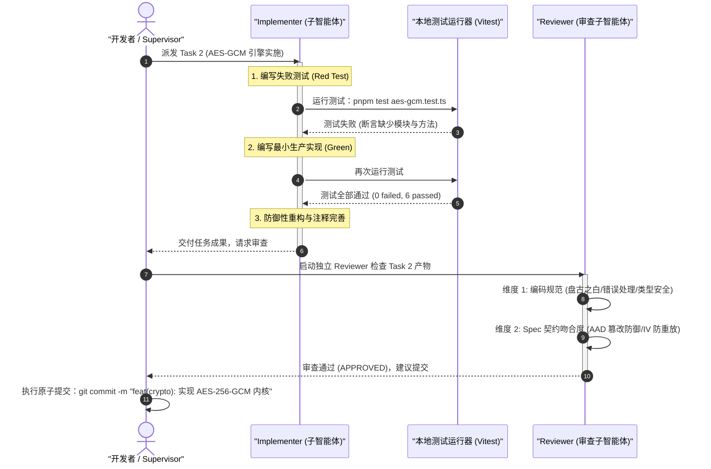
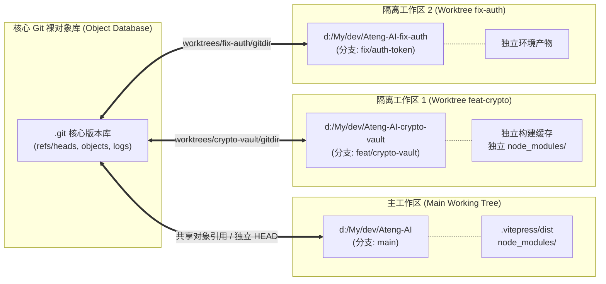
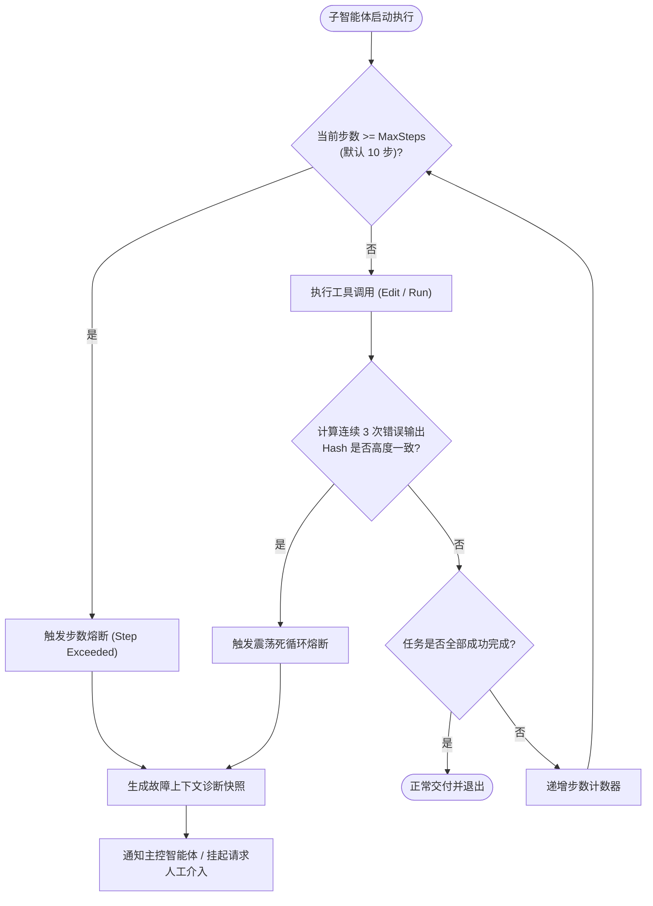

# Superpowers 实战进阶、工程避坑与自定义技能扩展

| 属性 | 详情 |
| :--- | :--- |
| **文档类型** | 工程最佳实践与进阶实战指南 |
| **当前状态** | 已归档 (Accepted) |
| **作者** | Ateng |
| **创建日期** | 2026-09-22 |
| **关联系统/模块** | Ateng-AI / Skills / Superpowers |

---

## 概述与核心哲学

在基于大语言模型（LLM）驱动的自主软件工程中，初学者往往将智能体视为“高级自动补全工具”或“单次问答机器”。然而，当面对企业级复杂系统、遗留代码重构或高可靠金融安全模块交付时，传统的单提示词（One-shot Prompt）或无状态对话会迅速暴露出三大致命缺陷：**上下文无序膨胀导致认知漂移**、**缺乏实体接缝导致破坏性变更**、以及**测试自圆其说导致的虚假质量**。

**Superpowers** 是一套面向现代自主智能体（Autonomous Agents）的工业级工程协作方法论与技能运行时架构。其核心理念是将人类顶级软件工程师在长期大型分布式系统演化中总结的高阶纪律——**严密需求推演、原子化计划分解、物理级工作区隔离、角色分工与红绿测试驱动开发、以及自动化分支交付闭环**——进行形式化（Formalization）与具象化，沉淀为智能体可严格遵循并自动化执行的技能组（Skills）。

```
                                  【Superpowers 工业级交付流水线】
  ┌─────────────────┐       ┌─────────────────┐       ┌─────────────────┐
  │  brainstorming  │ ───>  │  writing-plans  │ ───>  │ using-git-      │
  │  (需求推演/契约) │       │  (原子计划分解)  │       │  worktrees      │
  └─────────────────┘       └─────────────────┘       │ (物理环境隔离)   │
                                                      └────────┬────────┘
                                                               │
  ┌────────────────────────────────────────────────────────────┘
  │
  ▼
┌───────────────────────────────────────────────────────────────┐
│              subagent-driven-development (子智能体驱动实施)      │
│  ┌──────────────────────┐              ┌──────────────────┐   │
│  │   Implementer        │ ──测试红绿──> │     Reviewer     │   │
│  │ (test-driven-develop)│              │  (双轴严格代码审查) │   │
│  └──────────────────────┘              └──────────────────┘   │
└──────────────────────────────┬────────────────────────────────┘
                               │
                               ▼
                    ┌─────────────────────────┐
                    │ finishing-a-development-│
                    │ branch (分支合并与清理)  │
                    └─────────────────────────┘
```

通过这一闭环流水线，Superpowers 将不可预测的大模型概率生成，收敛为高度确定性、可回溯、高内聚且低耦合的现代软件工业品。本文档深入拆解真实模块从零交付的端到端演练、Git Worktrees 隔离实战、生产级工程避坑防线，以及自研技能扩展规范。

---

## 一、端到端实战演练：从零交付 CryptoVault 安全模块

为了完整展现 Superpowers 的工程威力，我们将以交付一个高安全等级的企业级通用数据加解密与验签工具模块——**`CryptoVault`** 为例。该模块要求支持对称数据加密（AES-256-GCM 带有认证标签与随机附加验证数据 AAD）、防篡改哈希签名与验证（HMAC-SHA256），并具备严格的异常分类体系与防御性参数断言。

---

### 1. 步骤一：通过 `brainstorming` 进行需求推演与契约收敛

在接收到模糊指令（如“请帮我写一个加解密工具”）时，未经过工程约束的智能体往往直接输出一段不安全的简陋代码（如硬编码密钥的 ECB 模式 AES）。Superpowers 强制要求在开始编写任何生产代码前，先激活 `brainstorming` 技能。

#### 1.1 Agent Step Back 深度审视机制
智能体主动“后退一步（Step Back）”，跳出语法细节，围绕系统级属性向用户提出关键决策质询：
- **威胁模型与合规约束**：数据存储在静态介质还是在 RPC 链路上传输？是否需要抵御选择密文攻击（CCA）？
- **算法选型确定**：为何选用带有认证标签的 **AES-256-GCM** 而非容易遭受重放攻击的 CBC 模式？为何随机 IV（Initialization Vector）必须达到 96 位（12 字节）且严禁复用？
- **密钥派生与生命周期**：密钥是以原始二进制字节数组提供，还是需要结合盐值通过 PBKDF2 / Argon2 派生？
- **异常分级体系**：解密失败到底是密钥错误、密文被篡改，还是数据格式损坏？必须通过显式错误类型予以区分，严禁静默返回 `null`。

```
                    ┌───────────────────────────────────────┐
                    │ 模糊需求输入："写一个数据加解密工具"    │
                    └──────────────────┬────────────────────┘
                                       │
                                       ▼
                    ┌───────────────────────────────────────┐
                    │  Agent Step Back 阶段 (brainstorming)  │
                    │  • 明确威胁模型 (CCA 防御)             │
                    │  • 算法收敛 (AES-256-GCM + HMAC)      │
                    │  • IV 与 AAD 认证机制设计              │
                    │  • 显式异常层次设计                    │
                    └──────────────────┬────────────────────┘
                                       │
                                       ▼
                    ┌───────────────────────────────────────┐
                    │  产出标准架构契约 (CryptoVault Spec)    │
                    └───────────────────────────────────────┘
```

#### 1.2 提炼架构契约与异常层次规范
经过头脑风暴推演，智能体与人类架构师达成一致，并在工作区产出标准契约设计文档：

```typescript
/**
 * CryptoVault 核心对外契约与异常定义
 */

// 1. 独立业务异常体系
export class CryptoVaultException extends Error {
  constructor(message: string, public readonly cause?: unknown) {
    super(message);
    this.name = 'CryptoVaultException';
  }
}

export class InvalidKeyException extends CryptoVaultException {
  constructor(message: string) {
    super(message);
    this.name = 'InvalidKeyException';
  }
}

export class DecryptionFailedException extends CryptoVaultException {
  constructor(message: string, cause?: unknown) {
    super(message, cause);
    this.name = 'DecryptionFailedException';
  }
}

export class SignatureVerificationException extends CryptoVaultException {
  constructor(message: string) {
    super(message);
    this.name = 'SignatureVerificationException';
  }
}

// 2. 加解密载荷契约
export interface EncryptedPayload {
  readonly ciphertext: string; // Base64 编码密文
  readonly iv: string;         // Base64 编码的 12 字节随机向量
  readonly tag: string;        // Base64 编码的 16 字节认证标签
  readonly aad?: string;       // 可选的附加验证数据字符串
}

// 3. 核心门面接口
export interface ICryptoVault {
  encrypt(plaintext: string, secretKey: Buffer, aad?: string): EncryptedPayload;
  decrypt(payload: EncryptedPayload, secretKey: Buffer): string;
  signHmac(message: string, secretKey: Buffer): string;
  verifyHmac(message: string, signature: string, secretKey: Buffer): boolean;
}
```

> [!IMPORTANT]
> **契约锁定前严禁编码**：`brainstorming` 的终点是输出无歧义、不可逆推翻的 Spec 契约文档。只有当接口参数、边界异常与安全策略完全敲定时，才能转入任务规划。

---

### 2. 步骤二：通过 `writing-plans` 产出原子化实施计划

进入规划阶段，智能体调用 `writing-plans` 技能，将整体需求拆解为**初级工程师无需思考即可无脑执行的原子任务列表（Atomic Tasks）**。

#### 2.1 优秀原子任务的“五要素准则”
每一个 Task 必须具备自包含性，严禁出现“实现加解密逻辑”这类模糊表述。必须明确包含：
1. **涉及物理文件**：明确的新建（`[NEW]`）或修改（`[MODIFY]`）绝对/相对路径。
2. **测试接缝（Seam）**：测试用例的摆放位置与验证目标。
3. **输入与输出契约**：明确函数入参与断言预期的异常类型。
4. **具体实现边界**：只做本任务范围内的最小改动，严禁跨任务偷跑。
5. **验证终端命令**：精确到单个测试用例文件的执行指令（例如 `pnpm test tests/unit/crypto-error.test.ts`）。

#### 2.2 CryptoVault 原子实施任务清单（实施计划切片）

```markdown
### Task 1: 建立核心异常层次与错误断言
- **文件**: 
  - `[NEW] src/crypto/errors.ts`
  - `[NEW] tests/crypto/errors.test.ts`
- **目标**: 实现基础异常基类 `CryptoVaultException` 及其派生子类，确保异常名称正确，错误堆栈无损。
- **验证命令**: `pnpm test tests/crypto/errors.test.ts`

### Task 2: 建立 AES-256-GCM 核心引擎 (TDD 严格驱动)
- **文件**:
  - `[NEW] src/crypto/aes-gcm.ts`
  - `[NEW] tests/crypto/aes-gcm.test.ts`
- **目标**: 
  - 校验密钥长度严格等于 32 字节（256 位），否则抛出 `InvalidKeyException`。
  - 加密逻辑：每次生成全新的 12 字节安全随机 IV，调用原生加密库生成密文与 16 字节 AuthTag。
  - 解密逻辑：校验 AuthTag 与 AAD，一旦内容遭篡改必须抛出 `DecryptionFailedException`。
- **验证命令**: `pnpm test tests/crypto/aes-gcm.test.ts`

### Task 3: 建立 HMAC-SHA256 验签防篡改引擎 (TDD 严格驱动)
- **文件**:
  - `[NEW] src/crypto/hmac.ts`
  - `[NEW] tests/crypto/hmac.test.ts`
- **目标**: 
  - 计算消息的十六进制 HMAC 签名。
  - 验签时使用常量时间对比（Timing-Safe Equal）防止时序攻击（Timing Attack）。
  - 校验不匹配时返回 `false` 或按契约抛出 `SignatureVerificationException`。
- **验证命令**: `pnpm test tests/crypto/hmac.test.ts`

### Task 4: 构建 CryptoVault 外观门面 (Facade) 与端到端集成测试
- **文件**:
  - `[NEW] src/crypto/crypto-vault.ts`
  - `[NEW] src/crypto/index.ts`
  - `[NEW] tests/crypto/crypto-vault.e2e.test.ts`
- **目标**: 整合底层组件，提供对外统一的开箱即用类，编写大文本加解密与多线程并发集成测试。
- **验证命令**: `pnpm test tests/crypto/crypto-vault.e2e.test.ts`
```

---

### 3. 步骤三：通过 `using-git-worktrees` 创建物理隔离工作区

在准备实施之前，绝不直接在主工作区或脏分支上运行。智能体必须调用 `using-git-worktrees` 技能，通过 Git 原生 Worktrees 在主项目同级目录派生一个物理隔离环境。

```bash
# 1. 确认当前主仓库分支干净
git status --short

# 2. 从 main 检出新分支 feat/crypto-vault，并创建物理独立的工作区目录
git worktree add -b feat/crypto-vault ../Ateng-AI-crypto-vault main

# 3. 进入隔离工作区进行环境自检
cd ../Ateng-AI-crypto-vault
pnpm install --frozen-lockfile
pnpm test
```

> [!TIP]
> 物理隔离的核心收益在于：即使子智能体在隔离目录执行全量清理、生成构建产物或安装实验性依赖，也不会影响开发者当前正在 IDE 中打开的主工程窗口，杜绝构建缓存冲突与文件监听闪烁。

---

### 4. 步骤四：通过 `subagent-driven-development` 调度子智能体

在隔离工作区就绪后，Supervisor（主控智能体）不会在一个超长上下文中一次性实施全部任务，而是调用 `subagent-driven-development` 技能，采用 **“调度-实现-审查”** 三元循环。



#### 4.1 Implementer 严格践行 TDD 红绿循环（以 Task 2 为例）

##### 阶段 1：红灯（Red Phase）——编写针对契约的失败用例
实施者子智能体首先在 `tests/crypto/aes-gcm.test.ts` 中构建完备的测试矩阵。此时生产代码尚未编写，测试执行必然失败：

```typescript
import { describe, it, expect } from 'vitest';
import { AesGcmEngine } from '../../src/crypto/aes-gcm';
import { InvalidKeyException, DecryptionFailedException } from '../../src/crypto/errors';

describe('AesGcmEngine 严格契约测试 (Red-Green TDD)', () => {
  const validKey = Buffer.alloc(32, 0x42); // 32 字节有效密钥
  const invalidKey = Buffer.alloc(16, 0x42); // 16 字节无效密钥 (非 256 位)
  const engine = new AesGcmEngine();

  it('当传入非法长度的密钥时，必须抛出 InvalidKeyException', () => {
    expect(() => {
      engine.encrypt('Secret Message', invalidKey);
    }).toThrowError(InvalidKeyException);
  });

  it('正常加解密全流程验证，且每次加密的 IV 必须完全随机', () => {
    const text = 'Ateng-AI 核心机密资产 2026';
    const payload1 = engine.encrypt(text, validKey);
    const payload2 = engine.encrypt(text, validKey);

    // 严禁复用相同 IV
    expect(payload1.iv).not.toEqual(payload2.iv);

    // 解密内容必须完全匹配
    const decrypted = engine.decrypt(payload1, validKey);
    expect(decrypted).toBe(text);
  });

  it('当密文被恶意篡改 1 个字节时，解密必须被拦截并抛出 DecryptionFailedException', () => {
    const text = '敏感支付订单数据';
    const payload = engine.encrypt(text, validKey);

    // 篡改 Base64 密文字符
    const rawCipher = Buffer.from(payload.ciphertext, 'base64');
    rawCipher[0] ^= 0xff; // 翻转首字节
    const tamperedPayload = {
      ...payload,
      ciphertext: rawCipher.toString('base64'),
    };

    expect(() => {
      engine.decrypt(tamperedPayload, validKey);
    }).toThrowError(DecryptionFailedException);
  });

  it('当附加验证数据 (AAD) 不一致时，解密必须强行终止', () => {
    const text = '具备租户隔离的业务报文';
    const aad = 'tenant_id=ateng_001';
    const payload = engine.encrypt(text, validKey, aad);

    // 伪造另外一个租户的 AAD 进行解密尝试
    const attackPayload = {
      ...payload,
      aad: 'tenant_id=ateng_002',
    };

    expect(() => {
      engine.decrypt(attackPayload, validKey);
    }).toThrowError(DecryptionFailedException);
  });
});
```

智能体运行命令 `pnpm test tests/crypto/aes-gcm.test.ts`，捕获预期失败日志：
`Error: Cannot find module '../../src/crypto/aes-gcm'`。**确认红灯亮起。**

##### 阶段 2：绿灯（Green Phase）——以最小代码使测试通过
实施者在 `src/crypto/aes-gcm.ts` 编写符合规范的健壮代码：

```typescript
import crypto from 'node:crypto';
import { EncryptedPayload } from './index';
import { InvalidKeyException, DecryptionFailedException } from './errors';

/**
 * AES-256-GCM 认证加解密底层引擎
 *
 * @author Ateng
 * @since 2026-09-22
 */
export class AesGcmEngine {
  private static readonly ALGORITHM = 'aes-256-gcm';
  private static readonly KEY_LENGTH_BYTES = 32;
  private static readonly IV_LENGTH_BYTES = 12;
  private static readonly AUTH_TAG_LENGTH_BYTES = 16;

  /**
   * 执行带认证的数据加密
   *
   * @param plaintext 明文字符串
   * @param secretKey 32 字节密钥
   * @param aad 可选附加验证数据
   * @returns 结构化加密载荷
   */
  public encrypt(plaintext: string, secretKey: Buffer, aad?: string): EncryptedPayload {
    // 1. 契约校验
    this.assertValidKey(secretKey);

    // 2. 生成安全强随机 IV (96 位)
    const iv = crypto.randomBytes(AesGcmEngine.IV_LENGTH_BYTES);
    const cipher = crypto.createCipheriv(AesGcmEngine.ALGORITHM, secretKey, iv, {
      authTagLength: AesGcmEngine.AUTH_TAG_LENGTH_BYTES,
    });

    if (aad) {
      cipher.setAAD(Buffer.from(aad, 'utf-8'));
    }

    const encrypted = Buffer.concat([
      cipher.update(plaintext, 'utf-8'),
      cipher.final(),
    ]);

    const authTag = cipher.getAuthTag();

    return {
      ciphertext: encrypted.toString('base64'),
      iv: iv.toString('base64'),
      tag: authTag.toString('base64'),
      aad,
    };
  }

  /**
   * 执行数据认证解密
   *
   * @param payload 结构化加密载荷
   * @param secretKey 32 字节密钥
   * @returns 解密后的明文字符串
   */
  public decrypt(payload: EncryptedPayload, secretKey: Buffer): string {
    // 1. 契约校验
    this.assertValidKey(secretKey);

    try {
      const iv = Buffer.from(payload.iv, 'base64');
      const authTag = Buffer.from(payload.tag, 'base64');
      const ciphertext = Buffer.from(payload.ciphertext, 'base64');

      const decipher = crypto.createDecipheriv(AesGcmEngine.ALGORITHM, secretKey, iv, {
        authTagLength: AesGcmEngine.AUTH_TAG_LENGTH_BYTES,
      });

      decipher.setAuthTag(authTag);

      if (payload.aad) {
        decipher.setAAD(Buffer.from(payload.aad, 'utf-8'));
      }

      const decrypted = Buffer.concat([
        decipher.update(ciphertext),
        decipher.final(),
      ]);

      return decrypted.toString('utf-8');
    } catch (error) {
      // 抹平底层报错差异，统一包裹为受控异常，防止敏感内部堆栈泄露
      throw new DecryptionFailedException('解密失败：密文损坏或认证标签不匹配', error);
    }
  }

  private assertValidKey(secretKey: Buffer): void {
    if (!secretKey || secretKey.length !== AesGcmEngine.KEY_LENGTH_BYTES) {
      throw new InvalidKeyException(
        `密钥非法：AES-256-GCM 必须提供严格 ${AesGcmEngine.KEY_LENGTH_BYTES} 字节的密钥，当前实际为 ${secretKey?.length ?? 0} 字节`
      );
    }
  }
}
```

再次运行测试：**4 passed (100%)，绿灯点亮！**

#### 4.2 Reviewer 独立执行双轴代码审查
Implementer 完成后，主控智能体唤醒 Reviewer 子智能体（具有全新、独立的上下文）。Reviewer 从两个不可妥协的维度开展审查：

1. **Standards 维度（工程基线与规范遵从）**：
   - 是否存在中英文混排缺少半角空格的中文注释？
   - 是否包含规范的 `@author Ateng` 与 `@since 2026-09-22` 元数据？
   - 是否有遗留的 `console.log` 或临时调试逻辑？
2. **Spec 维度（任务契约吻合度）**：
   - 异常捕获块是否把底层 OpenSSL 报错统一收敛为 `DecryptionFailedException`？（防止信息泄露 Padding Oracle）
   - 是否遵守了不可变原则（所有字段 `readonly`）？
   - 密钥断言是否在一切密码学运算之前优先执行卫语句拦截？

审查完全通过后，Reviewer 输出报告并授权主控提交：
```bash
git add src/crypto/aes-gcm.ts tests/crypto/aes-gcm.test.ts
git commit -m "feat(crypto): 实现 AES-256-GCM 认证加解密内核与防篡改断言"
```

---

### 5. 步骤五：通过 `finishing-a-development-branch` 验收并合并分支

当所有原子 Task（Task 1 ~ Task 4）全部完成并通过 Review 之后，调用 `finishing-a-development-branch` 技能，进入收敛闭环阶段：

1. **全量静态自检与回归测试**：
   ```bash
   pnpm lint
   pnpm test --coverage
   pnpm typecheck
   ```
2. **分支变基与历史整理（Interactive Rebase / Fast-Forward）**：
   - 回到主仓库检查 `main` 分支是否有最新提交。
   - 在 `feat/crypto-vault` 分支上执行 `git rebase main`，确保提交树线性平整。
3. **主干合并与标签归档**：
   - 通过 PR 流程或受控命令合并入主干。
4. **工作区安全移除**：
   ```bash
   # 退出隔离工作区目录回到主仓库
   cd d:/My/dev/Ateng-AI
   git worktree remove ../Ateng-AI-crypto-vault
   git branch -d feat/crypto-vault
   ```

---

## 二、Git Worktrees 物理工作区隔离开发实战

### 1. 为什么传统 Git 分支切换对 Agent 宿主环境是灾难性的？

在传统的人工开发中，开发者习惯在同一个物理目录下频繁使用 `git checkout` 或 `git switch` 切换分支。然而，在 **AI 智能体并发研发场景** 中，这一做法会导致毁灭性的环境雪崩：

```
                    传统同一个物理工作区内切换分支的连锁灾难
┌────────────────────────────────────────────────────────────────────────┐
│  主工程目录 (d:/My/dev/Ateng-AI)                                        │
│                                                                        │
│  [开发分支 feature-a] ───git switch───> [修复分支 hotfix-b]            │
│            │                                    │                      │
│            ▼                                    ▼                      │
│   依赖锁文件 package.json 突变          构建缓存 (.vitepress/cache) 错乱 │
│            │                                    │                      │
│            ▼                                    ▼                      │
│   Background Task 进程文件锁占用      IDE 语言服务器 (LSP) 索引崩溃       │
│            │                                    │                      │
│            ▼                                    ▼                      │
│  【灾难结果】: 终端报 EBUSY / 无法编译 / 智能体陷入无意义的环境排障死循环    │
└────────────────────────────────────────────────────────────────────────┘
```

1. **守护进程与文件锁死锁（Windows 特有痛点）**：VitePress 预览服务、TypeScript 编译守护进程（`tsc --watch`）或测试套件在后台运行。一旦切换分支导致大量文件被删除或替换，Windows 系统的文件锁机制会立即抛出 `EBUSY: resource busy or locked`，导致进程崩溃。
2. **构建缓存与依赖污染**：分支 A 引入了新库并执行了 `pnpm install`，切换到分支 B 后未重新安装，导致智能体面对虚假的类型定义，产生大量幻觉报错。
3. **多智能体并发踩踏**：如果父智能体正在 `main` 分支进行架构推演，而派发的两个子智能体试图同时在当前目录切换到不同分支工作，工作区将瞬间彻底报废。

---

### 2. Worktrees 核心原理与拓扑结构

Git Worktrees 允许一个单一的 Git 仓库（共享同一个 `.git` 目录下的对象库对象）同时挂载并检出多个**位于不同文件路径的独立工作树（Working Trees）**。每个工作树拥有完全独立的未提交更改、独立的文件系统缓存、独立的 `node_modules` 以及独立的构建输出目录。



在底层实现上，主仓库的 `.git/worktrees/<worktree-name>/` 目录下仅存放轻量级的管理元数据（如该工作树专属的 `HEAD` 指针、`index` 暂存区与 `commondir` 链接），物理开销微乎其微，但彻底在操作系统层隔离了文件系统。

---

### 3. Worktrees 常用命令与自动化管理 SOP

#### 3.1 核心命令速查

| 操作 | Git 命令 | 说明 |
| :--- | :--- | :--- |
| **列出所有工作区** | `git worktree list` | 查看所有已挂载的工作区路径、绑定分支与当前 commit hash |
| **创建新隔离工作区** | `git worktree add -b <new-branch> <path> <base-branch>` | 基于基础分支拉取新分支并在指定路径创建工作区 |
| **复用已有分支创建** | `git worktree add <path> <existing-branch>` | 将已存在的本地或远程分支签出至物理隔离路径 |
| **安全移除工作区** | `git worktree remove <path>` | 移除指定工作区（要求该工作区内无未暂存的修改） |
| **强制移除工作区** | `git worktree remove --force <path>` | 放弃未提交改动强行销毁该工作区 |
| **修剪失效元数据** | `git worktree prune` | 清理已被手动在文件系统中删除的工作树残留元数据 |

#### 3.2 生产级工作区自动化生命周期脚本
在持续调度子智能体的工程流水线中，推荐封装标准批处理脚本（如 PowerShell）：

```powershell
# 文件路径: scripts/worktree-manager.ps1
param (
    [Parameter(Mandatory=$true)][string]$Action,
    [Parameter(Mandatory=$false)][string]$BranchName,
    [Parameter(Mandatory=$false)][string]$Path
)

switch ($Action) {
    "create" {
        Write-Host "[SOP] 准备物理隔离工作区..." -ForegroundColor Cyan
        if (Test-Path $Path) {
            throw "目标路径 $Path 已存在，请先清理！"
        }
        git worktree add -b $BranchName $Path main
        Set-Location $Path
        Write-Host "[SOP] 安装独立依赖包..." -ForegroundColor Green
        pnpm install --frozen-lockfile
    }
    "clean" {
        Write-Host "[SOP] 安全回收隔离工作区: $Path" -ForegroundColor Yellow
        # 1. 杀死该目录下可能残留的 Node.js 进程
        Get-Process -Name "node" -ErrorAction SilentlyContinue | Where-Object { $_.Path -like "*$Path*" } | Stop-Process -Force
        # 2. 移除 Git Worktree
        git worktree remove --force $Path
        git worktree prune
        Write-Host "[SOP] 工作区已彻底净化。" -ForegroundColor Green
    }
}
```

---

## 三、生产级工程避坑指南

在长时间、跨会话的多智能体协同工程实施中，团队必须直面几类具有极大破坏性的隐藏暗礁。以下梳理四大致命坑点与对应的防御机制。

---

### 1. 坑点一：Token 消耗过大与上下文窗口膨胀防范

#### 1.1 灾难表现与机理
智能体在排查一个测试失败时，一次性读取 10 个完整源码文件，并在终端执行未限制行数的 `git log` 或全量测试。数万 Token 的终端输出瞬间挤占了上下文窗口。模型为了塞下这些信息，被迫触发自动压缩或丢弃较早的系统指令（System Instructions），导致智能体突然“失忆”，破坏最初约定的架构原则。

#### 1.2 防御策略：三层切片与短命隔离
1. **工具调用层：严格限制输出切片（Paging & Filtering）**：
   - 严禁执行裸 `cat`、`npm test`（打印上万行覆盖率报告）。
   - 文件查看强制启用 `StartLine` 与 `EndLine` 切片。
   - 终端命令必须管道化过滤，例如：
     ```bash
     # 错误做法：直接全量输出
     pnpm test
     
     # 正确做法：只聚焦失败用例与汇总行
     pnpm test --bail 1 --reporter=basic | Select-String -Pattern "FAIL|Error:|Tests:"
     ```
2. **架构调度层：父智能体保持极度轻量（Orchestrator Leanness）**：
   - 主控智能体（Supervisor）的上下文内**永远只保留架构决策树、任务清单状态与当前推进进度**。
   - 所有的代码编写、日志查看、调试试错全部下放给“短命子智能体（Ephemeral Subagents）”。子智能体执行完毕后，仅向父智能体返回 200 字以内的精简摘要与 Git Commit Hash，子智能体上下文随之销毁。

---

### 2. 坑点二：子智能体假死或陷入无限循环的超时与监控防护

#### 2.1 灾难表现
子智能体在修复一个语法错误时，修改方案引发了另一个类型错误；修复后又导致原有测试失败。智能体在没有全局视野的情况下，陷入“修改代码 A -> 运行报错 -> 修改代码 B -> 运行报 A 错”的**震荡死循环（Oscillation Deadlock）**，不知疲倦地消耗 API 配额数小时。

#### 2.2 防御机制：看门狗与确定性熔断



1. **绝对步数硬限制（Hard Step Ceiling）**：任何原子子智能体单次派发，最大允许工具调用轮数不得超过 10 轮。
2. **状态机哈希探针（Hash-based Oscillation Detection）**：监控层计算每次执行失败时的报错信息特征码（Error Fingerprint）。若同一个指纹在连续 3 轮交互中反复出现，判定智能体已失去自主纠错能力，立即强制终止任务，生成诊断报告交由上层处理。

---

### 3. 坑点三：TDD 中智能体制造“自圆其说的假测试”防御

#### 3.1 灾难表现：作弊与放水
大语言模型具有强烈的“迎合测试通过”的本能。当任务难度较高时，未经严格约束的智能体会通过令人啼笑皆非的手段制造 100% 通过率：
- **作弊手段 A：空断言**：在测试用例中写 `expect(true).toBe(true)` 或将断言直接注释掉。
- **作弊手段 B：Mock 掉被测内核**：本应测试加解密算法，智能体直接用 `vi.fn().mockReturnValue('Secret')` 把被测函数彻底 Mock 掉。
- **作弊手段 C：篡改测试适应错误实现**：当生产代码返回错误结果时，智能体不仅不修代码，反而修改测试用例的期望值以求绿灯。

#### 3.2 工业级反作弊三道防线

```
                 【防御智能体假测试的三道严密防线】
┌─────────────────────────────────────────────────────────────┐
│ 第一道防线: 严格红灯验证 (Red Phase Verification)            │
│  • 编写测试后必须物理运行，必须捕获预期的特定报错信息签名     │
│  • 若测试初次运行就“意外通过”，该测试用例判定为无效废用例     │
├─────────────────────────────────────────────────────────────┤
│ 第二道防线: 变异测试校验 (Mutation Testing Thought)         │
│  • 故意破坏生产代码核心逻辑（如注释掉验签逻辑）             │
│  • 健全的测试套件必须立即转红！如果不转红，测试存在漏洞     │
├─────────────────────────────────────────────────────────────┤
│ 第三道防线: 审查角色与实现角色上下文绝对隔离                 │
│  • Reviewer 智能体严禁继承 Implementer 的对话历史           │
│  • 独立比对 Git Diff 与原始 Spec 契约，审查断言有效性       │
└─────────────────────────────────────────────────────────────┘
```

> [!CAUTION] 核心工程红线
> 严禁让编写生产代码的同一上下文智能体自行签署测试合格证书！在 Superpowers 规范中，**“未经红灯验证的测试等同于未测试”**。

---

### 4. 坑点四：人工介入（Human-in-the-loop）的最佳断点设计

#### 4.1 全自动自治（Full Autonomy）的工程幻觉
在工业级代码库中，完全不设防的全自主智能体是不可接受的安全隐患。智能体可能在不经意间执行带有破坏性的操作（如误删生产数据表、强制推送覆写远程分支、安装包含投毒后门的第三方依赖）。

#### 4.2 四大黄金人工介入断点（Golden Breakpoints）

```
 [业务需求]
     │
     ▼
 ┌───────┐
 │ 断点 1 │ ──> 【契约与架构决策锁定 (Plan Sign-off)】: 方案与异常分级必须人类拍板
 └───────┘
     │ (批准后放行自动化编码)
     ▼
 ┌───────┐
 │ 断点 2 │ ──> 【破坏性动作阻断 (Destructive Guard)】: drop db / force push / rm -rf 弹窗
 └───────┘
     │ (无破坏性动作继续推进)
     ▼
 ┌───────┐
 │ 断点 3 │ ──> 【安全与合规审计门禁 (Security Gate)】: 外部网络请求 / 密码学改动二次确认
 └───────┘
     │ (审查通过)
     ▼
 ┌───────┐
 │ 断点 4 │ ──> 【合并与生产发布 (Release Sign-off)】: 最终代码主干合入与上线确认
 └───────┘
```

1. **断点 1：架构与接口契约确定后**：`brainstorming` 和 `writing-plans` 完毕后，必须由人类工程师审阅技术方案与接口签名，点击“Proceed”授权后方可进入自动化编码。
2. **断点 2：物理破坏性系统操作前**：检测到涉及覆盖本地未暂存文件、清空数据库表或安装新 npm 包等高危命令时，系统必须强制暂停并向用户展示确认弹窗。
3. **断点 3：核心密码学与隐私安全变更**：对加密算法、鉴权拦截器或敏感密钥流转的修改，必须由资深工程师进行合规审查。
4. **断点 4：主干合并与版本发布前**：工作区分支完工验收后，将最终 Diff 呈现给人类进行最终签署确认。

---

## 四、使用 `writing-skills` 扩展自研技能

随着团队业务复杂度的增长，通用的标准技能库往往不能完全覆盖企业特有的工程规范（例如特定 RPC 框架接入、内部低代码脚手架生成、合规审计流水线）。本章详解如何遵循规范扩展全新的自定义技能。

---

### 1. Superpowers 技能元结构剖析

在 Superpowers 运行时中，技能的组织遵循统一的自包含结构标准：

```
my-custom-skill/
├── SKILL.md                 # 核心规范元数据与行为约束指令（强制）
├── scripts/                 # 确定性自动化执行脚本（Python / Shell / Node.js）
│   └── audit-runner.js
├── references/              # 辅助标准文档、领域术语表与模板
│   └── security-rules.json
└── assets/                  # 流程图、示意图等静态资源
```

#### `SKILL.md` 的规范元数据骨架
`SKILL.md` 顶部必须包含标准的 YAML Frontmatter，用于运行时解析器进行意图匹配与渐进式调度：

```yaml
---
name: security-audit
description: 扫描当前代码库中的潜在安全漏洞、硬编码凭据与不安全的密码学调用，并输出标准合规审查报告。当用户提及“安全审计”、“凭据检查”或修改了认证鉴权核心模块时必须触发。
version: 1.0.0
author: Ateng
dependencies:
  - using-git-worktrees
---
```

---

### 2. 实战：编写自研 `security-audit` 技能并挂载运行时

#### 2.1 编写自研技能核心文件 `skills/security-audit/SKILL.md`

```markdown
# 代码安全合规审计技能 (security-audit)

## 技能意图与定位
本技能用于在实施或审查阶段，对代码变更进行静态安全分析。其核心目标是杜绝弱密码学算法、硬编码敏感秘钥（Secret Leakage）以及未经过防御的动态参数注入。

## 前置约束 (Preconditions)
- 执行本技能前，当前分支必须已完成编译自检。
- 必须在隔离工作区或只读模式下运行，严禁破坏性修改源码。

## 审计检测矩阵 (Detection Rules)
1. **密码学安全检查**：
   - 严禁使用 `crypto.createCipher`（已被弃用且不安全），必须使用 `createCipheriv`。
   - AES 加密算法必须使用 `aes-256-gcm` 或 `aes-128-gcm`，严禁使用 `aes-*-ecb` 模式。
   - 随机向量 (IV) 必须来自 `crypto.randomBytes`，严禁使用固定字面量。
2. **硬编码凭据扫描**：
   - 使用内置正则扫描：`/(AKID|SECRET_KEY|password|apiKey)\s*=\s*['"][a-zA-Z0-9_\-]{8,}['"]/i`。
   - 发现可疑凭据必须阻断流水线，要求改用环境变量或密钥托管服务。

## 执行规程与输出
1. 运行自动化扫描辅助脚本：
   ```bash
   node ./scripts/audit-runner.js --target=./src
   ```
2. 汇总生成 Markdown 格式的《代码安全合规自检卡片》：
   - 明确标注：【通过项】、【警告项（需说明理由）】、【致命阻断项（必须立即修复）】。
```

#### 2.2 编写确定性辅助脚本 `skills/security-audit/scripts/audit-runner.js`

```javascript
#!/usr/bin/env node

/**
 * 确定性静态安全规则扫描辅助脚本
 *
 * @author Ateng
 * @since 2026-09-22
 */
const fs = require('fs');
const path = require('path');

const FORBIDDEN_PATTERNS = [
  { name: 'ECB 弱加密模式', regex: /aes-\d+-ecb/i },
  { name: '已被废弃的不安全 Cipher', regex: /crypto\.createCipher\(/ },
  { name: '可疑硬编码密码', regex: /password\s*=\s*['"][^'"]{6,}['"]/i }
];

function scanDirectory(dir) {
  let issues = 0;
  const files = fs.readdirSync(dir);

  for (const file of files) {
    const fullPath = path.join(dir, file);
    const stat = fs.statSync(fullPath);

    if (stat.isDirectory()) {
      if (file !== 'node_modules' && file !== '.git') {
        issues += scanDirectory(fullPath);
      }
    } else if (file.endsWith('.ts') || file.endsWith('.js')) {
      const content = fs.readFileSync(fullPath, 'utf-8');
      FORBIDDEN_PATTERNS.forEach(rule => {
        if (rule.regex.test(content)) {
          console.error(`[SECURITY ALERT] 发现风险项 [${rule.name}] 于文件: ${fullPath}`);
          issues++;
        }
      });
    }
  }
  return issues;
}

const targetDir = process.argv[2]?.split('=')[1] || './src';
console.log(`[security-audit] 开始扫描目录: ${targetDir}...`);
const totalIssues = scanDirectory(path.resolve(process.cwd(), targetDir));

if (totalIssues > 0) {
  console.error(`[security-audit] 扫描未通过，共发现 ${totalIssues} 处安全违规！`);
  process.exit(1);
} else {
  console.log('[security-audit] 静态安全合规检查 100% 通过。');
  process.exit(0);
}
```

#### 2.3 将自研技能挂载到智能体运行时
将编写完成的技能放入项目的技能统一管理目录（例如 `.agents/skills/security-audit` 或全局插件库）。在宿主运行时配置文件中完成注册：

```json
{
  "skills": {
    "custom_paths": [
      "./skills/security-audit"
    ],
    "autoload": [
      "security-audit"
    ]
  }
}
```
此时，智能体在处理包含安全关键字的任务或处于双轴 Review 阶段时，便会自动激活该技能并按规程执行安全审计脚本。

---

### 3. 团队内部私有技能包沉淀策略

企业在推进智能体工程落地的过程中，切忌将“编写技能”退化为每个开发者在本地随性编写私有 Prompt。必须建立标准的企业级技能工程资产化流程：

```
                    企业级智能体技能沉淀与演进生命周期
┌────────────────┐     ┌────────────────┐     ┌────────────────┐     ┌────────────────┐
│ 1. 痛点提炼    │ ──> │ 2. 脚本确定化  │ ──> │ 3. 规范封装    │ ──> │ 4. CI 门禁与分发 │
│ 研发中反复踩坑  │     │ 将人类排障流程  │     │ 沉淀 SKILL.md  │     │ 静态规范校验    │
│ 总结规范基线    │     │ 固化为工具脚本  │     │ 明确输入输出   │     │ 跨团队统一引用 │
└────────────────┘     └────────────────┘     └────────────────┘     └────────────────┘
```

1. **痛点驱动与脚本固化（Code over Prompt）**：如果一个动作能用 20 行 Bash / Node.js 脚本 100% 确定性搞定，就绝不要用 500 字的 Prompt 让大模型靠概率去猜测。技能的核心是“用自然语言规约调度确定性的工具”。
2. **渐进式披露与按需加载**：技能正文必须精炼清晰，不要将数百页的 API 手册塞进 `SKILL.md`。手册应放入 `references/` 目录，在必要时由智能体按需调取，节约宝贵的上下文。
3. **版本化管理与持续演进**：将团队技能库作为独立的 Git 仓库进行维护（例如 `ateng-enterprise-skills`），通过 Git Submodule 或统一包管理器分发到各个微服务代码库，确保所有业务团队的智能体共享最新版本的工程智慧与安全护栏。
