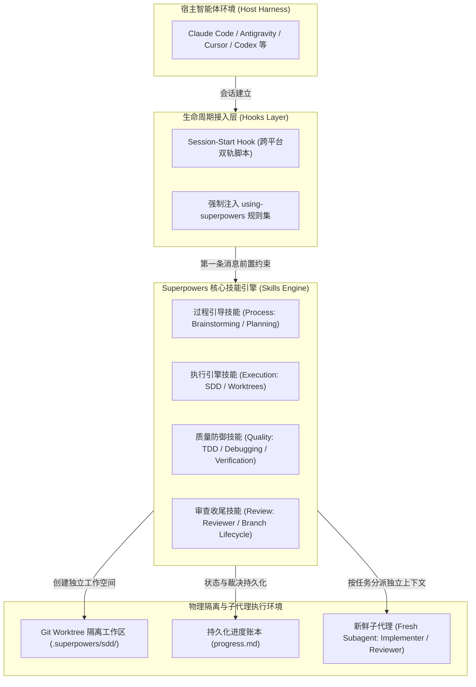
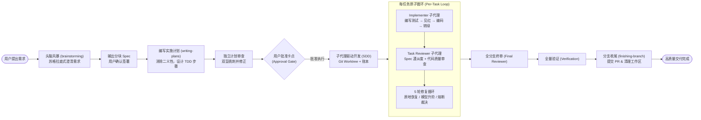

# Superpowers 框架全景总览与架构指南

| 属性 | 详情 |
| :--- | :--- |
| **文档类型** | 全景导读 / 架构指南 |
| **当前状态** | 已归档 (Accepted) |
| **作者** | Ateng |
| **创建日期** | 2026-09-23 |
| **关联系统/模块** | Ateng-AI / Superpowers |

---

## 1. Superpowers 体系概述与核心哲学 (Philosophy & Overview)

### 1.1 传统编码 Agent 的痛点与工程陷阱
随着大语言模型（LLM）在软件研发领域的深入应用，各类 AI 编码助手（Coding Agents）已具备极强的代码生成与工具调用能力。然而在真实工程实践中，未经约束的普通智能体往往表现出严重的“缺乏工程纪律”特征，导致项目陷入以下典型陷阱：

1. **跳过测试与直接编码（Code First, No Test）**：智能体倾向于在未建立任何验证机制的情况下直接大面积修改源码，造成难以察觉的隐蔽回归缺陷。
2. **长上下文污染与幻觉累积（Context Pollution & Hallucination）**：单会话随着轮次增加，历史冗余日志与调试尝试迅速膨胀，导致智能体逐步遗忘最初的设计约束并产生严重复读或逻辑漂移。
3. **假性完成声明（Premature Completion）**：智能体在未真正运行编译、构建与端到端测试的前提下，便主观宣称“修改已完成”，将未经验证的代码留给开发者。
4. **臆测式排障（Speculative Patching）**：遇到 Bug 时不追踪调用链和根本原因，而是针对表象抛错在表层反复添加临时容错补丁，破坏系统整体一致性。

### 1.2 Superpowers 的软件工程方法论
[Superpowers](https://github.com/obra/superpowers) 是由 Jesse Vincent（@obra）发起的开源智能体软件工程方法论框架。它并非简单提供辅助脚本，而是为 Coding Agent 建立了一套**可组合、自约束、具备强制性**的完整工程工作流规范。

其核心哲学体现为三大基石：
- **过程技能先行 (Process Skills First)**：在介入任何具体业务实现或编写单行代码之前，智能体必须强制触发顶层过程技能（如头脑风暴需求澄清、实施计划编制）。
- **不可协商的技能调用契约 (Non-Negotiable Invocations)**：
  > [!IMPORTANT]
  > Superpowers 确立了铁律级准则：“**只要某个任务有哪怕 1% 的概率适用内置技能，智能体绝对必须立即激活该技能，严禁通过任何推导理由绕过。**”
- **极致的工程严谨度 (Disciplined Engineering)**：全流程贯彻真正的红绿 TDD（Red-Green-Refactor）、YAGNI（You Aren't Gonna Need It）与 DRY（Don't Repeat Yourself），并通过隔离子代理将复杂计划拆解为极小原子闭环。

---

## 2. 系统架构与技术拓扑 (System Architecture)

### 2.1 运行时分层与组件架构
Superpowers 采用分层解耦的插件化架构，通过生命周期钩子（Hooks）深度接入各类宿主智能体环境，并在底层驱动物理隔离的工作空间与多子代理协同。

### 2.2 核心技能矩阵分类图谱
Superpowers 内置了 15 个高度专业化的技能模块，按工程职责划分四大矩阵：

| 技能类别 | 技能名称 (Skill Name) | 核心职责与触发场景 |
| :--- | :--- | :--- |
| **过程引导类 (Process)** | `using-superpowers` | 会话初始化入口契约，确立技能优先级，强制首选过程技能 |
| | `brainstorming` | 交互式头脑风暴，苏格拉底式提问，澄清需求并输出分块 Spec |
| | `writing-plans` | 将 Spec 转换为高防呆、面向初级工程师的详尽实施计划 |
| **执行引擎类 (Execution)** | `subagent-driven-development` | SDD 核心引擎，派发单任务子代理，驱动双轴审查与修复循环 |
| | `executing-plans` | 单会话线性执行计划（适用于无子代理支持的环境） |
| | `dispatching-parallel-agents` | 识别无文件依赖的独立任务，并发扇出与扇入调度多代理 |
| **质量防御类 (Quality)** | `test-driven-development` | 严格红绿 TDD 规范，确保有效断言与高质量单元/集成测试 |
| | `systematic-debugging` | 根因链路追踪、条件等待防御异步竞态、排查全局状态污染 |
| | `verification-before-completion` | 完成前强制端到端实测验证，严禁虚假声称完工 |
| **审查收尾类 (Review)** | `requesting-code-review` | 自动生成标准化审查包，调度独立角色开展无偏见审查 |
| | `receiving-code-review` | 情绪脱敏，逐项闭环响应并落实代码审查反馈意见 |
| | `using-git-worktrees` | 管理临时 Git 独立分支与工作树，杜绝污染开发者主干 |
| | `finishing-a-development-branch` | 规范化 Commit、创建 PR、清理临时工作区并安全交付 |
| **元技能与诊断类 (Meta)** | `writing-skills` | 编写高质量智能体技能的标准指南、劝服心理学与 Evals 评测 |
| | `diagnosing-superpowers` | 诊断自身执行轨迹、分析 Token 成本与时间开销、计划偏离度审计 |

---

## 3. 全平台支持矩阵与核心工作流概览 (Harness Matrix & Workflow)

### 3.1 跨平台 Harness 兼容矩阵
Superpowers 原生支持业界主流的 14+ 种智能体工具链与 Harness 容器：

| 宿主平台 (Harness) | 支持等级 | 集成方式 | Session-Start Hook 支持 | 特殊能力/备注 |
| :--- | :--- | :--- | :--- | :--- |
| **Antigravity** | 原生 Tier 1 | `agy plugin install` | 完整支持 | 原生支持子代理派发与工作区共享 |
| **Claude Code** | 官方 Tier 1 | 官方市场 `/plugin install` | 完整支持 | 原生插件机制，支持 Subagents 与 Ledger |
| **Cursor Agent** | 官方 Tier 1 | 市场 `/add-plugin superpowers` | 完整支持 | 深度适配 Cursor Composer 与终端调用 |
| **Codex (App / CLI)** | 官方 Tier 1 | 插件市场搜索安装 | 完整支持 | 优化上下文占用与批处理效率 |
| **Gemini CLI** | 原生 Tier 1 | `gemini extensions install` | 完整支持 | 原生扩展体系，支持自动更新 |
| **Devin CLI** | 官方 Tier 1 | `devin plugins install` | 完整支持 | 针对自主云端沙箱调优 |
| **GitHub Copilot CLI** | 社区 Tier 2 | 市场插件注册安装 | 完整支持 | 支持 CLI 自动化工作流 |
| **Factory Droid** | 社区 Tier 2 | Droid Marketplace 安装 | 完整支持 | 契合自主工程流水线 |
| **Grok Build CLI** | 社区 Tier 2 | xAI 官方市场安装 | 完整支持 | 适配 xAI 开发套件 |
| **Kimi Code / OpenCode** | 扩展 Tier 2 | 专用目录 `.kimi-plugin` / `.opencode` | 完整支持 | 适配中文本地化开发生态与模型 |
| **Pi / Hermes / Muse** | 扩展 Tier 2 | 专用扩展插件脚本载入 | 完整支持 | 轻量化与开源智能体平台支持 |

### 3.2 典型端到端生命周期旅程
在 Superpowers 体系下，一个典型研发任务的流转轨迹如下图所示：

---

## 4. 本套件导读与学习路径 (Reading Map & Navigation)

本套件由 7 篇专题文档构成，涵盖从环境准备到高级扩展的全景知识：

### 4.1 角色导读推荐
- **普通开发者 / 智能体使用者**：建议阅读路径为 `README.md` → `01-installation-and-harnesses.md` → `02-core-workflow-and-specs.md` → `03-subagent-driven-development.md`，快速掌握安装与端到端驱动智能体高效编码的技巧。
- **质量保障与测试工程师**：重点阅读 `04-testing-and-debugging.md` 与 `05-review-and-branch-lifecycle.md`，理解 Superpowers 如何通过严密的 TDD 与审查双重门禁消除 AI 幻觉代码。
- **智能体架构师与工具开发者**：深度研读 `03-subagent-driven-development.md` 与 `06-skill-authoring-and-diagnostics.md`，掌握 Worktree 隔离、Ledger 账本容灾、劝服工程与自主技能评测开发。

### 4.2 模块快速导航索引

| 序号 | 专题文档 | 对应文件名与相对路径 | 核心覆盖内容 |
| :---: | :--- | :--- | :--- |
| **01** | 多平台部署与集成 | [`01-installation-and-harnesses.md`](01-installation-and-harnesses.md) | 14+ 平台安装实战、Session-Start Hook、跨平台 Polyglot 启动脚本与环境排障 |
| **02** | 需求澄清与计划制定 | [`02-core-workflow-and-specs.md`](02-core-workflow-and-specs.md) | 交互式头脑风暴、Visual Companion 本地轻量画板服务、防呆实施计划与审查网 |
| **03** | 子代理驱动开发 (SDD) | [`03-subagent-driven-development.md`](03-subagent-driven-development.md) | SDD 核心架构、Git Worktree 隔离、Ledger 容灾账本、5 轮修复循环与熔断裁决 |
| **04** | 质量保障与系统排障 | [`04-testing-and-debugging.md`](04-testing-and-debugging.md) | 红绿 TDD 铁律、系统化调试四大法则、异步竞态等待、测试污染定位与完成前核验 |
| **05** | 代码审查与分支生命周期 | [`05-review-and-branch-lifecycle.md`](05-review-and-branch-lifecycle.md) | 客观审查包生成与意见闭环、多智能体扇出/扇入并发调度、分支终结与交付 SOP |
| **06** | 进阶扩展与诊断套件 | [`06-skill-authoring-and-diagnostics.md`](06-skill-authoring-and-diagnostics.md) | 自定义技能编写模式、劝服心理学、自动化 Evals 评测、会话审计与性能诊断 |

---

## 5. 权威参考资料与事实依据 (References & Grounding)

- [[Tier 1 官方源码]] [obra/superpowers GitHub Repository](https://github.com/obra/superpowers) - 官方主仓库代码、说明与提交历史 (核验日期: 2026-09-23)
- [[Tier 1 官方规范]] [skills/using-superpowers/SKILL.md](https://raw.githubusercontent.com/obra/superpowers/main/skills/using-superpowers/SKILL.md) - Superpowers 核心调用准则与入口规范 (核验日期: 2026-09-23)
- [[Tier 1 官方规范]] [skills/subagent-driven-development/SKILL.md](https://raw.githubusercontent.com/obra/superpowers/main/skills/subagent-driven-development/SKILL.md) - SDD 子代理开发方法论规范 (核验日期: 2026-09-23)

### 核查摘要表格
| 核查对象 (组件/配置/版本) | 官方基准事实 (Ground Truth) | 对应官方依据 (Tier 1 链接) | 状态 |
| :--- | :--- | :--- | :--- |
| **Superpowers 核心哲学** | 强调 Process Skills First 与严谨工程纪律，内置技能强制调用不可协商 | [README.md & using-superpowers](https://github.com/obra/superpowers) | 已核实真实有效 |
| **内置技能数量与结构** | 包含 `brainstorming`、`subagent-driven-development` 等 15 个独立技能模块 | [Git Tree 递归检索结果](https://api.github.com/repos/obra/superpowers/git/trees/main?recursive=1) | 已核实真实有效 |
| **多平台支持生态** | 原生覆盖 Antigravity、Claude Code、Cursor、Codex 等主流 Harness 体系 | [README.md Installation 章节](https://github.com/obra/superpowers#installation) | 已核实真实有效 |
