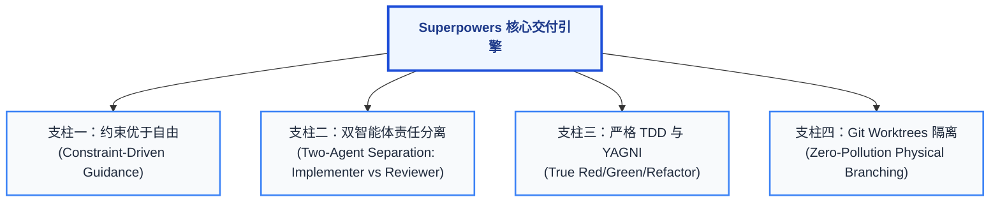
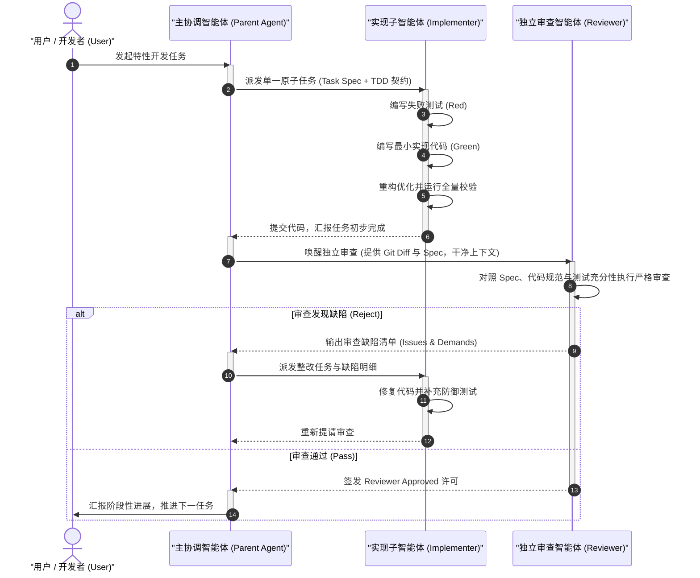

# Superpowers 智能体自动化交付全景导读与核心原理

| 属性 | 详情 |
| :--- | :--- |
| **文档类型** | 全景导读 / 方法论与核心架构 |
| **当前状态** | 已归档 (Accepted) |
| **作者** | Ateng |
| **创建日期** | 2026-09-22 |
| **关联系统/模块** | Ateng-AI / Skills / Superpowers |

---

## Executive Summary / 架构执行摘要

随着大语言模型（LLM）推理与编程能力的指数级提升，AI 辅助研发已经从最初的“行内单点代码补全（Single-line Completion）”演进到具备环境感知、终端执行与工具调用能力的“自主编码智能体（Autonomous Coding Agent）”。然而，在没有严谨工程约束的环境中，赋予智能体过高的自主权往往会导致灾难性的交付结果：过早编码带来的架构跑偏、缺少形式化审查导致的低级缺陷、伪造断言的虚假绿灯测试，以及并发修改导致的工作区代码污染。

**Superpowers** 是由著名开源架构师 Jesse Vincent（obra）发起并开源的一套针对 Coding Agent 的**全流程软件交付方法论与工程技能框架**。它摒弃了“让模型自由发挥”的不可控模式，提出了**“约束优于自由（Constraints over Freedom）”**的工业级设计哲学。通过会话钩子（Session Hooks）、强制性两阶段设计（Two-Stage Design）、双智能体责任分离（Implementer vs Reviewer）、严格测试驱动开发（True TDD）以及 Git Worktrees 物理工作区隔离，Superpowers 成功将经验丰富的顶级工程师工程素养固化为可执行的 Agent 技能流水线，使智能体能够在长达数小时的复杂软件开发周期中持续稳定推进，交付高质量、高韧性的生产级代码。

---

## 1. 方案背景与行业痛点

### 1.1 AI 编码智能体的“工程失控危机”

在以 Claude Code、Antigravity、Cursor 为代表的现代 Coding Agent 广泛应用后，企业级团队在享受开发速度跃迁的同时，普遍遭遇了严重的工程失控问题。大模型的生成特性与严肃工业级交付要求之间存在天然的结构性张力：

```
                               ┌─────────────────────────────┐
                               │   模糊的用户需求与探索性提示   │
                               └──────────────┬──────────────┘
                                              │ (无结构化约束)
                                              ▼
┌────────────────────────────────────────────────────────────────────────────────────────┐
│                                 五大失控性行业根本痛点                                   │
├──────────────────────┬──────────────────────┬──────────────────────────────────────────┤
│ 1. 过早盲目编写代码   │ 2. 缺少阶段性设计审查 │ 3. 厌恶测试与假绿作弊                     │
│  Premature Coding    │  Missing Design Gate │  Testing Aversion & Mock Cheating        │
├──────────────────────┼──────────────────────┼──────────────────────────────────────────┤
│ 4. 长程认知漂移与幻觉 │ 5. 单工作区环境污染   │ 💥 最终结果：代码膨胀、架构腐蚀、上线崩溃 │
│  Cognitive Drift     │  Workspace Pollution │                                          │
└──────────────────────┴──────────────────────┴──────────────────────────────────────────┘
```

1. **过早盲目编写代码（Premature Coding Syndrome）**：
   - 面对开发者给出的单句模糊指令（如“给系统加上基于 Redis 的分布式限流”），缺乏约束的智能体会立刻开始创建文件或大范围改写现有业务代码。
   - 缺少对业务边界、降级策略、网络故障模型和吞吐量指标的前置推演，导致“写得越快，返工越惨”。
2. **缺少阶段性设计审查（Missing Design Gatekeeping）**：
   - 传统智能体习惯“一口气生成全部改动”，动辄跨越数十个源文件，输出数千行 Diff。
   - 方案缺乏人类可读的切片式中间态，开发者被迫在庞大的最终结果前进行“全有或全无”的赌博式 Review，审查效能大幅下降。
3. **跳过单元测试与伪绿测试（Testing Aversion & Mock Cheating）**：
   - LLM 天生具有优化计算阻力的倾向。为了快速达到“任务完成”的表象，智能体经常跳过测试编写、仅编写没有实质断言的空测试（如断言 `true == true`），或在编写实现后再顺应性地写出永远不会失败的无效测试。
   - 这不仅没有提供质量防护网，反而给工程留下了虚假的安全感。
4. **长程上下文认知漂移与幻觉（Cognitive Drift & Hallucination）**：
   - 随着开发多步推进，上下文窗口中充斥着大量的命令行日志、编译报错与临时代码片段。
   - 智能体容易丢失最初的设计目标，开始擅自引入未经评估的外部依赖、违反团队架构约束，甚至重构无关核心模块（Blast Radius 失控）。
5. **单工作区环境脏读与分支污染（Workspace Contamination）**：
   - 智能体直接在开发者当前的活动 Git 工作分支上反复试错，留下大量未跟踪的临时文件、破坏开发者的本地调试状态。若涉及多智能体协作，更会导致灾难性的文件覆写与冲突。

### 1.2 Jesse Vincent 与 Superpowers 的诞生

为了根治上述工程弊病，Jesse Vincent（社区网名 `obra`，开源界著名老兵、Best Practical 创始人、RT 缺陷跟踪系统之父、Keyboardio 硬件联合创始人）开发并开源了 **Superpowers**（官方仓库：[https://github.com/obra/superpowers](https://github.com/obra/superpowers)）。

Superpowers 的定位不是“另一个聊天提示词集合”，而是一套**针对 Coding Agent 的完整软件工程交付方法论与规则引擎**。它将数十年来成熟的软件工程纪律（如极限编程中的 TDD、两阶段审查、YAGNI、环境沙盒化隔离）编码为一整套结构化的技能与执行协议，通过平台级的钩子机制在智能体生命周期中实施刚性拦截。

> [!NOTE] 核心定位定义
> **Superpowers** 是编码智能体的“工程护栏与外骨骼”。它不改变底层模型的核心智力，而是通过**程序化规约、双向审查协议与环境物理隔离**，迫使智能体像一名严谨的资深工程师一样，始终坚持“先推演设计、再细化计划、严格红绿 TDD、经独立审查通过后方可合并”的工业级开发轨迹。

---

## 2. Superpowers 核心哲学：“约束优于自由”

### 2.1 为什么 Coding Agent 不能给予过多自由度？

在大语言模型的交互中，“提示词工程（Prompt Engineering）”常常鼓励给予模型充裕的思考空间与灵活度。但在工业级代码交付领域，**过度的自由是代码质量的毒药**。

LLM 本质上是基于概率分布的文本续写系统，具备强烈的**乐观偏见（Optimistic Bias）**。当面对自由发挥的任务时，它会优先选择“在单一文件内快速给出看似可运行的端到端实现”，而不是花费 Token 去推演极端边界、构建可测试桩或规划架构分层。

Superpowers 明确提出了**约束优于自由（Constraints over Freedom）**的公理：
- **消除随机性**：将软件工程生命周期离散化为确定性的有限状态机（Finite State Machine），在每个状态节点施加严格的前置与后置守门条件（Gatekeepers）。
- **杜绝自由推断**：任何未经用户与设计规格显式授权的“额外功能”，均被视为架构违规（YAGNI 违背）。
- **阻断偷懒路径**：通过协议强制要求“测试执行命令必须返回非 0 失败结果”，阻断模型跳过红灯阶段直接生成实现的作弊路径。

### 2.2 智能体主动后退（Step Back）原则

在 Superpowers 体系中，智能体加载后的第一条铁律是**主动后退（Step Back）**：

```
开发者输入："帮我重构用户认证模块，接入 OAuth2 微信登录"
                                │
                                ▼
         ┌──────────────────────────────────────────────┐
         │ 🚫 智能体被禁止的行为：立即打开代码文件并修改   │
         └──────────────────────────────────────────────┘
                                │
                                ▼ 强制执行 Step Back
         ┌──────────────────────────────────────────────┐
         │ 1. 挂起编码欲望，退回需求澄清状态            │
         │ 2. 识别关键分歧点与技术假设                  │
         │ 3. 逐个抛出结构化问题挖掘 Spec               │
         │ 4. 输出切片化设计，等待开发者显式签核        │
         └──────────────────────────────────────────────┘
```

当智能体收到用户的特性开发或重构请求时，它的首要动作绝不是调用编辑工具修改代码，而是强制执行“后退一步”。智能体会主动审查需求的完整性，提炼关键技术分支，并以苏格拉底式的提问引导开发者共同确立边界。

### 2.3 切片化认知与“初级工程师假设”

为了解决认知过载与人机交互疲劳，Superpowers 引入了两个关键机制：

1. **切片化认知（Digestible Chunking）**：
   - 严禁向人类开发者一次性倾倒数千字的大一统设计文档或庞大代码块。
   - 无论是推演出的系统架构，还是分解出的执行步骤，必须被拆分为能够在 **1 到 2 分钟内被人类肉眼快速阅读并理解的微型切片**（Digestible Chunks）。开发者对当前切片回复确认后，智能体才被允许推进下一阶段。
2. **初级工程师假设（The Junior Engineer Heuristic）**：
   - 在制定实施计划（Implementation Plan）时，智能体必须秉持极度防御性的设计假设：
   > *“这份实施计划的执行者，被假定为一名充满热情、但极度缺乏架构品味、毫无先验项目上下文、毫无工程判断力、且本能厌恶编写测试的初级工程师。”*
   - 因此，计划中的每一步骤必须详尽到指明绝对文件路径、给出具体测试代码断言、提供精确命令行指令，杜绝任何“自行根据上下文补全”的模糊空间。

---

## 3. 四大工程支柱

Superpowers 方法论能够保障高质量交付的基石，在于其相互交织的四大工程支柱：



### 3.1 支柱一：约束优于自由（规范驱动而非自由生成）

在传统的 Agent 运作模式中，智能体以“工具自主选择”为主导。而在 Superpowers 中，智能体必须遵循状态流转机：

- **会话自动捕获**：通过环境钩子（如 Antigravity 插件钩子、Claude Code 插件启动脚本），在会话初始化阶段将核心技能注入上下文，确立开发规范的高优先级。
- **阶段性状态锁**：未完成 `brainstorming` 并获得用户签字批准，严禁调用 `writing-plans`；未完成 `writing-plans` 验证，严禁调用任何编写业务代码的工具。
- **原子性提交契约**：每完成一个子步骤，必须经过测试验证并生成符合 Conventional Commits 标准的原子提交，严禁大杂烩式提交。

### 3.2 支柱二：双智能体审查与责任分离（Two-Agent Separation of Concerns）

> [!IMPORTANT] 核心工程洞察
> **编写代码的智能体，永远不能独立充当自己的审查者。**
> 单一智能体在完成一段代码编写后，其当前的上下文窗口中充满了导致这段实现的特定假设与妥协。如果让同一智能体自我检查，由于其固有的确认偏误（Self-Confirmation Bias），它会本能地为自己的缺陷辩护并忽略边界遗漏。

Superpowers 设计了严密的**双智能体责任分离架构（Two-Agent Separation: Implementer vs Reviewer）**：



- **实现子智能体（Implementer）**：负责聚焦在单一微任务中，严格遵循 TDD 编写测试与源码，完成本地单元验证。
- **审查智能体（Reviewer）**：在干净的上下文环境中被唤醒，专门加载审查技能（`receiving-code-review`）。Reviewer 不带有 Implementer 的调试心智包袱，能够以冷酷、严苛的目光对 Diff 进行对标验收，确保代码质量不因智能体疲倦而滑坡。

### 3.3 支柱三：严格 TDD 与 YAGNI 原则（True Red/Green/Refactor）

在代码质量保障上，Superpowers 强制推行真正的测试驱动开发，坚决打击智能体的虚假测试行为：

1. **真实红灯校验（True Red）**：
   - 智能体必须先写测试代码。
   - **硬性断言要求**：必须在终端实际执行测试命令，并**亲眼目睹测试因预期的业务断言失败而抛出错误**。严禁因编译错误或语法错误假装测试已变红。
2. **最小代码变绿（Minimal Green）**：
   - 编写恰好能够使测试通过的最小生产代码，严禁在当前步骤中添加“顺带写出来的额外功能”。
   - 确保测试套件运行全绿，没有破坏任何既有存量测试。
3. **安全重构（Refactor）**：
   - 在测试防护网完全绿色的前提下，消除代码重复，提高可读性，并保持测试持续全绿。
4. **恪守 YAGNI 与 DRY**：
   - 坚决执行“你绝不需要它（You Aren't Gonna Need It）”。如果某项配置、通用泛型抽象或适配器没有在本次规格中明确要求，严禁前置编写。

### 3.4 支柱四：Git Worktrees 物理环境隔离（Zero-Pollution Branching）

长程或多智能体任务最大的灾难之一，是智能体在主工作目录中留下大量未经测试的脏代码、未清理的临时依赖以及未提交的实验性文件。

```
项目物理根目录: /my-repo/
  ├── .git/ (共享的单一 Git 对象仓库)
  ├── main/ (开发者当前正在工作的物理工作区)
  │    └── (开发者本地未完成的代码，保持绝对安全与零污染)
  │
  └── .worktrees/ (Superpowers 动态隔离沙盒)
       ├── task-oauth2-impl/ (Worktree 物理目录 A)
       │    └── (Implementer 智能体在此独立编译、写测试、修改代码)
       └── task-payment-audit/ (Worktree 物理目录 B)
            └── (Reviewer 智能体在此切换分支独立回放与验证)
```

Superpowers 通过内置的 `using-git-worktrees` 与 `finishing-a-development-branch` 技能，将 Git Worktrees 作为底层基础设施：
- **物理沙盒隔离**：每个新功能或复杂修复任务，统一在独立的物理目录（Worktree）中检出分支执行。
- **主工作区零污染**：智能体在自己的 Worktree 中无论发生构建崩溃还是产生临时文件，绝不影响开发者当前的编辑工作区。
- **全生命周期闭环**：任务完成并通过审查后，自动化执行分支变基与合并，随后彻底销毁该临时 Worktree 目录，保持整个代码仓库极致整洁。

---

## 4. 15 个原生技能全景分类矩阵

Superpowers 由 15 个经过工业级打磨的原生技能组合而成。根据软件交付生命周期，这 15 个技能被清晰划分为五大专业集群。

### 4.1 技能全景对照表

| 技能标识 (Identifier) | 所属分类 (Category) | 核心职责 (Core Responsibility) | 触发时机与调用约束 (Trigger Condition) |
| :--- | :--- | :--- | :--- |
| `brainstorming` | 规划与设计类 | 需求澄清与苏格拉底式头脑风暴，挖掘隐藏假设，提炼系统设计与核心规格 | 面对新需求、新特性或重大重构时强制首先触发；严禁跳过 |
| `writing-plans` | 规划与设计类 | 将设计方案编译为以 TDD 为导向、可供初级工程师机械化执行的高精度实施计划 | 在 `brainstorming` 产出的设计获得开发者显式签核后触发 |
| `executing-plans` | 实施与驱动类 | 协调实施计划的顺序调度与任务批处理，管理任务执行进度状态机 | 实施计划就绪且开发者发出开始执行（如“开始执行”）指令时 |
| `subagent-driven-development` | 实施与驱动类 | 核心实施引擎，调度子智能体逐项执行原子任务，并在每步后实施独立验收 | 在复杂工程、长程多文件特性的实施阶段作为核心骨干流程运行 |
| `dispatching-parallel-agents` | 实施与驱动类 | 并发调度多个隔离的只读或无依赖子智能体，执行大规模调研与独立计算 | 当存在相互独立的研究任务、竞品分析或解耦模块探索时触发 |
| `test-driven-development` | 质量与排障类 | 执行严格的红-绿-重构循环，拦截假测试与缺少断言的作弊代码 | 编写任何生产业务代码的前置守门技能；无红灯测试不可写实现 |
| `systematic-debugging` | 质量与排障类 | 基于科学假设假说-演绎法的故障排查流程，根治顽固 Bug 与性能瓶颈 | 当遇到测试运行失败、未捕获异常或复杂系统运行期故障时触发 |
| `verification-before-completion` | 质量与排障类 | 交付前的全量自检守门，执行静态代码分析、全量测试套件与契约校验 | 在声称某个子任务或整体特性“已完成”之前必须无条件通过 |
| `requesting-code-review` | 质量与排障类 | 格式化当前任务的修改摘要、Git Diff 与测试凭据，向审查者发起正式 Review | 当 Implementer 完成一个原子任务并通过本地验证准备提交时 |
| `receiving-code-review` | 质量与排障类 | 以独立 Reviewer 视角严格对比规格与代码，输出结构化修订意见或签发通过 | 收到审查请求后唤醒独立审查者运行；具有最高质量否决权 |
| `using-git-worktrees` | 环境与生命周期类 | 自动化创建与管理物理隔离的 Git Worktree 工作沙盒，防止工作区污染 | 在特性开发、重大修复或需要创建独立分支时首先执行 |
| `finishing-a-development-branch` | 环境与生命周期类 | 分支生命周期终结者：自动化执行最终测试套件、变基合并与清理 Worktree | 当所有计划任务全部完成且审查全部通过后收尾时触发 |
| `using-superpowers` | 元技能与系统类 | 根引导路由器，确保智能体在首次交互时正确识别并激活全套技能规约 | 智能体会话启动时自动注入，或用户询问工作方式时触发 |
| `diagnosing-superpowers` | 元技能与系统类 | 诊断当前宿主环境中的 Superpowers 配置、技能文件完整性与版本健康度 | 当技能调度异常、命令找不到或开发者主动请求自检时触发 |
| `writing-skills` | 元技能与系统类 | 遵循 Superpowers 标准规范与约束设计哲学，指导编写新的自定义技能 | 开发者希望为团队扩展特定业务流程或专有工具链技能时使用 |

### 4.2 核心技能深度技术解构

#### 1. `brainstorming` 与 `writing-plans`：双阶段需求编译
在 Superpowers 中，需求绝不直接转化为代码，而是经历两次“编译”：
- **第一次编译（自然语言 -> 架构设计）**：通过 `brainstorming` 进行提问与收敛，产出高层设计文档。该技能强制智能体提出至少 2-3 个可替代的技术架构方案，评估其利弊，并引导开发者做出明确技术权衡。
- **第二次编译（架构设计 -> 可执行代码规范）**：通过 `writing-plans` 将设计转化为形式化实施步骤。每个步骤定义为一个独立的任务包（Task Packet），包含：
  - **Task Header**：步骤编号、任务描述、涉及目标文件。
  - **Step 1 (Red)**：具体的测试代码（包含测试框架与完整断言）、运行测试的完整命令，以及**预期的失败报错信息（Expected Failure Output）**。
  - **Step 2 (Green)**：实现该测试所需修改的最小业务代码。
  - **Step 3 (Refactor & Commit)**：重构指引与原子提交消息。

#### 2. `subagent-driven-development`：工业级多 Agent 调度编排
该技能是 Superpowers 的核心执行引擎。在长任务执行中，它采用**“主智能体作为工程经理，子智能体作为一线打工者”**的分工模式：
- 主智能体拥有全局实施计划与上下文视野，但**不亲自编写业务代码**。
- 主智能体读取计划中的下一个未完成任务，创建或指定一个专门的子智能体上下文。
- 派发给子智能体的 Prompt 经过严格精炼，仅包含当前单一微任务所需的最小上下文（显著降低 Token 消耗并避免注意力分散）。
- 子智能体完成后，由主智能体调度 Review 机制，验收合格后打钩标记并推进下一任务。

#### 3. `systematic-debugging`：摒弃盲目试错的假设演绎调试法
当模型遇到代码报错时，常见的不良行为是“盲目猜测一个修改方案，改完看报错是否变化”，这往往会引发次生灾难。`systematic-debugging` 技能强行定义了科学调试循环：
- **观察现象（Observation）**：准确捕获完整的错误堆栈、入参条件与当前系统状态。
- **构建假设（Hypothesis）**：根据代码执行流提出不超过 3 个具有可证伪性的根因假设。
- **设计最小验证实验（Minimal Experiment）**：编写针对性的单测或添加确定性探针，严禁大面积改动业务代码来“碰运气”。
- **得出结论与定向根治（Root Cause Fix）**：只有当实验严格证实了某个假设时，方可实施最小改动，并补充回归测试防止再次发生。

---

## 5. 三大方法论体系横向对比矩阵

为了帮助技术团队在现代 Agent 工程化技术栈中做出精准选型，下表对业界三大主流 Agent 研发协作方法论体系——**Jesse Vincent 的 Superpowers**、**Matt Pocock 技能套件** 以及 **Google Antigravity 原生规划模式** 进行全景横向解构：

| 对比维度 | Superpowers (Jesse Vincent) | Matt Pocock 技能套件 | Antigravity 原生规划模式 |
| :--- | :--- | :--- | :--- |
| **核心设计哲学** | **约束优于自由（Constraint-Driven）**<br/>以防御性规约严格限制智能体，假设执行者缺乏判断力，强推流程锁 | **领域建模与深层模块（Domain-Driven）**<br/>强调代码设计的深接口与统一语言，推崇示踪弹任务与红绿循环 | **探索-审查-执行两阶段（Plan-Before-Act）**<br/>轻量自检，规划与交互一体化，注重平台原生集成与开发者敏捷度 |
| **核心创造者与起源** | Jesse Vincent (obra) 开源社区项目，源自对 Coding Agent 混乱开发的严苛约束需求 | Matt Pocock 基于大规模 TypeScript 与软件工程实践构建的 Agent 协作套件 | Google Antigravity 官方内置核心能力架构，作为 IDE / CLI 的原生底层机制 |
| **任务拆解颗粒度** | **高精微步（Micro-steps）**<br/>每步必须绑定具体的代码断言、单测文件与预期报错信息，颗粒度通常为 5-15 分钟工程量 | **示踪弹任务（Tracer Bullet Tickets）**<br/>端到端贯穿各层，结合 Design Tree 分支演进，关注架构深浅平衡 | **阶段性组件（Component-Based Tasks）**<br/>按模块与文件分组，产出结构化 `implementation_plan.md` |
| **质量审查与守门机制** | **强硬双 Agent 审查（Implementer vs Reviewer）**<br/>独立的审查智能体持有一票否决权，严密检验红绿 TDD 与假测试 | **双轴代码审查（Standards vs Spec）**<br/>并行运行规范与需求契约双智能体，输出并排比对审查报告 | **开发者显式签核（Human-in-the-Loop Gate）**<br/>依赖开发者审核 Artifact 并在 UI 点击 Proceed 推进执行 |
| **分支与工作区隔离** | **强依赖 Git Worktrees（Zero Pollution）**<br/>全自动化沙盒目录创建、测试与清理，开发者主工作区绝对零污染 | **基于传统 Git 约定（Local-First Git）**<br/>遵守本地两阶段确认，通常在当前工作区配合分支执行 | **工作区模式隔离（Workspace Branch/Share）**<br/>原生支持通过 `invoke_subagent` 配置 `branch` 或 `share` 模式 |
| **上下文管理与防漂移** | **子智能体最小上下文派发**<br/>父智能体仅向下分发当前任务的最小上下文片段，Reviewer 拥有全新独立上下文 | **显式统一语言与上下文收敛（CONTEXT.md）**<br/>通过领域词汇表与负面清单（_Avoid_）防止语义漂移 | **结构化 Artifacts 沉淀**<br/>通过 `implementation_plan.md` 与 `walkthrough.md` 跨轮次持久化上下文 |
| **人机干预与交互密度** | **极高（High-frequency Touchpoints）**<br/>在头脑风暴与切片设计阶段密集提问，但在子智能体执行阶段高度自主 | **中-高（Phased Interaction）**<br/>在 Grill Me 阶段高强度质询设计，在 TDD 实施阶段自主推进 | **平衡（Adaptive Interaction）**<br/>通过交互式规划模态按需向用户发起澄清，支持随时暂停和干预 |
| **最佳适用场景** | 1. 复杂基础库重构、高鲁棒性核心模块研发<br/>2. 需长达数小时完全无人值守自主推进的任务<br/>3. 对单测覆盖率和防退化有极致苛求的团队 | 1. 业务逻辑复杂的大型领域驱动（DDD）系统<br/>2. 依赖团队统一词汇表与复杂状态机的工程<br/>3. 需要标准化 GitHub Issues 分流与交接的流程 | 1. 日常功能迭代、敏捷缺陷修复与代码探查<br/>2. 与 Antigravity IDE 深度融合的交互式编码<br/>3. 追求极简配置、零第三方依赖的原生研发流 |

### 5.1 架构选型与融合建议

在实际企业级 AI 辅助研发平台（如 Ateng-AI）中，这三大体系并非水火不容，而是呈现出极佳的**互补与分层融合架构**：

```
┌─────────────────────────────────────────────────────────────────────────┐
│              Ateng-AI 融合型智能体交付架构 (Integrated Stack)             │
├─────────────────────────────────────────────────────────────────────────┤
│ 【最上层：领域语言与需求建模】 (借鉴 Matt Pocock 体系)                   │
│   • 统一业务领域词汇表与负面清单 (CONTEXT.md)                          │
│   • 严苛设计推演与压力质询 (Grilling / Design Tree)                    │
├─────────────────────────────────────────────────────────────────────────┤
│ 【中间层：执行约束与调度内核】 (采用 Superpowers 体系)                   │
│   • 双智能体责任分离 (Implementer 编码 vs Reviewer 独立核验)            │
│   • 真正红绿 TDD (True Red Verification，严防 Mock 作弊)                │
│   • Git Worktrees 物理沙盒隔离 (Zero Pollution)                         │
├─────────────────────────────────────────────────────────────────────────┤
│ 【基础设施层：宿主运行时与交互】 (依托 Antigravity 原生能力)              │
│   • 多模式子智能体管理 (Subagents Isolation & Messaging)                │
│   • 交互式 Artifact 渲染与两阶段签核 (Planning Mode UI)                 │
└─────────────────────────────────────────────────────────────────────────┘
```

- 当启动全新系统设计或业务重构时，采用 **Matt Pocock** 的 Domain Modeling 与 Grilling 流程，夯实领域统一语言；
- 当进入具体工程实施与代码生成阶段时，全面激活 **Superpowers** 的 Worktrees 隔离、子任务派发、严格 TDD 与 Reviewer 双 Agent 审查；
- 全局基于 **Antigravity** 的任务调度系统、Artifact 管理与轻量 Planning Mode 进行状态沉淀与开发者审批。

---

## 6. 后续阅读与章节导航

为了帮助开发者和团队架构师全面落地 Superpowers 体系，本知识库提供了端到端的实施与演练指南，请按照如下路径进行深入探索：

| 章节与指引文档 | 核心内容概述 | 建议阅读对象 |
| :--- | :--- | :--- |
| 🚀 **[全流程实战工作流演练指南 (workflow.md)](workflow.md)** | 详尽剖析一个真实业务特性从需求输入、`brainstorming` 头脑风暴、`writing-plans` 计划编制、Worktree 建立、Subagent 派发、严格 TDD 红绿循环，到双智能体审查与主干合并的完整端到端流转案例。 | 资深开发人员、工程团队负责人 |
| 🛠️ **[全平台安装与宿主接入指南 (installation.md)](installation.md)** | 详细覆盖 Claude Code、Google Antigravity、Cursor、Devin、Codex 等主流 Agent 宿主环境的插件安装、Session Hook 配置、离线环境部署与状态诊断（`diagnosing-superpowers`）。 | 平台工程师、研发效能团队 (DevOps) |
| 💡 **[工程落地最佳实践与避坑指南 (best-practices.md)](best-practices.md)** | 总结大型存量系统接入 Superpowers 的防御性实践：防范虚假测试的有效套路、复杂单体系统的 Worktree 优化、大型上下文 Token 消耗控制策略与企业级规范扩展（`writing-skills`）。 | 软件架构师、资深 Tech Lead |

> [!TIP] 快捷导航提示
> 如果您是首次使用 Superpowers，建议先阅读 **[全平台安装与宿主接入指南 (installation.md)](installation.md)** 完成本地研发环境的插件激活与健康校验，再跟随 **[全流程实战工作流演练指南 (workflow.md)](workflow.md)** 体验一个完整的标准红绿 TDD 交付闭环。
