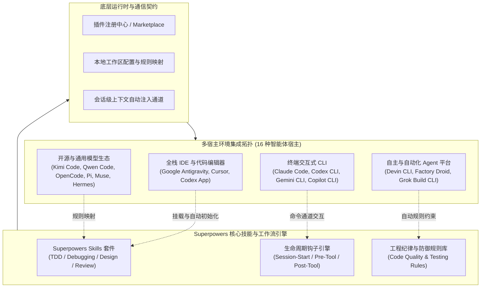
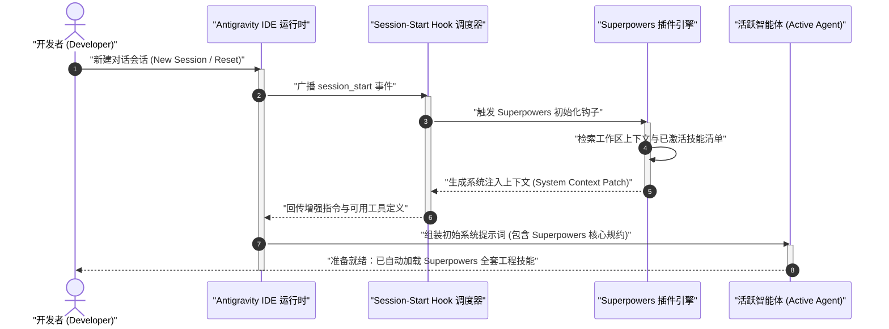

# Superpowers 多宿主安装集成与运行时配置指南

| 属性 | 详情 |
| :--- | :--- |
| **文档类型** | 部署安装与多宿主集成指南 |
| **当前状态** | 已归档 (Accepted) |
| **作者** | Ateng |
| **创建日期** | 2026-09-22 |
| **关联系统/模块** | Ateng-AI / Skills / Superpowers |

---

## 📖 概述与技术背景

**Superpowers** 是由著名开源架构师 Jesse Vincent（obra）主导研发并开源的一款面向下一代 AI 编程智能体（AI Coding Assistants）的**超级能力扩展插件与工程技能体系**。它旨在为 AI 智能体注入工业级工程协作纪律与深度开发技能，包含严谨的测试驱动开发（TDD）、四阶段根因诊断（Root-Cause Diagnosis）、高阶软件架构设计、多智能体协同交接以及自动化代码评审等专业工作流。

在现代智能体开发实践中，开发者往往在不同的终端 CLI、代码编辑器、全栈 IDE 以及云端自动化代理之间切换。为了实现“**一次配置、跨宿主无缝生效**”，Superpowers 采用了轻量化插件架构与生命周期钩子（Lifecycle Hooks）机制。无论是在本地交互式终端、专业级 Agent IDE 还是全自动云端智能体中，Superpowers 都能提供一致的工程能力支持。



---

## 🌐 16 种智能体宿主环境兼容矩阵

Superpowers 支持覆盖目前主流与前沿的 16 种智能体宿主环境。各环境在安装方式、自动化钩子支持程度以及命令交互方式上略有差异，全景对比如下表所示：

| 宿主名称 | 宿主类别 / 形态 | 安装与分发形态 | 支持状态 | 推荐命令入口 / 激活指令 | 核心特性与自动化等级 |
| :--- | :--- | :--- | :--- | :--- | :--- |
| **Google Antigravity** | 全栈 Agent IDE | 官方原生插件 (CLI Plugin) | 官方原生支持 (Native) | `agy plugin install https://github.com/obra/superpowers` | 完整支持 Session-start Hook，自动注入会话，零配置启动 |
| **Claude Code** | 终端命令行智能体 | 官方 / 专有 Marketplace 插件 | 官方原生支持 (Native) | `/plugin install superpowers@claude-plugins-official` | 支持官方市场与专有市场双源安装，支持斜杠命令与自动工具增强 |
| **Cursor** | AI 代码编辑器 | Marketplace / Chat 命令扩展 | 深度适配 (Tier 1) | `/add-plugin superpowers` | 深度协同 `.cursorrules` 与 Agent Composer 模式，支持实时内联重构 |
| **Codex App** | 桌面 GUI 客户端 | 本地规则 / 扩展包配置 | 官方支持 (Tier 1) | UI 设置面板导入 / 配置工作区技能 | 界面化状态管理，可视化技能开关与上下文映射 |
| **Codex CLI** | 终端交互 CLI | npm / pip 插件包或本地技能源 | 官方支持 (Tier 1) | `codex plugins add obra/superpowers` | 快速终端命令行调用，与 OpenAI 原生 API 及工具链深度整合 |
| **Devin CLI** | 自主软件工程 Agent | 工作区技能配置 (Repo Config) | 适配器支持 (Tier 2) | `devin skill attach obra/superpowers` | 适合端到端自主研发流程，支持长时间运行与无人值守流水线 |
| **Factory Droid** | 研发流程协作 Agent | Droid Marketplace / 规则清单 | 深度适配 (Tier 2) | `droid install-plugin superpowers` | 深度集成于企业 CI/CD 与研发自动化看板，多任务编排执行 |
| **Gemini CLI** | 命令行交互 Agent | 扩展模块 / 提示词挂载 | 社区支持 (Community) | `gemini extension add superpowers` | 原生接入 Google Gemini 2.5 系列模型超长上下文支持 |
| **GitHub Copilot CLI** | 终端命令行辅助 | Copilot 扩展 (Extension) | 社区适配 (Community) | `gh copilot alias add superpowers` | 与 GitHub 生态及 GitHub CLI (`gh`) 紧密协同 |
| **Grok Build CLI** | 命令行构建与探索 Agent | 系统配置注入 / Git Submodule | 社区支持 (Community) | `grok plugin add obra/superpowers` | 针对复杂编译排障、快速构建分析场景优化 |
| **Kimi Code** | 交互式代码智能体 | 本地技能包映射 (MCP/Skills) | 适配器支持 (Tier 2) | `kimi skill install superpowers` | 充分发挥超长上下文优势，支持海量历史会话与大型项目代码库 |
| **OpenCode** | 开源多模型终端 CLI | 规则文件挂载 / 插件系统 | 社区支持 (Community) | `opencode install obra/superpowers` | 架构中立，支持本地自建模型与开源权重无缝加载 |
| **Pi** | 极简交互 Agent | 配置文件挂载 (Config JSON) | 轻量支持 (Lightweight) | `pi config set skills.superpowers true` | 极小资源占用，适合轻量级环境与边缘端辅助 |
| **Qwen Code** | 通义千问代码终端 | 技能配置与插件市场 | 适配器支持 (Tier 2) | `qwen plugin install superpowers` | 针对中文研发语境、国内网络环境与主流框架特化优化 |
| **Hermes Agent** | 自主推理与分析 Agent | Agent 运行时注册清单 | 社区支持 (Community) | `hermes agent:extend obra/superpowers` | 强调逻辑推演与形式化验证，适合高复杂度算法分析 |
| **Muse** | 创意与架构辅助 Agent | 架构规则清单 / Workspace Skill | 轻量支持 (Lightweight) | `muse skill import superpowers` | 侧重系统架构前置推演、原型设计与设计树可视化 |

> [!NOTE] 宿主层级说明
> - **Native / Tier 1**：官方原生支持或提供第一方插件市场，生命周期钩子与自动上下文注入完全开箱即用。
> - **Tier 2**：通过厂商专属扩展机制或工作区技能规则桥接，核心能力无缝运行，部分高级钩子依赖适配器。
> - **Community / Lightweight**：由开源社区驱动或采用通用配置挂载，建议配合统一诊断命令完成健康检查。

---

## 🚀 重点宿主深度实战一：Google Antigravity 集成

**Google Antigravity** 作为面向全栈智能体研发的高级 Agent IDE，具备极其完善的插件生态与生命周期扩展能力。Superpowers 在 Antigravity 中享有官方一等公民待遇，通过原生插件机制实现秒级安装与无感自动激活。

### 1. 官方插件安装与部署

在开发机任意终端或 Antigravity 内置终端中，执行官方插件安装命令：

```bash
# 从官方 GitHub 仓库直接拉取并安装 Superpowers 插件
agy plugin install https://github.com/obra/superpowers
```

**命令输出与预期执行效果**：

```text
[INFO] Cloning plugin repository from https://github.com/obra/superpowers...
[INFO] Resolving plugin manifest (plugin.json)...
[INFO] Registering custom skills: tdd, diagnosing-bugs, codebase-design, code-review...
[INFO] Registering lifecycle hook: session-start (priority: HIGH)...
[SUCCESS] Plugin 'superpowers' (v1.2.0) successfully installed to ~/.gemini/antigravity/plugins/superpowers.
[HINT] Plugin is active. All future agent sessions will automatically load Superpowers.
```

### 2. Session-start Hook 自动注入机制剖析

在许多传统的 AI 工具中，每次开启新对话时，开发者都需要手动上传规约提示词（Prompt Template）或显式调用斜杠命令激活特定技能，这极大地降低了开发流畅度。**Superpowers 在 Antigravity 中彻底解决了这一痛点，其核心在于 `session-start` 生命周期钩子（Lifecycle Hook）**。

#### 自动化注入工作时序



#### 为什么无需手动加载？

1. **事件驱动契约**：Antigravity 运行时规范定义了标准生命周期事件（包括 `session-start`、`pre-tool-call`、`post-tool-call`、`session-end`）。Superpowers 在其 `plugin.json` 清单中声明订阅了 `session-start` 事件。
2. **高优先级系统上下文注入**：当开发者开启一个新对话时，Antigravity 的 Hook 调度器会在首次大模型推理请求发出之前，自动将 Superpowers 的工程规范、TDD 行为契约、测试保护屏障以及诊断工具链注入到智能体的系统上下文字段中。
3. **零 Token 浪费与按需激活**：Superpowers 遵循渐进式披露（Progressive Disclosure）原则，初始化阶段仅注入轻量级契约元数据（约 200~300 tokens），具体的大型技能指令仅在智能体感知到特定任务意图时动态展开，既保证了自动化，又兼顾了上下文窗口利用效率。

### 3. 插件管理、更新与排障维护

日常维护可通过 `agy plugin` 系列命令高效完成：

```bash
# 1. 查看当前已安装的全部插件及其状态
agy plugin list

# 预期输出：
# ID           NAME         VERSION   STATUS   HOOKS               PATH
# superpowers  Superpowers  1.2.0     ACTIVE   session-start (1)   ~/.gemini/antigravity/plugins/superpowers

# 2. 更新 Superpowers 到最新版本（支持原地增量拉取）
agy plugin update superpowers

# 3. 若遇到本地配置损坏，执行强制重新安装以重置环境
agy plugin uninstall superpowers
agy plugin install https://github.com/obra/superpowers --force
```

> [!TIP] 本地存储拓扑
> Superpowers 在 Antigravity 中的物理存储路径位于当前用户目录下的 `~/.gemini/antigravity/plugins/superpowers/`（Windows 环境为 `C:\Users\<username>\.gemini\antigravity\plugins\superpowers\`）。若遇到异常情况，可以直接检查该目录下的 `manifest.json` 与日志输出。

---

## 💻 重点宿主深度实战二：Claude Code 终端集成

**Claude Code** 是 Anthropic 推出的官方终端命令行智能体。Superpowers 在 Claude Code 中提供了双轨分发通道：官方认证插件市场（稳定版本）与 Superpowers 官方专属市场（滚动更新版本）。

### 1. 方式一：官方插件市场安装（推荐稳定路径）

在 Claude Code 交互终端中，直接利用官方插件市场标识符进行安装：

```bash
# 在 Claude Code 终端中输入斜杠命令
/plugin install superpowers@claude-plugins-official
```

**运行交互效果说明**：
- Claude Code 会连接官方插件中心，校验包签名与权限清单。
- 安装完成后，Superpowers 会自动注册为终端受管技能，支持即刻调用。

### 2. 方式二：Superpowers 专有市场添加与安装（获取前沿特性）

如果需要体验最新的试验性工程技能、性能优化补丁或未正式合入官方市场的特性，可以挂载 Superpowers 官方维护的专属市场源：

```bash
# 步骤 1：添加 Superpowers 专有市场源
/plugin marketplace add obra/superpowers-marketplace

# 步骤 2：从专有市场安装最新版本的 Superpowers
/plugin install superpowers@superpowers-marketplace
```

```text
[Claude Code] Adding marketplace 'obra/superpowers-marketplace'... Done.
[Claude Code] Fetching package index from superpowers-marketplace...
[Claude Code] Installing 'superpowers' (latest-nightly)...
[Claude Code] Verifying tool permissions and script sandbox...
[Claude Code] Success: Superpowers installed and activated for current profile.
```

### 3. 插件生命周期与更新 SOP

为保证智能体技能库与最新工程实践同步，建议定期执行版本更新与健康校验：

```bash
# 查看所有已加载插件与版本
/plugin list

# 检查并升级 Superpowers
/plugin update superpowers

# 卸载 Superpowers 插件
/plugin uninstall superpowers
```

> [!IMPORTANT] 终端环境变量与网络配置
> Claude Code 依赖系统原生网络与 Git 配置。若在企业内网或代理环境下执行安装命令失败，请确保终端已正确配置 `HTTP_PROXY` 与 `HTTPS_PROXY`，并且 `git config --global url."https://".insteadOf git://` 可用。

---

## 🖱️ 重点宿主深度实战三：Cursor IDE 集成

**Cursor** 作为基于 VS Code 构建的下一代 AI 优先代码编辑器，拥有极高的开发者渗透率。Superpowers 为 Cursor 提供了与 Agent Composer 深度协同的专属安装与规则桥接路径。

### 1. 方式一：Cursor Agent Chat 命令行安装

在 Cursor 中打开 Agent Chat / Composer 面板（快捷键 `Ctrl + I` 或 `Ctrl + L`），直接向智能体发送插件安装指令：

```text
/add-plugin superpowers
```

Cursor Agent 会自动识别该指令，检索兼容的技能注册包，并在项目级配置目录 `.cursor/` 中创建对应的挂载链接与依赖清单。

### 2. 方式二：UI Marketplace 界面搜索与启用

如果不便使用命令行，可通过 Cursor 的可视化图形界面进行配置：

1. **打开设置面板**：按下 `Ctrl + ,`（macOS 为 `Cmd + ,`），在搜索栏输入 `Plugins` 或导航至 `Cursor Settings -> Features -> Plugins`。
2. **检索插件**：在 Marketplace 搜索输入框中键入 `Superpowers`。
3. **点击启用 (Enable)**：找到作者为 `obra` 的官方 Superpowers 条目，点击 **Install** 并切换状态开关为 **Enabled**。
4. **重启会话**：点击 Composer 右上角垃圾桶图标重置会话，使新启用的技能配置生效。

### 3. 多模型与 Cursor 规则协同配置

Cursor 支持在多款顶级大模型之间切换（如 Claude 3.7 Sonnet、GPT-4o、Gemini 2.5 Pro 等）。为了让不同模型都能精准遵守 Superpowers 的工程规范，必须做好 **Cursor Rules 协同配置**：

#### 项目根目录 `.cursorrules` 推荐协同配置

在项目根目录下创建或编辑 `.cursorrules` 文件，加入与 Superpowers 协同的声明：

```markdown
# Superpowers Engineering Rules for Cursor Agent

## 1. 核心工作流与技能遵从
- 当面临复杂新功能开发或重大重构时，优先采用 Superpowers TDD 工作流（Red-Green-Refactor）。
- 严禁在测试失败或无测试保障的情况下直接合并未经验证的生产代码。
- 遇到疑难缺陷时，遵循 Superpowers 四阶段根因诊断，严禁采用盲猜或打补丁式修复。

## 2. 工具链执行防线
- 优先复用当前仓库已有工具链与包管理配置（如 pnpm / npm / yarn / mvn / gradle）。
- 任何破坏性变更或未通过测试的代码提交前，必须向开发者显式汇报风险与差异。
```

> [!WARNING] 模型选择与推理深度平衡
> 在 Cursor Composer 中运行复杂工程任务时，强烈建议选用具备**深度思考能力（Extended Thinking / Reasoner）** 的模型（如 **Claude 3.7 Sonnet (Thinking Mode)** 或 **o3-mini**）。轻量化或小参数模型在理解长篇技能规范和多步骤工具调用时，可能出现漏步或未能严格执行 TDD 循环的现象。

---

## 🧰 其余常见宿主快速上手速查

针对矩阵中其余 13 种智能体宿主环境，Superpowers 提供了灵活的标准配置与快速上手通道：

### 1. Codex App 与 Codex CLI

OpenAI 生态下的 Codex 工具支持通过标准配置或 CLI 进行技能挂载：

```bash
# Codex CLI 快速安装指令
codex plugins add obra/superpowers

# Codex App 配置文件挂载方式 (~/.codex/config.json)
{
  "plugins": {
    "superpowers": {
      "source": "https://github.com/obra/superpowers",
      "autoUpdate": true,
      "enabled": true
    }
  }
}
```

### 2. Devin CLI 与 Factory Droid

自主型智能体（Autonomous Agents）强调在沙箱隔离环境下自动运行完整工程闭环：

```bash
# Devin CLI 绑定工作区技能
devin skill attach obra/superpowers --workspace=./

# Factory Droid 自动化流水线注册
droid install-plugin superpowers --scope=organization
```

### 3. Gemini CLI 与 GitHub Copilot CLI

终端级轻量化辅助工具的挂载指南：

```bash
# Gemini CLI 挂载扩展
gemini extension add superpowers

# GitHub Copilot CLI 别名与规则注入
# 在 ~/.config/gh-copilot/config.yml 中添加 Superpowers 提示词挂载
gh copilot config set skills.superpowers.enabled true
```

### 4. 国内与开源模型宿主（Kimi Code、Qwen Code、OpenCode）

在国内主流智能体与开源 CLI 中，可通过软链接或本地技能目录（`.agents/skills/`）直接挂载：

```bash
# 步骤 1：克隆 Superpowers 到全局共享目录
git clone https://github.com/obra/superpowers.git ~/.agent-skills/superpowers

# 步骤 2：在项目工作区创建软链接（Linux / macOS）
mkdir -p .agents/skills
ln -s ~/.agent-skills/superpowers .agents/skills/superpowers

# Windows PowerShell 管理员环境软链接示例
# New-Item -ItemType SymbolicLink -Path ".agents\skills\superpowers" -Target "$HOME\.agent-skills\superpowers"
```

---

## 🩺 会话级初始化验证与自检 SOP

完成任意宿主的安装后，必须执行标准化验收与健康自检，以确认 Superpowers 插件已正常注入且能够被底层大模型准确调用。

### 1. 交互式对话自检验证

在安装好 Superpowers 的任意宿主环境（如 Antigravity Chat、Claude Code、Cursor Composer）中启动一个新会话，输入以下标准化自检测试 Prompt：

```text
请列出当前会话已激活的 Superpowers 技能清单，并说明你如何执行测试驱动开发 (TDD)。
```

#### 预期健康响应特征

当 Superpowers 成功激活时，智能体**必定**包含以下特征的响应：

1. **精准枚举技能清单**：列出 `tdd`、`diagnosing-bugs`、`codebase-design`、`code-review` 等 Superpowers 专属技能名称。
2. **阐明工程契约**：明确指出在执行新功能开发时必须“先写测试用例（Red）-> 运行确认失败 -> 编写实现使测试通过（Green）-> 重构优化（Refactor）”。
3. **无泛化推诿**：不会出现“我是一个通用大模型，不具备外部插件”等未挂载插件时的默认回答。

### 2. 常用诊断工具：`diagnosing-superpowers`

Superpowers 内置了自省排障诊断工具 `diagnosing-superpowers`。如果智能体在会话中表现异常，可直接在对话中触发诊断：

```text
/diagnosing-superpowers
```

或者要求智能体执行自检：

```text
请运行 diagnosing-superpowers，全面检查当前宿主环境的权限、技能加载状态与依赖完整性。
```

### 3. 故障排查与典型问题清单 (Troubleshooting Matrix)

| 故障现象 | 潜在根本原因 | 排查步骤与修复方案 |
| :--- | :--- | :--- |
| **现象一：命令执行提示 `Plugin not found`** | 插件未成功安装，或本地缓存路径损坏 | 1. 运行 `agy plugin list` 或 `/plugin list` 确认是否在列表中。<br/>2. 检查网络是否能够连通 GitHub；若受限，配置终端代理或通过本地 Git 仓库路径安装。 |
| **现象二：新会话中智能体不遵守 TDD 规约** | Session-start Hook 未正常执行，或会话未重置 | 1. 彻底关闭当前会话并重新启动（Reset / New Session）。<br/>2. 检查模型版本，确保使用的模型支持长系统提示词和工具调用。<br/>3. 手动在对话中发出 `/diagnosing-superpowers` 强制重载。 |
| **现象三：Claude Code 专有市场无法添加** | 市场 URL 解析失败或 API Token 权限限制 | 1. 检查拼写是否为 `obra/superpowers-marketplace`。<br/>2. 尝试回退至官方市场稳定包：`/plugin install superpowers@claude-plugins-official`。 |
| **现象四：Cursor 中工具调用报错或静默跳过** | Cursor Agent 权限未放行终端命令执行 | 1. 检查 Cursor 设置中的 `Run in Terminal` 权限。<br/>2. 将运行模式调整为 `Agent Mode` 并授予工作区读写权限。 |
| **现象五：跨宿主版本冲突或技能行为不一致** | 本地多环境安装了不同版本的 Superpowers | 1. 统一各宿主的更新策略，在 Antigravity 中运行 `agy plugin update superpowers`。<br/>2. 针对软链接方式，统一更新共享源仓库 `git -C ~/.agent-skills/superpowers pull`。 |

> [!CAUTION] 严禁生产环境绕过健康检查
> 在团队协同与持续集成（CI）环境中，切勿在未通过会话初始化验证的情况下直接交付关键代码。确保每个智能体节点均处于 Superpowers 严格的测试防御网与质量把控之下。
