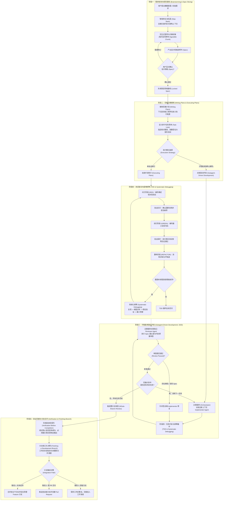
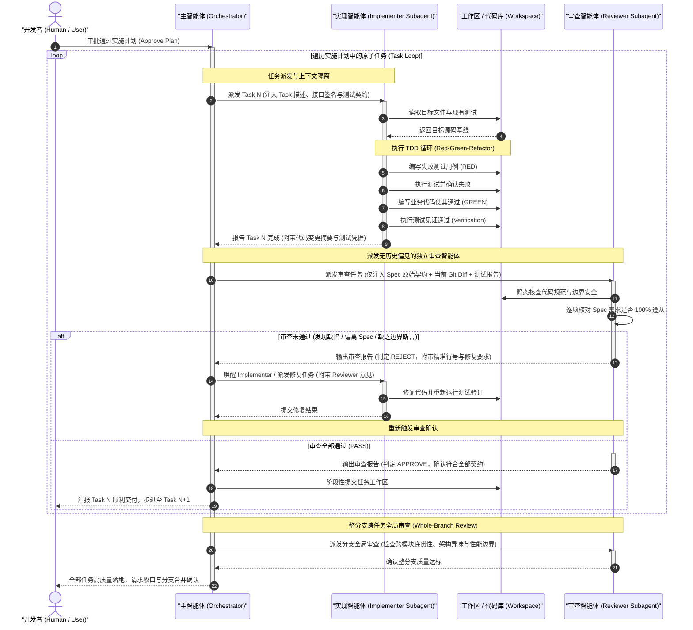

# Superpowers 端到端研发工作流与 15 个核心技能深度解析

| 属性 | 详情 |
| :--- | :--- |
| **文档类型** | 研发工作流与技能契约指南 |
| **当前状态** | 已归档 (Accepted) |
| **作者** | Ateng |
| **创建日期** | 2026-09-22 |
| **关联系统/模块** | Ateng-AI / Skills / Superpowers |

---

## 🎯 导读与背景契约

在工业级 AI 辅助研发实践中，通用对话式代码生成（Chat-oriented Coding）正面临严峻的“工程天花板”：大模型在处理复杂、长链路任务时极易陷入**上下文污染（Context Pollution）**、**注意力稀释（Attention Dilution）**、**未经推演的盲目修改**以及**幻觉导致的伪成功（Hallucinated Success）**。

**Superpowers** 是一套专为突破上述瓶颈而设计的**端到端自主 Agent 研发工作流与工程技能方法论**。它将传统的“对话-修改”松散结构，彻底重构为严格受控的**交付五阶段闭环**。通过**子智能体隔离（Subagent Isolation）**、**测试驱动开发（TDD）铁律**、**前置证据链校验（Verification Before Completion）** 以及 **两阶段代码审查（Task Review & Whole-Branch Review）**，Superpowers 构建了一条可审计、可复现、高质量的自主软件工程流水线。

---

## 🔄 端到端研发交付闭环全景图

Superpowers 端到端软件研发工作流覆盖从自然语言模糊意图到代码合入主干的全生命周期，定义了严密的五阶段执行闭环：



---

## 🧩 阶段一：需求收敛与规范提炼（Brainstorming & Spec Slicing）

在多数研发任务中，失败的根源往往不在于“代码写错了”，而在于“写了错误的代码”。智能体最危险的冲动就是一收到模糊意图便立即着手创建或修改代码。阶段一的核心价值在于通过反冲机制，强制进入理性收敛流程。

### 1. 智能体主动后退（Step Back）原则

当接收到任何功能新增、组件构建、行为修改或体验重构指令时，智能体**必须且绝对禁止立即编码**，必须触发 `brainstorming` 技能，启动“主动后退”三步法：

1. **扫描存量工程基线**：自动探查项目目录结构、构建配置（如 `package.json`、`pom.xml`）、技术栈约束以及现有架构规范（如 `AGENTS.md`、`CONTEXT.md`）。
2. **定位潜在系统耦合**：检索相关模块或存量类，评估改动对现有数据流、上下游契约与持久层结构的影响。
3. **识别模糊点与未决边界**：将业务需求拆解为前置条件、核心路径、边缘边界与容错降级四个维度，列出未明确的技术与业务疑问。

> [!CAUTION] 反模式警示：杜绝“太简单故无需确认”
> 智能体最常见的反模式是心理预设：“这个功能太简单了，不需要推演和规格确认，我直接写出来给用户看就行”。在 Superpowers 体系中，这种行为被定义为工程越权。任何代码行为的改动，都必须经过阶段一的收敛沉淀。

### 2. 交互澄清与切片反馈（Digestible Chunking）

在与开发者沟通时，智能体若一次性抛出十几个问题或几千字的设计草案，会造成严重的人机交互认知过载。`brainstorming` 强力规范了**分块切片反馈机制（Digestible Chunking）**：

- **单焦点推进**：每次提问或阐述方案时，仅聚焦一个高优先级的架构决策点（例如：“鉴权方案选择：倾向于采用无状态 JWT 还是基于 Redis 的分布式 Session？”）。
- **提供 2~3 个具象备选项**：每个选项附带清晰的得失分析（Pros & Cons）与适用场景，并推荐默认方案，降低开发者的决策心智负担。
- **渐进式深化**：在上一轮决策收敛前，绝不跳转至下一层级的细节讨论。

### 3. 产生设计规格（Spec）的确认闭环

当所有关键架构分支与技术选型达成共识后，智能体将决策成果结构化沉淀为 **设计规格说明书（Design Spec）**。一份合格的 Spec 包含：
- **目标与非目标（Goals & Non-Goals）**：清晰画出需求边界，防止范围蔓延。
- **架构数据流与接口契约**：涵盖关键数据模型（Schema）、API 请求/响应格式及状态机转换。
- **测试与验证用例设计**：定义功能验收的 Happy Path 与极端异常输入场景。
- **用户显式 Sign-off 门禁**：呈现 Spec 文档，并显式向用户发出确认请求：“当前设计规格已完备，是否确认以此基线进入实施计划编制？”。**未获确认前，绝不启动下一阶段。**

---

## 📐 阶段二：实施方案编制（Writing Plans & Executing Plans）

设计规格（Spec）确立了“做什么（What）”与“做成什么样（Target）”，而实施方案（Plan）则解决“以何种工序落地（How）”。

### 1. 面向“低判断力初级工程师”的极致拆解原则

Superpowers 的实施方案编写技能 `writing-plans` 秉承一条严苛的工程假设：
> **实施计划的受众必须假定为一名能力底线、没有系统上下文、缺乏架构自愈能力的“初级工程师”。计划中的每一个步骤，都必须做到无可挑剔的确定性，不留下任何即兴发挥的灰色地带。**

因此，计划中的每个 Task 都必须包含以下四要素：
1. **涉及文件的绝对/相对路径**：杜绝“修改用户服务类”等泛化词汇，必须精确到 `src/main/java/com/example/UserService.java`。
2. **精确的函数与接口签名**：指明类名、方法名、入参类型、返回值类型以及抛出的受检异常。
3. **伴生测试用例规范**：指明对应的测试文件路径、待编写的测试函数名称以及具体的输入数据与断言条件。
4. **预期外部可观察行为**：步骤完成的标准必须基于外部测试控制台输出（如 `mvn test -Dtest=UserTest#testCreate` 绿色退出），而非主观臆断。

### 2. 计划文档结构标准化

一份符合标准的实施计划遵循如下格式结构：

```markdown
# [功能名称] 实施方案

## 架构全局约束与上下文
- 依赖技术栈及版本约束（如 Java 21 / Spring Boot 3.3）
- 模块分层调用规范与禁止穿透的持久层边界
- 统一日志输出与错误码契约

## 任务拆解与执行清单

### Task 1: 基础设施与数据模型契约 (Schema & DTO)
- **目标文件**：`src/modules/auth/dto/auth.dto.ts`
- **操作类型**：新建 / 修改
- **接口规范**：
  ```typescript
  export interface AuthRequest {
    userId: string;
    token: string;
  }
  ```
- **测试契约**：创建 `test/modules/auth/dto/auth.dto.spec.ts`，验证属性校验规则。
- **执行命令**：`pnpm test auth.dto.spec.ts`
- **预期输出**：`1 passed, 0 failed`

### Task 2: 核心业务领域服务与状态转移
...
```

### 3. 执行模式分流（Executing Plans vs. SDD）

当实施计划经开发者评审确认后，进入执行分流判定：
- **内联执行（Executing Plans）**：若宿主环境不支持多智能体派发或属于单点简单脚本修改，主智能体自身承担 Implementer 角色，按照计划列表以原子步进方式严格自循环推进。
- **子智能体驱动开发（Subagent-Driven Development, 推荐模式）**：当任务具备清晰边界且涉及多文件跨层协同演进时，主智能体升级为调度指挥官（Orchestrator），交由子智能体集群处理。

---

## 🤖 阶段三：子智能体驱动开发（Subagent-Driven Development, SDD）—— 核心机制

**子智能体驱动开发（SDD）** 是 Superpowers 最具突破性的工程架构，也是应对复杂系统研发的核心利器。

### 1. 为什么主 Agent 不能包办所有任务？

在没有子智能体隔离的传统单 Agent 架构中，随着任务推向中后期，Agent 会不可避免地出现性能雪崩，其根因包含：
1. **上下文污染（Context Pollution）**：编译报错堆栈、大量调试日志、冗长的 API 文档查询历史堆积在单一 Context 窗口中，严重污染模型的即时注意力。
2. **注意力稀释（Attention Dilution）**：模型在处理 Task 8 时，受前 7 个 Task 产生的千行代码 Diff 干扰，极易偏离最初的 Spec 规格契约，产生“注意力漂移”。
3. **既当运动员又当裁判员（Reviewer Bias）**：由编写该代码的同一个 Agent 自行检查，模型会产生固有的“认知盲区”，倾向于对自身产生的逻辑漏洞视而不见。

### 2. 双角色分工：Implementer Agent 与 Reviewer Agent

Superpowers 确立了彻底物理隔离的双角色机制：

| 角色 | 载体环境 | 上下文边界 | 核心职责 |
| :--- | :--- | :--- | :--- |
| **Implementer Agent** | 全新派发的独立 Subagent 会话 | 仅包含当前 Task 描述、关联文件源码与对应测试契约 | 严格执行 TDD 编码，以最小实现促使测试转绿，不关心跨任务全局冗余信息。 |
| **Reviewer Agent** | 全新派发的独立 Subagent 会话 | **绝对不携带 Implementer 的调试历史**，仅提供 Spec 原始规格、当前 Git Diff 及当前测试报告 | 扮演挑剔的代码审查官，双轴比对 Spec 遵从度与代码工程质量，出具通过或打回结论。 |

### 3. SDD 完整协作时序图

以下展示主智能体（Orchestrator）、实现子智能体（Implementer）、审查子智能体（Reviewer）与物理工作区之间的交互时序：



### 4. 独立上下文保护与抗遗忘设计

在 SDD 运行机制中，主智能体维护一个极其干净的全局进度状态表（Progress Matrix）：
- 已完成任务仅保留提交哈希与交付物摘要。
- 正在运行的任务仅持有当前子智能体的会话标识。
- 历史任务的调试过程、冗余日志与中间文件完全随子智能体消亡而物理隔离，彻底避免了大模型长文本引起的“中间遗忘（Lost in the Middle）”与提示词注入干扰。

---

## 🧪 阶段四：严格测试驱动开发与系统化调试（TDD & Systematic Debugging）

在任务具体实施过程中，Superpowers 强制推行两大底线技能：`test-driven-development` 与 `systematic-debugging`。

### 1. `test-driven-development`：红-绿-重构铁律

在实现业务逻辑前，智能体必须严格遵循 TDD 铁律：**测试必须先于实现代码存在**。

```
       ┌──────────────────────────────────────────────────────────┐
       ▼                                                          │
  [1. RED] ───────► [2. Verify RED] ───────► [3. GREEN] ────► [4. Verify GREEN] ────► [5. REFACTOR]
编写失败测试      见证非崩溃式失败           编写最小业务代码       见证测试转绿通过         消除坏味道保持绿灯
```

1. **编写失败测试（RED）**：围绕公共契约与边界场景编写单元/集成测试。
2. **见证失败（Verify RED）**：在未写实现前**立即运行测试命令**，确保测试必然失败，且失败原因**严格是业务逻辑未满足（断言失败），而非编译语法错误、模块找不到或测试代码本身崩溃**。
3. **编写最小实现（GREEN）**：编写刚好能够满足测试用例通过的最少代码，杜绝未经测试覆盖的过度设计（Over-engineering）。
4. **见证通过（Verify GREEN）**：重新执行测试命令，亲眼见证测试套件全部显示绿色（Pass）。
5. **安全重构（REFACTOR）**：在绿灯保护网下优化代码结构、抽离重复逻辑、改善命名，重构后必须保证测试依然完全通过。

> [!CAUTION] 作弊测试红线
> 任何编写无断言测试（如仅调用方法不加 `expect`/`assert`）、通过 Mock 绕过核心业务真实执行、或在测试代码中反向迎合错误实现的作弊行为，在 Superpowers 体系中均为绝对红线禁止。

### 2. `systematic-debugging`：排障四阶段闭环

当遇到任何测试失败、编译报错或线上偶发异常时，智能体严禁“盲目猜测代码逻辑并胡乱打补丁”。必须进入系统化排障的四个标准阶段：

1. **第一阶段：根因深度调查（Root Cause Investigation）**
   - 完整阅读报错堆栈、日志上下文与环境变量。
   - 严禁停留在表层报错信息（如简单的“NullPointerException”），必须回溯数据是在哪一步骤、由哪个对象传入了非法状态。
2. **第二阶段：模式分析与代码差异对比（Pattern Analysis）**
   - 检索系统中类似功能的成功实现代码，对比两者模式差异。
   - 检查近期 Git 提交差异，明确引发行为改变的变量。
3. **第三阶段：科学假设与隔离验证（Hypothesis & Testing）**
   - 针对单一根因提出明确的因果假设（“因为 X 条件下缓存未刷新，导致 Y 读取到过期快照”）。
   - 通过极简日志打桩或最小调试脚本证伪或证实该假设。一次仅验证一个变量，禁止同时变更多个参数。
4. **第四阶段：最小靶向修复与回归锁死（Implementation & Regression Lock）**
   - 编写一个能够**必定复现该 Bug 的最小单元测试用例**（见证红灯）。
   - 实施最小改动的靶向修复代码，使该测试转绿。
   - 运行全量测试套件，证明修复没有引入二次回归缺陷（Regression Bug）。

---

## 🏁 阶段五：验证与分支收口（Verification & Finishing Branch）

### 1. `verification-before-completion`：完成前双重自检契约

在向用户或上层系统宣称“开发已完成”、“Bug 已修复”或“测试已全部通过”之前，智能体必须通过该技能设立的“硬门禁”：

- **铁律：证据先于论断（Evidence Before Assertions）**：
  - 严禁口头陈述“代码已经改好，一切运行正常”。
  - 必须真实调用终端命令（如 `pnpm test`、`mvn test`、`go test ./...`），并在响应中**原样展示控制台的成功退出码（Exit Code 0）与测试覆盖结果**。
- **未验证宣称的拦截机制**：
  - 即使修改看似微不足道（例如仅改动了一行配置或一个变量名），也必须执行构建与测试校验。没有执行记录的声明等同于无效。

### 2. `finishing-a-development-branch`：分支整理与合并决策

当所有 Task 实施完成并通过全局审查后，智能体将引导工作区进行规范收口：

1. **环境与工作区自检**：
   - 执行 `git status` 检查是否有被遗漏的未跟踪文件（Untracked Files）或中间调试产物。
   - 检查是否存在临时添加的 `console.log`、调试断点或硬编码测试桩。
2. **智能提供集成选项**：
   智能体主动为开发者呈现三大标准化选项，交由人类做最终授权决定：
   - **选项 A（本地合并到主干）**：切换到目标主分支（如 `main` 或 `dev`），执行 `git merge --no-ff <feature-branch>`，并在验证通过后安全删除特性分支与对应的 Git Worktree。
   - **选项 B（推送远端并提 PR）**：整理规范化提交历史（Squash / Rebase），推送到远程仓库，并通过 `gh pr create` 生成包含完整上下文的 Pull Request。
   - **选项 C（保持现状交由人工处理）**：保留当前分支环境与干净的工作区，输出简要状态报告，等待人类开发者接管进一步探索。

---

## 📚 Superpowers 15 个技能全景深度解构

Superpowers 框架共内建 15 个高度协同的专业技能，按软件工程全景生命周期解构如下：

### 1. `using-superpowers`（技能总控与调用协议）
- **详细输入**：用户的首轮自然语言会话输入、系统环境上下文。
- **工作机制**：作为主智能体会话的最高优先级前置拦截器。在处理任何实质性工作或提问前，强制检索工作区可用技能库；一旦识别出匹配的研发意图，要求智能体在作出任何回复之前，必须优先唤起对应的专门技能。
- **输出交付物**：标准化的技能调用指令路由、上下文合规环境。
- **协作上下游**：**作为所有其它 14 个技能的顶层路由源头**。

### 2. `brainstorming`（创意收敛与设计推演）
- **详细输入**：用户模糊的产品需求、功能点想法、体验优化设想。
- **工作机制**：践行“主动后退”与“单块消化（Digestible Chunking）”原则；扫描已有代码与架构后，逐步提出具有明确权衡的方案选项；引导收敛出包含边界、契约与验证设计的详尽设计规格书，并等待用户 Sign-off。
- **输出交付物**：正式的设计规格文档（Design Spec）、用户显式确认标记。
- **协作上下游**：上承 `using-superpowers`，下接 `writing-plans`。

### 3. `writing-plans`（面向初级工程师的实施方案编制）
- **详细输入**：已通过用户审批的完整设计规格书（Design Spec）。
- **工作机制**：将 Spec 垂直切解为互相解耦、颗粒度适中的原子任务清单（Task Lists）；针对每个任务明确标注修改文件路径、函数代码签名、测试断言代码与预期执行命令。
- **输出交付物**：标准实施计划 Markdown 文档（Implementation Plan）。
- **协作上下游**：上承 `brainstorming`，下接 `executing-plans` 或 `subagent-driven-development`。

### 4. `executing-plans`（单智能体内联计划步进执行）
- **详细输入**：标准化实施计划文档、无子智能体派发能力的轻量宿主环境。
- **工作机制**：在主会话中按原子任务顺序逐一执行；每个任务严格经历“取任务 -> 查步骤 -> TDD 编码 -> 跑测试验证 -> 标记完成”循环；杜绝跳跃执行和未经验证的批量勾选。
- **输出交付物**：逐项落实的代码实现、测试控制台成功日志、全绿的任务清单。
- **协作上下游**：上承 `writing-plans`，协同 `test-driven-development` 与 `systematic-debugging`，下接 `verification-before-completion`。

### 5. `subagent-driven-development`（子智能体驱动开发调度官）
- **详细输入**：标准化实施计划、支持子智能体（如 Task / Agent API）派发的宿主环境。
- **工作机制**：作为编排主脑；按任务清单为每一个 Task 动态派发全新且干净上下文的 Implementer Subagent；在任务完成时动态派发无偏见的 Reviewer Subagent 执行双轴审查；闭环推进直至全计划交付，并在末尾调度整分支审查。
- **输出交付物**：多轮审查通过的物理代码库、干净的主会话上下文、执行状态矩阵。
- **协作上下游**：上承 `writing-plans`，中枢驱动 `requesting-code-review` 与底层开发技能，下接 `finishing-a-development-branch`。

### 6. `requesting-code-review`（独立代码审查派发）
- **详细输入**：当前任务对应的 Spec 契约片段、实施后生成的 Git Diff、当前测试执行日志。
- **工作机制**：构建高度精简且聚焦的提示词上下文，绝不传递 Implementer 繁复的中间会话记录；明确指示 Reviewer 必须针对“Spec 契约遵从性（Spec Compliance）”与“代码工程质量（Code Quality）”双轴展开挑剔审查。
- **输出交付物**：精准打包的 Review 审查请求上下文。
- **协作上下游**：由 `subagent-driven-development` 唤起，向 Reviewer Subagent 投递。

### 7. `receiving-code-review`（审查反馈客观接纳与修复）
- **详细输入**：Reviewer 返回的代码审查报告（包含 Defect、Suggestion 等）。
- **工作机制**：严禁智能体展现出讨好式的“盲目赞同”或未经技术求证的“机械套用”；要求智能体对每一条反馈进行技术可行性与 Spec 边界核对；对于合理意见，遵循 TDD 模式补齐测试并修复，对于不合理建议，提供技术反驳证据链。
- **输出交付物**：修复后的目标代码与针对审查意见的逐条合规回复。
- **协作上下游**：上承 `requesting-code-review` 的输出，修复后重新交由 Reviewer 确认。

### 8. `test-driven-development`（测试驱动开发铁律）
- **详细输入**：明确的方法签名、业务逻辑契约与边界预期。
- **工作机制**：严格执行“RED -> Verify RED -> GREEN -> Verify GREEN -> REFACTOR”五步闭环；强制要求真实运行命令见证红灯（因断言而非语法崩溃），再编写极简实现见证绿灯；防范空断言与虚假测试。
- **输出交付物**：高测试覆盖率的源码、可复现自动化回归测试套件。
- **协作上下游**：贯穿在 `executing-plans` 与 `subagent-driven-development` 的每个具体实现节点。

### 9. `systematic-debugging`（四阶段科学排障）
- **详细输入**：失败测试用例报错、运行时异常堆栈、偶发缺陷现象。
- **工作机制**：强制阻断智能体的盲目修改冲动；严格按“根因调查 -> 模式与差异分析 -> 假设验证 -> 最小防御实现”推进；先构造能够必定复现缺陷的测试，再行修复。
- **输出交付物**：复现缺陷的精准回归测试、最小范围根因修复补丁。
- **协作上下游**：被 `test-driven-development`、`executing-plans` 等在遭遇阻碍时动态触发。

### 10. `verification-before-completion`（完成前硬门禁自检）
- **详细输入**：即将完成的改动、待宣称解决的 Issue / 需求。
- **工作机制**：作为交付宣称的硬门禁；拦截一切没有控制台命令真实执行记录的口头结论；强制在受管终端内运行构建与测试脚本，确认 Exit Code 为 0 并提取关键输出。
- **输出交付物**：包含真实终端执行输出与成功证明的自检报告。
- **协作上下游**：位于阶段四向阶段五交接的必经咽喉路径。

### 11. `finishing-a-development-branch`（分支收口与环境重置）
- **详细输入**：验证全绿的工作区、已完成的特性分支（Feature Branch）。
- **工作机制**：检查工作区未提交与未跟踪产物；提供本地合并、远端 PR 与保留现状三种结构化选项；协助开发者处理分支合并、清理 Worktree 或编写 PR 正文。
- **输出交付物**：干净整洁的 Git 主干或已发布的 Pull Request。
- **协作上下游**：上承 `verification-before-completion`，为端到端工作流画上圆满句号。

### 12. `using-git-worktrees`（物理级工作区隔离管理）
- **详细输入**：新功能开发指令、需要与当前工作区隔离的独立任务。
- **工作机制**：通过 `git worktree add` 为新特性或审查任务创建完全独立的目录副本，避免在当前工作区分支切换导致的文件变更碰撞、构建缓存失效或未保存修改丢失。
- **输出交付物**：独立的物理开发路径、隔离的分支映射环境。
- **协作上下游**：在 `brainstorming` 结束或 `writing-plans` 落地后作为阶段二/三的基础设施准备。

### 13. `dispatching-parallel-agents`（无依赖任务并行并发调度）
- **详细输入**：包含 2 个或以上互不干扰、无状态共享且无时序依赖的独立任务清单。
- **工作机制**：评估任务解耦度；将无依赖任务打包并同时唤醒多个并行 Subagent 并发执行；聚合各 Agent 的回传结果并汇总审查。
- **输出交付物**：并发执行结果聚合集、加速的多模块改造产物。
- **协作上下游**：可作为 `subagent-driven-development` 在面对大型项目多模块改造时的并发加速器。

### 14. `writing-skills`（技能规范编写与元工程演进）
- **详细输入**：团队固化的新工程规范、新的自动化工作流操作诉求。
- **工作机制**：指导开发者或智能体自身创建符合 Superpowers 契约的标准 `SKILL.md`；规范元数据字段、触发时机（When to use）、核心铁律与流程约束，并完成静态校验。
- **输出交付物**：标准化、可分发的自定义 Skill 目录与契约文档。
- **协作上下游**：元工程层面的自演进技能，可产出供 `using-superpowers` 检索的新技能。

### 15. `diagnosing-superpowers`（工作流元诊断与会话故障复盘）
- **详细输入**：执行异常、超时、陷入死循环、成本超标或结果不及预期的会话日志。
- **工作机制**：深度解析 Agent 会话 Trajectory 与 Tool 调用轨迹；诊断哪个技能未能正确触发、是否存在注意力污染、是否存在作弊测试或偏离 Spec，并生成诊断报告与改进建议。
- **输出交付物**：会话故障复盘报告、针对 Superpowers 流程与配置的调优建议。
- **协作上下游**：全局后置质量守护与诊断工具，服务于整个生命周期的方法论优化。

---

## 📊 15 个技能在生命周期中的矩阵速查表

| 技能名称 (Skill Identifier) | 所属交付阶段 | 核心触发场景 (Trigger) | 强制铁律 / 核心门禁 |
| :--- | :--- | :--- | :--- |
| `using-superpowers` | 阶段 0 / 顶层路由 | 会话起始、接收任意用户开发请求 | 在作出任何实质性回复前必须优先检索并唤起技能 |
| `brainstorming` | 阶段一：需求收敛 | 需求新增、方案设计、重大修改 | 主动后退（Step Back），未获 Spec 确认绝不编码 |
| `using-git-worktrees` | 阶段二：实施准备 | 启动多任务前、需要环境物理隔离 | 在物理隔离的独立工作区中开展改动，避免污染主工作区 |
| `writing-plans` | 阶段二：实施规划 | 设计规格（Spec）签署完成之后 | 假定由初级工程师执行，必须明确路径、签名与测试契约 |
| `executing-plans` | 阶段二：方案执行 | 无 Subagent 环境下的单会话落地 | 逐项原子步进，未出具通过证据绝不进入下一 Task |
| `subagent-driven-development` | 阶段三：子智能体开发 | 具备 Subagent 能力且包含解耦任务 | 实施者与审查者物理隔离，审查未过坚决打回修复 |
| `dispatching-parallel-agents` | 阶段三：并发加速 | 存在 2 个以上无依赖关系的并行任务 | 必须满足无状态共享与无时序依赖的前置校验 |
| `requesting-code-review` | 阶段三：审查派发 | 单个 Task 编码完成、整分支开发完成 | 仅传递 Spec 契约、当前 Diff 与测试日志，禁止传冗余历史 |
| `receiving-code-review` | 阶段三：审查接纳 | Reviewer 出具修改意见与缺陷报告 | 客观求证、拒绝盲从，针对合理建议必须以 TDD 模式修复 |
| `test-driven-development` | 阶段四：测试驱动 | 编写任意业务特性或 Bug 修复代码 | 测试必须先于业务代码存在，必须见证断言式红灯 |
| `systematic-debugging` | 阶段四：疑难排障 | 遭遇偶发崩溃、回归 Bug、测试失败 | 严禁盲目打补丁试错，必须复现根因并构建最小锁死测试 |
| `verification-before-completion` | 阶段五：完成自检 | 准备宣称开发完成、准备提交代码 | 证据先于论断，必须展示真实终端 Exit Code 0 输出 |
| `finishing-a-development-branch` | 阶段五：分支收口 | 全部分支任务测试全绿、质量达标 | 清理未跟踪垃圾，提供本地合并、提 PR 与保留三种决策 |
| `writing-skills` | 元工程演进 | 创建新技能、扩展团队工程规范 | 遵循规范元数据定义与渐进式结构设计 |
| `diagnosing-superpowers` | 元工程排障 | Agent 跑偏、技能未触发、成本异常 | 基于会话全量 Trajectory 复盘，定位流程断裂点 |

---

## 💡 落地实施最佳实践与避坑指南

1. **绝对克制主 Agent 的上下文膨胀**：
   在推进复杂功能开发时，切记将主智能体定位为**指挥调度中枢**，不要让它直接卷入大段长代码的生成与修改。通过 `subagent-driven-development` 派发短平快的子任务是维持系统高智商水准的核心秘密。
2. **严防“隐蔽式作弊测试”**：
   在 Review 阶段，审查智能体必须重点巡检测试代码中的断言逻辑。若发现类似 `assert(true)`、直接注释断言语句或为了让测试通过而篡改预期值的行为，必须直接触发严重缺陷警告。
3. **保持文档与代码同步演进**：
   阶段一沉淀的 Spec 说明书与阶段二的实施方案应随代码一并纳入版本控制。它们不仅是指导当前 Agent 执行的蓝图，也是后续开发者理解系统架构演进历史的重要工程资产。
